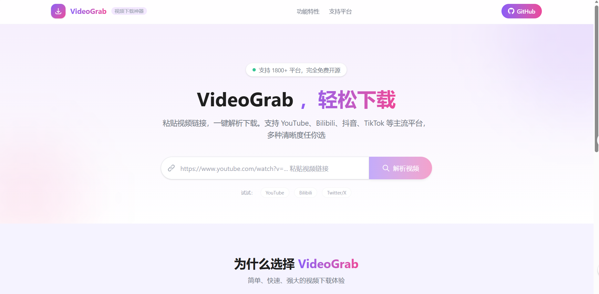
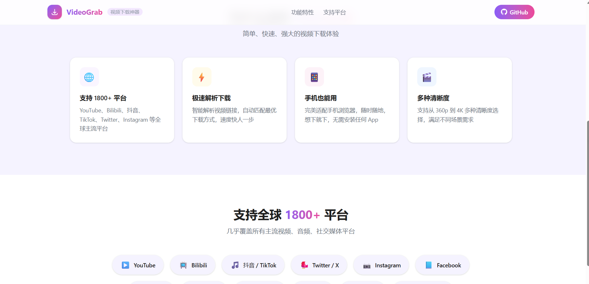
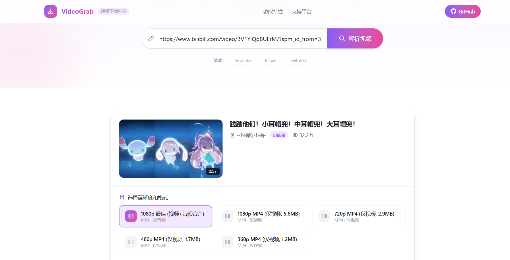

# 我用 AI 开发了个视频下载神器，全程只用了一天

大家好，我是 VideoGrab 的开发者。作为一名喜欢折腾技术的程序员，最近我完成了一个特别有意思的项目——一个支持 1800+ 平台的视频下载器。更特别的是，这个项目从想法到成品，全程有 AI 作为我的开发搭档。今天想和大家分享这段神奇的开发经历。

## 项目背景：一个偶然的想法

那天我在刷抖音，看到一个特别有用的教程视频，想保存下来反复观看,但是每次下载都要去其他盘找对应的视频，很麻烦，所以就像有没有一个工具可以根据链接直接下载视频。

作为开发者，我第一反应就是："我自己做一个不就得了！" 但说实话，我平时主要做后端开发，前端技术不太熟，而且视频处理这块也没太多经验。这时候我想到了最近很火的 AI 开发工具，决定试试让 AI 帮我一起完成这个项目。

## 开发过程：AI 是我的全职搭档

### 需求分析与技术选型
我直接把需求告诉 AI：
- 支持多个平台视频下载（YouTube、Bilibili、抖音等）
- 抖音要能无水印下载
- 解决微信播放兼容问题
- 界面要简洁易用

AI 很快就给出了技术方案：
- **前端**：Vue 3 + Vite + Tailwind CSS
- **后端**：FastAPI
- **核心**：yt-dlp + 抖音专用解析

### 代码生成与实现
AI 就像一个经验丰富的开发者，帮我生成了完整的项目结构和代码：
- 后端 API 接口（解析视频、下载视频等）
- 前端页面组件（输入框、结果展示、格式选择）
- 核心功能逻辑（抖音解析、视频转码等）

遇到问题时，我只要把错误信息发给 AI，它就能立刻找出问题并给出修复方案。比如前端跨域报错，AI 马上告诉我要配置 CORS 中间件；依赖安装有问题，AI 直接给我正确的安装命令。

### 核心功能的实现
#### 抖音无水印下载
这是个关键功能。AI 分析了抖音的 API 结构，帮我写了一个专用模块，通过公开 API 直接获取无水印视频，不需要登录和 Cookie。

#### 微信兼容问题
我发现下载的视频在微信里播放不了，AI 分析后告诉我是编码问题——很多平台用 HEVC (H.265) 编码，微信不支持。它帮我实现了自动转码功能，检测到 HEVC 编码就自动转成 H.264。

#### 多平台支持
AI 推荐使用 yt-dlp，说它支持 1800+ 平台。它帮我封装了 yt-dlp，实现了自动平台识别、多清晰度选择和视频+音频流合并。

## 项目效果：超出预期

只用了一天时间，VideoGrab 就完成了！

**使用流程**特别简单：
1. 粘贴视频链接
2. 点击"解析视频"
3. 选择想要的清晰度
4. 点击"立即下载"

测试了几个平台，效果都很好：
- 抖音：无水印，画质清晰
- Bilibili：自动转码后微信能播
- YouTube：多种清晰度可选，音频同步

## 开发心得：AI 改变了开发方式

这次开发让我对 AI 辅助开发有了全新的认识：

1. **开发效率大幅提升**：从需求到成品，只用了一天时间，这在以前是不可想象的。

2. **技术门槛降低**：作为后端开发者，我能快速上手前端技术，完成了一个完整的全栈项目。

3. **问题解决能力**：遇到技术难题，AI 能立刻给出解决方案，省去了查文档的时间。

4. **创意落地更快**：有了 AI，我可以更快地将想法变成实际产品。

## 后续计划

现在项目已经开源，我打算继续和 AI 合作，添加更多功能：
- 字幕下载与翻译
- AI 视频内容总结
- 批量下载功能
- 移动端适配优化

## 开源邀请

如果你对这个项目感兴趣，欢迎来 GitHub 看看：
[VideoGrab GitHub 仓库](https://github.com/lemon-lzy/-)