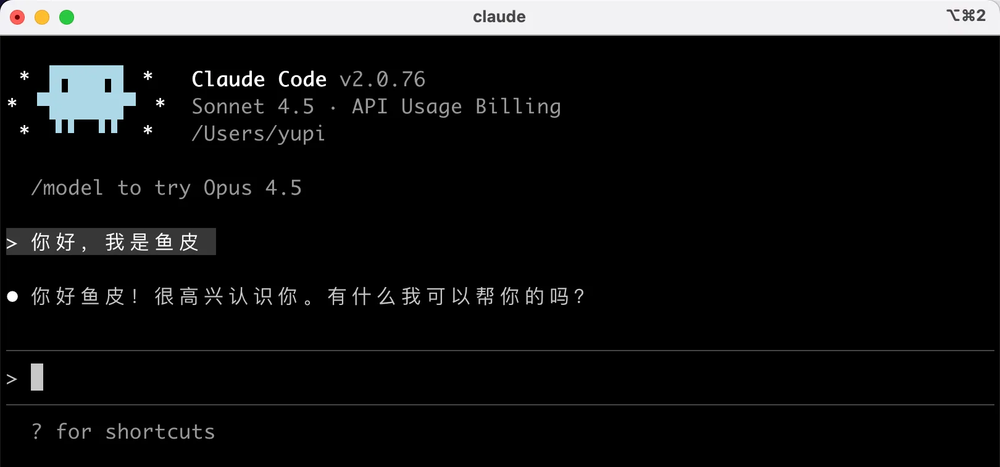

# 日常工作中，我是如何用AI高效办公的（附避坑指南）

工作中被问得最多的问题之一：“你平常怎么用AI？” 其实AI于我而言，从来不是“替代工具”，而是“高效搭子”——它帮我搞定重复琐碎的活儿，腾出时间专注于核心工作，甚至能在我卡壳时提供新思路。今天就好好梳理一下，我日常工作中AI的具体用法、常用工具，以及使用过程中踩过的坑和解决方案，希望能给同样想靠AI提效的小伙伴一些参考。

# 一、常用AI工具清单

### 零代码平台

在浏览器里‍打开就能用，不需要⁡安装任何软件，不需‏要懂任何代码。适合؜完全零基础的新手、想快速做出原型的同学。

**代表工具**：Bolt.new、Lovable、秒哒

**优势**：上手快、所见即所得、自动部署

**局限**：功能‍相对简单，复杂项目⁡可能力不从心

### AI 代码编辑器
需要下载安装‍，界面像传统代码编辑器，⁡但内置了强大的 AI ‏助手。适合有一定基础、想深؜入学习 Vibe Coding、需要做复杂项目的人。

**代表工具**：‍Cursor、Trae
### 命令行工具
在终端里通‍过命令行和 AI ⁡对话，适合有编程基‏础的开发者、喜欢命令行؜的极客。

**代表工具**：Claude Code、Gemini CLI

### VSCode集成：
caludeCode、Github Copilot

## 模型推荐：
### 国外模型：
- calude
- ChatGPT
- Gemini
### 国内模型
- 智谱GLM（智谱）
- DeepSeek
- 通义千问（阿里云）
- Kimi(月之暗面)
### 命令行工具
**代表工具**：
Claude Code、Gemini CLI(通过命令行操控我们的电脑)

# 二、模型之前的优缺点：
## calude

### 优点
1. 编程能力顶尖。
2. 代码理解、bug调试、代码优化能力突出。
3. **超长上下文**，记忆稳定，不易丢失上下文信息。

### 缺点
1. 使用成本更高。
2. 响应速度偏慢,轻量化场景适配性一般。
## GPT
### 优点
- 运行速度快，token 消耗更低，任务处理效率高,需要快速迭代的场⁡景。
- 前沿技术知识更新快
- 配套生态完善，插件工具丰富。

### 缺点
纯编程硬实力略弱于 Claude，在复杂代码重构、深度调试场景不占优势。

## Gemini
### 优点
- **超长上下文**：支持百万字级输入，可通读全量代码、长文档，记忆稳定。
- **前端 / 3D 能力强**：UI 设计、3D 建模、动画网站开发表现优异。
- **性价比高**：订阅与 API 定价更低，还有免费版可用。
### 缺点
- 综合逻辑、深度推理弱于 GPT、Claude 高端模型。

## 国产大模型
### 优点
- **中文能力顶尖**，理解本土需求精准，国内访问流畅稳定。
- **性价比极高**，API 成本仅为国际模型约 1/10，多款提供免费额度。
- **合规性强**，适配国内企业安全要求，生态本土化完善。
- **开源选择多**，低成本即可落地项目开发。
### 缺点
- 极限复杂推理、深度创作能力，仍弱于 Claude Opus 等顶级国际模型。
- 插件、全球化生态与工具链丰富度不足。

### 个人选择
对我个人而言，因为有比较丰富的项目开发经验、做过不少商业项目。所以在选择模型时，我一般会优先考虑能力较强的大模型。日常开发主力用 Cursor + Claude Sonnet，这个组合功能全面、效果好。

**其他情况**：

- 遇到特别复杂的问题时，会切换到 Claude Opus。
- 做快速原型或验证想法时，用 Gemini。
- 需要追求速度时，会选择智谱 GLM，它在快速生成完整项目方面表现不错。
- 大量测试时用 DeepSeek 或者通义千问 API，因为相对便宜。
# 三、AI高效使用技巧：拒绝“无效用AI”，让效率翻倍

其实，Vibe Coding 和传统编程一样，都有自己的「心法」。这些心法不是玄学，而是经过无数人验证的思维方式与工作原则。掌握它们，就能让 AI 精准理解你的意图，产出高质量代码与项目。

今天分享 Vibe Coding 最重要的 5 个核心心法，结合个人实战与社区高手经验总结，学会后你的 AI 编程能力会实现质的飞跃。

## 心法一：Planning is Everything
规划至上，这是 Vibe Coding 第一核心原则。

很多人使用 AI 编程的通病：上来直接一句话「帮我做一个记账应用」，坐等成品，结果往往严重不符合预期、代码烂尾、反复返工。

核心根源：**缺少前期规划**。
行业共识：**规划花费 5 分钟，能节省 30 分钟返工时间**。

### 规划为什么比代码更重要
AI 擅长解决「怎么做」，但不会帮你思考「做什么」。
需求模糊的情况下，AI 只会按默认理解开发，最终产出能运行，但完全不是你想要的产品。

编码前必须明确四大问题：
1. 项目核心功能是什么？
2. 用户使用流程是怎样的？
3. 核心刚需 & 次要迭代功能如何划分？
4. 项目有无特殊限制、技术要求、设计规范？

### 普通人快速落地规划的方法
不用专业产品能力，直接让 AI 充当你的产品经理：
> 示例提示词：我想做一个番茄钟应用，目前需求比较模糊，请以产品经理的视角向我提问，帮我梳理完整需求。

AI 会逐步引导你明确功能细节，梳理完毕后，直接让 AI 整理为**PRD 产品需求文档**。
这份文档就是项目宪法，后续所有 AI 对话、功能开发，都可以挂载参考，统一开发目标。

### 规划决定代码底层架构
AI 有明显特性：优先保证代码能运行，而非保证结构合理。
代码一旦勉强跑通，后续只会不断打补丁、堆砌逻辑，最终形成难以维护的屎山代码。
前期完善规划，就是打好项目地基，从根源规避后期重构返工。

目前主流 AI 编程工具均已标配规划模式：
- Cursor：专属 Plan 规划模式
- Claude Code：连续两次 Shift+Tab 进入计划模式

先沟通确认方案，再批量生成代码，是最高效的开发模式。

## 心法二：MVP 思维
MVP 全称 Minimum Viable Product，**最小可行产品**。
核心逻辑：优先完成可用最简版本，再循序渐进叠加功能。

### 为什么必须用 MVP 思维
新手通病：追求一步到位，起步就想堆砌全部功能。
以记账软件举例，一开始就想要分类、图表、数据导出、多账户管理等复杂能力，最终极易开发卡顿、逻辑混乱、项目烂尾。

MVP 思维则聚焦核心：
记账 App 最简可用版本，只保留 3 个核心能力：
1. 快速记录收支
2. 查看全部账单列表
3. 自动统计总金额

核心版本稳定运行后，再迭代高级功能，开发节奏会极度顺畅。

### MVP 四大核心优势
1. **降低开发难度**：单次只解决核心问题，任务轻量化
2. **快速验证想法**：短时间产出可用产品，验证方案可行性
3. **维持开发动力**：持续看到成品效果，提升创作成就感
4. **灵活调整方向**：早期成本低，发现问题可快速修正

### 落地使用技巧
和 AI 协作时，主动明确约束：
> 本次开发只做 MVP 最小版本，仅保留 2~3 个核心功能，其余功能延后迭代。

牢记核心原则：**完成，永远优于完美**。

## 心法三：迭代优于完美
MVP 定义「做什么」，迭代思维定义「怎么做」。
不要追求一次性写出完美代码，**小步迭代、逐步优化**才是 AI 编程的正确节奏。

### 迭代的必要性
AI 无法 100% 读懂隐性需求，一次性产出完美代码本身就不现实。
人和人沟通尚且需要反复解释，人与 AI 的协作更是如此。

正确开发方式：拆解大型需求为碎片化小任务。
以登录页开发为例，拆分步骤：
1. 基础登录表单搭建（账号+密码）
2. 增加表单规则校验
3. 对接后端接口实现登录逻辑
4. 补充加载状态、错误提示、交互动画

单次只完成一个小模块，测试无误后再推进下一步。

### 标准迭代闭环
提出明确需求 → AI 生成代码 → 本地测试运行/codeReview → 发现问题短板 → 精准描述问题并让 AI 优化 → 循环往复，持续完善。

### 正视返工
在 Vibe Coding 中，返工是常态，不是失误。
每一次调整优化，都会让项目逻辑更严谨、交互更完善，同时也会提升你调教 AI 的经验。
拒绝完美主义内耗，迭代才是项目落地的必经之路。

## 心法四：上下文是王道
绝大多数人忽略的核心关键：**上下文决定 AI 产出的精准度**。

上下文指项目全部背景信息：技术栈、代码规范、历史功能、设计风格、约束条件等。
AI 无长期全局记忆，新对话会清空所有历史认知，缺少上下文，AI 只能自由发挥。

### 上下文缺失的典型问题
指令：帮我写一个按钮。
AI 无法判断技术栈，可能输出原生 HTML、Vue、React 任意版本，样式、风格全部随机，完全无法贴合项目。

完整指令：基于 React + Tailwind 编写圆角蓝色主按钮，搭配hover 加深效果。
信息完整，产出代码直接可用、贴合项目规范。

### 高质量上下文提供技巧
1. **挂载项目 PRD**：新对话固定附上需求文档，统一开发目标
2. **明确技术栈**：提前声明框架、组件库、工具链（Next.js / Spring 等）
3. **参考现有代码**：要求新功能复刻已有页面的代码结构与规范
4. **锁定设计风格**：定义主色调、布局风格、交互规范，避免 AI 随机美化

### 高效进阶方案
使用专属上下文文件：
如 Claude Code 支持读取项目 `CLAUDE.md`，提前写入项目介绍、技术栈、开发规范。
AI 自动全局读取，无需每次重复说明，大幅提升协作效率。

## 心法五：像产品经理一样思考
Vibe Coding 里，你是产品负责人，AI 是执行开发团队。
你的格局，直接决定项目的完整度与体验上限。

### 产品思维核心
把模糊的个人想法，转化为清晰、可落地、可执行的具体功能需求。
兼顾核心功能、用户体验、功能取舍三大维度。

### 重点关注用户体验
开发不能只满足「功能能用」，更要考虑细节体验：
- 操作失败后的友好文字提示
- 接口请求时的加载状态
- 极端场景适配（内容过长、空数据）
- 过渡动画、操作反馈

这类细节 AI 不会主动思考，需要你主动提出要求。

### 合理做功能取舍
根据项目定位调整开发重心：
- 演示 Demo：优先界面美观、核心流程跑通
- 正式产品：侧重数据安全、性能优化、稳定性

拒绝盲目堆砌功能，合理控制开发边界。

### 精准沟通，拒绝模糊描述
反面示例：做一个好看的搜索框
优质示例：页面顶部居中搜索框，支持回车搜索，关键词模糊匹配内容列表

需求越具体，AI 产出越贴合预期，减少无效沟通与反复修改。

---

## 五大心法 综合实战案例
以「每日一句励志名言」小程序为例，完整串联所有心法：
1. **规划先行**：和 AI 沟通梳理需求，确定数据来源、交互逻辑、核心场景
2. **MVP 落地**：仅保留「随机名言+一键换句」两大核心能力
3. **分步迭代**：静态文案 → 随机数组 → 点击刷新，逐步开发
4. **绑定上下文**：约定 React+Tailwind、简约暖系橙色设计风格
5. **产品化优化**：增加淡入动画、长文本自适应，优化使用体验

---

## 全文核心总结
1. **Planning is Everything**：先规划后编码，地基稳才不返工
2. **MVP 思维**：先做最简可用版，再迭代高级能力
3. **迭代优于完美**：小步快跑，持续优化，拒绝一步到位
4. **上下文是王道**：补齐项目背景，让 AI 精准对齐规范
5. **产品经理思维**：细化需求、关注体验、合理取舍

Vibe Coding 的核心，从来不是单纯让 AI 写代码，而是**人主导规划与设计，AI 负责落地执行**。
掌握这套思维逻辑，才能真正驾驭 AI 开发，高效高质量完成任意项目。