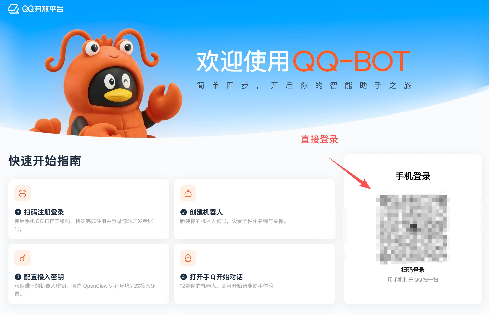
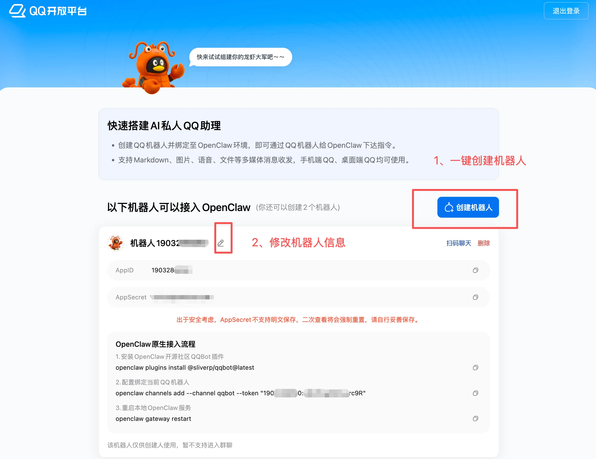
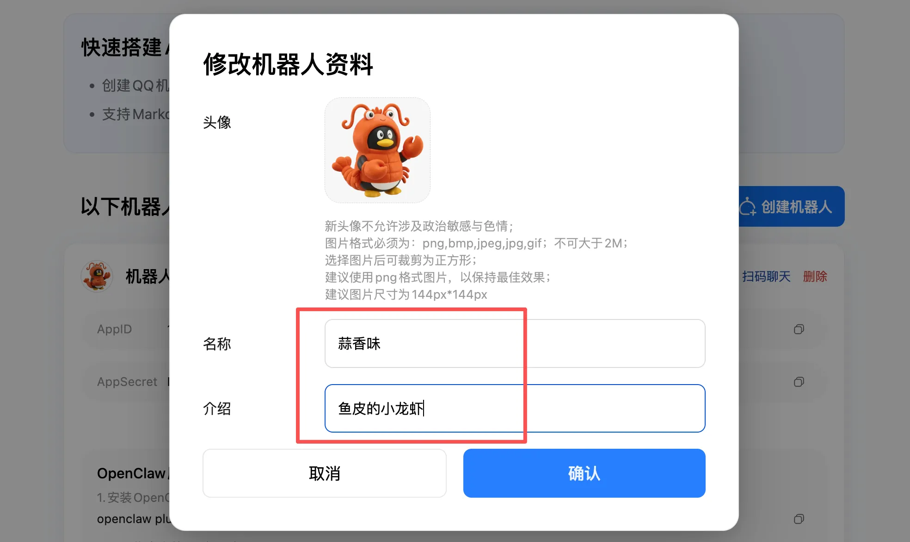
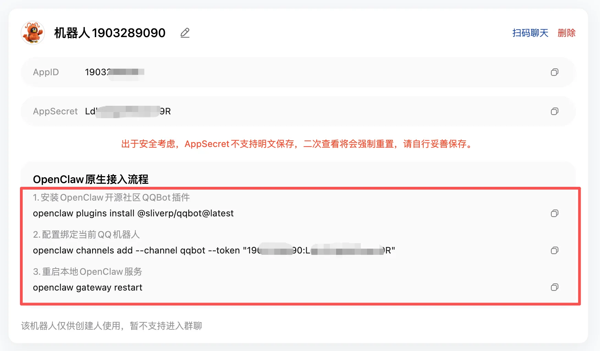
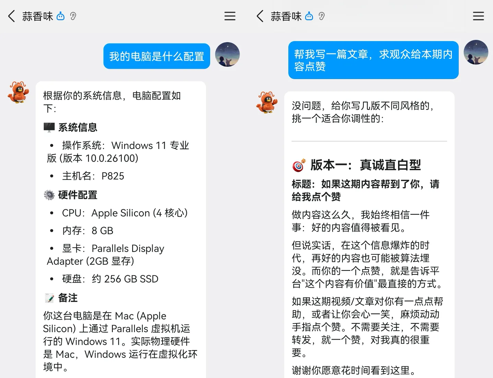

# OpenClaw 保姆级安装+QQ接入教程
## 一、前期准备
1. 可正常联网电脑（Windows/Mac/Linux）
2. 建议虚拟机/备用机操作，保障数据安全

## 二、环境安装
### Windows 必装依赖
1. 安装 Node.js 22+ 版本
2. 安装 Git 默认配置一路下一步

### 1、开启PowerShell权限（管理员运行）
```powershell
Set-ExecutionPolicy RemoteSigned -Scope CurrentUser
```
输入 `A` 确认

### 2、安装 pnpm
```powershell
npm install -g pnpm
pnpm -v
pnpm setup
```
> 执行完毕**关闭当前窗口**，重新管理员打开PowerShell

### 3、安装 OpenClaw
```powershell
pnpm add -g openclaw@latest
openclaw -v
```

### Mac / Linux 一键安装
```bash
curl -fsSL https://openclaw.ai/install.sh | bash
```

## 三、初始化配置
```bash
openclaw onboard --install-daemon
```
1. 同意协议选择 `Yes`
2. 安装模式选择：`Quickstart`
3. 大模型推荐选择：`Qwen` 扫码授权
4. 聊天渠道、搜索服务全部跳过
5. 安装技能：勾选 `ClawHub`，安装工具选 npm
6. 额外配置全部选 No
7. 防火墙弹窗选择允许
8. 运行方式选择：Web UI

## 四、QQ 机器人接入
1. 接入地址：https://q.qq.com/qqbot/openclaw/index.html
   
2. QQ扫码登录，直接创建机器人



3. 复制页面三条专属命令，依次在终端执行

4. 网页控制台 Channels 查看QQ渠道，接入完成

## 五、卸载命令
### Windows 彻底卸载
```powershell
openclaw gateway stop
openclaw gateway uninstall
schtasks /Delete /F /TN "OpenClaw Gateway"
Remove-Item -Recurse -Force "$env:USERPROFILE\.openclaw"
pnpm remove -g openclaw
```

### Mac / Linux 彻底卸载
```bash
openclaw gateway stop
openclaw gateway uninstall
rm -rf "${OPENCLAW_STATE_DIR:-$HOME/.openclaw}"
pnpm remove -g openclaw
rm -rf /Applications/OpenClaw.app
```