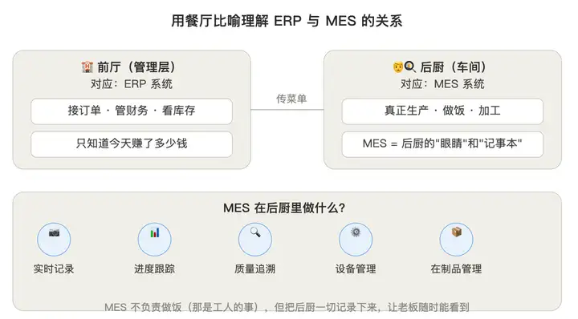
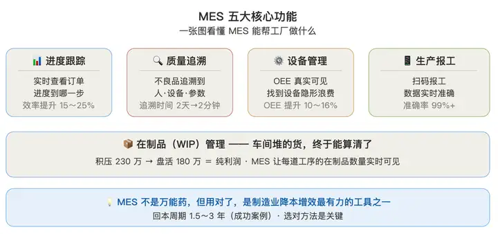

# 什么是MES?
MES是一套面向生产制造企业车间执行层的生产信息化管理系统，简单来说MES主要用于从订单下达到产品完成的整个生产过程进行优化管理，精细化管控生产，实现车间透明化管理。

MES从ERP得到生产订单指令，进而工厂的生产线根据生产订单要求，进行工序下达，完成产品的交付

MES就相当于车间的中枢神经，连接各个部门，指引控制所有生产活动，同时MES系统通过移动设备报工，搜集生产信息、设备信息和质量信息等相应生产信息汇总，形成订单一体化信息登记，为生产管理决策提供有效的支持，增强企业订单按期交付能力。
## 大白话总结（[参考知乎作者](https://www.zhihu.com/question/11643904419/answer/2035475144769024493)）：
### 一、先用一个比喻讲清楚 MES 是啥？
**把工厂作一个餐厅**：

- **老板**：看财务报表，知道今天赚没赚钱 → 对应 ERP 系统（管财务、订单、库存）
- **服务员**：把客人点的菜传给后厨 → 对应 订单系统
- **后厨**：真正做饭的地方，灶台、厨师、配菜、上菜 → 这就是 车间

**问题来了：老板只知道今天接了多少单、收了多少钱，但不知道**：

- 后厨现在做到哪一步了？
- 哪个灶台效率最高？
- 哪道菜经常做糊（不良品）？
- 客人等了 20 分钟还没上菜，卡在哪了？

MES 系统，就是装在后厨的"眼睛"和"记事本"。

它不负责接单（那是 ERP 的事），也不负责做饭（那是工人做的事），但它把后厨发生的一切都记下来，让老板随时能看到。

### 二、MES 到底能干哪几件事？（用工厂语言讲）

1️⃣ 生产进度实时跟踪
#### 没有 MES 之前：
老板问车间主任：「订单做到哪了？」 

车间主任：「我下去看看……呃，应该做到第 3 道工序了」（其实他自己也不确定）

#### 有了 MES 之后：
老板打开手机/电脑，直接看到：

订单 A：已完工 70%，预计明天下午 3 点完成订单 

B：卡在第 2 道工序，已延误 4 小时

价值：不用下去跑现场，生产效率提高 15～25%。

2️⃣ 质量管理：出问题能追溯到根儿上

**没有 MES 之前**：

客户投诉：「你们这批货有 50 个不良品！」 

工厂排查：查纸质记录，花 2 天，最后发现是「上周三晚班，3 号机床参数设错了」——但不知道是谁操作的。

**有了 MES 之后：** 

输入不良品批次号，系统直接显示：生产时间：2026-05-03 晚班 20:15操作工人：张三使用设备：3 号 CNC工艺参数：温度 185°C（标准是 170～180°C）价值：追溯时间从 2 天缩短到 2 分钟，避免同样错误再发生。

⸻3️⃣ 设备管理中 OEE 看得见OEE（设备综合效率） = 可用性 × 性能 × 质量

**没有 MES之前**：

工厂算 OEE 靠「估算」，数据不准。 

**有了 MES**：

系统自动采集设备运行数据，真实 OEE 一目了然。我服务过的一家工厂，上了 MES 后发现：老板以为设备利用率 85%实际只有 62%（剩下 23% 被换模、待料、故障吃掉了）找到问题，才能解决问题。6 个月后，OEE 提升到 78%。

4️⃣ 生产报工：

工人不用手写纸条了

**传统方式**： 工人做完一道工序，手写一张纸条，交给统计员，统计员再录入 Excel。问题：数据滞后（当天的数据，第二天才能看到）容易错（字迹潦草、录入错误）工人抵触（多了一道"额外工作"）

**MES 方式**： 工人用扫码枪/触摸屏/手机，扫一下工单条码，点「开始」和「完成」，系统自动记录。价值：数据实时，准确率 99%+，工人也省事。

5️⃣ 在制品（WIP）管理：

车间堆的货，终于能算清了

**传统**：很多工厂车间里堆了大量在制品（做了一半的半成品），但没人知道具体有多少、值多少钱。我见过最夸张的案例：一家电子厂，车间在制品积压了 230 万（相当于 2 个月的产量），老板完全不知道。

**上了 MES 后**：每道工序的在制品数量实时可见，3 个月清理了 180 万积压。这笔钱盘活了，就是纯利润。

本人所在公司为一家制造耳机的制造业厂大，这种制造业自然逃离不了ERP、MES系统这种东西，在我们公司同上ERP是整个公司项目的一个核心，MES是管理车间的系统。

# 公司的MES具体是干什么的？
## 自动化测试机的概念？
### 1、自动化测试机是什么

就是生产线上一台台自动检测耳机好坏的机器：充电测试机、ANC 音质测试仪、RF 信号测试仪。耳机放进去，机器自动测参数、自动判良品 / 不良，不用人工拿着仪器一点点测。这些机器是别的设备工厂造好，卖给我们公司。

### 2、不同品牌机器往 MES 上报数据啥意思

不同厂家造的测试机，内部系统不一样、说话格式不一样。机器测完每一只耳机后，自动把测试结果通过网线传给天键的 MES 系统存档，即上报数据。

### 3、这么做的实际意义？

- **不用人工填表**：以前员工手写良品不良，容易写错、偷懒；机器自动上传数据，真实无法篡改。

- **管控流线**：上道测试不合格，MES 收到数据后，下一台测试机直接不让耳机过线，强制返修。

- **追溯品质**：后续出现质量问题，在 MES 查得到：哪天生产、哪台机器测的、哪个操作员做的、哪项参数不合格。

- **统计产能**：看板自动显示产线产量、不良率，管理人员实时看生产状况。

## 除了除了管控耳机测试合格 / 返工，公司的MES还有 几个实用功能

### 一、车间大屏看板：实时看全厂生产
- **产线实时数据**：大屏实时显示每条线今天做了多少耳机、目标产量还差多少、良品率多少、不良集中在哪道工序。不用车间文员每天手写日报。
- **设备状态监控**：哪台测试机停机、故障、空转，大屏直接标红提醒，维修师傅立刻去检修；避免机器空耗、产线停工没人发现。
- **在制品数量**：能查到整条产线上有多少半成品卡在某工位，方便调度物料、调整人手。

### 二、产品全生命周期追溯：售后 / 客诉溯源
- 每只耳机有唯一 MAC 码（相当于耳机身份证），从上线组装→每道测试→返修→成品入库全记录在系统：
- 客户反馈一批耳机音质故障，扫码就能查到：哪天生产、哪条产线、哪个操作工、哪台测试机、当时各项测试参数、有没有返修过、修了几次。
- 快速锁定是原材料问题、机器问题还是员工操作问题，不用整批全部报废。

### 三、返修
不只是不合格退回返工，系统自动记维修台账：
- **退站限制**：不能随意往前跳工序，比如耳机已经做完包装，不能退回前面 RF 工位，防止乱改生产流程。
- **维修次数记账**：退站返修后，系统自动更新维修次数，连续 3 次修不好直接锁死产品，做报废处理，杜绝反复返修浪费物料。
- **批量返修**：管理人员可以批量扫码，一次性退回一批不良耳机，不用逐个手动改数据。

### 四、自动生成各类报表，支撑成本、生产核算
系统根据每天测试机上传的数据，自动生成三类报表：
- **品质报表**：每日 / 每月各机型不良占比、不良原因分布（充电故障 / 音质故障 / RF 故障），研发、品质部用来优化产品。
- **生产绩效报表**：每条产线、每个班组、单个工人日产数量、合格率，用来核算计件工资、班组考核。
- **设备报表**：每台测试机开机时长、故障频次、有效产出，评估设备要不要保养、淘汰换新。

今天是来公司第二天，大概看了公司的MES是干嘛的，但代码什么的还没拉，因为公司电脑还没申请，下来，后面会继续更新，期待能更了解公司和MES相关的架构
