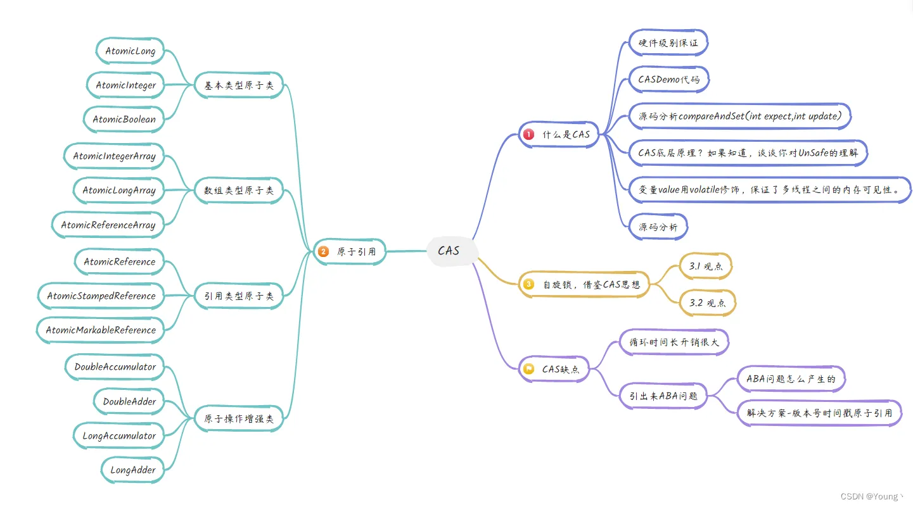

This blog template is built with [Astro](https://astro.build/). For the things that are not mentioned in this guide, you may find the answers in the [Astro Docs](https://docs.astro.build/).

## Front-matter of Posts

```yaml
---
title: My First Blog Post
published: 2023-09-09
description: This is the first post of my new Astro blog.
image: ./cover.jpg
tags: [Foo, Bar]
category: Front-end
draft: false
---
```


# CAS 原理及相关问题解析

## 一、CAS 概念
CAS（Compare-And-Swap）是**原子性操作**，它维护了三个操作数：
- 内存地址
- 预期值
- 更新值

执行 CAS 操作时，会将内存位置的值与预期原值进行比较：
- 若二者相等，则将内存中的值修改为更新值；
- 若二者不相等，则不做任何操作或进行自旋重试。

## 二、CAS 原理
在 Java 中，CAS 的实现底层依赖 `Unsafe` 类的 `compareAndSwap` 方法，该方法被 `native` 关键字修饰，其原子性由 **CPU 的原子指令集**保证。
- 以 x86 架构为例，底层通过 `compare and exchange` 指令确保原子性；
- 该指令执行时会锁住总线或缓存行，保证同一时刻只有一个 CPU 内核能够操作目标内存地址。

## 三、CAS 代码使用示例
### 1. 示例代码
```java
public class CASDemo {
    public static void main(String[] args) {
        // 创建一个原子类，初始值为5
        AtomicInteger atomicInteger = new AtomicInteger(5);

        /**
         * 方法参数：期望值、更新值
         * 只有当内存中的实际值与期望值相同时，才会执行更新操作
         * 假设三秒前获取的值为5，尝试更新为2019
         */
        System.out.println(atomicInteger.compareAndSet(5, 2019) + "\t current data: " + atomicInteger.get());

        // 再次尝试以期望值5更新为1024
        System.out.println(atomicInteger.compareAndSet(5, 1024) + "\t current data: " + atomicInteger.get());
    }
}
```

### 2. 执行结果
```
true	 current data: 2019
false	 current data: 2019
```

## 四、乐观锁（CAS）存在的问题
1.  **自旋开销大**
    自旋 CAS 的方式如果长时间更新不成功，会持续占用 CPU 资源，给 CPU 带来很大的性能开销。
2.  **单变量原子性限制**
    一次性只能保证**一个共享变量**的原子性操作。若需保证多个共享变量的原子性，可通过 `AtomicReference` 处理，或直接使用 `synchronized` 关键字实现。
3.  **ABA 问题**
    CAS 操作可能存在 ABA 问题，不过在大部分业务场景下，该问题不会影响并发操作的最终效果。

## 五、ABA 问题详解
### 1. 什么是 ABA 问题
在执行 CAS 操作的过程中，会出现以下场景：
- 线程 1 从内存中获取共享变量的值为 A；
- 线程 1 被挂起，线程 2 执行操作，将该变量的值修改为 B；
- 线程 3 执行操作，又将该变量的值修改回 A；
- 线程 1 恢复执行，比较发现变量值仍为 A，便认为该值从未被修改过，继续执行更新操作，这就是 **ABA 问题**。

### 2. ABA 问题的解决方法
解决 ABA 问题的常用方案是使用**带有版本号的 CAS**，Java 中可通过 `AtomicStampedReference` 类实现。
- 原理：在共享变量的基础上新增一个**版本号**，每次对变量执行修改操作时，同步将版本号递增；
- CAS 操作时的判断条件：不仅要求变量的当前值与预期值相等，还要求版本号也完全一致，才会执行更新操作；
- 效果：当变量值相同但版本号不同时，说明发生过 ABA 问题，此时不会执行更新。

### 3. 补充说明
ABA 问题在大部分业务场景下不会影响并发操作的最终结果，因此很多场景下可以不用专门解决。

---
