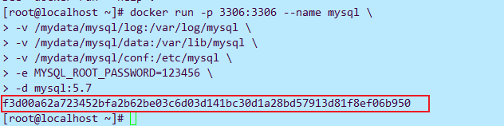
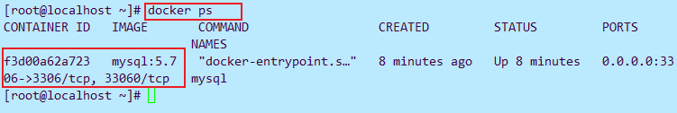
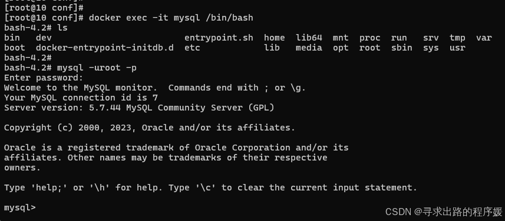
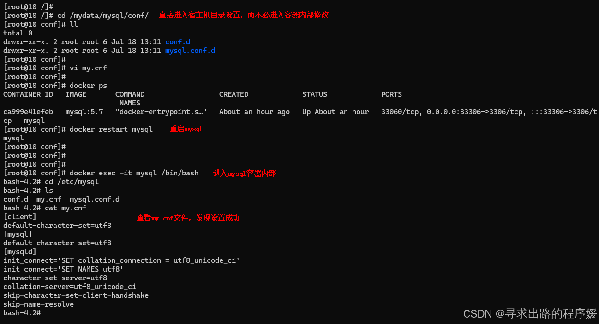

# Docker下载mysql5.7和redis

## 1.下载mysql:

首先要拉去mysql的镜像：

```
sudo docker pull mysql:5.7
```

然后创建root实例并启动：

```
sudo docker run -p 3306:3306 --name mysql \
-v /usr/local/mysql/log:/var/log/mysql \
-v /usr/local/mysql/data:/var/lib/mysql \
-v /usr/local/mysql/conf:/etc/mysql/conf.d \
-e MYSQL_ROOT_PASSWORD=293928 \
--network yunxiang_network \
-d mysql:8
```

配置说明：

```
参数说明
-p 3306:3306：将容器的3306端口映射到主机的3306端口。如果本地已安装mysql或其他应该占用了3306端口，可使用其他端口 -p port1:3306，保证port1端口未被占用即可
-v /mydata/mysql/conf:/etc/mysql：将配置文件夹挂在到主机
-v /mydata/mysql/log:/var/log/mysql：将日志文件夹挂载到主机
-v /mydata/mysql/data:/var/lib/mysql/：将数据文件夹挂载到主机
-e MYSQL_ROOT_PASSWORD=root：初始化root用户的密码
冒号（:）左边为linx文件目录，右边为docker内部
```

使用命令：

```
sudo docker ps -a
```

我们可以看到可以目前mysql正在运行，并占用3306端口。

**问题：**

mysql挂了没跑起来，查看日志看一下原因

```
docker logs mysql
```


**解决办法：**

##### 检查本地配置目录:

确认本地的 /mydata/mysql/conf 目录中[是否存在](https://so.csdn.net/so/search?q=是否存在&spm=1001.2101.3001.7020) conf.d 和 mysql.conf.d 子目录，如果不存在，创建这个子目录。

```bash
-- 创建子目录
mkdir -p /usr/mysql/conf/conf.d
mkdir -p /mydata/mysql/conf/mysql.conf.d
123
```

此时，可以通过命令进入conf目录中检查是否已经存在子目录

```bash
cd /mydata/mysql/conf
1
```

##### 删除或重命名旧容器:

```bash
-- 删除它，以释放容器名称
docker rm mysql

-- 重命名旧容器
docker rename mysql old_mysql
12345
```

##### 重启容器:

```bash
docker run -p 3306:3306 --name mysql \
-v /mydata/mysql/log:/var/log/mysql \
-v /mydata/mysql/data:/var/lib/mysql \
-v /mydata/mysql/conf:/etc/mysql \
-e MYSQL_ROOT_PASSWORD=root  \
-d mysql:5.7
```

此时，通过命令可以查看是否可以已经启动MySQL容器

```bash
docker ps
```


#### 进入mysql容器

```bash
docker exec -it mysql /bin/bash
1
```

使用MySQL命令打开客户端：

```bash
mysql -uroot -p        
mysql -uroot -p密码 --default-character-set=utf8   
```


#### 修改mysql默认配置

#####  查看mysql挂载的文件夹

由于在创建实例的时候，已经将部分文件夹挂载到Linux宿主机目录下，所以当我们修改一些mysql的配置文件时，不需要再进入docker环境下，直接在Linux环境下操作即可。挂载的目录为：

```shell
/mydata/mysql/conf==> etc/mysql
```

所以只要我们在宿主机的挂载目录中创建的文件，同样也会映射到容器的映射目录下。


#### mysql配置

Linux 操作系统中 MySQL 的配置文件是 my.cnf，一般会放在 /etc/my.cnf 或 /etc/mysql/my.cnf 下。

所以我们只要在宿主机的/mydata/mysql/conf中写入my.cnf文件，容器内就会有/etc/mysql/my.cnf,即成功完成配置。

#### 操作：

```
cd /mydata/mysql/conf
ls
vi my.cnf
# 在my.cnf中插入上述my.cnf内容，保存退出（esc+:wq）,如果编译失败想退出用:!q

#重启mysql
docker ps
docker restart mysql

```

my.cnf文件内容为：

```
[client]
default-character-set=utf8

[mysql]
default-character-set=utf8

[mysqld]
init_connect='SET collation_connection = utf8_unicode_ci'
init_connect='SET NAMES utf8'
character-set-server=utf8
collation-server=utf8_unicode_ci
skip-character-set-client-handshake
skip-name-resolve
```

2）进入mysql容器内部，查看文件是否配置成功

```sh
docker exec -it mysql /bin/bash
cd /etc/mysql
ls
cat my.cnf
```


### 补充

**1）设置mysql每次开机随docker自启动**

可以使用`docker run`命令时加上`--restart`选项，或者在容器创建后更改其重启策略

```shell
docker run -d --restart=always --name yourContainerName yourImag
```

这里的`--restart=always`选项确保无论退出代码是什么，只要Docker守护程序启动，容器都会自动重启。

如果容器已经运行，您可以使用`docker update`命令更改重启策略

```shell
docker update mysql-container --restart=always
1
```

2）如果想 设置docker服务开机自启动，可使用如下命令：

```sh
systemctl enable docker
```

## 2.redis的安装

#### 一、安装redis

1.1 拉去镜像

```XML
docker pull redis:6.2
```

1.2 查看拉去的镜像：

```
docker images
```

#### 二，创建reids[配置文件](https://so.csdn.net/so/search?q=配置文件&spm=1001.2101.3001.7020)

**新建文件夹**

```XML
1-新建文件夹
mkdir -p /data/dockerData/redis/conf
cd /data/dockerData/redis/conf

2-创建文件
touch redis.config
ls

3-编写文件内容  （进入后 i 子母键插入，黏贴下面配置，:wq! 保存并退出）
vim redis.config
```


**本次使用的配置文件（注意看我注释）redis.config：**

```
# Redis服务器配置 
 
# 绑定IP地址
#解除本地限制 注释bind 127.0.0.1  
#bind 127.0.0.1  
 
# 服务器端口号  
port 6379 
 
#配置密码，不要可以删掉
requirepass 293928
  
 
 
#这个配置不要会和docker -d 命令 冲突
# 服务器运行模式，Redis以守护进程方式运行,默认为no，改为yes意为以守护进程方式启动，可后台运行，除非kill进程，改为yes会使配置文件方式启动redis失败，如果后面redis启动失败，就将这个注释掉
daemonize no
 
#当Redis以守护进程方式运行时，Redis默认会把pid写入/var/run/redis.pid文件，可以通过pidfile指定(自定义)
#pidfile /data/dockerData/redis/run/redis6379.pid  
 
#默认为no，redis持久化，可以改为yes
appendonly yes
 
 
#当客户端闲置多长时间后关闭连接，如果指定为0，表示关闭该功能
timeout 60
# 服务器系统默认配置参数影响 Redis 的应用
maxclients 10000
tcp-keepalive 300
 
#指定在多长时间内，有多少次更新操作，就将数据同步到数据文件，可以多个条件配合（分别表示900秒（15分钟）内有1个更改，300秒（5分钟）内有10个更改以及60秒内有10000个更改）
save 900 1
save 300 10
save 60 10000
 
# 按需求调整 Redis 线程数
tcp-backlog 511
 
 
 
  
 
 
# 设置数据库数量，这里设置为16个数据库  
databases 16
 
 
 
# 启用 AOF, AOF常规配置
appendonly yes
appendfsync everysec
no-appendfsync-on-rewrite no
auto-aof-rewrite-percentage 100
auto-aof-rewrite-min-size 64mb
 
 
# 慢查询阈值
slowlog-log-slower-than 10000
slowlog-max-len 128
 
 
# 是否记录系统日志，默认为yes  
syslog-enabled yes  
 
#指定日志记录级别，Redis总共支持四个级别：debug、verbose、notice、warning，默认为verbose
loglevel notice
  
# 日志输出文件，默认为stdout，也可以指定文件路径  
logfile stdout
 
# 日志文件
#logfile /var/log/redis/redis-server.log
 
 
# 系统内存调优参数   
# 按需求设置
hash-max-ziplist-entries 512
hash-max-ziplist-value 64
list-max-ziplist-entries 512
list-max-ziplist-value 64
set-max-intset-entries 512
zset-max-ziplist-entries 128
zset-max-ziplist-value 64
```

####  三、运行容器，使用上面配置文件启动

```
docker run -p 6379:6379 --name redis6.2.6 -v /data/dockerData/redis/conf/redis.config:/etc/redis/redis.conf -v /data/dockerData/redis/data:/var/lib/redis -v /data/dockerData/redis/logs:/logs -d redis:6.2.6 redis-server /etc/redis/redis.conf

sudo docker run --name redis \
--network yunxiang_network \
-p 6379:6379 \
-d redis:6.2 
```


