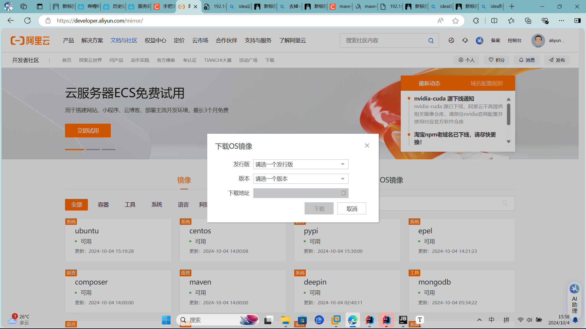
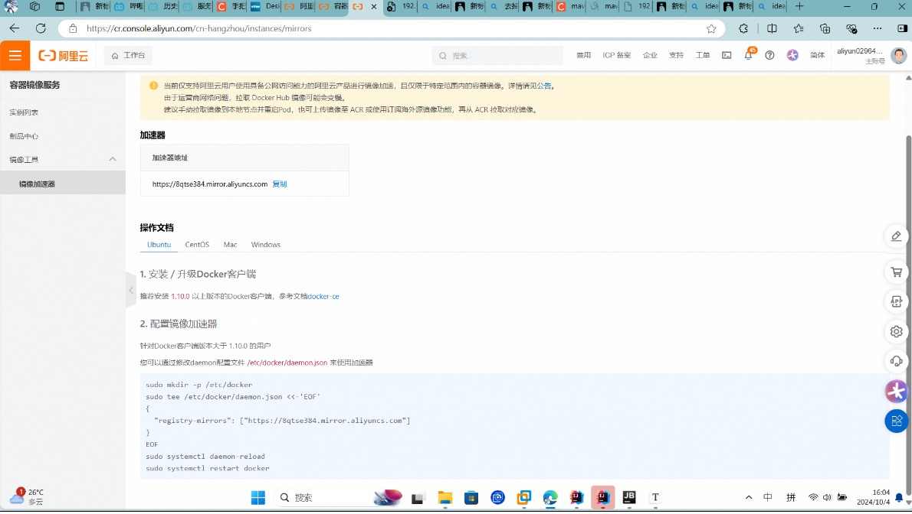
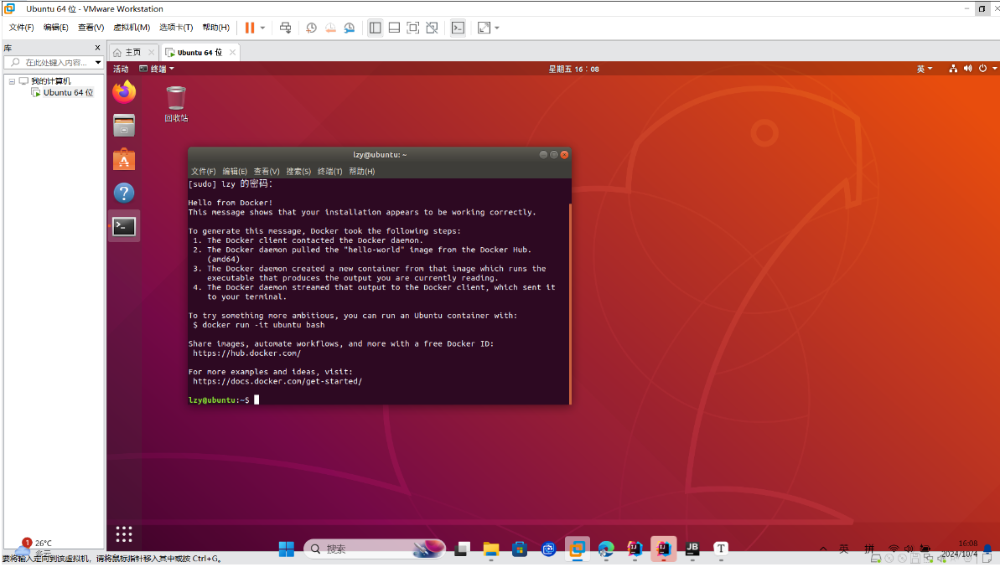

# linux系统与idea远程操控linux

### 1.首先去阿里巴巴的[镜像官网]([阿里巴巴开源镜像站-OPSX镜像站-阿里云开发者社区 (aliyun.com)](https://developer.aliyun.com/mirror/))中下载对应的os镜像

### 2.下载虚拟机[vmware](https://www.vmware.com/products/desktop-hypervisor/workstation-and-fusion)

### 3.添加虚拟机，选择我们刚才下载好的镜像

### 4.设置虚拟机的中文语言，键盘，日期，具体操作搜帖子

### 5.安装docker，配置镜像加速器（不然可能会连接超时），在首页的产品中，找到阿里云的**容器镜像服务**：


按照官方文档的命令切换镜像源，注意阿里的镜像源可能也会超时，可以去网上搜搜一些稳定的，比如中科大什么的镜像源

这里给一个我成功的镜像源：

```
sudo mkdir -p /etc/docker
sudo tee /etc/docker/daemon.json <<-'EOF'
{
  "registry-mirrors": ["https://docker.registry.cyou",
"https://docker-cf.registry.cyou",
"https://dockercf.jsdelivr.fyi",
"https://docker.jsdelivr.fyi",
"https://dockertest.jsdelivr.fyi",
"https://mirror.aliyuncs.com",
"https://dockerproxy.com",
"https://mirror.baidubce.com",
"https://docker.m.daocloud.io",
"https://docker.nju.edu.cn",
"https://docker.mirrors.sjtug.sjtu.edu.cn",
"https://docker.mirrors.ustc.edu.cn",
"https://mirror.iscas.ac.cn",
"https://docker.rainbond.cc"]
}
EOF
sudo systemctl daemon-reload
sudo systemctl restart docker
```

下载完我们执行sudo docker run hello-world，出现：

就是已经成功配置了，配置好了docker以后，我们就可以进行远程开发了

### 6.使用idea远程开发同步linx

#### (六个步骤：编写代码，文件同步，代码运行，编译构建，部署，调试)

1.在linx系统在按win然后搜索ip,得到我们虚拟机的ip地址，这个ip地址非常重要，等下会经常使用

2.安装ssh（可以使用mobax等工具进行远程连接）,这个看linx服务器的种类去敲命令安装,比如ubuntu的命令是`sudo apt-get install openssh-server`,然后输入相关命令去查看ssh是否安装成功，比如ubuntu的命令为`ps -ef | grep ssh`

3.安装java环境，如jdk和maven,我们先更新软件安装包`sudo apt update`,然后下载jdk: `sudo apt install openjdk-8-jdk`,我们用`java-version`查看是否安装成功；然后我们用`sudo apt install maven`就可以下载maven了，同理用`mvn -v`查看一下是否安装成功，如果你要运行的代码中有需要别的环境需要安装，同理即可，到这里我们的环境就算安装完成了

4.在idea中，我们点击tool->deployment(部署的意思)，点击configuration,来创建一个远程部署的配置，点左上角的添加，选择SFTP协议，给服务器起个名字（比如ubuntu），然后给ssh起给配置，该配置的作用是idea要连接哪个linx服务器，我们输入linx服务器对应的ip地址，用户名和密码，然后点击test connection，如果显示successfully就连接成功，点击ok.

5.然后在deployment(就刚才打开的地方)右边的mapping设置我们java项目->linx服务器的映射文件，这里java默认选择根目录，然后linx选择/home/用户名/code

6.设置完linx服务器的连接后，接下来我们将idea的代码同步到linx服务器上，我们在项目根目录中右键，然后点击deployment,然后选择sync with deployment to(同步部署)，选择我们的linx服务器，然后系统就会自动给我们列举两个系统中不同的文件，我们点击第二个按钮直接一键部署。当然我们也可以设置一些自动同步的设置，如点击tool->deployment->automatic uoload就可以实现自动同步；也可以在tool->depolyment->option中设置自动同步删除等操作。

7.那同步完代码，我们如何运行linx中的代码呢，这里我们点击idea的控制台，然后点向下箭头选择我们linx服务器的ip,然后就可以跟操控idea的代码一样操控linx代码了，我们cd到代码目录文件，然后输入`maven spring-boot:run`就可以成功运行代码，在浏览器访问测试接口可以发现访问成功(这里要注意如果只是显示build successfully然后项目没启动的，去pom文件把<skip>true</skip>注释掉即可)

8.代码没有问题，那我们怎么打包并部署呢，和云服务器宝塔面板的部署一样，我们的目的都是把代码打成java包然后放到linx上运行，因为我们代码本来就在linx上，所以我们只需要用idea远程操控打包linx的代码并运行jar包即可：我们输入`mvn package`就可以将代码打成jar包，然后输入`java -jar jar包路径 --spring.profiles.active=prod`运行jar包，最后我们再访问浏览器的测试接口，能看到测试接口的对应输出就行了

ubuntu安装docker:

```
sudo apt install docker.io
```

1）查看命令用法

```shell
复制代码docker --help
```

查看具体子命令的用法：

```shell
复制代码docker run --help
```

2）从远程仓库拉取现成的镜像

用法：

```shell
复制代码docker pull [OPTIONS] NAME[:TAG|@DIGEST]
```

示例：

```shell
复制代码docker pull hello-world
```

3）根据镜像创建容器实例：

```shell
复制代码docker create [OPTIONS] IMAGE [COMMAND] [ARG...]
```

启动实例，得到容器实例 containerId：

```shell
复制代码sudo docker create hello-world
```

4）查看容器状态：

```shell
复制代码sudo docker ps -a
```

5）启动容器：

```shell
复制代码docker start [OPTIONS] CONTAINER [CONTAINER...]
```

启动示例：

```shell
复制代码sudo docker start mystifying_shamir
```

6）查看日志：

```shell
复制代码docker logs [OPTIONS] CONTAINER
```

启动示例：

```shell
复制代码sudo docker logs mystifying_shamir
```

7）删除容器实例：

```shell
复制代码docker rm [OPTIONS] CONTAINER [CONTAINER...]
```

删除示例：

```shell
复制代码sudo docker rm mystifying_shamir
```

8）删除镜像：

```shell
复制代码docker rmi --help
```

示例，强制删除：

```shell
复制代码sudo docker rmi hello-world -f
```

9）其他：构建镜像（build）、推送镜像（push）、运行容器（run）、执行容器命令（exec）等


**注意：**

如果我们遇到在用mobax远程连接时修改文件出现：

**MobaXterm写文件出现Permission denied**

我们可以这么做：

cd到想修改文件的所在文件夹下面，使用语句：

```bash
chmod [-R] 777 文件名
```


