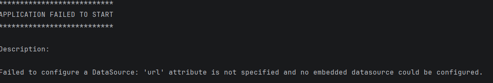

# 问题
在配置多环境时，将application.yml->application-local.yml
然后在application.yml编写配置为spring.profiles.active=local时出现：

# 解决办法及其原理：
把配置文件改成 application-local.yml 并设置 spring.profiles.active: local 后加载失败，本质是 Spring Boot 加载配置文件的「时机问题」 —— 你想让 Spring 加载 local 环境的配置，但「指定环境的配置」本身需要先被 Spring 读到，而你把 spring.profiles.active: local 写在了需要被激活才能加载的文件里，形成了「死循环」。
## 一、核心原理：Spring Boot 配置加载的「先后顺序」
Spring Boot 加载配置的优先级是：

- 先加载无环境标识的核心配置（application.yml）；
- 再根据核心配置里的 spring.profiles.active，加载对应环境的配置（如 application-local.yml）；
- 如果你的 spring.profiles.active: local 写在 application-local.yml 里：
- Spring 启动时先找 application.yml（空 / 不存在），默认激活 default 环境；
- 因为没激活 local，所以 application-local.yml 根本不会被加载；
- 最终 Spring 既没读到 application.yml 里的数据源配置，也没读到 application-local.yml 里的，自然报「url 未指定」。
## 二、解决方案
application-local.yml保留多环境不同的配置
然后再编写一个application.yml去多环境共同配置，顺便编写spring.profiles.active配置去激活对应的多环境配置。

