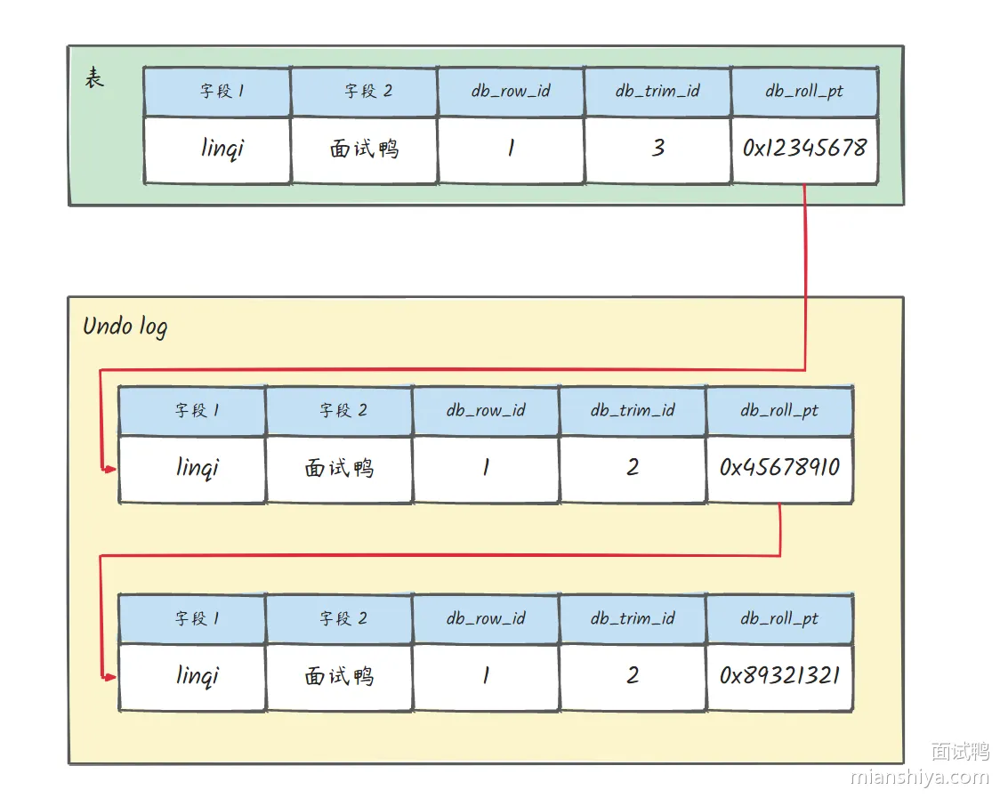
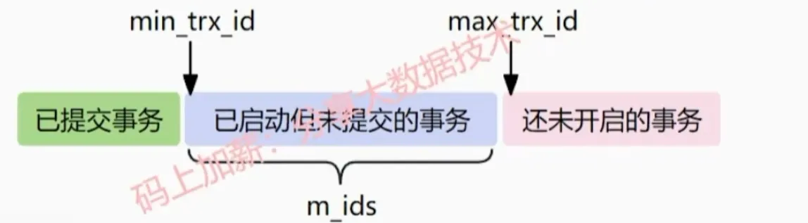

# 事务隔离机制和MVCC
## 事务
首先，我们要了解一下什么是事务，才能展开下面的话题:

### 什么是数据库事务：

事务就是一系列sql语句, 要么全成功, 要么全失败

### 事务的四大特征（ACID）:
**原子性 (Atomicity):** 事务是不可分割的最小单元, n个连续操作失败了一个, 前面的操作回滚 (要么都成功, 要么都失败)

原子性通过**undolog**回滚来实现

**一致性(Consistency):** 执行事务前后，数据总量保持一致. 例如转账业务中，无论事务是否成功，转账者和收款人的总额应该是不变的；

保证了其他三个特性, 一致性就自然实现了.

**隔离性 (Isolation):** 多个事务并发执行时，每个事务的操作互不干扰.

mvcc+锁 配合undolog来实现

**持久性 (Durability)**:持久性是指一个事务一旦被提交，它对数据库中数据的改变就是永久性的, 无法撤销

redolog来实现

## 隔离性产生的问题：
以下为隔离性产生的问题，他们在不同隔离级别下产生或者被解决:

### 脏读
**定义**：一个事务读到另一个事务未提交的数据。

**案例**：在事务A执行过程中，事务A对数据资源进行了修改，事务B读取了事务A修改后的数据。 由于某些原因，事务A并没有完成提交，发生了RollBack操作，则事务B读取的数据就是脏数据。
### 不可重复读:
**定义**： 同一个事务中，前后两次读取的数据不一致。

**案例**：事务B读取了两次数据资源，在这两次读取的过程中事务A修改了数据，导致事务B在这两次读取出来的数据不一致。
   ### 幻读:
**定义**：同一个事务中，前后两次读取的数据的行数不一致(比如第一次读是有0条数据, 但是第二次读却有了1条数据).

  **案例**：事务A按照条件查询数据时，没有对应的数据行，但是在插入数据时，又发现这行数据已经存在，好像出现了幻觉。(由于解决了不可重复读, 所以该事务读取不到别的事务已提交的数据)

### 事务的隔离级别：
#### 读未提交：
读未提交(Read Uncommitted)，是最低的隔离级别，所有的事务都可以看到其他未提交的事务的执行结果。不能解决脏读，可重复读，幻读，所以很少应用于实际项目。

#### 读已提交
读已提交(Read Committed)， 在该隔离级别下，一个事务的更新操作结果只有在该事务提交之后，另一个事务才可能读取到同一笔数据更新后的结果。
可以防止脏读，但是不能解决可重复读和幻读的问题。

#### 可重复读 (mysql默认隔离级别)
可重复读(Repeatable Read)，MySQL默认的隔离级别。

可重复读是快照读, 在该隔离级别下，一个事务多次读同一个数据, 实际上读的是数据快照, 其他事务修改数据在当前事务是不可见的, 这样就可以保证在同一个事务内两次读到的数据是一样的。
可以防止脏读、不可重复读、第一类更新丢失、第二类更新丢失的问题，不过还是会出现幻读。
#### 串行化
串行化(Serializable)，这是最高的隔离级别。

它要求事务按顺序一个一个执行，不能并发执行(会阻塞)。
在这个级别，可以解决上面提到的所有并发问题，但可能导致大量的超时现象和锁竞争，通常不会用这个隔离级别
注意: 事务的隔离级别越高, 数据安全性就越高, 但是执行效率越低.

### 事务隔离级别是怎么实现的：
MySQL 的隔离级别基于锁和 MVCC 机制共同实现的。

**读未提交**：直接**读取最新的数据版本**实现，会出现**脏读，不可重复读和幻读**问题;

**读已提交**：通过MVCC+行锁锁住行数据实现，解决了脏读，但会出现不可重复读或者幻读；

**可重复读**:通过MVCC+临建锁实现。解决脏读和不可重复读和一部分的幻读问题；

**串行化**： 通过表级锁实现；

## MVCC:
### 定义
MVCC( 多版本并发控制)指维护一个数据的多个版本，控制返回某个版本的数据，使得读写操作没有冲突.

具体实现数据库记录中的隐式字段、undolog日志、readView进行实现的。

## MVCC 可以为数据库解决什么问题
在并发读写数据库时, 可以解决读写并发问题，提高了数据库并发读写的性能.

同时还可以解决脏读、不可重复读和一部分幻读问题。

### MVCC 的实现原理
MVCC的具体实现，依赖于数据库记录中的隐式字段(最近更新的事务id和回滚指针)、undo log版本链？、readView。
#### 隐藏字段:
行数据除了我们定义的字段之外，还有一些重要的隐藏字段:

**db_trx_id**:最近修改的事务id

**db_roll_ptr**:回滚指针，指着这行数据的上一个版本。

综上所述，构成了undo版本链

**readview**:

readview其实就是维护了一个集合，他有四个字段:

**trx_ids**:表示当前数据库活跃事务id列表

**low_limit_id**:下一个事务的id（最大事务id）

**up_limit_id**:最小活跃事务id（最小事务id）。

**creator_trx_id**:readview创建者事务的id

然后这个关系如下:

undolog版本链决定返回的数据，readview加上可见性算法决定了返回数据的那个版本。先看最新的版本数据能不能满足可见，不能就一直回undolog的前一个版本直到找到可见的数据版本然后返回

 

