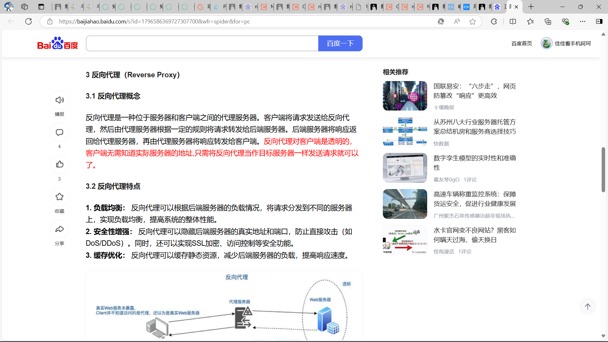

# Linx中nginx的使用

### 1.nginx的作用：

我们在java项目中一般用nginx进行反向代理

简单来说，nginx就像是前端和后端的一个代理服务器，前端发送请求给nginx，nginx根据配置文件和前端请求的url代理到相应的后端接口，这样我们就可以轻松解决跨域问题和各种问题。

如果是浏览器，浏览器就要直接访问nginx的端口，比如你nginx在ip为192.168.150.105的linx虚拟机中部署，端口为默认的80（80端口可以不写），这样我们的浏览器就得请求到192.168.150.105（：80）/url,这样浏览器就会请求到nginx，nginx就会根据后面的url去代理到对应的后端端口。

前端也是一样的，我们前端发请求要发送给nginx，比如你前端和nginx都部署在ip为192.168.150.105的虚拟机中，那你的前端就得请求到192.168.150.105（：80）/url,这样才能请求请求到nginx,nginx才能根据后面的url来代理到对应的接口。


### 2.nginx在docker的部署：

**我们先创建一个初始化容器，用来拷贝我们的配置：**

```
docker run \
--restart always \
--name nginx \
-d \
-p 80:80 \
nginx
```

**创建挂载的文件：**

```
mkdir -p /data/nginx/conf//挂载配置文件目录
mkdir -p /data/nginx/html//挂载资源文件目录
mkdir -p /data/nginx/conf.d
cd /data/nginx/conf.d
touch default.conf //挂载默认配置文件，我们的文件配置就在这里配置
```

-p ：指的是创建一个或者多个目录文件


**拷贝文件：**

```
docker cp Nginx:/etc/nginx/nginx.conf  /data/nginx/conf
docker cp Nginx:/etc/nginx/conf.d/default.conf /data/nginx/conf.d/default.conf
docker cp Nginx:/usr/share/nginx/html/index.html /data/nginx/html
```


**然后我们删掉原来那个容器:**

```
sudo docker stop nginx
sudo docker rm nginx
```


**最后我们重新创建一个容器**：

```
docker run \
--restart always \
--name nginx \
-d \
-v /data/nginx/html:/usr/share/nginx/html \
-v /data/nginx/conf/nginx.conf:/etc/nginx/nginx.conf \
-v /data/nginx/conf.d/default.conf:/etc/nginx/conf.d/default.conf \
-p 80:80 \
nginx
```


**3.nginx配置（参考的）：**

```
server {

    listen       80;
    server_name  192.168.1.101;

    # 首页
    index index.html;

    location / {
        root   /usr/share/nginx/html;
        index  index.html index.htm;
    }

    location /api/ {
        auth_request /auth;
        # 鉴权通过后的处理方式
        proxy_pass http://192.168.1.101:8080/success;
    }

    location = /auth {
        # 发送子请求到HTTP服务，验证客户端的凭据，返回响应码
        internal;
        # 设置参数
        set $query '';
        if ($request_uri ~* "[^\?]+\?(.*)$") {
            set $query $1;
        }
        # 验证成功，返回200 OK
        proxy_pass http://192.168.1.101:8080/verify?$query;
        # 发送原始请求
        proxy_pass_request_body off;
        # 清空 Content-Type
        proxy_set_header Content-Type "";
     }

    error_page 404 /404.html;
        location = /40x.html {

        }

    error_page   500 502 503 504  /50x.html;
     location = /50x.html {
     }

}
```

然后可以通过mobax点到

```
/data/nginx/conf.d/default.conf
```

目录下，然后将配置文件改成我们要的。

**注意：**

如果我们遇到在用mobax远程连接时修改文件出现：

**MobaXterm写文件出现Permission denied**

我们可以这么做：

cd到想修改文件的所在文件夹下面，使用语句：

```bash
chmod [-R] 777 文件名
```

