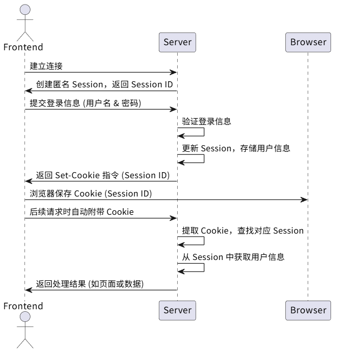

# 一、需求分析
对于用户模块，通常要具有下列功能：

- 用户注册

- 用户登录

- 获取当前登录用户

- 用户注销

- 用户权限控制

- 【管理员】管理用户

**具体分析每个需求**：

1）**用户注册**：用户可以通过输入账号、密码、确认密码进行注册

2）**用户登录**：用户可以通过输入账号和密码登录

3）**获取当‍前登录用户**：得到已经登录的用户信息（不用重复登录）

4）**用户注销**：用户可以退出登录

5）**用户权‍限控制**：用户又分为普通用户和管理员，管理员拥有整个系统؜的最高权限，比如可以管理其他用户

6）**用户管‍理**：仅管理员可用，可以对整个系统中的用户进行管理，比如؜搜索用户、删除用户

# 二、方案设计
实现用户模块的难度不大，方案设计阶段我们需要确认：

- 库表设计

- 用户登录流程

- 如何对用户权限进行控制？

## 库表设计

库名：no_code

表名：user（用户表）


### 1、核心设计
用户表的核‍心是用户登录凭证（账号密码）和个人信息，SQL 如下：

````
-- 用户表
create table if not exists user
(
id           bigint auto_increment comment 'id' primary key,
userAccount  varchar(256)                           not null comment '账号',
userPassword varchar(512)                           not null comment '密码',
userName     varchar(256)                           null comment '用户昵称',
userAvatar   varchar(1024)                          null comment '用户头像',
userProfile  varchar(512)                           null comment '用户简介',
userRole     varchar(256) default 'user'            not null comment '用户角色：user/admin',
editTime     datetime     default CURRENT_TIMESTAMP not null comment '编辑时间',
createTime   datetime     default CURRENT_TIMESTAMP not null comment '创建时间',
updateTime   datetime     default CURRENT_TIMESTAMP not null on update CURRENT_TIMESTAMP comment '更新时间',
isDelete     tinyint      default 0                 not null comment '是否删除',
UNIQUE KEY uk_userAccount (userAccount),
INDEX idx_userName (userName)
) comment '用户' collate = utf8mb4_unicode_ci;
````
**几个注意事项**：

**editTime 和 updateTime 的区别**：editTime 表示用户编辑个人信息的时间（需要业务代码来更新），而 updateTime 表示这条用户记录任何字段发生修改的时间（由数据库自动更新）。

**给唯一值添加唯一键（唯一索引）**:比如账号 userAccount，利用数据库天然防重复，同时可以增加查询效率。
给经常用于查询的字段添加索引，比如用户昵称 userName，可以增加查询效率。


### 用户登录流程
1）建立初始会话‍：前端与服务器建立连接后，服务器会为该客户端创建一个初始的匿名 Session，并将其状态保؜存下来。这个 Session 的 ID 会作为唯一标识，返回给前端。

2）登录成功，更新会话信息：当‍用户在前端输入正确的账号密码并提交到后端验证成功后，后端会更新该用户的 Session，将用户的登录信息（如用户 ID、用户名等）保存到与该 Session 关联的存储中。同؜时，服务器会生成一个 Set-Cookie 的响应头，指示前端保存该用户的 Session ID。

3）前端保存 Cookie：前端接收到后端的响应后，浏览器会自动根据 Set-Cookie 指令，将 Sessi؜on ID 存储到浏览器的 Cookie 中，与该域名绑定。

4）带 Cookie 的后续请求：当前端再次向相同域名的服务器发送请求时，浏览器会自动在请求头中附؜带之前保存的 Cookie，其中包含 Session ID。

5）后端验‍证会话：服务器接收到请求后，从请求头中提取 Session ؜ID，找到对应的 Session 数据。

6）获取会话‍中存储的信息：后端通过该 Session 获取之前存储的用户信息（如登录؜名、权限等），从而识别用户身份并执行相应的业务逻辑。



### 如何对用户权限进行控制？

可以将接口分为四种权限：

- 未登录也可以使用
- 登录用户才能使用
- 未登录也可以使用，但是登录用户能进行更多操作（比如登录后查看全文）
- 仅管理员才能使用
传统的权限‍控制方法是，在每个接口内单独编写逻辑：先获取到当前登录؜用户信息，然后判断用户的权限是否符合要求。

这种方法最‍灵活，但是会写很多重复的代码，而且其他开发者无法一眼得؜知接口所需要的权限。

权限校验其实是一个比较通用的业务需求，一般会通过 Spring AOP 切面 + 自定义权限校验注解 实现统一的接口拦截和权限校验；如果有特殊的权限校验逻辑，再单独在接口中编码。
如果需要更复杂更灵活的权限控制，可以引入 Shiro / Spring Security / Sa-Token 等专门的权限管理框架。

## 代码生成器生成代码：
### MyBatis Flex 代码生成器
#### 1、什么是 MyBatis Flex？
MyBatis Plus 作为数据访问层框架，能够通过 Java 快速操作数据库。

MyBatis Flex是一个数据访问层框架，它的作用和 MyBatis Plus 一样，都是对传统操作数据库的 MyBatis 框架进行增强。它的 3 大优势：

- **更轻量**：MyBatis-Flex 除了 MyBatis 本身，再无任何第三方依赖，因此会带来更高的自主性、把控性和稳定性。在任何一个系统中，依赖越多，稳定性越差。
- **更灵活**：MyBatis-Flex 提供了非常灵活的 QueryWrapper，支持关联查询、多表查询、多主键、逻辑删除、乐观锁更新、数据填充、数据脱敏等等。
- **更高的性能**：MyBatis-Flex 通过独特的架构，没有任何 MyBatis 拦截器、在 SQL 执行的过程中，没有任何的 SQL Parse，因此会带来指数级的性能增长。

##### Mybatis Flex对比Mybatis的优势
官方文档 中提到了和 MyBatis Plus 的功能对比，我认为比较有竞争力的是它 支持多表查询：

此外，在 Mybatis Flex 中，有了一个名称为 mybatis-flex-codegen 的模块，提供了可以通过数据库表，生成代码的功能。当我们把数据库表设计完成后， 就可以使用其快速生成 Entity、Mapper、Service、Controller 代码，能大幅提高我们的开发效率。

# 前端编写
## 创建项目
使用 Vue 官方推荐的脚手架 create-vue 快速创建 Vue3 的项目：https://cn.vuejs.org/guide/quick-start.html

💡 Vue 提供了在线编码测试，可以通过 Playground 来学习 Vue：https://play.vuejs.org/

**创建命令**：
````
npm create vue@latest
````

## 请求生成
### 1、请求工具库
安装请求工具类 Axios，参考官方文档 执行命令：
````
npm install axios
````

### 2、全局自定义请求
需要自定义全局请求地址等，参考 Axios 官方文档，编写请求配置文件 request.ts。包括全局接口请求地址、超时时间、自定义请求响应拦截器等。

响应拦截器的应用场景：我们需要对接口的 通用响应 进行统一处理，比如从 response 中取出 data；或者根据 code 去集中处理错误。这样不用在每个接口请求中都去写相同的逻辑。

比如可以在‍全局响应拦截器中，读取出结果中的 data，并校验 code؜ 是否合法，如果是未登录状态，则自动登录。

示例代码如下，其中 withCredentials: true 一定要写，否则无法在发请求时携带 Cookie，就无法完成登录。

代码如下：
````
import axios from 'axios'
import { message } from 'ant-design-vue'

// 创建 Axios 实例
const myAxios = axios.create({
  baseURL: 'http://localhost:8123/api',
  timeout: 60000,
  withCredentials: true,
})

// 全局请求拦截器
myAxios.interceptors.request.use(
  function (config) {
    // Do something before request is sent
    return config
  },
  function (error) {
    // Do something with request error
    return Promise.reject(error)
  },
)

// 全局响应拦截器
myAxios.interceptors.response.use(
  function (response) {
    const { data } = response
    // 未登录
    if (data.code === 40100) {
      // 不是获取用户信息的请求，并且用户目前不是已经在用户登录页面，则跳转到登录页面
      if (
        !response.request.responseURL.includes('user/get/login') &&
        !window.location.pathname.includes('/user/login')
      ) {
        message.warning('请先登录')
        window.location.href = `/user/login?redirect=${window.location.href}`
      }
    }
    return response
  },
  function (error) {
    // Any status codes that falls outside the range of 2xx cause this function to trigger
    // Do something with response error
    return Promise.reject(error)
  },
)

export default myAxios

````

### 3、自动生成请求代码
如果采用传‍统开发方式，针对每个请求都要单独编写代码，很麻烦。

推荐使用 OpenAPI 工具，直接根据后端接口文档自动生成前端请求代码即可，这种方式会比 AI 生成更可控。

按照官方文档的步骤，先安装：
````
npm i --save-dev @umijs/openapi
````
还需要安装依赖库：
````
npm i --save-dev tslib
````
在 前端项目根目录 新建 openapi2ts.config.ts，根据自己的需要定制生成的代码：
````
export default {
requestLibPath: "import request from '@/request'",
schemaPath: 'http://localhost:8123/api/v3/api-docs',
serversPath: './src',
}
````
注意，要将‍ schemaPath 改为自己后端服务提供的 Swagge؜r 接口文档的地址，生成前确保后端已启动！

在 package.json 的 scripts 中添加 "openapi2ts": "openapi2ts"。

执行脚本即‍可生成请求代码，还包括 TypeScript 类型：

### 4.根据请求接口，配合ai生成前端页面
前端请求后端接口都在api包下，我们可以让ai根据该包的请求接口，配合我们描述的页面逻辑生成可以请求后端的代码。
