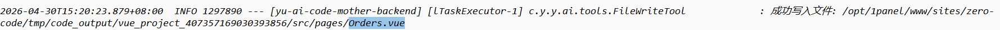
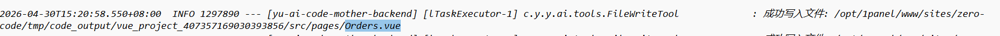
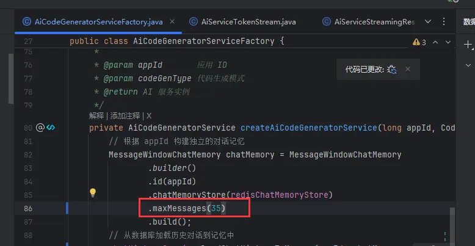
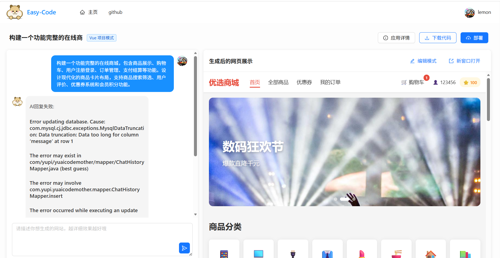

# 重复调用工具
### 起因

起因是我在面试的时候，面试官看了一下我的零代码平台的项目，然后后面我看数据库和日志，发现面试官生成了两次vue项目，但一直在不断调用工具写入文件，一直不生成结果，就排查了一下。

结果发现AI多次重复写入了相同的文件，比如这里的日志，在15时20分23秒的时候调用工具写入一个Order.vue页面，但在15时20分58秒后，又再次写入了相同的页面

### 思考
为啥会这样循环调用？

为此我到处在找解决方案，找了一圈也没找到

今天无意在看LangChan4j官方文档时发现工具调用的内容也会通过聊天记忆的方式传给AI让AI知道工具的执行结果，所以我在想AI循环调用工具是不是因为AI忘记了这个工具之前生成过，而之所以会忘记是因为之前的调用结果AI看不到，也就是不在对话记忆窗口中，接着我调大了Vue工程模式的对话记忆窗口测试了一下果然没有出现工具循环调用的情况了。

### 解决方案
调大对话记忆窗口的容量即可（最简单的方法）。

记忆窗口容量一般在初始化会话记忆模型时定义。

这样就能相当于AI会话时能记住很早前就创建过(35个)的文件了。

程序也能正常运行。

可以看到，和之前面试官输入的提示词一直去生成，结果发现可以正常的去生成了
