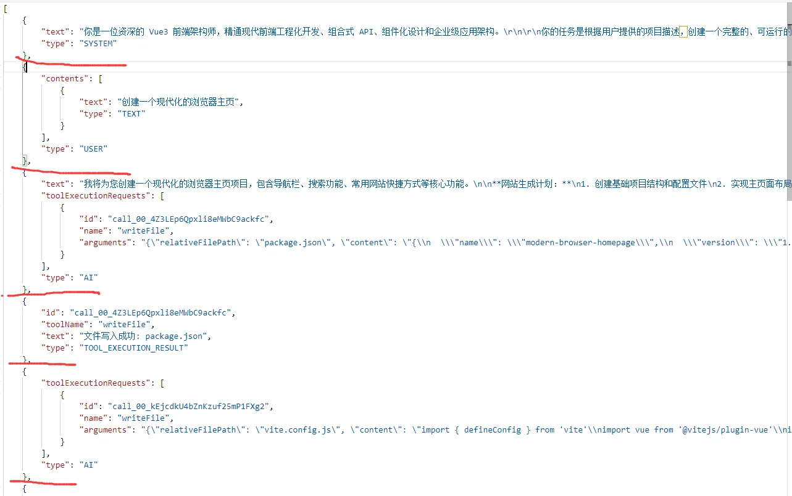
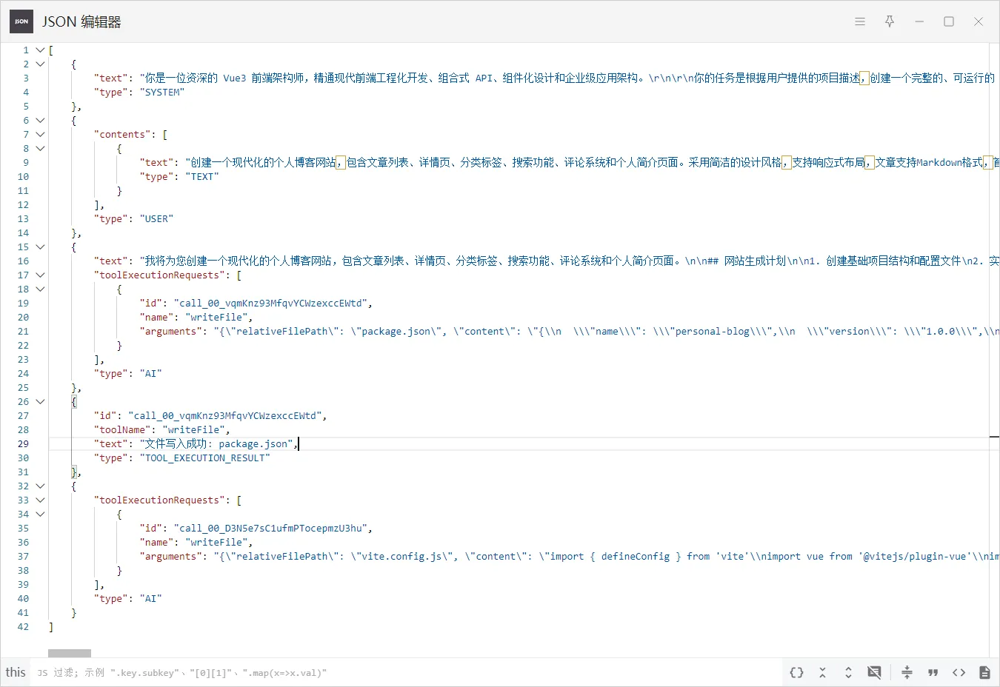
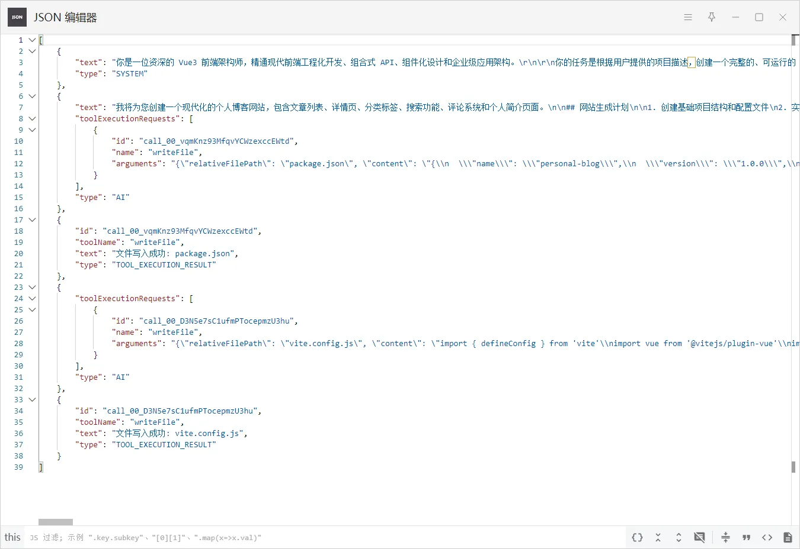
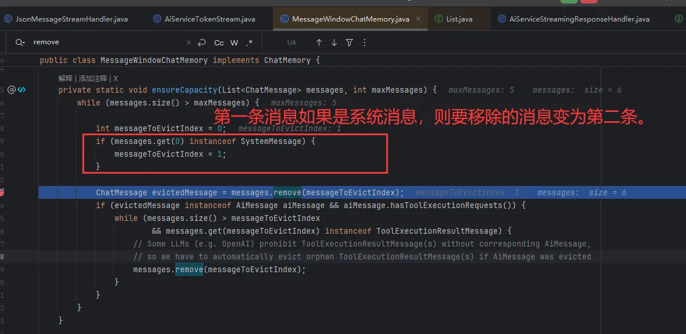
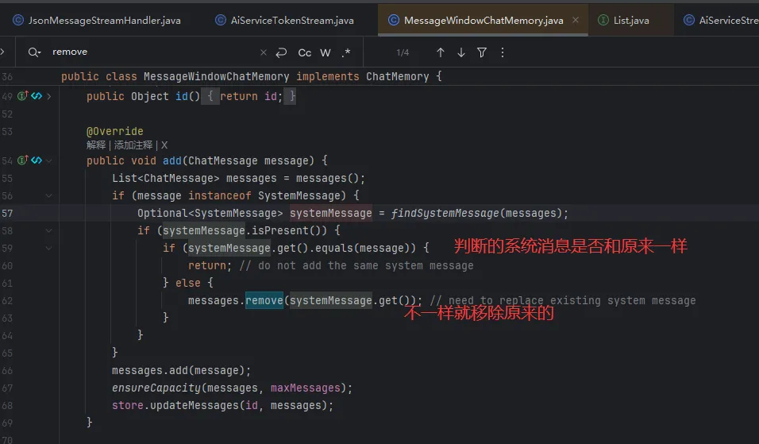

# 重复调用工具
### 起因

起因是我在面试的时候，面试官看了一下我的零代码平台的项目，然后后面我看数据库和日志，发现面试官生成了两次vue项目，但一直在不断调用工具写入文件，一直不生成结果，就排查了一下。


结果发现AI多次重复写入了相同的文件，比如这里的日志，在15时20分23秒的时候调用工具写入一个Order.vue页面，但在15时20分58秒后，又再次写入了相同的页面


### 思考
为啥会这样循环调用？

为此我到处在找解决方案，找了一圈也没找到

今天无意在看LangChan4j官方文档时发现工具调用的内容也会通过聊天记忆的方式传给AI让AI知道工具的执行结果，所以我在想AI循环调用工具是不是因为AI忘记了这个工具之前生成过，而之所以会忘记是因为之前的调用结果AI看不到，也就是不在对话记忆窗口中，接着我调大了Vue工程模式的对话记忆窗口测试了一下果然没有出现工具循环调用的情况了。

### 解决方案
调大对话记忆窗口的容量即可（最简单的方法）。

记忆窗口容量一般在初始化会话记忆模型时定义。

这样就能相当于AI会话时能记住很早前就创建过(35个)的文件了。

程序也能正常运行。


可以看到，和之前面试官输入的提示词一直去生成，结果发现可以正常的去生成了

# 扩展
## 记忆窗口容量是什么？
在langchin4j中，记忆窗口是AI每次收到系统消息，用户消息，或者AI每一次回复，调用工具，工具调用完成都会作为一个独立的窗口。

举个例子：

在以下对话记忆中，从上到下分别是系统消息、用户消息、AI回复(顺带工具调用)、工具结果、工具调用5条消息，此时记忆窗口数量就是 5 。

### 记忆窗口超出了会怎么样？
来试试看，我把记忆窗口容量的数量改为了5，然后我们看一下五条记忆窗口的会话记忆。

此时放开断点，新增一条会话记忆。

可以看出，第二条用户发送的提示词被移除了。准确的说，是除系统消息外的第一条消息会被移除。

langchain4j源码里是这样的，只有系统消息会被保留。（可能系统消息是很重要的叭）

另外，在添加消息时，如果添加的消息是系统消息，那么会直接移除掉原来的系统消息，保证系统消息唯一。

## 记忆容量是什么？
是一次记忆窗口的最大token数量。

可以通过配置文件来在定义。
````
langchain4j:
  open-ai:
    reasoning-streaming-chat-model:
      max-tokens: 500  # 一次记忆窗口的token容量就是500,这么点一般都会报错
````
如果一次窗口的token超出了这个数量，在流式响应请求中会直接报错。
````
java.lang.RuntimeException: com.fasterxml.jackson.core.JsonParseException: Unexpected character ('n' (code 110)): was expecting comma to separate Object entries
 at [Source: REDACTED (`StreamReadFeature.INCLUDE_SOURCE_IN_LOCATION` disabled); line: 1, column: 56]
````
看起来是流失响应块的结尾字符不正确，大概就是到达指定token后直接返回未完成的响应块了？（我猜的）

### 记忆窗口容量和记忆容量该如何设置呢？
最终我的记忆窗口容量是35、窗口最大token是32768（因为是默认的）。

我不限制代码行数跑下来一般会调用8-13次工具，也就是16-26个记忆窗口，再加上系统消息和用户消息，给出了5个窗口余量。（其实也不够，如果用户对一个应用频繁修改，那么丢失窗口也是必然的。）

token数量主要集中在代码上，一个文件的代码一般也不会超过32768个token（1token=3字母），也可以在prompt中限制一个文件的大小。

