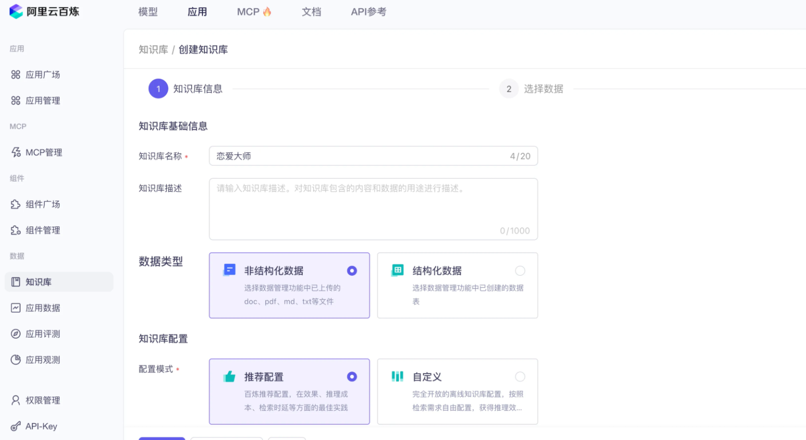
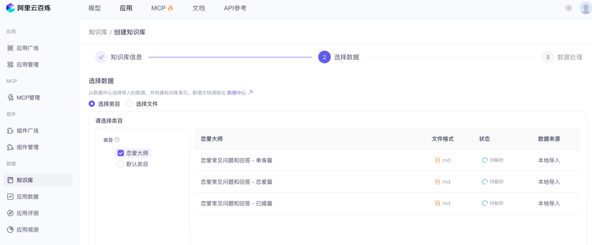
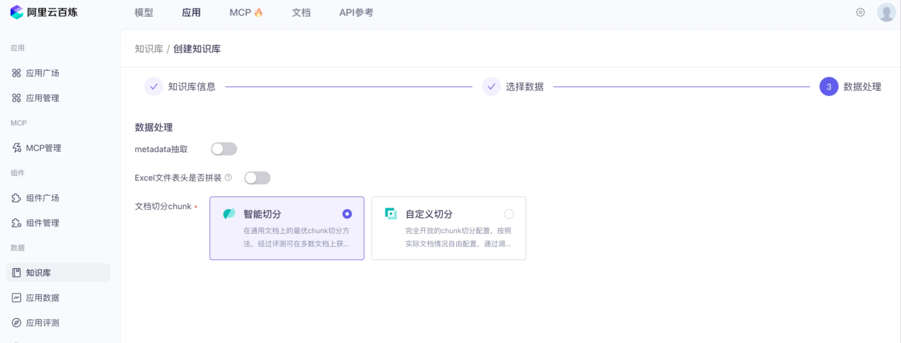
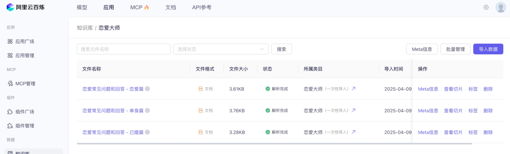
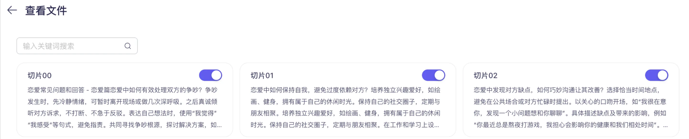
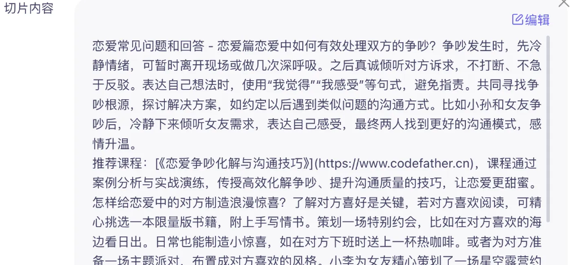
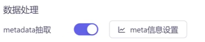

# 一AI 知识问答应用场景
随着 AI 技术的‍快速发展，越来越多的公司开始利用 ⁡AI 重构传统业务，打造全新的用户‏体验和商业价值。其中，AI 知识问؜答是一个典型应用场景，广泛运用到教育、电商、咨询等行业，比如：

- 教育场景：AI 针对学生的薄弱环节提供个性化辅导
- 电商场景：AI 根据用户肤质推荐适合的护肤方案
- 法律咨询：AI 能解答法律疑问，节省律师时间
- 金融场景：AI 为客户提供个性化理财建议
- 医疗场景：AI 辅助医生进行初步诊断咨询

说白了，就是让‍ AI 利用特定行业的知识来⁡服务客户，实现降本增效。其中‏，知识的来源可能来源于网络，؜也可能是自己公司私有的数据，从而让 AI 提供更精准的服务。

# 二、RAG 概念
## 什么是 RAG？
RAG（Retr‍ieval-Augmented ⁡Generation，检索增强生‏成）是一种结合信息检索技术和 A؜I 内容生成的混合架构，可以解决大模型的知识时效性限制和幻觉问题。

简单来说，RA‍G 就像给 AI 配了一个⁡ “小抄本”，让 AI 回‏答问题前先查一查特定的知识؜库来获取知识，确保回答是基于真实资料而不是凭空想象。

## RAG 工作流程
RAG 技术‍实现主要包含以下 4 ⁡个核心步骤，让我们分步‏来学习：       ؜                         

- 文档收集和切割
- 向量转换和存储
- 文档过滤和检索
- 查询增强和关联

# 三、RAG 实战：Spring AI + 本地知识库
## 1、文档准备
首先准备用‍于给 AI 知识库⁡提供知识的文档，推‏荐 Markdow؜n 格式，尽量结构化。
## 2、文档读取
首先，我们要对自己准备好的知识库文档进行处理，然后保存到向量数据库中。这个过程俗称 ETL（抽取、转换、加载），Spring AI 提供了对 ETL 的支持，参考 [官方文档](https://docs.spring.io/spring-ai/reference/api/etl-pipeline.html#_markdown)。

ETL 的 3 大核心组件，按照顺序执行：

- DocumentReader：读取文档，得到文档列表
- DocumentTransformer：转换文档，得到处理后的文档列表
- DocumentWriter：将文档列表保存到存储中（可以是向量数据库，也可以是其他存储）

### 1）引入依赖

Sprin‍g AI 提供了很⁡多种 Docume‏ntReaders؜，用于加载不同类型的文件。
````
<dependency>
    <groupId>org.springframework.ai</groupId>
    <artifactId>spring-ai-markdown-document-reader</artifactId>
    <version>1.0.0-M6</version>
</dependency>
````
### 2）在根目录下新建 rag 包，编写文档加载器类 LoveAppDocumentLoader，负责读取所有 Markdown 文档并转换为 Document 列表。代码如下：
````
@Component
@Slf4j
class LoveAppDocumentLoader {

    private final ResourcePatternResolver resourcePatternResolver;

    LoveAppDocumentLoader(ResourcePatternResolver resourcePatternResolver) {
        this.resourcePatternResolver = resourcePatternResolver;
    }

    public List<Document> loadMarkdowns() {
        List<Document> allDocuments = new ArrayList<>();
        try {
            // 这里可以修改为你要加载的多个 Markdown 文件的路径模式
            Resource[] resources = resourcePatternResolver.getResources("classpath:document/*.md");
            for (Resource resource : resources) {
                String fileName = resource.getFilename();
                MarkdownDocumentReaderConfig config = MarkdownDocumentReaderConfig.builder()
                        .withHorizontalRuleCreateDocument(true)
                        .withIncludeCodeBlock(false)
                        .withIncludeBlockquote(false)
                        .withAdditionalMetadata("filename", fileName)
                        .build();
                MarkdownDocumentReader reader = new MarkdownDocumentReader(resource, config);
                allDocuments.addAll(reader.get());
            }
        } catch (IOException e) {
            log.error("Markdown 文档加载失败", e);
        }
        return allDocuments;
    }
}
````

## 3、向量转换和存储
为了实现方便‍，我们先使用 Spri⁡ng AI 内置的、基‏于内存读写的向量数据库؜ SimpleVectorStore 来保存文档。

在 rag 包下新建 LoveAppVectorStoreConfig 类，实现初始化向量数据库并且保存文档的方法。代码如下：
````
@Configuration
public class LoveAppVectorStoreConfig {

    @Resource
    private LoveAppDocumentLoader loveAppDocumentLoader;
    
    @Bean
    VectorStore loveAppVectorStore(EmbeddingModel dashscopeEmbeddingModel) {
        SimpleVectorStore simpleVectorStore = SimpleVectorStore.builder(dashscopeEmbeddingModel)
                .build();
        // 加载文档
        List<Document> documents = loveAppDocumentLoader.loadMarkdowns();
        simpleVectorStore.add(documents);
        return simpleVectorStore;
    }
}
````

## 4、查询增强
Spring AI 通过‍ Advisor 特性提供了开箱即用的 RAG 功⁡能。主要是 **QuestionAnswerAdv‏isor** 问答拦截器和 **RetrievalAug؜mentationAdvisor** 检索增强拦截器，前者更简单易用、后者更灵活强大。

查询增强的原理其实很简单‍。向量数据库存储着 AI 模型本身不知道的数据，当用户问题⁡发送给 AI 模型时，**QuestionAnswerAd‏visor** 会查询**向量数据库**，获取与用户问题相关的文档؜。然后从向量数据库返回的响应会被附加到用户文本中，为 AI 模型提供上下文，帮助其生成回答。

此处我们就选用更简单易用的 QuestionAnswerAdvisor 问答拦截器，在 LoveApp 中新增和 RAG 知识库进行对话的方法。代码如下：
````
@Resource
private VectorStore loveAppVectorStore;

public String doChatWithRag(String message, String chatId) {
ChatResponse chatResponse = chatClient
.prompt()
.user(message)
.advisors(spec -> spec.param(CHAT_MEMORY_CONVERSATION_ID_KEY, chatId)
.param(CHAT_MEMORY_RETRIEVE_SIZE_KEY, 10))
// 开启日志，便于观察效果
.advisors(new MyLoggerAdvisor())
// 应用知识库问答
.advisors(new QuestionAnswerAdvisor(loveAppVectorStore))
.call()
.chatResponse();
String content = chatResponse.getResult().getOutput().getText();
log.info("content: {}", content);
return content;
}
````
# 四、RAG 实战：Spring AI + 云知识库服务
我们‍文档读取、文档加载、向量数据库可以直接使用别人提供的云知识库؜服务来简化 RAG 的开发。但缺点是额外的费用、以及数据隐私问题。

很多 AI 大模型应用开发平台都提供了云知识库服务，比如阿里云百炼，通过Spring AI Alibaba 可以和它轻松集成，简化 RAG 开发。

## 1.准备知识库
1）进入阿里云百炼平台的 知识库，创建一个知识库，选择推荐配置：

2）导入数据到知识库中，选择要导入的数据：

导入数据时‍，可以设置数据预处⁡理规则，智能切分文‏档为文档切片（一部؜分文档）：

创建好知识库后，进入知识库查看文档和切片：


如果你觉得智能切分得到的切片不合理，可以手动编辑切片内容：

matadata其实相当于文档的标签，能更加精确的搜索：

## 2、RAG 开发
有了知识库后，我们就可以用程序来对接了。开发过程很简单，可以参考 [Spring AI Alibaba 的官方文档](https://java2ai.com/docs/1.0.0-M6.1/tutorials/retriever/#%E7%A4%BA%E4%BE%8B%E7%94%A8%E6%B3%95) 来学习。

Spring AI A‍libaba 利用了 Spring AI 提⁡供的文档检索特性（DocumentRetri‏ever），自定义了一套文档检索的方法，使得؜程序会调用阿里灵积大模型 API 来从云知识库中检索文档，而不是从内存中检索。

1）先编⁡写一个配置类，用于‏初始化基于云知识库؜的检索增强顾问 Bean：
````
@Configuration
@Slf4j
class LoveAppRagCloudAdvisorConfig {

    @Value("${spring.ai.dashscope.api-key}")
    private String dashScopeApiKey;

    @Bean
    public Advisor loveAppRagCloudAdvisor() {
        DashScopeApi dashScopeApi = new DashScopeApi(dashScopeApiKey);
        final String KNOWLEDGE_INDEX = "恋爱大师";
        DocumentRetriever documentRetriever = new DashScopeDocumentRetriever(dashScopeApi,
                DashScopeDocumentRetrieverOptions.builder()
                        .withIndexName(KNOWLEDGE_INDEX)
                        .build());
        return RetrievalAugmentationAdvisor.builder()
                .documentRetriever(documentRetriever)
                .build();
    }
}
````
注意上述代码中指定知识库要 使用名称（而不是 id）。

2）然后在 LoveApp 中使用该 Advisor：
````
@Resource
private Advisor loveAppRagCloudAdvisor;

public String doChatWithRag(String message, String chatId) {
ChatResponse chatResponse = chatClient
.prompt()
.user(message)
.advisors(spec -> spec.param(CHAT_MEMORY_CONVERSATION_ID_KEY, chatId)
.param(CHAT_MEMORY_RETRIEVE_SIZE_KEY, 10))
// 开启日志，便于观察效果
.advisors(new MyLoggerAdvisor())
// 应用增强检索服务（云知识库服务）
.advisors(loveAppRagCloudAdvisor)
.call()
.chatResponse();
String content = chatResponse.getResult().getOutput().getText();
log.info("content: {}", content);
return content;
}
````

