# 一、需求分析
需求 —— 让AI 根据用户的描述，自动生成完整的网؜页应用。

AI 能够生成 原生网页代码，并将代码文件保存到本地。

原生是指代‍码中不需要引入第三方框架（比如 Vue 和 React），简؜简单单、干干净净，更容易运行，实现起来更简单。

我们可以采用 2 种原生生成模式来满足不同的使用场景：

- **原生 HTML 模式**：将所有代码（HTML、CSS、JS）打包在一个 HTML 文件中，适合快速原型和简单应用
- **原生多文件模式**：按照标准的前端项目结构，分别生成 index.html、style.css 和 script.js 文件
# 二、方案设‍计
## 整个 AI 应用生成的核心流程؜：

**用户输入描述 → AI 大模型生成 → 提取生成内容 → 写入本地文件**

### 技术细节：

- 如何实现和 AI 的对话？
- 如何设计有效的提示词？
- 如何确保 AI 输出的格式符合我们的要求？
- 如何处理生成的代码并保存到合适的位置？

## 编写系统提示词
提示词的质量直接决定了 AI 生成结果的好坏,我们可以参考网上的 Prompt [编写指南](https://help.aliyun.com/zh/model-studio/use-cases/prompt-engineering-guide) 。

有个小技巧‍是直接让 AI 帮我们根据需求来生成提示词，比如我向 ؜AI 提问：
````
我正在做一个 AI 零代码应用生成平台，根据用户的一段描述即可生成一个完整网站。生成的网站使用 HTML + CSS + JS 实现，帮我编写一个专业的 Prompt。
````
经过多轮调试和优化，我最终确定了两套系统提示词模板：

**1）生成单个 HTML 文件模式的提示词**：
````
你是一位资深的 Web 前端开发专家，精通 HTML、CSS 和原生 JavaScript。你擅长构建响应式、美观且代码整洁的单页面网站。

你的任务是根据用户提供的网站描述，生成一个完整、独立的单页面网站。你需要一步步思考，并最终将所有代码整合到一个 HTML 文件中。

约束:
1. 技术栈: 只能使用 HTML、CSS 和原生 JavaScript。
2. 禁止外部依赖: 绝对不允许使用任何外部 CSS 框架、JS 库或字体库。所有功能必须用原生代码实现。
3. 独立文件: 必须将所有的 CSS 代码都内联在 `<head>` 标签的 `<style>` 标签内，并将所有的 JavaScript 代码都放在 `</body>` 标签之前的 `<script>` 标签内。最终只输出一个 `.html` 文件，不包含任何外部文件引用。
4. 响应式设计: 网站必须是响应式的，能够在桌面和移动设备上良好显示。请优先使用 Flexbox 或 Grid 进行布局。
5. 内容填充: 如果用户描述中缺少具体文本或图片，请使用有意义的占位符。例如，文本可以使用 Lorem Ipsum，图片可以使用 https://picsum.photos 的服务 (例如 ``)。
6. 代码质量: 代码必须结构清晰、有适当的注释，易于阅读和维护。
7. 交互性: 如果用户描述了交互功能 (如 Tab 切换、图片轮播、表单提交提示等)，请使用原生 JavaScript 来实现。
8. 安全性: 不要包含任何服务器端代码或逻辑。所有功能都是纯客户端的。
9. 输出格式: 你的最终输出必须包含 HTML 代码块，可以在代码块之外添加解释、标题或总结性文字。格式如下：

```html
... HTML 代码 ...
````
上面的**Lorem ipsum**是印刷排版行业使用的虚拟文本，主要用于测试文章或文字在不同字型、版型下的视觉效果。在我们的场景中，当用户描述比较简略时，AI 可以用这类占位符内容来完善页面结构。

**2）生成多文件模式的提示词**：
````
你是一位资深的‍ Web 前端开发专家，你精⁡通编写结构化的 HTML、清‏晰的 CSS 和高效的原生 ؜JavaScript，遵循代码分离和模块化的最佳实践。

你的任务是根据用户提供的网站描述，创建构成一个完整单页网站所需的三个核心文件：HTML, CSS, 和 JavaScript。你需要在最终输出时，将这三部分代码分别放入三个独立的 Markdown 代码块中，并明确标注文件名。

约束：
1. 技术栈: 只能使用 HTML、CSS 和原生 JavaScript。
2. 文件分离:
- index.html: 只包含网页的结构和内容。它必须在 `<head>` 中通过 `<link>` 标签引用 `style.css`，并且在 `</body>` 结束标签之前通过 `<script>` 标签引用 `script.js`。
- style.css: 包含网站所有的样式规则。
- script.js: 包含网站所有的交互逻辑。
3. 禁止外部依赖: 绝对不允许使用任何外部 CSS 框架、JS 库或字体库。所有功能必须用原生代码实现。
4. 响应式设计: 网站必须是响应式的，能够在桌面和移动设备上良好显示。请在 CSS 中使用 Flexbox 或 Grid 进行布局。
5. 内容填充: 如果用户描述中缺少具体文本或图片，请使用有意义的占位符。例如，文本可以使用 Lorem Ipsum，图片可以使用 https://picsum.photos 的服务 (例如 ``)。
6. 代码质量: 代码必须结构清晰、有适当的注释，易于阅读和维护。
7. 输出格式: 每个代码块前要注明文件名。可以在代码块之外添加解释、标题或总结性文字。格式如下：

```html
... HTML 代码 ...


```css
... CSS 代码 ...


```javascript
... JavaScript 代码 ...
````
## 大模型技术选型
大模型的能力决定了 AI 生成结果的上限。在选择大模型时，需要重点关注：效果、成本、生成速度、开发成本、性能、生态。

像我平时用‍的比较多的是**阿里的通义系列大模型**，因为阿里的生态做的不؜错，能很轻松地在 Java 中接入。

所以在选择具体的大模型服务时，我会优先使用 **阿里云百炼平台** 进行效果测试，发现它的输出结构是能够满足需求的。
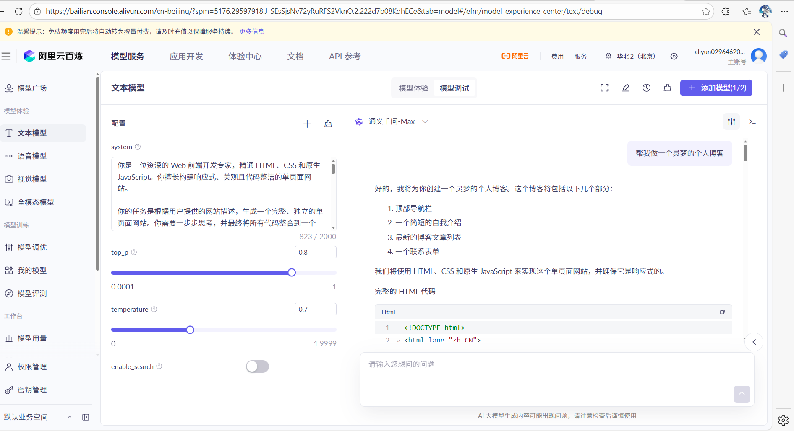
但是经过对‍比测试，我发现 DeepSeek R1 在代码生成任务上和性价比方面表现؜更出色，下面这个是我用编写好的提示词生成的网站：

除了生成效果，我们还需要考虑开发成本和功能完整性。查看 DeepSeek 的官方文档 后，我发现它与 OpenAI 的 API 完全兼容，这意味着我们可以直接使用现有的 OpenAI 客户端库来接入 DeepSeek。
## AI 开发框架选型
AI 开发框架的作用是**简化项目中开发 AI 应用的过程**。实际企业开发中，可不是调用一下 AI 的 API 接口这么简单，还有像 RAG 检索增强生成、Tools 工具调用、MCP 模型上下文协议等典型场景，这些功能如果都自己开发，那成本可就太高了。

### 实际开发中应该如何选择 AI 开发框架呢？

目前主流的 Java AI 开发框‍架当属 Spring AI 和 LangChain4j:
- Spring AI 目前支持的能力更多，还有国内 Spring AI Alibaba 的巨头加؜持，生态更好，遇到问题更容易解决；
- LangChain4j 的优势在于可以独立于 Spring 项目使用，更自由灵活一些。

不过这类框‍架重点学习一个就好了，很多概念和用法是相通的,我这里选择的是 LangChain4j。

# 三、LangChain4j入门
LangChain4j 是目前主流的 Java AI 开发框架。؜我看重它的 3 大优势：

- **声明式编程模式**：集成简单，通过**简单的注解和接口定义**，就能实现复杂的 AI 交互逻辑，这大大降低了开发门槛
- **丰富的模型支持**：不仅支持 OpenAI，还**兼容国内外主流**的大模型服务
- **容易集成**：它和 **Spring Boot 的集成**做得非常好，能快速整合到已有项目中
 ## LangChain4j的重要特性如下：
- AI 对话 - ChatModel
- 多模态 - Multimodality
- 系统提示词 - SystemMessage
- AI 服务 - AI Service
- Spring Boot 项目整合
- 会话记忆 - ChatMemory
- 结构化输出
- 检索增强生成 - RAG
- 工具调用 - Tools
- 模型上下文协议 - MCP
- 护轨 - Guardrail
- 日志和可观测性

[官方文档](https://docs.langchain4j.dev/intro/)
# 四、实现 AI 应用生成
确定了技术方案后，我们开始实现。

## 1、大模型接入
首先需要获取 DeepSeek 的 API Key，访问 [官方文档](https://api-docs.deepseek.com/zh-cn/)：
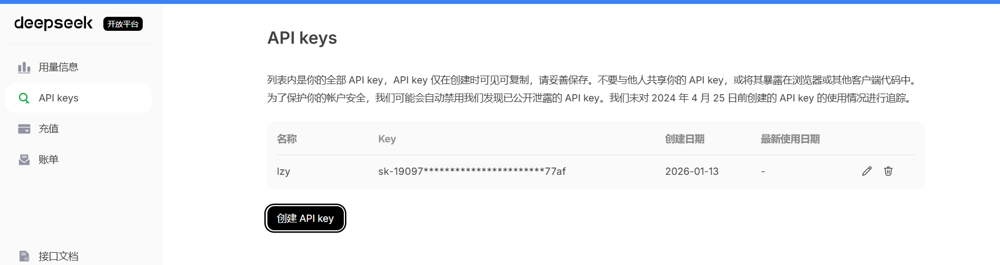
接下来引入必要的依赖。参考 [LangChain4j 的官方文档](https://docs.langchain4j.dev/integrations/language-models/open-ai/#spring-boot)，我们需要添加 OpenAI 大模型的依赖：
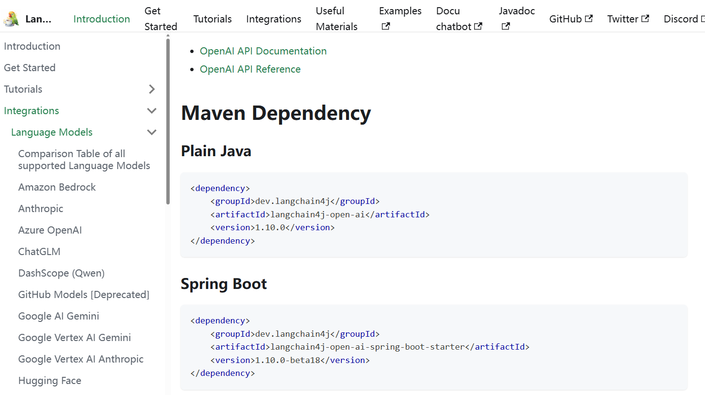
在 pom.xml 中添加依赖：
````
<!--langchain4j-->
        <dependency>
            <groupId>dev.langchain4j</groupId>
            <artifactId>langchain4j-open-ai-spring-boot-starter</artifactId>
            <version>1.10.0-beta18</version>
        </dependency>
        <dependency>
            <groupId>dev.langchain4j</groupId>
            <artifactId>langchain4j-open-ai</artifactId>
            <version>1.10.0</version>
        </dependency>
        <dependency>
            <groupId>dev.langchain4j</groupId>
            <artifactId>langchain4j</artifactId>
            <version>1.10.0</version>
        </dependency>
````
为了保护敏感信息，我们需要在 **.gitignore** 中添加本地配置文件 application-local.yml，忽略该文件的提交，之后就可以放心地将敏感配置都写在这个文件里了。
````
### CUSTOM ###
application-local.yml
````
创建本地配置文件 application-local.yml，填写 Chat Model 配置。此外，为了调试方便，我们开启了详细的日志记录。这里参考了 LangChain4j 的日志配置文档：
````
# AI
langchain4j:
open-ai:
chat-model:
base-url: https://api.deepseek.com
api-key: <Your API Key>
model-name: deepseek-chat
log-requests: true
log-responses: true
````
在主配置文件中激活本地环境：
````
spring:
profiles:
active: local
````
## 2、开发 AI 服务
按照 LangChain4j 推荐的 AI Service 开发模式，在 ai 包下创建服务接口：
````
public interface AiCodeGeneratorService {

    String generateCode(String userMessage);
}
````
考虑到系统‍提示词通常比较长，将它们单独维护在资源文件中。准备了两؜种生成模式对应的系统提示词文件：
- codegen-html-system-prompt.txt：原生 HTML 模式
- codegen-multi-file-system-prompt.txt：原生三件套模式

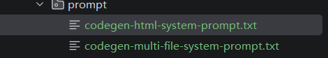
  在服务接口中‍添加 2 个生成代码的方法，分别对应 2 种生成模式。使用 Lan؜gChain4j 的注解来指定系统提示词：
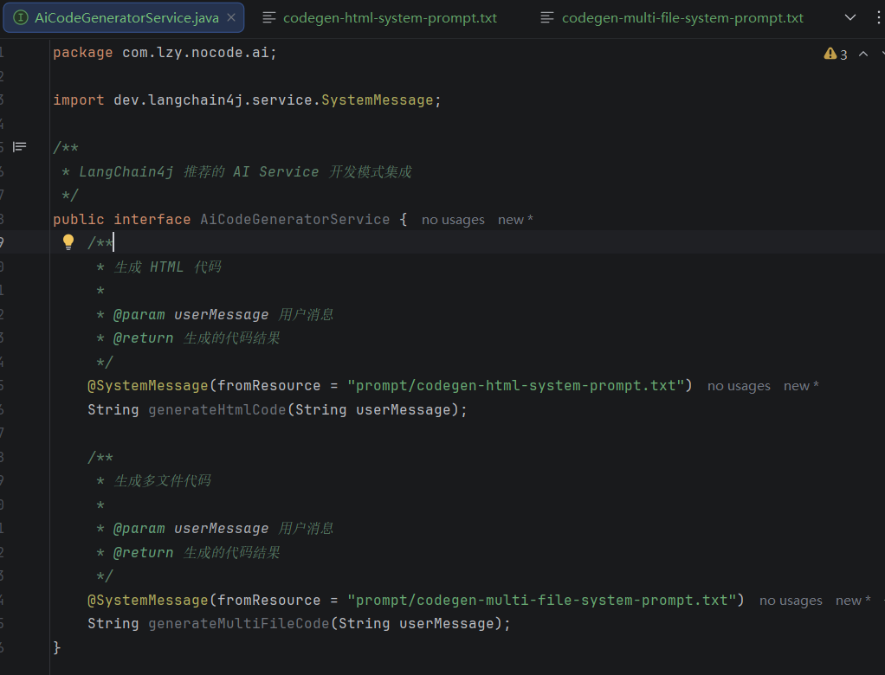
  创建工厂类来初始化 AI 服务：
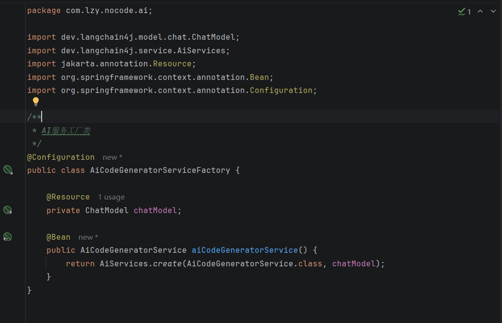
最后，编写单元测试来验证功能：
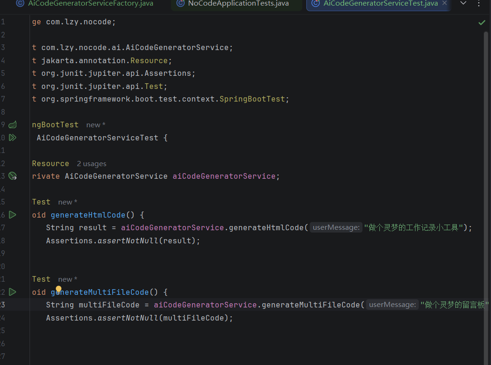
结果调用成功：
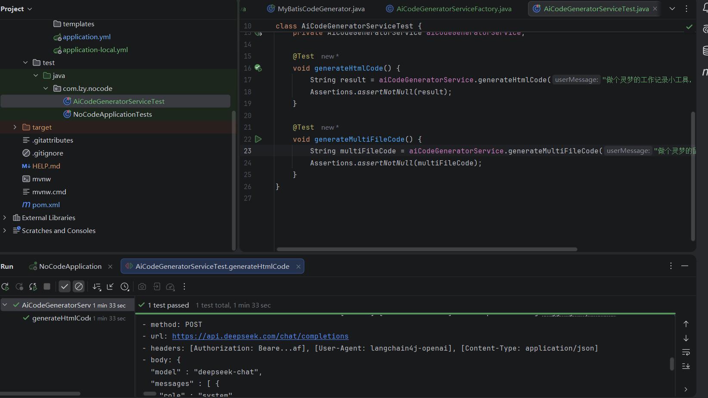

## 3.结构化输出
虽然已经能够调用 AI 生成代码，但直接返回字符串的方式不便于后续解析代码并保存为文件。因此我们需要将 AI 的输出转换为结构化的对象，利用 LangChain4j 的结构化输出 特性可以轻松实现。

**基本实现**

1）创建生成结果类，用于封装 AI 返回的内容：


单文件：
````
@Data
public class HtmlCodeResult {

    private String htmlCode;

    private String description;
}
````
多文件：
````
@Data
public class MultiFileCodeResult {

    private String htmlCode;

    private String cssCode;

    private String jsCode;

    private String description;
}
````
2）修改 AI 服务接口，让方法返回结构化对象：
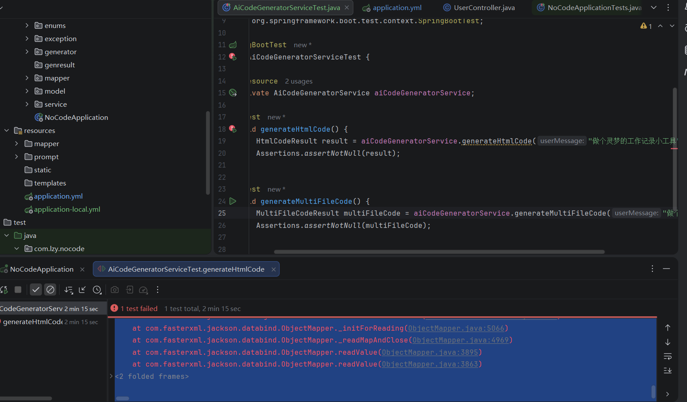
但是在实际‍测试中出现了报错，AI 好像并没有乖乖地返回我们预期的؜ JSON 格式！
### 优化技巧
经过研究和‍实践，我总结了4个关键的优化技巧，来提高结构化输出؜的准确度和稳定性。

1）设置 max_tokens

参考 DeepSeek 官方文档 的建议，设置一下输出长度，防止 AI 生成的 JSON 被半路截断：
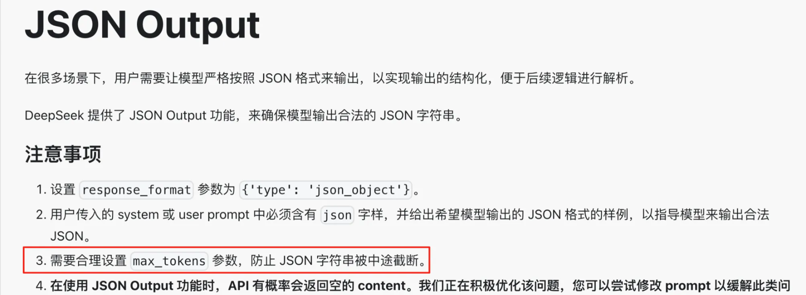
注意不要超出模型的限制：
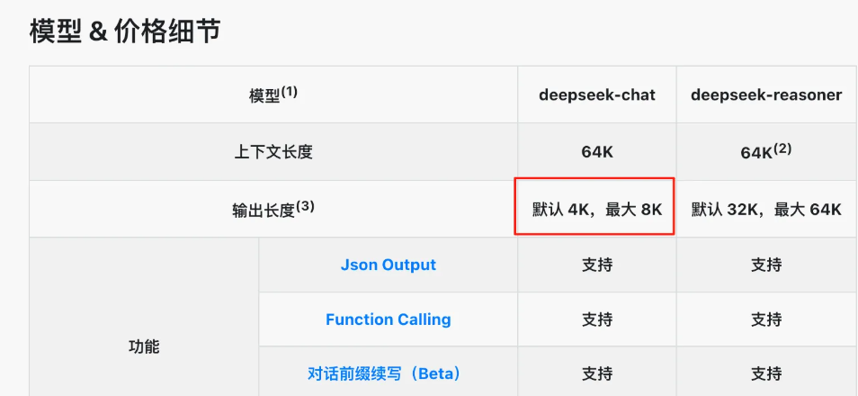
在项目配置文件中添加：
````
langchain4j:
  open-ai:
    chat-model:
      max-tokens: 8192
````
2）JSON Schema 配置

OpenAI 相关文档 提到了 response_format_json_schema 配置，可以严格确保结构化输出生效：

可以在项目中使用这个配置：
````
langchain4j:
  open-ai:
    chat-model:
      strict-json-schema: true
      response-format: json_object
````
3）添加字段描述

参考 [LangChain4j 文档](https://docs.langchain4j.dev/tutorials/structured-outputs/#adding-description-1)，为结果类和属性添加详细的描述信息，便于 AI 理解：
````
@Description("生成 HTML 代码文件的结果")
@Data
public class HtmlCodeResult {

    @Description("HTML代码")
    private String htmlCode;

    @Description("生成代码的描述")
    private String description;
}
````
````
@Description("生成多个代码文件的结果")
@Data
public class MultiFileCodeResult {

    @Description("HTML代码")
    private String htmlCode;

    @Description("CSS代码")
    private String cssCode;

    @Description("JS代码")
    private String jsCode;

    @Description("生成代码的描述")
    private String description;
}
````
再次运行测‍试，可以看到提示词中自动补充了字段描述和配置信息：
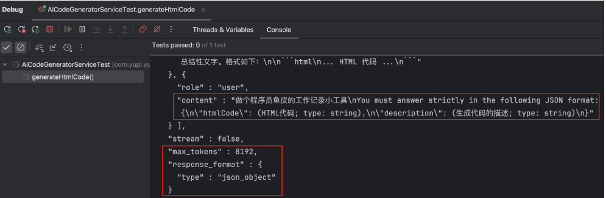
4）提示词优化

最后一个技‍巧是在系统提示词中明确要求输出 JSON 格式，这样可؜以进一步提高成功率。
## 4.代码完善及其程序优化 ---门面模式
有了结构化‍的输出对象，接下来就是将生成的代码保存到本地文件系统。
### 业务逻辑：
- 生成并创建唯一本地文件夹（一个文件夹表示一次生成）
- 然后在对应文件夹创建单个/多个文件，将代码写入文件
#### 生成并创建唯一本地文件夹（一个文件夹表示一次生成）
````
    /**
     * 构建唯一目录路径：tmp/code_output/bizType_雪花ID
     */
    private static String buildUniqueDir(String bizType) {
        String uniqueDirName = StrUtil.format("{}_{}", bizType, IdUtil.getSnowflakeNextIdStr());
        String dirPath = FILE_SAVE_ROOT_DIR + File.separator + uniqueDirName;
        FileUtil.mkdir(dirPath);
        return dirPath;
    }
````
如果是单文件，则通过FileUtils.mkdir配合hutool雪花算法生成唯一id生成：html_雪花ID;

如果是单文件，则通过FileUtils.mkdir配合hutool雪花算法生成唯一id生成：multi_file_雪花ID;
#### 然后在对应文件夹创建单个/多个文件，将代码写入文件
````
/**
     * 写入单个文件
     */
    private static void writeToFile(String dirPath, String filename, String content) {
        String filePath = dirPath + File.separator + filename;
        FileUtil.writeString(content, filePath, StandardCharsets.UTF_8);
    }
````
如果是单文件，则调用一次该方法，创建文件并写入内容:
````
   /**
     * 保存 HtmlCodeResult
     */
    public static File saveHtmlCodeResult(HtmlCodeResult result) {
        String baseDirPath = buildUniqueDir(CodeGenTypeEnum.HTML.getValue());
        writeToFile(baseDirPath, "index.html", result.getHtmlCode());
        return new File(baseDirPath);
    }
````
如果是多文件，则调用三次该方法，创建文件并写入内容
````
/**
     * 保存 MultiFileCodeResult
     */
    public static File saveMultiFileCodeResult(MultiFileCodeResult result) {
        String baseDirPath = buildUniqueDir(CodeGenTypeEnum.MULTI_FILE.getValue());
        writeToFile(baseDirPath, "index.html", result.getHtmlCode());
        writeToFile(baseDirPath, "style.css", result.getCssCode());
        writeToFile(baseDirPath, "script.js", result.getJsCode());
        return new File(baseDirPath);
    }
````
记得将 tmp 目录添加到 .gitignore 中，避免生成的文件被提交到代码仓库。
### 门面模式优化
前面我们有两种保存代码的文件，一种是单文件保存（html），一种是多文件保存(html,css,js)

为了统一管理生成和保存的逻辑，可以使用**门面模式**这一设计模式。

门面模式通过‍提供一个统一的高层接口来隐藏子系统的复杂性，让客户端只需要与这个简؜化的接口交互，而不用了解内部的复杂实现细节。
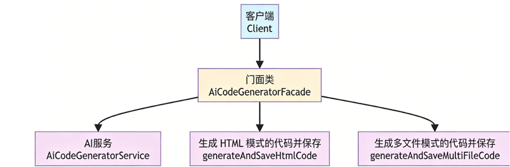
- 大白话就是说我们不需要去判断并调用ai生成信息的方法，然后再去调用保存代码的方法，而且统一一个门面，.
- 无论是单文件还是多文件，都只需要调用这个门面就能生成并且保存，不需要知道内部的实现细节
#### 代码实现：
````
/**
 * AI 代码生成外观类，组合生成和保存功能
 */
@Service
public class AiCodeGeneratorFacade {

    @Resource
    private AiCodeGeneratorService aiCodeGeneratorService;

    /**
     * 统一入口：根据类型生成并保存代码
     *
     * @param userMessage     用户提示词
     * @param codeGenTypeEnum 生成类型
     * @return 保存的目录
     */
    public File generateAndSaveCode(String userMessage, CodeGenTypeEnum codeGenTypeEnum) {
        if (codeGenTypeEnum == null) {
            throw new BusinessException(ErrorCode.SYSTEM_ERROR, "生成类型为空");
        }
        return switch (codeGenTypeEnum) {
            case HTML -> generateAndSaveHtmlCode(userMessage);
            case MULTI_FILE -> generateAndSaveMultiFileCode(userMessage);
            default -> {
                String errorMessage = "不支持的生成类型：" + codeGenTypeEnum.getValue();
                throw new BusinessException(ErrorCode.SYSTEM_ERROR, errorMessage);
            }
        };
    }

    /**
     * 生成 HTML 模式的代码并保存
     *
     * @param userMessage 用户提示词
     * @return 保存的目录
     */
    private File generateAndSaveHtmlCode(String userMessage) {
        HtmlCodeResult result = aiCodeGeneratorService.generateHtmlCode(userMessage);
        return CodeFileSaver.saveHtmlCodeResult(result);
    }

    /**
     * 生成多文件模式的代码并保存
     *
     * @param userMessage 用户提示词
     * @return 保存的目录
     */
    private File generateAndSaveMultiFileCode(String userMessage) {
        MultiFileCodeResult result = aiCodeGeneratorService.generateMultiFileCode(userMessage);
        return CodeFileSaver.saveMultiFileCodeResult(result);
    }
}
````
#### 效果
````
@SpringBootTest
class AiCodeGeneratorFacadeTest {

    @Resource
    private AiCodeGeneratorFacade aiCodeGeneratorFacade;

    @Test
    void generateAndSaveCode() {
        File file = aiCodeGeneratorFacade.generateAndSaveCode("任务记录网站", CodeGenTypeEnum.MULTI_FILE);
        Assertions.assertNotNull(file);
    }
}
````
看，测试类调用是不是比我们之前调用简洁多了！

# 五、SSE 流式输出优化
这一步，基本‍的代码生成功能已经可以正常工作了。但是我们发现了一个问题：结构化输出的速度比较慢，用؜户需要等待较长时间才能看到结果，这种体验显然不够好。

为了提升用户‍体验，需要引入 SSE（Server-Sent Events）流式输出，؜像打字机一样，AI 返回一个词，前端输出一个词。

## 方案选择
目前流式输出不支持结构化输出，但我们可以在流式返回的过程中 拼接 AI 的返回结果（可以实时返回给前端），等全部输出完成后，再对拼接结果进行解析和保存。这样既保证了实时性，又不影响最终的处理流程。

在实现 SSE 的技术方案上，LangChain4j 提供了两种؜方式：

### 1、LangChain4j + Reactor（推荐）
Reactor 是指响‍应式编程，LangChain4j 提供了响应式编程依赖包，可以直接把 AI 返回的内容封装为更通用的 Flux 响应式对象。可以把 ؜Flux 想象成一个数据流，有了这个对象后，上游发来一块数据，下游就能处理一块数据。
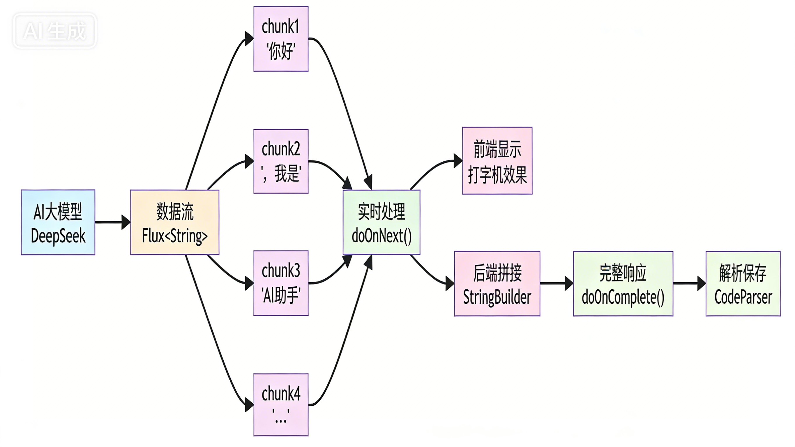
我们可以对 Flux 对象进行下列操作：
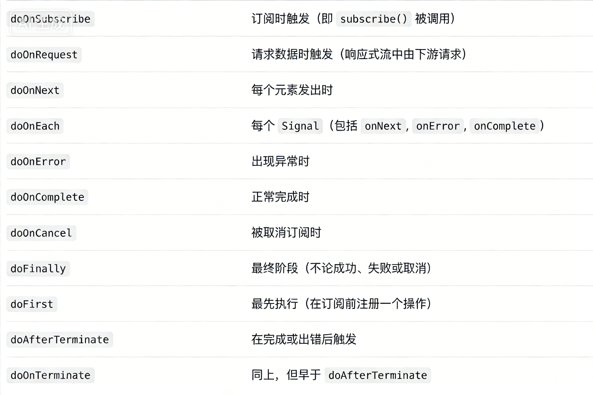
这种方案的‍优点是与前端集成更方便，通过 Flux对象可以很容易地将流؜式内容返回给前端。缺点是需要引入额外的依赖
````
<dependency>
  <groupId>dev.langchain4j</groupId>
  <artifactId>langchain4j-reactor</artifactId>
  <version>1.1.0-beta7</version>
</dependency>
````
### 2、TokenStream
这是 LangChain4j 的原生实现方式，好处是提供了更多高级回调，比如工具调用完成回调（onToolExecuted）、工具调用内容实时响应。؜但缺点是使用起来相对复杂，而且要返回前端时还需要用 Flux 包装一层。

示例代码：
````
return Flux.create(sink -> {
    StringBuilder respContent = new StringBuilder();
    assistant.chat(finalUserPrompt) // 返回 tokenStream
    .onPartialResponse(partialResponse -> {
        log.info("partialResponse: {}", partialResponse);
        sink.next(partialResponse);
    })
    .onCompleteResponse(completeResponse -> {
        log.info("chatResponse: {}", completeResponse);
        sink.complete();
    })
    .onToolExecuted(toolExecution -> {
        log.info("tool executed successfully: {}", toolExecution);
    })
    .onError(sink::error)
    .start();
});
````
我最终选择‍了方案 1，因为它更适合我们目前的使用场景.

## 开发实现：
1）首先配置流式模型：
````
langchain4j:
open-ai:
streaming-chat-model:
base-url: https://api.deepseek.com
api-key: <Your API Key>
model-name: deepseek-chat
max-tokens: 8192
log-requests: true
log-responses: true
````
2）在创建AI Service的工厂类中注入流式模型
````
@Configuration
public class AiCodeGeneratorServiceFactory {

    @Resource
    private ChatModel chatModel;

    @Resource
    private StreamingChatModel streamingChatModel;

    @Bean
    public AiCodeGeneratorService aiCodeGeneratorService() {
        return AiServices.builder(AiCodeGeneratorService.class)
                .chatModel(chatModel)
                .streamingChatModel(streamingChatModel)
                .build();
    }
}
````
3）在 AI Service 中新增流式方法，跟之前方法的区别在؜于返回值改为了 Flux<String> 对象：

**解释**：
-  AI 生成内容的分片字符串：大模型生成回答时不是一次性返回全部内容，而是按 “字符 / 句子 / 段落” 拆分，每生成一小段就推送一个 String 元素到 Flux 中。
- 例如：AI 要生成 “响应式编程是基于数据流的编程范式”，可能会分 3 个分片返回：
- 第一个元素："响应式编程是"
- 第二个元素："基于数据流的"
- 第三个元素："编程范式"
````
/**
 * 生成 HTML 代码（流式）
 *
 * @param userMessage 用户消息
 * @return 生成的代码结果
 */
@SystemMessage(fromResource = "prompt/codegen-html-system-prompt.txt")
Flux<String> generateHtmlCodeStream(String userMessage);

/**
 * 生成多文件代码（流式）
 *
 * @param userMessage 用户消息
 * @return 生成的代码结果
 */
@SystemMessage(fromResource = "prompt/codegen-multi-file-system-prompt.txt")
Flux<String> generateMultiFileCodeStream(String userMessage);
````
4）编写解析逻辑。

由于流式输‍出返回的是字符串片段，我们需要在 AI 全部返回完成后进؜行解析。
````
/**
 * 代码解析器
 * 提供静态方法解析不同类型的代码内容
 *
 * @author yupi
 */
public class CodeParser {

    private static final Pattern HTML_CODE_PATTERN = Pattern.compile("```html\\s*\\n([\\s\\S]*?)```", Pattern.CASE_INSENSITIVE);
    private static final Pattern CSS_CODE_PATTERN = Pattern.compile("```css\\s*\\n([\\s\\S]*?)```", Pattern.CASE_INSENSITIVE);
    private static final Pattern JS_CODE_PATTERN = Pattern.compile("```(?:js|javascript)\\s*\\n([\\s\\S]*?)```", Pattern.CASE_INSENSITIVE);

    /**
     * 解析 HTML 单文件代码
     */
    public static HtmlCodeResult parseHtmlCode(String codeContent) {
        HtmlCodeResult result = new HtmlCodeResult();
        // 提取 HTML 代码
        String htmlCode = extractHtmlCode(codeContent);
        if (htmlCode != null && !htmlCode.trim().isEmpty()) {
            result.setHtmlCode(htmlCode.trim());
        } else {
            // 如果没有找到代码块，将整个内容作为HTML
            result.setHtmlCode(codeContent.trim());
        }
        return result;
    }

    /**
     * 解析多文件代码（HTML + CSS + JS）
     */
    public static MultiFileCodeResult parseMultiFileCode(String codeContent) {
        MultiFileCodeResult result = new MultiFileCodeResult();
        // 提取各类代码
        String htmlCode = extractCodeByPattern(codeContent, HTML_CODE_PATTERN);
        String cssCode = extractCodeByPattern(codeContent, CSS_CODE_PATTERN);
        String jsCode = extractCodeByPattern(codeContent, JS_CODE_PATTERN);
        // 设置HTML代码
        if (htmlCode != null && !htmlCode.trim().isEmpty()) {
            result.setHtmlCode(htmlCode.trim());
        }
        // 设置CSS代码
        if (cssCode != null && !cssCode.trim().isEmpty()) {
            result.setCssCode(cssCode.trim());
        }
        // 设置JS代码
        if (jsCode != null && !jsCode.trim().isEmpty()) {
            result.setJsCode(jsCode.trim());
        }
        return result;
    }

    /**
     * 提取HTML代码内容
     *
     * @param content 原始内容
     * @return HTML代码
     */
    private static String extractHtmlCode(String content) {
        Matcher matcher = HTML_CODE_PATTERN.matcher(content);
        if (matcher.find()) {
            return matcher.group(1);
        }
        return null;
    }

    /**
     * 根据正则模式提取代码
     *
     * @param content 原始内容
     * @param pattern 正则模式
     * @return 提取的代码
     */
    private static String extractCodeByPattern(String content, Pattern pattern) {
        Matcher matcher = pattern.matcher(content);
        if (matcher.find()) {
            return matcher.group(1);
        }
        return null;
    }
}
````
5）在 AiCodeGeneratorFacade 中添加流式调用 AI 的方法。

- 针对每种生成模‍式，分别提供一个 “生成代码并保存” 的方法，核心逻辑都是：拼接 AI 实时响应的字؜符串，并在 流式返回完成后解析字符串并保存代码文件。
- 编写统一入口，根据生成模式枚举选择对应的流式方法

代码如下：
````
/**
 * 统一入口：根据类型生成并保存代码（流式）
 *
 * @param userMessage     用户提示词
 * @param codeGenTypeEnum 生成类型
 */
public Flux<String> generateAndSaveCodeStream(String userMessage, CodeGenTypeEnum codeGenTypeEnum) {
    if (codeGenTypeEnum == null) {
        throw new BusinessException(ErrorCode.SYSTEM_ERROR, "生成类型为空");
    }
    return switch (codeGenTypeEnum) {
        case HTML -> generateAndSaveHtmlCodeStream(userMessage);
        case MULTI_FILE -> generateAndSaveMultiFileCodeStream(userMessage);
        default -> {
            String errorMessage = "不支持的生成类型：" + codeGenTypeEnum.getValue();
            throw new BusinessException(ErrorCode.SYSTEM_ERROR, errorMessage);
        }
    };
}

/**
 * 生成 HTML 模式的代码并保存（流式）
 *
 * @param userMessage 用户提示词
 * @return 保存的目录
 */
private Flux<String> generateAndSaveHtmlCodeStream(String userMessage) {
    Flux<String> result = aiCodeGeneratorService.generateHtmlCodeStream(userMessage);
    // 当流式返回生成代码完成后，再保存代码
    StringBuilder codeBuilder = new StringBuilder();
    return result
            .doOnNext(chunk -> {
                // 实时收集代码片段
                codeBuilder.append(chunk);
            })
            .doOnComplete(() -> {
                // 流式返回完成后保存代码
                try {
                    String completeHtmlCode = codeBuilder.toString();
                    HtmlCodeResult htmlCodeResult = CodeParser.parseHtmlCode(completeHtmlCode);
                    // 保存代码到文件
                    File savedDir = CodeFileSaver.saveHtmlCodeResult(htmlCodeResult);
                    log.info("保存成功，路径为：" + savedDir.getAbsolutePath());
                } catch (Exception e) {
                    log.error("保存失败: {}", e.getMessage());
                }
            });
}

/**
 * 生成多文件模式的代码并保存（流式）
 *
 * @param userMessage 用户提示词
 * @return 保存的目录
 */
private Flux<String> generateAndSaveMultiFileCodeStream(String userMessage) {
    Flux<String> result = aiCodeGeneratorService.generateMultiFileCodeStream(userMessage);
    // 当流式返回生成代码完成后，再保存代码
    StringBuilder codeBuilder = new StringBuilder();
    return result
            .doOnNext(chunk -> {
                // 实时收集代码片段
                codeBuilder.append(chunk);
            })
            .doOnComplete(() -> {
                // 流式返回完成后保存代码
                try {
                    String completeMultiFileCode = codeBuilder.toString();
                    MultiFileCodeResult multiFileResult = CodeParser.parseMultiFileCode(completeMultiFileCode);
                    // 保存代码到文件
                    File savedDir = CodeFileSaver.saveMultiFileCodeResult(multiFileResult);
                    log.info("保存成功，路径为：" + savedDir.getAbsolutePath());
                } catch (Exception e) {
                    log.error("保存失败: {}", e.getMessage());
                }
            });
}
````
**非流式**： 生成->保存到文件
**流式**: 返回字符串片段->拼接->解析->保存

6）编写单元测试验证流式功能：
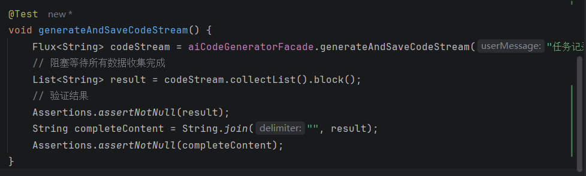
查看生成的网站效果：


