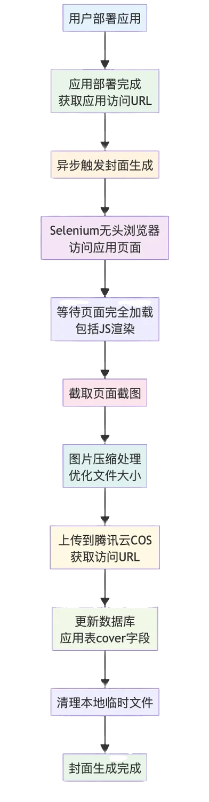

# 一、生成应用封面图

## 需求分析
如果每个应‍‍‍用都有一个精美⁡的⁡预⁡览图，会让‏整个‏平台‏看起来؜更加专؜业和؜吸引人。

## 方案设计
### 实现流程
实现应用封面图生成功能，我们需要考虑几个关键步骤：

1）首先要获取到应用的可访问 URL。由于我们的平台支持多种生成模式（原生 HTML、多文件项目、Vue 工程），其中原生模式和 Vue 工程模式生成可访问浏览 URL 的时机不一样。所以为了统一处理，而且确保应用已经可以正常访问，我们选择在 应用部署完成后再生成封面图。

2）使用 Selenium 这样的自动化工具打开一个无头浏览器，访问应用页面并进行截图。

3）直接截‍‍‍图得到的图片通常比⁡⁡⁡较大，不仅占用存储‏‏‏空间，加载速度也会؜؜؜比较慢。因此我们需要对图片进行压缩处理。

虽然我们可以通‍‍‍过调整 Selenium 的⁡⁡⁡窗口大小来控制截图尺寸，但这‏‏‏样可能会导致页面显示不全。更؜؜؜好的方案是先按正常尺寸截图，然后使用工具库对图片进行压缩。

4）为了确保‍‍‍图片的持久化存储和快速访⁡⁡⁡问，将压缩后的图片上传到‏‏‏腾讯云 COS 对象存储؜؜؜中，并将访问 URL 保存到数据库的应用表中。

5）最后，记得清理本地临时文件。


# 开发实现
接下来，我们依次开发实现下列功能：

- 本地生成截图
- 保存截图到对象存储
- 截图服务
- 触发截图生成

## 1、本地生成截图
首先，我们需要在项目中引入必要的依赖:
````
<!-- Selenium 网页截图依赖 -->
<dependency>
    <groupId>org.seleniumhq.selenium</groupId>
    <artifactId>selenium-java</artifactId>
    <version>4.33.0</version>
</dependency>
<dependency>
    <groupId>io.github.bonigarcia</groupId>
    <artifactId>webdrivermanager</artifactId>
    <version>6.1.0</version>
</dependency>
````

接下来，我们在 utils 包下创建专门用于网页截图的工具类，提供根据 URL 生成截图文件并返回路径的方法。

1）第一步是初始化驱动。需要注意避免重复初始化驱动程序：

- 在静态代码块里初始化驱动，确保整个应用生命周期内只初始化一次
- 默认使用已经初始化好的驱动实例
- 在项目停止前正确销毁驱动，释放资源

代码如下：
````
@Slf4j
public class WebScreenshotUtils {

    private static final WebDriver webDriver;

    static {
        final int DEFAULT_WIDTH = 1600;
        final int DEFAULT_HEIGHT = 900;
        webDriver = initChromeDriver(DEFAULT_WIDTH, DEFAULT_HEIGHT);
    }

    @PreDestroy
    public void destroy() {
        webDriver.quit();
    }

    /**
     * 初始化 Chrome 浏览器驱动
     */
    private static WebDriver initChromeDriver(int width, int height) {
        try {
            // 自动管理 ChromeDriver
            WebDriverManager.chromedriver().setup();
            // 配置 Chrome 选项
            ChromeOptions options = new ChromeOptions();
            // 无头模式
            options.addArguments("--headless");
            // 禁用GPU（在某些环境下避免问题）
            options.addArguments("--disable-gpu");
            // 禁用沙盒模式（Docker环境需要）
            options.addArguments("--no-sandbox");
            // 禁用开发者shm使用
            options.addArguments("--disable-dev-shm-usage");
            // 设置窗口大小
            options.addArguments(String.format("--window-size=%d,%d", width, height));
            // 禁用扩展
            options.addArguments("--disable-extensions");
            // 设置用户代理
            options.addArguments("--user-agent=Mozilla/5.0 (Windows NT 10.0; Win64; x64) AppleWebKit/537.36 (KHTML, like Gecko) Chrome/91.0.4472.124 Safari/537.36");
            // 创建驱动
            WebDriver driver = new ChromeDriver(options);
            // 设置页面加载超时
            driver.manage().timeouts().pageLoadTimeout(Duration.ofSeconds(30));
            // 设置隐式等待
            driver.manage().timeouts().implicitlyWait(Duration.ofSeconds(10));
            return driver;
        } catch (Exception e) {
            log.error("初始化 Chrome 浏览器失败", e);
            throw new BusinessException(ErrorCode.SYSTEM_ERROR, "初始化 Chrome 浏览器失败");
        }
    }
}
````

这段代码看‍‍‍起来长，其实基⁡本⁡都⁡是一些配置‏，属‏于样板‏代码؜。其中؜比较重؜要的是：

- 无头模式运行：通过 --headless 参数，Chrome 浏览器在后台运行，不会弹出窗口。
- Docker 兼容性：添加了 --no-sandbox 和 --disable-dev-shm-usage 参数，确保在容器环境中正常运行。

2）编写一些子方法，比如保存图片到文件：
````
/**
 * 保存图片到文件
 */
private static void saveImage(byte[] imageBytes, String imagePath) {
    try {
        FileUtil.writeBytes(imageBytes, imagePath);
    } catch (Exception e) {
        log.error("保存图片失败: {}", imagePath, e);
        throw new BusinessException(ErrorCode.SYSTEM_ERROR, "保存图片失败");
    }
}
````
压缩图片：
````
/**
 * 压缩图片
 */
private static void compressImage(String originalImagePath, String compressedImagePath) {
    // 压缩图片质量（0.1 = 10% 质量）
    final float COMPRESSION_QUALITY = 0.3f;
    try {
        ImgUtil.compress(
                FileUtil.file(originalImagePath),
                FileUtil.file(compressedImagePath),
                COMPRESSION_QUALITY
        );
    } catch (Exception e) {
        log.error("压缩图片失败: {} -> {}", originalImagePath, compressedImagePath, e);
        throw new BusinessException(ErrorCode.SYSTEM_ERROR, "压缩图片失败");
    }
}
````
等待页面加载完成：
````
/**
 * 等待页面加载完成
 */
private static void waitForPageLoad(WebDriver driver) {
    try {
        // 创建等待页面加载对象
        WebDriverWait wait = new WebDriverWait(driver, Duration.ofSeconds(10));
        // 等待 document.readyState 为complete
        wait.until(webDriver ->
                ((JavascriptExecutor) webDriver).executeScript("return document.readyState")
                        .equals("complete")
        );
        // 额外等待一段时间，确保动态内容加载完成
        Thread.sleep(2000);
        log.info("页面加载完成");
    } catch (Exception e) {
        log.error("等待页面加载时出现异常，继续执行截图", e);
    }
}
````
不仅等待 ‍‍‍DOM 完全加⁡载⁡，⁡还额外等待‏ 2‏ 秒‏确保动؜态内容渲؜؜染完成。

3）最后编写完整‍‍‍的生成网页截图方法，访问网页、等⁡⁡⁡待页面加载完成并截图、保存截图文‏‏‏件并压缩、最后返回压缩后的路径。؜؜؜  
````
/**
 * 生成网页截图
 *
 * @param webUrl 网页URL
 * @return 压缩后的截图文件路径，失败返回null
 */
public static String saveWebPageScreenshot(String webUrl) {
    if (StrUtil.isBlank(webUrl)) {
        log.error("网页URL不能为空");
        return null;
    }
    try {
        // 创建临时目录
        String rootPath = System.getProperty("user.dir") + File.separator + "tmp" + File.separator + "screenshots"
                + File.separator + UUID.randomUUID().toString().substring(0, 8);
        FileUtil.mkdir(rootPath);
        // 图片后缀
        final String IMAGE_SUFFIX = ".png";
        // 原始截图文件路径
        String imageSavePath = rootPath + File.separator + RandomUtil.randomNumbers(5) + IMAGE_SUFFIX;
        // 访问网页
        webDriver.get(webUrl);
        // 等待页面加载完成
        waitForPageLoad(webDriver);
        // 截图
        byte[] screenshotBytes = ((TakesScreenshot) webDriver).getScreenshotAs(OutputType.BYTES);
        // 保存原始图片
        saveImage(screenshotBytes, imageSavePath);
        log.info("原始截图保存成功: {}", imageSavePath);
        // 压缩图片
        final String COMPRESSION_SUFFIX = "_compressed.jpg";
        String compressedImagePath = rootPath + File.separator + RandomUtil.randomNumbers(5) + COMPRESSION_SUFFIX;
        compressImage(imageSavePath, compressedImagePath);
        log.info("压缩图片保存成功: {}", compressedImagePath);
        // 删除原始图片，只保留压缩图片
        FileUtil.del(imageSavePath);
        return compressedImagePath;
    } catch (Exception e) {
        log.error("网页截图失败: {}", webUrl, e);
        return null;
    }
}
````

## 2、保存截图到对象存储
为了让生成‍‍‍‍‍‍‍的封面图能够持久⁡⁡⁡化⁡存储并快速⁡⁡⁡访问‏‏‏，我‏们需要将图片؜؜؜上‏‏‏传到؜腾讯云 COS 对؜؜؜象存储。     

创建成功后，在配置文件中添加 COS 相关配置
````
# 添加 COS 对象存储配置（需要从腾讯云获取）
cos:
  client:
    host: your-custom-domain.com
    secretId: your-secret-id
    secretKey: your-secret-key
    region: ap-shanghai
    bucket: your-bucket-name
````
引入依赖：‍‍‍‍‍
````
<dependency>
     <groupId>com.qcloud</groupId>
     <artifactId>cos_api</artifactId>
     <version>5.6.227</version>
</dependency>
````
在 config 包下创建 COS 客户端配置类：
````
/**
 * 腾讯云COS配置类
 * 
 * @author yupi
 */
@Configuration
@ConfigurationProperties(prefix = "cos.client")
@Data
public class CosClientConfig {

    /**
     * 域名
     */
    private String host;

    /**
     * secretId
     */
    private String secretId;

    /**
     * 密钥（注意不要泄露）
     */
    private String secretKey;

    /**
     * 区域
     */
    private String region;

    /**
     * 桶名
     */
    private String bucket;

    @Bean
    public COSClient cosClient() {
        // 初始化用户身份信息(secretId, secretKey)
        COSCredentials cred = new BasicCOSCredentials(secretId, secretKey);
        // 设置bucket的区域, COS地域的简称请参照 https://www.qcloud.com/document/product/436/6224
        ClientConfig clientConfig = new ClientConfig(new Region(region));
        // 生成cos客户端
        return new COSClient(cred, clientConfig);
    }
}
````
然后在 manager 包下创建可复用的 CosManager 类，专门负责和 COS 对象存储进行交互，提供文件上传功能，不包含特殊的业务逻辑。
````
/**
 * COS对象存储管理器
 *
 * @author yupi
 */
@Component
@Slf4j
public class CosManager {

    @Resource
    private CosClientConfig cosClientConfig;

    @Resource
    private COSClient cosClient;

    /**
     * 上传对象
     *
     * @param key  唯一键
     * @param file 文件
     * @return 上传结果
     */
    public PutObjectResult putObject(String key, File file) {
        PutObjectRequest putObjectRequest = new PutObjectRequest(cosClientConfig.getBucket(), key, file);
        return cosClient.putObject(putObjectRequest);
    }

    /**
     * 上传文件到 COS 并返回访问 URL
     *
     * @param key  COS对象键（完整路径）
     * @param file 要上传的文件
     * @return 文件的访问URL，失败返回null
     */
    public String uploadFile(String key, File file) {
        // 上传文件
        PutObjectResult result = putObject(key, file);
        if (result != null) {
            // 构建访问URL
            String url = String.format("%s%s", cosClientConfig.getHost(), key);
            log.info("文件上传COS成功: {} -> {}", file.getName(), url);
            return url;
        } else {
            log.error("文件上传COS失败，返回结果为空");
            return null;
        }
    }
}
````

## 3、截图服务
考虑到后续项目要改造为微服务，最好将截图功能单独封装为一个 通用服务，将本地生成截图和文件上传整合在一起。不包含 appId 等具体的业务参数，作用就是根据要截图的网址返回截图后的图片地址。

在 service 包下新建 ScreenshotService 和实现类，代码如下：
````
@Service
@Slf4j
public class ScreenshotServiceImpl implements ScreenshotService {

    @Resource
    private CosManager cosManager;

    @Override
    public String generateAndUploadScreenshot(String webUrl) {
        ThrowUtils.throwIf(StrUtil.isBlank(webUrl), ErrorCode.PARAMS_ERROR, "网页URL不能为空");
        log.info("开始生成网页截图，URL: {}", webUrl);
        // 1. 生成本地截图
        String localScreenshotPath = WebScreenshotUtils.saveWebPageScreenshot(webUrl);
        ThrowUtils.throwIf(StrUtil.isBlank(localScreenshotPath), ErrorCode.OPERATION_ERROR, "本地截图生成失败");
        try {
            // 2. 上传到对象存储
            String cosUrl = uploadScreenshotToCos(localScreenshotPath);
            ThrowUtils.throwIf(StrUtil.isBlank(cosUrl), ErrorCode.OPERATION_ERROR, "截图上传对象存储失败");
            log.info("网页截图生成并上传成功: {} -> {}", webUrl, cosUrl);
            return cosUrl;
        } finally {
            // 3. 清理本地文件
            cleanupLocalFile(localScreenshotPath);
        }
    }

    /**
     * 上传截图到对象存储
     *
     * @param localScreenshotPath 本地截图路径
     * @return 对象存储访问URL，失败返回null
     */
    private String uploadScreenshotToCos(String localScreenshotPath) {
        if (StrUtil.isBlank(localScreenshotPath)) {
            return null;
        }
        File screenshotFile = new File(localScreenshotPath);
        if (!screenshotFile.exists()) {
            log.error("截图文件不存在: {}", localScreenshotPath);
            return null;
        }
        // 生成 COS 对象键
        String fileName = UUID.randomUUID().toString().substring(0, 8) + "_compressed.jpg";
        String cosKey = generateScreenshotKey(fileName);
        return cosManager.uploadFile(cosKey, screenshotFile);
    }

    /**
     * 生成截图的对象存储键
     * 格式：/screenshots/2025/07/31/filename.jpg
     */
    private String generateScreenshotKey(String fileName) {
        String datePath = LocalDate.now().format(DateTimeFormatter.ofPattern("yyyy/MM/dd"));
        return String.format("/screenshots/%s/%s", datePath, fileName);
    }

    /**
     * 清理本地文件
     *
     * @param localFilePath 本地文件路径
     */
    private void cleanupLocalFile(String localFilePath) {
        File localFile = new File(localFilePath);
        if (localFile.exists()) {
            File parentDir = localFile.getParentFile();
            FileUtil.del(parentDir);
            log.info("本地截图文件已清理: {}", localFilePath);
        }
    }
}
````
注意，本地截图文件在上传到对象存储后立即清理，避免占用服务器磁盘空间。同时，COS 对象键按日期分层存储，便于后续管理和维护。而且我们只需对外暴露 generateAndUploadScreenshot 这一个方法就好，其他的都是内部方法。

## 4、触发截图生成
最后，我们需要在应用部署完成后触发截图生成。在 AppServiceImpl 的 deployApp 方法中添加相关逻辑：
````
@Resource
private ScreenshotService screenshotService;

/**
 * 异步生成应用截图并更新封面
 *
 * @param appId  应用ID
 * @param appUrl 应用访问URL
 */
@Override
public void generateAppScreenshotAsync(Long appId, String appUrl) {
    // 使用虚拟线程异步执行
    Thread.startVirtualThread(() -> {
        // 调用截图服务生成截图并上传
        String screenshotUrl = screenshotService.generateAndUploadScreenshot(appUrl);
        // 更新应用封面字段
        App updateApp = new App();
        updateApp.setId(appId);
        updateApp.setCover(screenshotUrl);
        boolean updated = this.updateById(updateApp);
        ThrowUtils.throwIf(!updated, ErrorCode.OPERATION_ERROR, "更新应用封面字段失败");
    });
}
````

# 二、下载代码
## 需求分析

除了在线预览‍‍‍‍‍‍‍和使用生成的应用，用户可⁡⁡⁡⁡⁡⁡⁡能需要下载代码到本地进行二‏‏‏‏‏次‏‏开发。这样一来，我们؜؜؜؜؜؜؜的平台不仅是一个在线工具，更是一个真正的开发起点。

## 方案设计
实现代码下载功能需要考虑几个关键步骤：

- 基础校验：我们需要验证应用是否存在、用户是否有下载权限等。考虑到安全性，只有应用的创建者才能下载对应的代码。
- 找到应用的生成目录。这里要特别注意，我们要下载的是 原始的生成目录，而不是部署目录。部署目录是打包构建之后的文件，而生成目录包含的是源代码。
- 定义文件过滤器，因为并不是所有文件都需要提供给用户下载。比如 node_modules 目录体积庞大且可以通过 npm install 重新安装，dist 和 build 目录是构建产物可以重新生成，.DS_Store、.env 等文件包含系统信息或敏感配置不应该下载。
- 最后将过滤后的文件打包成 ZIP 压缩包，通过 HTTP 响应直接返回给前端。需要设置正确的响应头，告诉浏览器这是一个需要下载的文件、并且传递下载的文件名称。

## 后端开发
和截图服务类似，我们将项目下载单独封装为一个 service 包下的通用服务 ProjectDownloadService，可以对指定路径下的文件进行打包下载。

可以使用 Hutool 工具库的 ZipUtil 实现 ZIP 包压缩，支持指定文件过滤器，正好满足我们的需求。

1）实现文件过滤
这里有个小设‍‍‍‍‍‍‍计，我们不仅要过滤特定的⁡⁡⁡⁡⁡⁡⁡文件和目录名称，还过滤了‏‏‏‏‏‏‏特定的文件扩展名。过滤逻؜؜؜؜؜؜؜辑会检查路径中的每一部分，确保不会遗漏无用文件。
````
@Service
@Slf4j
public class ProjectDownloadServiceImpl implements ProjectDownloadService {

    /**
     * 需要过滤的文件和目录名称
     */
    private static final Set<String> IGNORED_NAMES = Set.of(
            "node_modules",
            ".git",
            "dist",
            "build",
            ".DS_Store",
            ".env",
            "target",
            ".mvn",
            ".idea",
            ".vscode"
    );

    /**
     * 需要过滤的文件扩展名
     */
    private static final Set<String> IGNORED_EXTENSIONS = Set.of(
            ".log",
            ".tmp",
            ".cache"
    );

    /**
     * 检查路径是否允许包含在压缩包中
     *
     * @param projectRoot 项目根目录
     * @param fullPath    完整路径
     * @return 是否允许
     */
    private boolean isPathAllowed(Path projectRoot, Path fullPath) {
        // 获取相对路径
        Path relativePath = projectRoot.relativize(fullPath);
        // 检查路径中的每一部分
        for (Path part : relativePath) {
            String partName = part.toString();
            // 检查是否在忽略名称列表中
            if (IGNORED_NAMES.contains(partName)) {
                return false;
            }
            // 检查文件扩展名
            if (IGNORED_EXTENSIONS.stream().anyMatch(partName::endsWith)) {
                return false;
            }
        }
        return true;
    }
}
````

2）下载压缩包核心方法：
````
@Override
public void downloadProjectAsZip(String projectPath, String downloadFileName, HttpServletResponse response) {
    // 基础校验
    ThrowUtils.throwIf(StrUtil.isBlank(projectPath), ErrorCode.PARAMS_ERROR, "项目路径不能为空");
    ThrowUtils.throwIf(StrUtil.isBlank(downloadFileName), ErrorCode.PARAMS_ERROR, "下载文件名不能为空");
    File projectDir = new File(projectPath);
    ThrowUtils.throwIf(!projectDir.exists(), ErrorCode.NOT_FOUND_ERROR, "项目目录不存在");
    ThrowUtils.throwIf(!projectDir.isDirectory(), ErrorCode.PARAMS_ERROR, "指定路径不是目录");
    log.info("开始打包下载项目: {} -> {}.zip", projectPath, downloadFileName);
    // 设置 HTTP 响应头
    response.setStatus(HttpServletResponse.SC_OK);
    response.setContentType("application/zip");
    response.addHeader("Content-Disposition",
            String.format("attachment; filename=\"%s.zip\"", downloadFileName));
    // 定义文件过滤器
    FileFilter filter = file -> isPathAllowed(projectDir.toPath(), file.toPath());
    try {
        // 使用 Hutool 的 ZipUtil 直接将过滤后的目录压缩到响应输出流
        ZipUtil.zip(response.getOutputStream(), StandardCharsets.UTF_8, false, filter, projectDir);
        log.info("项目打包下载完成: {}", downloadFileName);
    } catch (Exception e) {
        log.error("项目打包下载异常", e);
        throw new BusinessException(ErrorCode.SYSTEM_ERROR, "项目打包下载失败");
    }
}
````
3）接下来在 AppController 中编写接口，拼接好应用代码目录和下载文件名，然后调用下载服务：
````
@Resource
private ProjectDownloadService projectDownloadService;

/**
 * 下载应用代码
 *
 * @param appId    应用ID
 * @param request  请求
 * @param response 响应
 */
@GetMapping("/download/{appId}")
public void downloadAppCode(@PathVariable Long appId,
                            HttpServletRequest request,
                            HttpServletResponse response) {
    // 1. 基础校验
    ThrowUtils.throwIf(appId == null || appId <= 0, ErrorCode.PARAMS_ERROR, "应用ID无效");
    // 2. 查询应用信息
    App app = appService.getById(appId);
    ThrowUtils.throwIf(app == null, ErrorCode.NOT_FOUND_ERROR, "应用不存在");
    // 3. 权限校验：只有应用创建者可以下载代码
    User loginUser = userService.getLoginUser(request);
    if (!app.getUserId().equals(loginUser.getId())) {
        throw new BusinessException(ErrorCode.NO_AUTH_ERROR, "无权限下载该应用代码");
    }
    // 4. 构建应用代码目录路径（生成目录，非部署目录）
    String codeGenType = app.getCodeGenType();
    String sourceDirName = codeGenType + "_" + appId;
    String sourceDirPath = AppConstant.CODE_OUTPUT_ROOT_DIR + File.separator + sourceDirName;
    // 5. 检查代码目录是否存在
    File sourceDir = new File(sourceDirPath);
    ThrowUtils.throwIf(!sourceDir.exists() || !sourceDir.isDirectory(),
            ErrorCode.NOT_FOUND_ERROR, "应用代码不存在，请先生成代码");
    // 6. 生成下载文件名（不建议添加中文内容）
    String downloadFileName = String.valueOf(appId);
    // 7. 调用通用下载服务
    projectDownloadService.downloadProjectAsZip(sourceDirPath, downloadFileName, response);
}
````

# 三、AI ‍‍‍‍‍‍智能选择方案

## 需求分析
目前我们平台提‍‍‍‍‍‍‍供了 3 套不同的代码生成⁡⁡⁡⁡⁡⁡⁡方案：原生 HTML、原生‏‏‏‏‏‏‏多文件、Vue 工程。分别؜؜؜؜؜؜؜适合不同复杂度的项目需求，也使用了成本不同的大模型。

那么问题来‍‍‍‍‍‍‍了，当用⁡⁡户⁡提⁡出⁡需⁡求‏‏⁡时‏，如‏何判‏؜؜断应‏؜该使‏؜用哪套؜方案呢؜？

让用户自己选择的话，会增加用户的使用门槛。更好的方案是让 AI 来自动判断，这就是所谓的**智能路由**。

## 方案设计
在实际生产环境中，智能路由本身应该选择 成本更低、输出更快 的大模型，因为路由决策是一个相对简单的分类任务，不需要太强的模型。

我们可以利‍‍用 L‍‍‍‍‍angChai⁡⁡n4j 的**结构化输出**⁡⁡⁡⁡⁡‏‏功能来实现智能路由。؜؜结构化输出‏‏‏‏‏支持枚举类型，这正好符合我们的需求؜؜؜؜؜：

编写一段用于 AI 路由的提示词，需要给出清晰的判断规则：
````
你是一个专业的代码生成方案路由器，需要根据用户需求返回最合适的代码生成类型。

可选的代码生成类型：
1. HTML - 适合简单的静态页面，单个 HTML 文件，包含内联 CSS 和 JS
2. MULTI_FILE - 适合简单的多文件静态页面，分离 HTML、CSS、JS 代码
3. VUE_PROJECT - 适合复杂的现代化前端项目

判断规则：
- 如果用户需求简单，只需要一个展示页面，选择 HTML
- 如果用户需要多个页面但不涉及复杂交互，选择 MULTI_FILE
- 如果用户需求复杂，涉及多页面、复杂交互、数据管理等，选择 VUE_PROJECT
````

## 后端开发

首先将提示词保存到 resources/prompt/codegen-routing-system-prompt.txt 文件中。

1）在 ai 包下新建 AI 智能路由服务，也是一个 AI Service：
````
/**
 * AI代码生成类型智能路由服务
 * 使用结构化输出直接返回枚举类型
 *
 * @author yupi
 */
public interface AiCodeGenTypeRoutingService {

    /**
     * 根据用户需求智能选择代码生成类型
     *
     * @param userPrompt 用户输入的需求描述
     * @return 推荐的代码生成类型
     */
    @SystemMessage(fromResource = "prompt/codegen-routing-system-prompt.txt")
    CodeGenTypeEnum routeCodeGenType(String userPrompt);
}
````
注意方法的返回值是枚举类型，框架帮我们实现结构化输出。

2）创建 AI 智能路由服务工厂：
````
/**
 * AI代码生成类型路由服务工厂
 *
 * @author yupi
 */
@Slf4j
@Configuration
public class AiCodeGenTypeRoutingServiceFactory {

    @Resource
    private ChatModel chatModel;

    /**
     * 创建AI代码生成类型路由服务实例
     */
    @Bean
    public AiCodeGenTypeRoutingService aiCodeGenTypeRoutingService() {
        return AiServices.builder(AiCodeGenTypeRoutingService.class)
                .chatModel(chatModel)
                .build();
    }
}
````
3）将创建应‍‍‍‍‍‍‍用的逻辑从 Contr⁡⁡⁡⁡⁡⁡⁡oller 提取到 S‏‏‏‏‏‏‏ervice 中（因为؜؜؜؜؜؜؜这个方法有更多业务逻辑了），并集成智能路由服务：
````
@Resource
private AiCodeGenTypeRoutingService aiCodeGenTypeRoutingService;

@Override
public Long createApp(AppAddRequest appAddRequest, User loginUser) {
    // 参数校验
    String initPrompt = appAddRequest.getInitPrompt();
    ThrowUtils.throwIf(StrUtil.isBlank(initPrompt), ErrorCode.PARAMS_ERROR, "初始化 prompt 不能为空");
    // 构造入库对象
    App app = new App();
    BeanUtil.copyProperties(appAddRequest, app);
    app.setUserId(loginUser.getId());
    // 应用名称暂时为 initPrompt 前 12 位
    app.setAppName(initPrompt.substring(0, Math.min(initPrompt.length(), 12)));
    // 使用 AI 智能选择代码生成类型
    CodeGenTypeEnum selectedCodeGenType = aiCodeGenTypeRoutingService.routeCodeGenType(initPrompt);
    app.setCodeGenType(selectedCodeGenType.getValue());
    // 插入数据库
    boolean result = this.save(app);
    ThrowUtils.throwIf(!result, ErrorCode.OPERATION_ERROR);
    log.info("应用创建成功，ID: {}, 类型: {}", app.getId(), selectedCodeGenType.getValue());
    return app.getId();
}
````
这样，应用‍‍‍‍‍‍‍创建时会自动调⁡⁡⁡⁡⁡用⁡智⁡能路由服务‏‏‏‏‏，根‏据用‏户的初؜؜؜؜؜始提示؜词选择؜最合适的代码生成类型。

4）相应地，AppController 的代码可以简化：
````
@PostMapping("/add")
public BaseResponse<Long> addApp(@RequestBody AppAddRequest appAddRequest, HttpServletRequest request) {
    ThrowUtils.throwIf(appAddRequest == null, ErrorCode.PARAMS_ERROR);
    // 获取当前登录用户
    User loginUser = userService.getLoginUser(request);
    Long appId = appService.createApp(appAddRequest, loginUser);
    return ResultUtils.success(appId);
}
````

