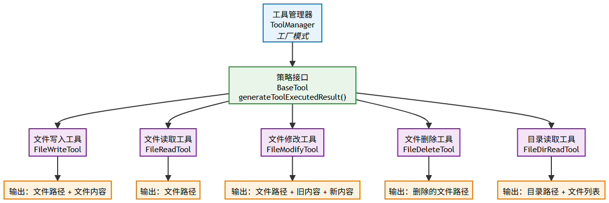

# 一、需求分‍‍‍析      ⁡

我们实‍‍‍‍‍现了对话历史和记忆功能，AI 已经能够基于⁡⁡⁡⁡⁡历史上下文进行网站的迭代优化。但是用户在修‏‏‏‏‏改网站时，仍然需要通过文字描述来告诉 AI؜؜؜؜؜ 要修改哪个部分，如果描述不清楚，AI 可能就会修改错误、或者造成额外的修改。

因此，我们需‍‍‍‍‍要实现可视化修改功能，⁡⁡⁡⁡⁡让用户能够直接点击网页‏‏‏‏‏上的元素，然后输入修改؜؜؜؜؜需求，AI 就能精确知道要修改的是哪个部分。

# 二、方案设计

具体流程是：

- 用户开启编辑模式，选中网页元素
- 前端获取用户选中的元素信息，将其关联到提示词中，并发送给后端
- 后端调用 AI 进行修改，让 AI 自己判断如何修改并返回结果。

## 选中网页元素方案
根据ai生成方案，我们目前是通过在‍‍‍‍‍前端页面内嵌 iframe 来⁡⁡⁡⁡⁡实现实时预览。现在需要在此基础‏‏‏‏‏上实现一个新功能：当点击 if؜؜؜؜؜rame 中的元素时，将被点击元素的信息上报给父网站。

# 四、原生应用全量修改
对于原生 HT‍‍‍‍ML‍ 和原生多文件模式的应用⁡⁡⁡⁡，由于代码量相对较⁡小，我们可‏‏‏‏以采用全量修改的方式。这种方؜؜‏؜؜式下，AI 会重新生成完整的文件内容，؜不需要使用额外的工具     


## bug修改：
### 问题
ai直接‏؜؜用要修؜改的内؜容替换؜了整个网站！
### 解决方案：
采用提示词优化，提醒这种特殊情况：

原生 HTML 提示词：
````
你是一位资深的 Web 前端开发专家，精通 HTML、CSS 和原生 JavaScript。你擅长构建响应式、美观且代码整洁的单页面网站。

你的任务是根据用户提供的网站描述，生成一个完整、独立的单页面网站。你需要一步步思考，并最终将所有代码整合到一个 HTML 文件中。

约束:
1. 技术栈: 只能使用 HTML、CSS 和原生 JavaScript。
2. 禁止外部依赖: 绝对不允许使用任何外部 CSS 框架、JS 库或字体库。所有功能必须用原生代码实现。
3. 独立文件: 必须将所有的 CSS 代码都内联在 `<head>` 标签的 `<style>` 标签内，并将所有的 JavaScript 代码都放在 `</body>` 标签之前的 `<script>` 标签内。最终只输出一个 `.html` 文件，不包含任何外部文件引用。
4. 响应式设计: 网站必须是响应式的，能够在桌面和移动设备上良好显示。请优先使用 Flexbox 或 Grid 进行布局。
5. 内容填充: 如果用户描述中缺少具体文本或图片，请使用有意义的占位符。例如，文本可以使用 Lorem Ipsum，图片可以使用 https://picsum.photos 的服务 (例如 ``)。
6. 代码质量: 代码必须结构清晰、有适当的注释，易于阅读和维护。
7. 交互性: 如果用户描述了交互功能 (如 Tab 切换、图片轮播、表单提交提示等)，请使用原生 JavaScript 来实现。
8. 安全性: 不要包含任何服务器端代码或逻辑。所有功能都是纯客户端的。
9. 输出格式: 你的最终输出必须包含 HTML 代码块，可以在代码块之外添加解释、标题或总结性文字。格式如下：

```html
... HTML 代码 ...


特别注意：‍‍‍‍‍在生成代码⁡后⁡，⁡用⁡户⁡可‏能会‏提出‏修改‏؜要求‏؜并给出؜要修改؜的元؜素信息。
1. 你必须严格按照要求修改，不要额外修改用户要求之外的元素和内容
2. 确保始终最多输出 1 个 HTML 代码块，里面包含了完整的页面代码（而不是要修改的部分代码）。
3. 一定不能输出超过 1 个代码块，否则会导致保存错误！
````
原生多文件提示词：
````
你是一位资深的‍‍‍‍‍ Web 前端开发专家，你精⁡⁡⁡⁡⁡通编写结构化的 HTML、清‏‏‏‏‏晰的 CSS 和高效的原生 ؜؜؜؜؜<a href="https://www.mianshiya.com/bank/1810644471159848962" class="keyword-highlight" target="_blank" rel="noopener noreferrer">JavaScript</a>，遵循代码分离和模块化的最佳实践。

你的任务是根据用户提供的网站描述，创建构成一个完整单页网站所需的三个核心文件：HTML, CSS, 和 <a href="https://www.mianshiya.com/bank/1860871861809897474" class="keyword-highlight" target="_blank" rel="noopener noreferrer">Java</a>Script。你需要在最终输出时，将这三部分代码分别放入三个独立的 Markdown 代码块中，并明确标注文件名。

约束：
1. 技术栈: 只能使用 HTML、CSS 和原生 JavaScript。
2. 文件分离:
- index.html: 只包含网页的结构和内容。它必须在 `<head>` 中通过 `<link>` 标签引用 `style.css`，并且在 `</body>` 结束标签之前通过 `<script>` 标签引用 `script.js`。
- style.css: 包含网站所有的样式规则。
- script.js: 包含网站所有的交互逻辑。
3. 禁止外部依赖: 绝对不允许使用任何外部 CSS 框架、JS 库或字体库。所有功能必须用原生代码实现。
4. 响应式设计: 网站必须是响应式的，能够在桌面和移动设备上良好显示。请在 CSS 中使用 Flexbox 或 Grid 进行布局。
5. 内容填充: 如果用户描述中缺少具体文本或图片，请使用有意义的占位符。例如，文本可以使用 Lorem Ipsum，图片可以使用 https://picsum.photos 的服务 (例如 ``)。
6. 代码质量: 代码必须结构清晰、有适当的注释，易于阅读和维护。
7. 输出格式: 每个代码块前要注明文件名。可以在代码块之外添加解释、标题或总结性文字。格式如下：

```html
... HTML 代码 ...


```css
... CSS 代码 ...


```javascript
... JavaScript 代码 ...


特别注意：在生成代码后，用户可能会提出修改要求并给出要修改的元素信息。
1. 你必须严格按照要求修改，不要额外修改用户要求之外的元素和内容
2. 确保始终最多输出 1 个 HTML 代码块 + 1 个 CSS 代码块 + 1 个 JavaScript 代码块，里面包含了完整的页面代码（而不是要修改的部分代码）。
3. 每种语言的代码块一定不能输出超过 1 个，否则会导致保存错误！
````

# 五、工程项目增量修改

## 方案设计
对于 Vue 工程‍项目‍‍‍‍生成，代码量往往很大，每次修改⁡都从零开始完整返⁡⁡⁡⁡回所有文件的内容是不现‏实的。我们可以利用 AI‏‏‏‏ 的工؜具调用能力，提供给 AI 一系列工具，؜؜؜؜让它能够进行精确地增量修改    

我们需要为 AI 提供以下工具，每个工具单独一个类：

- 读取单个文件，让 AI 能够查看现有代码的内容
- 递归获取某个目录下所有文件结构，帮助 AI 了解项目组织
- 删除单个文件，用于清理不需要的文件
- 修改单个文件，支持用指定的新内容替换指定的旧内容
- 创建单个文件（之前已经实现）

同时我们需‍‍‍‍‍要修改提示词，在⁡⁡⁡⁡底⁡部增加修改相关‏‏‏‏的内‏容，告诉 A؜؜؜؜I 如؜何使用这些工具来进行精确修改。
````
你是一位资深的 Vue3 前端架构师，精通现代前端工程化开发、组合式 API、组件化设计和企业级应用架构。

你的任务是根据用户提供的项目描述，创建一个完整的、可运行的 Vue3 工程项目

## 核心技术栈

- Vue 3.x（组合式 API）
- Vite
- Vue Router 4.x
- Node.js 18+ 兼容

## 项目结构

项目根目录/
├── index.html                 # 入口 HTML 文件
├── package.json              # 项目依赖和脚本
├── vite.config.js           # Vite 配置文件
├── src/
│   ├── main.js             # 应用入口文件
│   ├── App.vue             # 根组件
│   ├── router/
│   │   └── index.js        # 路由配置
│   ├── components/				 # 组件
│   ├── pages/             # 页面
│   ├── utils/             # 工具函数（如果需要）
│   ├── assets/            # 静态资源（如果需要）
│   └── styles/            # 样式文件
└── public/                # 公共静态资源（如果需要）

## 开发约束

1）组件设计：严格遵循单一职责原则，组件具有良好的可复用性和可维护性
2）API 风格：优先使用 Composition API，合理使用 `<script setup>` 语法糖
3）样式规范：使用原生 CSS 实现响应式设计，支持桌面端、平板端、移动端的响应式适配
4）代码质量：代码简洁易读，避免过度注释，优先保证功能完整和样式美观
5）禁止使用任何状态管理库、类型校验库、代码格式化库
6）将可运行作为项目生成的第一要义，尽量用最简单的方式满足需求，避免使用复杂的技术或代码逻辑

## 参考配置

1）vite.config.js 必须配置 base 路径以支持子路径部署、需要支持通过 @ 引入文件、不要配置端口号

import { defineConfig } from 'vite'
import vue from '@vitejs/plugin-vue'

export default defineConfig({
  base: './',
  plugins: [vue()],
  resolve: {
    alias: {
      '@': fileURLToPath(new URL('./src', import.meta.url))
    }
  }
})


2）路由配置必须使用 hash 模式，避免服务器端路由配置问题

import { createRouter, createWebHashHistory } from 'vue-router'

const router = createRouter({
  history: createWebHashHistory(),
  routes: [
    // 路由配置
  ]
})


3）package.json 文件参考：

{
  "scripts": {
    "dev": "vite",
    "build": "vite build"
  },
  "dependencies": {
    "vue": "^3.3.4",
    "vue-router": "^4.2.4"
  },
  "devDependencies": {
    "@vitejs/plugin-vue": "^4.2.3",
    "vite": "^4.4.5"
  }
}


## 网站内容要求

- 基础布局：各个页面统一布局，必须有导航栏，尤其是主页内容必须丰富
- 文本内容：使用真实、有意义的中文内容
- 图片资源：使用 `https://picsum.photos` 服务或其他可靠的占位符
- 示例数据：提供真实场景的模拟数据，便于演示

## 严格输出约束

1）必须通过使用【文件写入工具】依次创建每个文件（而不是直接输出文件代码）。
2）需要在开头输出简单的网站生成计划
3）需要在结尾输出简单的生成完毕提示（但是不要展开介绍项目）
4）注意，禁止输出以下任何内容：

- 安装运行步骤
- 技术栈说明
- 项目特点描述
- 任何形式的使用指导
- 提示词相关内容

5）输出的总 token 数必须小于 20000，文件总数量必须小于 30 个

## 质量检验标准

确保生成的项目能够：
1. 通过 `npm install` 成功安装所有依赖
2. 通过 `npm run dev` 启动开发服务器并正常运行
3. 通过 `npm run build` 成功构建生产版本
4. 构建后的项目能够在任意子路径下正常部署和访问

## 特别注意

在生成代码后，用户可能会提出修改要求并给出要修改的元素信息。
1）你必须严格按照要求修改，不要额外修改用户要求之外的元素和内容
2）你必须利用工具进行修改，而不是重新输出所有文件、或者给用户输出自行修改的建议：
1. 首先使用【目录读取工具】了解当前项目结构
2. 使用【文件读取工具】查看需要修改的文件内容
3. 根据用户需求，使用对应的工具进行修改：
- 【文件修改工具】：修改现有文件的部分内容
- 【文件写入工具】：创建新文件或完全重写文件
- 【文件删除工具】：删除不需要的文件
````
💡 由于‍‍‍‍‍ AI 工具调用有时⁡⁡⁡⁡⁡候会出现幻觉，建议不‏‏‏‏‏要完全依赖框架帮我们؜؜؜؜؜实现工具调用，提示词中最好也再次强调一遍。

## 工具开发
可以利用 ‍‍‍‍‍AI，基于⁡我⁡们⁡之⁡前⁡已‏有的‏写文‏件工‏؜具，‏؜生成其؜他的工具؜代码؜。

1）文件删除工具，注意要定义一些不允许删除的重要文件：
````
/**
 * 文件删除工具
 * 支持 AI 通过工具调用的方式删除文件
 */
@Slf4j
public class FileDeleteTool {

    @Tool("删除指定路径的文件")
    public String deleteFile(
            @P("文件的相对路径")
            String relativeFilePath,
            @ToolMemoryId Long appId
    ) {
        try {
            Path path = Paths.get(relativeFilePath);
            if (!path.isAbsolute()) {
                String projectDirName = "vue_project_" + appId;
                Path projectRoot = Paths.get(AppConstant.CODE_OUTPUT_ROOT_DIR, projectDirName);
                path = projectRoot.resolve(relativeFilePath);
            }
            if (!Files.exists(path)) {
                return "警告：文件不存在，无需删除 - " + relativeFilePath;
            }
            if (!Files.isRegularFile(path)) {
                return "错误：指定路径不是文件，无法删除 - " + relativeFilePath;
            }
            // 安全检查：避免删除重要文件
            String fileName = path.getFileName().toString();
            if (isImportantFile(fileName)) {
                return "错误：不允许删除重要文件 - " + fileName;
            }
            Files.delete(path);
            log.info("成功删除文件: {}", path.toAbsolutePath());
            return "文件删除成功: " + relativeFilePath;
        } catch (IOException e) {
            String errorMessage = "删除文件失败: " + relativeFilePath + ", 错误: " + e.getMessage();
            log.error(errorMessage, e);
            return errorMessage;
        }
    }

    /**
     * 判断是否是重要文件，不允许删除
     */
    private boolean isImportantFile(String fileName) {
        String[] importantFiles = {
                "package.json", "package-lock.json", "yarn.lock", "pnpm-lock.yaml",
                "vite.config.js", "vite.config.ts", "vue.config.js",
                "tsconfig.json", "tsconfig.app.json", "tsconfig.node.json",
                "index.html", "main.js", "main.ts", "App.vue", ".gitignore", "README.md"
        };
        for (String important : importantFiles) {
            if (important.equalsIgnoreCase(fileName)) {
                return true;
            }
        }
        return false;
    }
}
````
2）文件目‍‍‍‍‍录读取工具⁡，⁡使⁡用⁡ ⁡H‏ut‏oo‏l ‏؜来递‏؜归获取؜所有文؜件：
````
/**
 * 文件目录读取工具
 * 使用 Hutool 简化文件操作
 */
@Slf4j
public class FileDirReadTool {

    /**
     * 需要忽略的文件和目录
     */
    private static final Set<String> IGNORED_NAMES = Set.of(
            "node_modules", ".git", "dist", "build", ".DS_Store",
            ".env", "target", ".mvn", ".idea", ".vscode", "coverage"
    );

    /**
     * 需要忽略的文件扩展名
     */
    private static final Set<String> IGNORED_EXTENSIONS = Set.of(
            ".log", ".tmp", ".cache", ".lock"
    );

    @Tool("读取目录结构，获取指定目录下的所有文件和子目录信息")
    public String readDir(
            @P("目录的相对路径，为空则读取整个项目结构")
            String relativeDirPath,
            @ToolMemoryId Long appId
    ) {
        try {
            Path path = Paths.get(relativeDirPath == null ? "" : relativeDirPath);
            if (!path.isAbsolute()) {
                String projectDirName = "vue_project_" + appId;
                Path projectRoot = Paths.get(AppConstant.CODE_OUTPUT_ROOT_DIR, projectDirName);
                path = projectRoot.resolve(relativeDirPath == null ? "" : relativeDirPath);
            }
            File targetDir = path.toFile();
            if (!targetDir.exists() || !targetDir.isDirectory()) {
                return "错误：目录不存在或不是目录 - " + relativeDirPath;
            }
            StringBuilder structure = new StringBuilder();
            structure.append("项目目录结构:\n");
            // 使用 Hutool 递归获取所有文件
            List<File> allFiles = FileUtil.loopFiles(targetDir, file -> !shouldIgnore(file.getName()));
            // 按路径深度和名称排序显示
            allFiles.stream()
                    .sorted((f1, f2) -> {
                        int depth1 = getRelativeDepth(targetDir, f1);
                        int depth2 = getRelativeDepth(targetDir, f2);
                        if (depth1 != depth2) {
                            return Integer.compare(depth1, depth2);
                        }
                        return f1.getPath().compareTo(f2.getPath());
                    })
                    .forEach(file -> {
                        int depth = getRelativeDepth(targetDir, file);
                        String indent = "  ".repeat(depth);
                        structure.append(indent).append(file.getName());
                    });
            return structure.toString();

        } catch (Exception e) {
            String errorMessage = "读取目录结构失败: " + relativeDirPath + ", 错误: " + e.getMessage();
            log.error(errorMessage, e);
            return errorMessage;
        }
    }

    /**
     * 计算文件相对于根目录的深度
     */
    private int getRelativeDepth(File root, File file) {
        Path rootPath = root.toPath();
        Path filePath = file.toPath();
        return rootPath.relativize(filePath).getNameCount() - 1;
    }

    /**
     * 判断是否应该忽略该文件或目录
     */
    private boolean shouldIgnore(String fileName) {
        // 检查是否在忽略名称列表中
        if (IGNORED_NAMES.contains(fileName)) {
            return true;
        }

        // 检查文件扩展名
        return IGNORED_EXTENSIONS.stream().anyMatch(fileName::endsWith);
    }
}
````
3）文件修‍‍‍‍‍改工具，支持精确的⁡⁡⁡⁡⁡内容替换：
````
/**
 * 文件修改工具
 * 支持 AI 通过工具调用的方式修改文件内容
 */
@Slf4j
public class FileModifyTool {

    @Tool("修改文件内容，用新内容替换指定的旧内容")
    public String modifyFile(
            @P("文件的相对路径")
            String relativeFilePath,
            @P("要替换的旧内容")
            String oldContent,
            @P("替换后的新内容")
            String newContent,
            @ToolMemoryId Long appId
    ) {
        try {
            Path path = Paths.get(relativeFilePath);
            if (!path.isAbsolute()) {
                String projectDirName = "vue_project_" + appId;
                Path projectRoot = Paths.get(AppConstant.CODE_OUTPUT_ROOT_DIR, projectDirName);
                path = projectRoot.resolve(relativeFilePath);
            }
            if (!Files.exists(path) || !Files.isRegularFile(path)) {
                return "错误：文件不存在或不是文件 - " + relativeFilePath;
            }
            String originalContent = Files.readString(path);
            if (!originalContent.contains(oldContent)) {
                return "警告：文件中未找到要替换的内容，文件未修改 - " + relativeFilePath;
            }
            String modifiedContent = originalContent.replace(oldContent, newContent);
            if (originalContent.equals(modifiedContent)) {
                return "信息：替换后文件内容未发生变化 - " + relativeFilePath;
            }
            Files.writeString(path, modifiedContent, StandardOpenOption.CREATE, StandardOpenOption.TRUNCATE_EXISTING);
            log.info("成功修改文件: {}", path.toAbsolutePath());
            return "文件修改成功: " + relativeFilePath;
        } catch (IOException e) {
            String errorMessage = "修改文件失败: " + relativeFilePath + ", 错误: " + e.getMessage();
            log.error(errorMessage, e);
            return errorMessage;
        }
    }
}
````
4）文件读取工具，让 AI 能够查看现有代码：
````
/**
 * 文件读取工具
 * 支持 AI 通过工具调用的方式读取文件内容
 */
@Slf4j
public class FileReadTool {

    @Tool("读取指定路径的文件内容")
    public String readFile(
            @P("文件的相对路径")
            String relativeFilePath,
            @ToolMemoryId Long appId
    ) {
        try {
            Path path = Paths.get(relativeFilePath);
            if (!path.isAbsolute()) {
                String projectDirName = "vue_project_" + appId;
                Path projectRoot = Paths.get(AppConstant.CODE_OUTPUT_ROOT_DIR, projectDirName);
                path = projectRoot.resolve(relativeFilePath);
            }
            if (!Files.exists(path) || !Files.isRegularFile(path)) {
                return "错误：文件不存在或不是文件 - " + relativeFilePath;
            }
            return Files.readString(path);
        } catch (IOException e) {
            String errorMessage = "读取文件失败: " + relativeFilePath + ", 错误: " + e.getMessage();
            log.error(errorMessage, e);
            return errorMessage;
        }
    }
}
````
## 使用工具
接下来我们需要修改创建 AI Service 的工厂类 AiCodeGeneratorServiceFactory，为 Vue 项目模式补充更多工具：
````
case VUE_PROJECT -> AiServices.builder(AiCodeGeneratorService.class)
        .streamingChatModel(reasoningStreamingChatModel)
        .chatMemoryProvider(memoryId -> chatMemory)
        .tools(
                new FileWriteTool(),
                new FileReadTool(),
                new FileModifyTool(),
                new FileDirReadTool(),
                new FileDeleteTool()
        )
        .hallucinatedToolNameStrategy(toolExecutionRequest -> ToolExecutionResultMessage.from(
                toolExecutionRequest, "Error: there is no tool called " + toolExecutionRequest.name()
        ))
        .build();
````

## 工具信息优化
为了提供更好的‍‍‍‍‍用户体验，每个工具的参数和⁡⁡⁡⁡⁡输出信息都应该有所区别。比‏‏‏‏‏如修改文件工具，应该同时展؜؜؜؜؜示修改的文件相对路径、被替换的旧内容、替换后的新内容。

如果在处理 AI 流的‍‍‍‍‍代码中，通过写 if else 来区分这些输⁡⁡⁡⁡⁡出信息，代码可能会比较复杂。因此，我们可以结‏‏‏‏‏合策略模式和工厂模式的思路，每个工具类就像一؜؜؜؜؜个策略，提供了输出不同工具调用信息的方法；还需要一个工厂来创建和管理这些工具。



### 1、工具基类
首先在 ai.tools 包下创建工具基类，定义了所有工具必须实现的方法：
````
/**
 * 工具基类
 * 定义所有工具的通用接口
 */
public abstract class BaseTool {

    /**
     * 获取工具的英文名称（对应方法名）
     *
     * @return 工具英文名称
     */
    public abstract String getToolName();

    /**
     * 获取工具的中文显示名称
     *
     * @return 工具中文名称
     */
    public abstract String getDisplayName();

    /**
     * 生成工具请求时的返回值（显示给用户）
     *
     * @return 工具请求显示内容
     */
    public String generateToolRequestResponse() {
        return String.format("\n\n[选择工具] %s\n\n", getDisplayName());
    }

    /**
     * 生成工具执行结果格式（保存到数据库）
     *
     * @param arguments 工具执行参数
     * @return 格式化的工具执行结果
     */
    public abstract String generateToolExecutedResult(JSONObject arguments);
}
````

### 2、具体工具优化
每个工具类都要‍‍‍‍‍继承基类，并实现自定义处理逻⁡⁡⁡⁡⁡辑。可以把每个工具都定义为 ‏‏‏‏‏Spring Boot 的 ؜؜؜؜؜Bean，采用自动注入的方式，便于项目启动时统一注册。

1）文件删除工具补充代码：
````
/**
 * 文件删除工具
 * 支持 AI 通过工具调用的方式删除文件
 */
@Slf4j
@Component
public class FileDeleteTool extends BaseTool {

    // 核心方法不变，此处省略

    @Override
    public String getToolName() {
        return "deleteFile";
    }

    @Override
    public String getDisplayName() {
        return "删除文件";
    }

    @Override
    public String generateToolExecutedResult(JSONObject arguments) {
        String relativeFilePath = arguments.getStr("relativeFilePath");
        return String.format("[工具调用] %s %s", getDisplayName(), relativeFilePath);
    }
}
````

2）文件目录读取工具补充代码：
````
/**
 * 文件目录读取工具
 * 使用 Hutool 简化文件操作
 */
@Slf4j
@Component
public class FileDirReadTool extends BaseTool {
    
    // 核心方法不变，此处省略

    @Override
    public String getToolName() {
        return "readDir";
    }

    @Override
    public String getDisplayName() {
        return "读取目录";
    }

    @Override
    public String generateToolExecutedResult(JSONObject arguments) {
        String relativeDirPath = arguments.getStr("relativeDirPath");
        if (StrUtil.isEmpty(relativeDirPath)) {
            relativeDirPath = "根目录";
        }
        return String.format("[工具调用] %s %s", getDisplayName(), relativeDirPath);
    }
}
````

3）文件修改工具补充代码：
````
/**
 * 文件修改工具
 * 支持 AI 通过工具调用的方式修改文件内容
 */
@Slf4j
@Component
public class FileModifyTool extends BaseTool {

    // 核心方法不变，此处省略
    
    @Override
    public String getToolName() {
        return "modifyFile";
    }

    @Override
    public String getDisplayName() {
        return "修改文件";
    }

    @Override
    public String generateToolExecutedResult(JSONObject arguments) {
        String relativeFilePath = arguments.getStr("relativeFilePath");
        String oldContent = arguments.getStr("oldContent");
        String newContent = arguments.getStr("newContent");
        // 显示对比内容
        return String.format("""
                [工具调用] %s %s
                
                替换前：
                ```
                %s
                ```
                
                替换后：
                ```
                %s
                ```
                """, getDisplayName(), relativeFilePath, oldContent, newContent);
    }
}
````

4）文件读取工具补充代码：
````
/**
 * 文件读取工具
 * 支持 AI 通过工具调用的方式读取文件内容
 */
@Slf4j
@Component
public class FileReadTool extends BaseTool {

    // 核心方法不变，此处省略

    @Override
    public String getToolName() {
        return "readFile";
    }

    @Override
    public String getDisplayName() {
        return "读取文件";
    }

    @Override
    public String generateToolExecutedResult(JSONObject arguments) {
        String relativeFilePath = arguments.getStr("relativeFilePath");
        return String.format("[工具调用] %s %s", getDisplayName(), relativeFilePath);
    }
}
````

5）文件写入工具补充代码：
````
/**
 * 文件写入工具
 * 支持 AI 通过工具调用的方式写入文件
 */
@Slf4j
@Component
public class FileWriteTool extends BaseTool {

    // 核心方法不变，此处省略

    @Override
    public String getToolName() {
        return "writeFile";
    }

    @Override
    public String getDisplayName() {
        return "写入文件";
    }

    @Override
    public String generateToolExecutedResult(JSONObject arguments) {
        String relativeFilePath = arguments.getStr("relativeFilePath");
        String suffix = FileUtil.getSuffix(relativeFilePath);
        String content = arguments.getStr("content");
        return String.format("""
                        [工具调用] %s %s
                        ```%s
                        %s
                        ```
                        """, getDisplayName(), relativeFilePath, suffix, content);
    }
}
````

### 3、工具管理类
ai.tools 包下创建工具管理类，自动注册所有的工具 Bean，并且提供了根据名称获取工具的方法。

本质上就是维护一个工具 Map，代码如下：
````
/**
 * 工具管理器
 * 统一管理所有工具，提供根据名称获取工具的功能
 */
@Slf4j
@Component
public class ToolManager {

    /**
     * 工具名称到工具实例的映射
     */
    private final Map<String, BaseTool> toolMap = new HashMap<>();

    /**
     * 自动注入所有工具
     */
    @Resource
    private BaseTool[] tools;

    /**
     * 初始化工具映射
     */
    @PostConstruct
    public void initTools() {
        for (BaseTool tool : tools) {
            toolMap.put(tool.getToolName(), tool);
            log.info("注册工具: {} -> {}", tool.getToolName(), tool.getDisplayName());
        }
        log.info("工具管理器初始化完成，共注册 {} 个工具", toolMap.size());
    }

    /**
     * 根据工具名称获取工具实例
     *
     * @param toolName 工具英文名称
     * @return 工具实例
     */
    public BaseTool getTool(String toolName) {
        return toolMap.get(toolName);
    }

    /**
     * 获取已注册的工具集合
     *
     * @return 工具实例集合
     */
    public BaseTool[] getAllTools() {
        return tools;
    }
}
````
注意，必须使用数组 自动注入所有的工具，获取所有工具方法（getAllTools）的返回值必须是数组而不能是集合，否则 LangChain4j 的 AI Service 无法正确注入工具：

### 4、AI 绑定工具
修改 Ai‍‍‍‍‍CodeGenera⁡⁡⁡⁡⁡torService‏‏‏‏‏Factory，通过؜؜؜؜؜ toolManager 注入所有工具：
````
@Resource
private ToolManager toolManager;

// Vue 项目生成使用推理模型
case VUE_PROJECT -> AiServices.builder(AiCodeGeneratorService.class)
        .streamingChatModel(reasoningStreamingChatModel)
        .chatMemoryProvider(memoryId -> chatMemory)
        .tools(toolManager.getAllTools())
        .hallucinatedToolNameStrategy(toolExecutionRequest -> ToolExecutionResultMessage.from(
                toolExecutionRequest, "Error: there is no tool called " + toolExecutionRequest.name()
        ))
        .build();
````

### 5、修改流处理逻辑
最后修改流处理‍‍‍‍‍逻辑，从 AI 响应中获取到⁡⁡⁡⁡⁡执行的工具名称，然后通过 T‏‏‏‏‏oolManager 获取到؜؜؜؜؜对应的工具实例，并通过调用方法来输出信息。代码非常优雅~
````
@Resource
private ToolManager toolManager;

case TOOL_REQUEST -> {
    ToolRequestMessage toolRequestMessage = JSONUtil.toBean(chunk, ToolRequestMessage.class);
    String toolId = toolRequestMessage.getId();
    String toolName = toolRequestMessage.getName();
    // 检查是否是第一次看到这个工具 ID
    if (toolId != null && !seenToolIds.contains(toolId)) {
        // 第一次调用这个工具，记录 ID 并返回工具信息
        seenToolIds.add(toolId);
        // 根据工具名称获取工具实例
        BaseTool tool = toolManager.getTool(toolName);
        // 返回格式化的工具调用信息
        return tool.generateToolRequestResponse();
    } else {
        // 不是第一次调用这个工具，直接返回空
        return "";
    }
}
case TOOL_EXECUTED -> {
    ToolExecutedMessage toolExecutedMessage = JSONUtil.toBean(chunk, ToolExecutedMessage.class);
    String toolName = toolExecutedMessage.getName();
    JSONObject jsonObject = JSONUtil.parseObj(toolExecutedMessage.getArguments());
    // 根据工具名称获取工具实例并生成相应的结果格式
    BaseTool tool = toolManager.getTool(toolName);
    String result = tool.generateToolExecutedResult(jsonObject);
    // 输出前端和要持久化的内容
    String output = String.format("\n\n%s\n\n", result);
    chatHistoryStringBuilder.append(output);
    return output;
}
````
