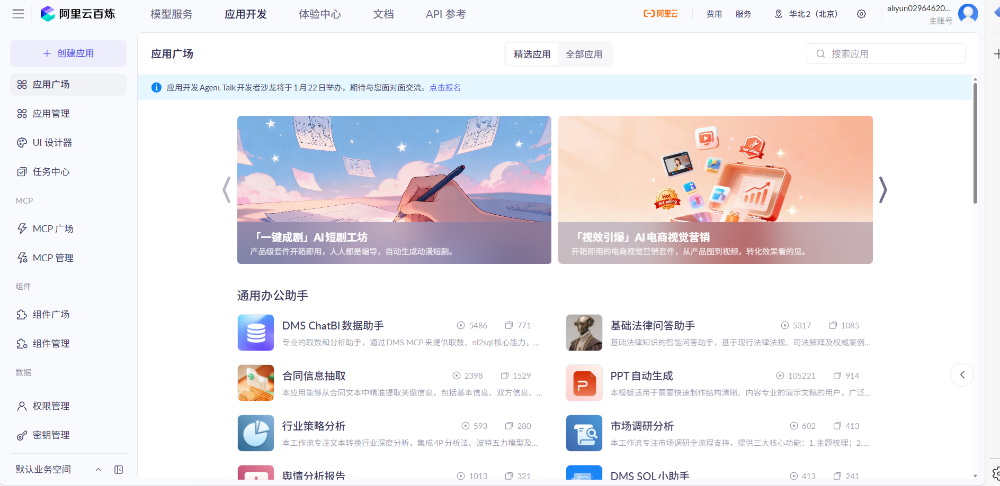
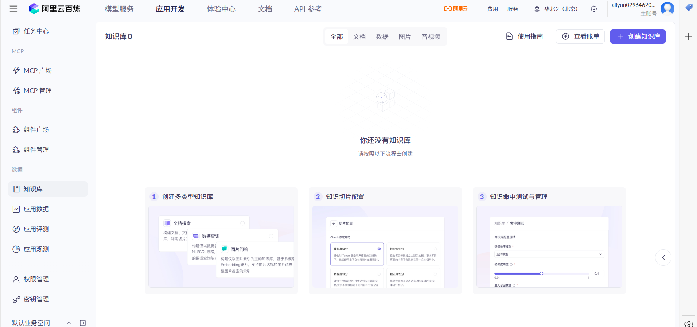

# AI大模型接入
## 使用大模型的 2 种途径
在实际开发‍过程中，我们主要有 2 种途径来使用 AI 大模型，分؜别是**云服务**和**自部署**，各有优缺。

### 1、云服务
直接使用其‍他云服务商在云端已部署好的大模型服务，无需自己考虑基础؜设施（比如服务器、GPU 算力），特点如下：

- 提供纯净的大模型能力和构建应用（智能体）的工具
- 按需付费，无需前期大量基础设施投入
- 随时可用，维护成本低
- 自动更新到最新版本的模型
- 通常具有更完善的安全措施和合规保障
### 2、自部署
开发者自行‍在本地或私有云环境部署开源大模型，特点如下：

- 完全控制数据流，更高的数据隐私保障
- 可根据特定需求微调和定制模型
- 无网络延迟，适合对响应速度有严格要求的场景
- 一次性成本较高，需要专业的技术团队维护
- 适合企业级应用和对数据安全有严格要求的场景
- 对于个人开发‍者，选用云服务就够了，不建议自己本地部署大模型，资源和维护成本太高了；对؜于特定业务领域的、考虑到数据安全性的企业，适合自部署。

## 接入大模型的 3 种方式
### 1、AI 应用平台接入
通过云服务商提供的 AI 应用平台来使用 AI 大模型。

以 阿里云百炼 为例，这是一站式的大模型开发及应用构建平台，它提供了从模型调用到应用构建的全流程支持。

不论是开发者还‍是业务人员，都可以通过简单的界面操作，在 5 分钟内开发出一款大模型应用，或在几小时؜内训练出一个专属模型，从而将更多精力专注于应用创新。

此外，还提‍供了知识库管理、应用评测、应用观测等功能，能够帮企业快؜速构建智能客服等应用。

### 2、AI 软件客户端接入
除了平台之‍外，还可以通过 AI 软件客户端来使用大模型能力(差不多就是直连ai,而平台相当于中台去链接ai)
### 3、程序接入
可以通过编‍程的方式在自己的项目中调用 AI 大模型，又可以分为 ؜2 种方式：

- 直接调用 AI 大模型，比如调用 DeepSeek（更原生）
- 调用 AI 大模型平台创建的应用或智能体（更方便）

对于第 1 种方式，可以使用特定平台提供的 SDK 或 API，参考平台的文档来接入；也可以使用 AI 开发框架，比如 Spring AI、Spring AI Alibaba、LangChain4j 等自主选择大模型进行调用，可以灵活切换使用的大模型而几乎不用修改代码。

对于第 2 种方式，一般只能使用特定平台提供的 SDK 或 API，参考 平台的文档 来接入，每个大模型服务平台的代码都不一样。

如果是个人小项目，第 2 种方式可能会更方便，因为把大多数应用构建的操作都放到了云端可视化平台而不是通过编程来实现；但如果是企业级项目，考虑到扩展性，更推؜荐第 1 种方式，直接用 Spring AI 等开发框架调用 AI 大模型。

## 四、程序调用 AI 大模型
在实际开发中，有‍多种方式可以在应用程序中调用 AI 大模型。下面详细介绍 4 种主流的接入方式，并通过实例؜代码展示如何在 Java 项目中实现与 AI 大模型的交互。

- SDK 接入：使用官方提供的软件开发工具包，最直接的集成方式
- HTTP 接入：通过 REST API 直接发送 HTTP 请求调用模型
- Spring AI：基于 Spring 生态系统的 AI 框架，更方便地接入大模型
- LangChain4j：专注于构建 LLM 应用的 Java 框架，提供丰富的 AI 调用组件

### 1、SDK 接入
SDK（软‍件开发工具包）是官方提供的最直接的集成方式，通常提供了؜完善的类型支持和错误处理机制。

1）首先需要按照官方文档安装 SDK：安装 SDK [官方指南](https://help.aliyun.com/zh/model-studio/install-sdk)

在选择 SDK 版本时，建议在 Maven 仓库查看最新的版本号：[Maven中央仓库版本信息](https://mvnrepository.com/artifact/com.alibaba/dashscope-sdk-java)

### 使用 H؜TTP 请求调用 AI 大模型的 API。
💡 使用建‍议：一般来说，如果有官方 SDK 支持，优先使用 SDK；只有在不؜支持 SDK 的情况下，再考虑直接 HTTP调用。

HTTP 调用的详细说明可参考官方文档：通过 API 调用通义千问

### 3、Spring AI
[Spring AI](https://docs.spring.io/spring-ai/reference/) 是 Spring 生态系统的新成员，旨在简化 AI 功能与 Spring 应用的集成。Spring AI 通过提供统一接口、支持集成多种 AI 服务提供商和模型类型、各种 AI 开发常用的特性（比如 RAG 知识库、Tools 工具调用和 MCP 模型上下文协议），简化了 AI 应用开发代码，使开发者能够专注于业务逻辑，提高了开发效率。

#### Spring AI 的核心特性如下，参考官方文档：

- **跨 AI 供应商的可移植 API 支持**：适用于聊天、文本转图像和嵌入模型，同时支持同步和流式 API 选项，并可访问特定于模型的功能。
- **支持所有主流 AI 模型供应商**：如 Anthropic、OpenAI、微软、亚马逊、谷歌和 Ollama，支持的模型类型包括：聊天补全、嵌入、文本转图像、音频转录、文本转语音
- **结构化输出**：将 AI 模型输出映射到 POJO（普通 Java 对象）。
- **支持所有主流向量数据库**：如 Apache Cassandra、Azure Cosmos DB、Azure Vector Search、Chroma、Elasticsearch、GemFire、MariaDB、Milvus、MongoDB Atlas、Neo4j、OpenSearch、Oracle、PostgreSQL/PGVector、PineCone、Qdrant、Redis、SAP Hana、Typesense 和 Weaviate。
- **跨向量存储供应商的可移植 API**：包括新颖的类 SQL 元数据过滤 API。
- **工具/函数调用**：允许模型请求执行客户端工具和函数，从而根据需要访问必要的实时信息并采取行动。
- **可观测性**：提供与 AI 相关操作的监控信息。
- **文档 ETL 框架**：适用于数据工程场景。
- **AI 模型评估工具**：帮助评估生成内容并防范幻觉响应。
- **Spring Boot 自动配置和启动器**：适用于 AI 模型和向量存储。
- **ChatClient API**：与 AI 聊天模型通信的流式 API，用法类似于 WebClient 和 RestClient API。
- **Advisors API**：封装常见的生成式 AI 模式，转换发送至语言模型（LLM）和从语言模型返回的数据，并提供跨各种模型和用例的可移植性。
- 支持聊天对话记忆和检索增强生成（RAG）。
Spring AI 默认没有支持所有的大模型（尤其是国产的），更多的是支持兼容 OpenAI API 的大模型的集成，参考 官方的模型对比。因此，我们如果想要调用阿里系大模型（比如通义千问），推荐直接使用阿里自主封装的 Spring AI Alibaba 框架，它不仅能直接继承阿里系大模型，用起来更方便，而且与标准的 Spring AI 保持兼容。

### 4、LangChain4j
和 Spring AI ‍作用一样，LangChain4j 是一个专注于构建基于大语言模型（LLM）应用的 Java 框架，作为知名 AI 框架 LangChain؜ 的 Java 版本，它提供了丰富的工具和抽象层，简化了与 LLM 的交互和应用开发。

LangChain 官方是没有支持阿里系大模型的，只能用 [社区版本的整合大模型包](https://github.com/langchain4j/langchain4j-community/tree/main/models)。可以在官方文档中查询支持的模型列表：[LangChain4j模型集成](https://docs.langchain4j.dev/integrations/language-models/dashscope/)

要接入阿里云灵积模型，可以参考官方文档：[DashScope模型集成](https://docs.langchain4j.dev/integrations/language-models/dashscope/)，提供了依赖和示例代码。

