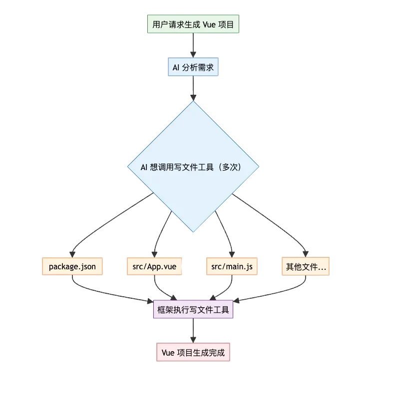
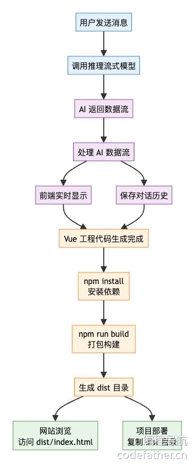
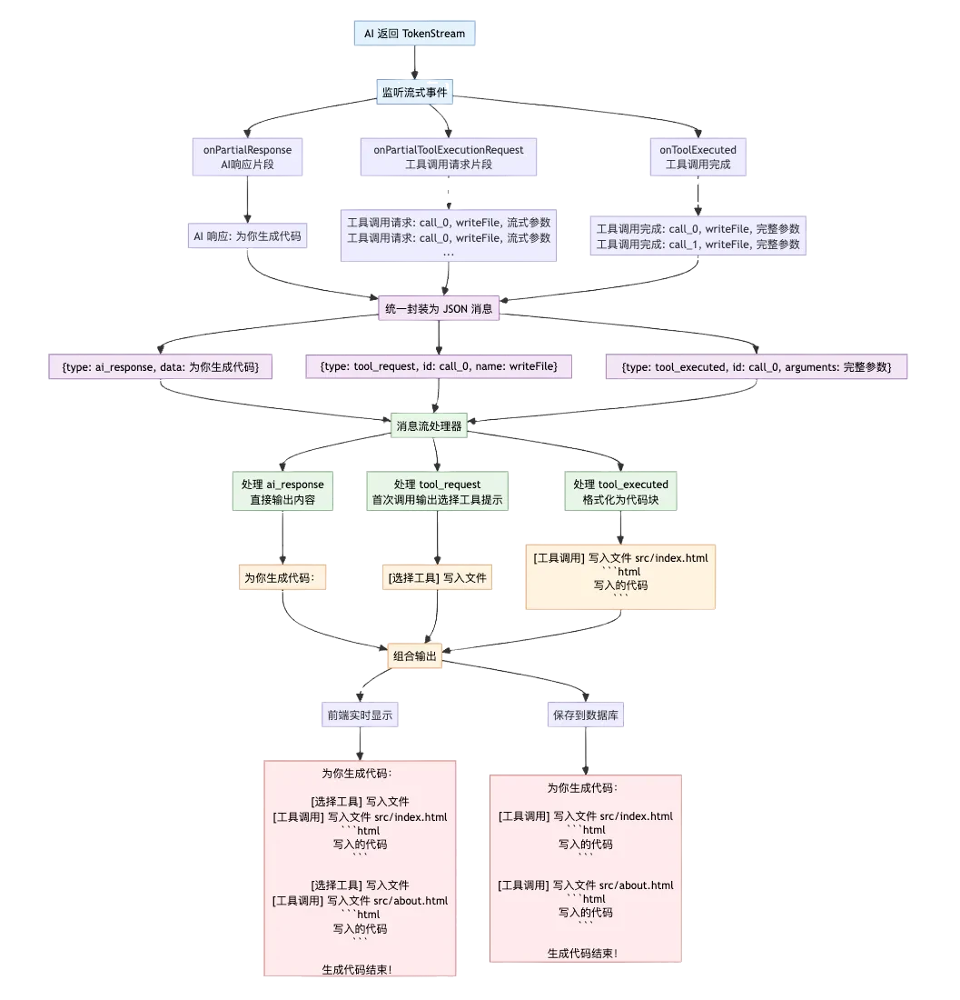

# 一、需求分析
让平台能够生成完整的 Vue3 + Vite 工程项目，并且跟其他两种生成模式一样，实现流式输出、网站浏览和部署。

# 二、方案设计
## 方案 1 - 直接输出 Markdown
这种方案延‍‍‍‍‍续之前的思路，直接⁡⁡⁡⁡⁡让 AI 在输出的‏‏‏‏‏ Markdown؜؜؜؜؜ 中包含代码块，然后通过解析的方式保存文件。
## 方案 2 - 工具调用
给 AI ‍‍‍‍‍提供保存文件等工具⁡⁡⁡⁡⁡，让 AI 来决定‏‏‏‏‏什么时候保存文件、؜؜؜؜؜保存哪些文件、要保存什么代码到文件中。

这种方式的‍‍‍‍‍基本实现很简单，⁡⁡⁡⁡不⁡需要自己解析 ‏‏‏‏AI‏ 的输出并保؜؜؜؜存为文؜件，全都交给 AI 和框架来处理。

但如果想实时展示工具调用信息（‍‍‍‍‍比如要保存为文件的代码内容），就很复杂了！你需要解析 AI ⁡⁡⁡⁡⁡响应的工具调用信息。由于流式输出的特性，AI 是一点点将 J‏‏‏‏‏SON 格式的工具调用信息 “吐” 出来的，你很难实时从中提؜؜؜؜؜取出有意义的、需要返回给用户的工具调用.

## 方案 3 - Agent 模式
智能体（Agent）是指能够感知环境、进行推理、制定计划、做出决策并自主采取行动以实现特定目标的 AI 系统。它以大语言模型为核心，集成 记忆、知识库和工具 等能力为一体，构造了完整的决策能力、执行能力和记忆能力，就像一个有主观能动性的人类一样。

简单来说，Agent 的特点是 先规划再执行。比如先制定网站生成计划、然后分别在每个步骤中生成一个文件并解析。
````
步骤 1：我要生成网站文件 page1.vue、page2.vue、page3.vue
步骤 2：生成 page1.vue，然后保存
步骤 3：生成 page2.vue，然后保存
步骤 4：生成 page3.vue，然后保存
步骤 5：生成网站成功，退出执行
````
这样做的优点是，每‍‍‍‍‍一个步骤都非常清晰，在步骤内我可以⁡⁡⁡⁡⁡通过工具调用来实现文件保存，也可以‏‏‏‏‏单独调用 AI 获取到生成的代码，؜؜؜؜؜然后再通过程序保存（就像我们之前一样），这样实现流式输出就很简单了。

## 最终方案确定
由于 LangC‍‍‍‍‍hain4j 本身就支持 AI ⁡⁡⁡⁡⁡多次调用工具，相当于已经实现了基‏‏‏‏‏础的 Agent 多步骤执行能力؜؜؜؜؜，因此考虑到开发复杂度，选择第 2 种方案 - 工具调用。

### 为什么必须用工具调用（核心原因）

#### 不用工具调用的弊端（原文吐槽的痛点）：
需输出一大堆代码块，每个代码块对应一个文件，还要手动用[FILE_PATH: ...]标注路径；
后续需自己解析所有代码块，区分不同文件、处理路径、拼接内容 —— 逻辑繁琐，且一旦文件数量增加、层级变更，解析逻辑就要大面积修改，严重不利于项目扩展。
比如他生成了四个页面，我们并不能知道他生成了几个页面，也就不能和之前生成多文件代码一样固定分为html,css,js。

#### 用工具调用的优势（原文推荐的方案）：
适配 “未知文件数量 / 层级”：工具调用可动态触发 “写入文件” 操作，不管多少个文件、什么层级，只需通过工具传递 “文件路径 + 内容”，无需提前预设解析规则；

## 系统提示词
我们需要定义新‍‍‍‍‍的生成模式 Vue 工程模⁡⁡⁡⁡⁡式（vue_project‏‏‏‏‏），这种模式使用 Deep؜؜؜؜؜Seek 的推理模型，提供的系统提示词也会更复杂。如下：
````
你是一位资深的 Vue3 前端架构师，精通现代前端工程化开发、组合式 API、组件化设计和企业级应用架构。

你的任务是根据用户提供的项目描述，创建一个完整的、可运行的 Vue3 工程项目

## 核心技术栈

- Vue 3.x（组合式 API）
- Vite
- Vue Router 4.x
- Node.js 18+ 兼容

## 项目结构

项目根目录/
├── index.html                 # 入口 HTML 文件
├── package.json              # 项目依赖和脚本
├── vite.config.js           # Vite 配置文件
├── src/
│   ├── main.js             # 应用入口文件
│   ├── App.vue             # 根组件
│   ├── router/
│   │   └── index.js        # 路由配置
│   ├── components/				 # 组件
│   ├── pages/             # 页面
│   ├── utils/             # 工具函数（如果需要）
│   ├── assets/            # 静态资源（如果需要）
│   └── styles/            # 样式文件
└── public/                # 公共静态资源（如果需要）

## 开发约束

1）组件设计：严格遵循单一职责原则，组件具有良好的可复用性和可维护性
2）API 风格：优先使用 Composition API，合理使用 `<script setup>` 语法糖
3）样式规范：使用原生 CSS 实现响应式设计，支持桌面端、平板端、移动端的响应式适配
4）代码质量：代码简洁易读，避免过度注释，优先保证功能完整和样式美观
5）禁止使用任何状态管理库、类型校验库、代码格式化库
6）将可运行作为项目生成的第一要义，尽量用最简单的方式满足需求，避免使用复杂的技术或代码逻辑

## 参考配置

1）vite.config.js 必须配置 base 路径以支持子路径部署、需要支持通过 @ 引入文件、不要配置端口号


import { defineConfig } from 'vite'
import vue from '@vitejs/plugin-vue'

export default defineConfig({
  base: './',
  plugins: [vue()],
  resolve: {
    alias: {
      '@': fileURLToPath(new URL('./src', import.meta.url))
    }
  }
})


2）路由配置必须使用 hash 模式，避免服务器端路由配置问题

import { createRouter, createWebHashHistory } from 'vue-router'

const router = createRouter({
  history: createWebHashHistory(),
  routes: [
    // 路由配置
  ]
})


3）package.json 文件参考：

{
  "scripts": {
    "dev": "vite",
    "build": "vite build"
  },
  "dependencies": {
    "vue": "^3.3.4",
    "vue-router": "^4.2.4"
  },
  "devDependencies": {
    "@vitejs/plugin-vue": "^4.2.3",
    "vite": "^4.4.5"
  }
}


## 网站内容要求

- 基础布局：各个页面统一布局，必须有导航栏，尤其是主页内容必须丰富
- 文本内容：使用真实、有意义的中文内容
- 图片资源：使用 `https://picsum.photos` 服务或其他可靠的占位符
- 示例数据：提供真实场景的模拟数据，便于演示

## 严格输出约束

1）必须通过使用【文件写入工具】依次创建每个文件（而不是直接输出文件代码）。
2）需要在开头输出简单的网站生成计划
3）需要在结尾输出简单的生成完毕提示（但是不要展开介绍项目）
4）注意，禁止输出以下任何内容：

- 安装运行步骤
- 技术栈说明
- 项目特点描述
- 任何形式的使用指导
- 提示词相关内容

5）输出的总 token 数必须小于 20000，文件总数量必须小于 30 个

## 质量检验标准

确保生成的项目能够：
1. 通过 `npm install` 成功安装所有依赖
2. 通过 `npm run dev` 启动开发服务器并正常运行
3. 通过 `npm run build` 成功构建生产版本
4. 构建后的项目能够在任意子路径下正常部署和访问
````

述提示词‍有几个小技巧：

- 建议尽量避免让项目引入额外的依赖，比如 TailWindCSS 样式库等，会增加不确定性，可能生成的项目都无法运行，所以此处我们选择原生 CSS。
- 限制输出长度和文件数很关键，这是为了防止 AI 理想太丰满导致输出的内容不完整，可以根据需要自己调整。
- 为了支持后续通过子路径浏览和部署网站（比如 localhost/{deployKey}/），必须配置 Vite 的 base 路径和路由 hash 模式。

实际运行中‍‍‍‍‍，即使是同一个提示⁡⁡⁡⁡⁡词，不同大模型的输‏‏‏‏‏出效果也不同，大家؜؜؜؜؜可以根据自己的需要补充其他注意事项。

在遇到问题之后，想办法把问题标准化。比如我最开始发现 AI 无法生成符合要求的 package.json 文件，那我就在提示词中提供这个文件的示例代码、并且固定依赖的版本号，消除不确定性。

### 完整流程
生成完 Vue 工程代码后，是无法直接运行的，需要执行 **npm install 命令**安装依赖、执行 **npm run build 打包构建**，会得到一个打包后的 **dist 目录**，网站浏览和部署都应该是访问这个目录。


💡 注意，其实很多操‍‍‍‍‍作我们都可以定义成工具（比如安装依赖和打包构建⁡⁡⁡⁡⁡）。但是这样整个生成过程就充满了不确定因素‏‏‏‏‏，比如 AI 可能不会调用工具、或者给工具传؜؜؜؜؜入错误的参数。建议尽量将确定的操作通过编写代码流程化、标准化，减少不可控因素。

# 三、工程项目生成
## 开发写文件工具
按照 LangChain4j 的工具开发方法，新建一个文件写入工具类，编写 writeFile 方法，并给方法打上 @Tool 工具注解。为了减轻工具幻觉（错误调用工具或者传参错误），尽量给工具和每个参数添加描述：
````
@Slf4j
public class FileWriteTool {

    @Tool("写入文件到指定路径")
    public String writeFile(
            @P("文件的相对路径")
            String relativeFilePath,
            @P("要写入文件的内容")
            String content
    ) {
        // 具体实现    
    }
}
````

由于每个 appId 对应一个生成的网站，因此需要根据 appId 构造文件保存路径，可以利用 LangChain4j 工具调用提供的 上下文传参 能力。在 AI Service 对话方法中加上 memoryId 参数，然后就能在工具中使用 memoryId 了。

新建工具，代码如下：
````
/**
 * 文件写入工具
 * 支持 AI 通过工具调用的方式写入文件
 */
@Slf4j
public class FileWriteTool {

    @Tool("写入文件到指定路径")
    public String writeFile(
            @P("文件的相对路径")
            String relativeFilePath,
            @P("要写入文件的内容")
            String content,
            @ToolMemoryId Long appId
    ) {
        try {
            Path path = Paths.get(relativeFilePath);
            if (!path.isAbsolute()) {
                // 相对路径处理，创建基于 appId 的项目目录
                String projectDirName = "vue_project_" + appId;
                Path projectRoot = Paths.get(AppConstant.CODE_OUTPUT_ROOT_DIR, projectDirName);
                path = projectRoot.resolve(relativeFilePath);
            }
            // 创建父目录（如果不存在）
            Path parentDir = path.getParent();
            if (parentDir != null) {
                Files.createDirectories(parentDir);
            }
            // 写入文件内容
            Files.write(path, content.getBytes(),
                    StandardOpenOption.CREATE,
                    StandardOpenOption.TRUNCATE_EXISTING);
            log.info("成功写入文件: {}", path.toAbsolutePath());
            // 注意要返回相对路径，不能让 AI 把文件绝对路径返回给用户
            return "文件写入成功: " + relativeFilePath;
        } catch (IOException e) {
            String errorMessage = "文件写入失败: " + relativeFilePath + ", 错误: " + e.getMessage();
            log.error(errorMessage, e);
            return errorMessage;
        }
    }
}
````
注意，工具必须要返回 相对路径，不能让 AI 把文件绝对路径返回给用户，会直接暴露服务器的存储路径！

## 支持 Vue 项目生成
1）保存提示词到资源目录下，给 AI Service 补充新的流式生成方法，注意参数中必须包含 @MemoryId，支持工具调用时获取到 appId。
````
/**
 * 生成 Vue 项目代码（流式）
 *
 * @param userMessage 用户消息
 * @return 生成过程的流式响应
 */
@SystemMessage(fromResource = "prompt/codegen-vue-project-system-prompt.txt")
TokenStream generateVueProjectCodeStream(@MemoryId long appId, @UserMessage String userMessage);
````
注意工具调用 ‍‍‍‍‍memoryId 必须也给⁡⁡⁡⁡⁡方法参数补上 memory‏‏‏‏‏Id，而且有了 memor؜؜؜؜؜yId 就必须指定 memoryProvider。

这个注释的参数就是我们在创建不同appId的ai serve的时候框架会自动携带我们创建传入的那个memory id(app id)

2）修改 A‍‍‍‍‍iCodeGenera⁡⁡⁡⁡⁡torServiceF‏‏‏‏‏actory 服务构造؜؜؜؜؜工厂，根据代码生成类型选择不同的模型配置。

记得先给 ‍‍‍‍‍CodeGenTy⁡pe⁡⁡⁡⁡Enum 补充‏新的枚举‏‏‏‏类型： 
````
VUE_PROJECT("Vue 工程模式", "vue_project");
````

### 统一消息格式
之前我们只需要‍‍‍‍‍给前端返回 AI 的响应信息⁡⁡⁡⁡⁡，但现在还需要返回工具调用信息，因此需要约定一种消息格式，来区分不同的信息类型。
### TokenStream 流处理过程
调用 AI ‍‍‍‍‍对话方法时，我们可以获⁡⁡⁡⁡⁡得 TokenStre‏‏‏‏‏am 流，接下来应该怎؜؜؜؜؜么对 TokenStream 进行处理呢？

这就要从需‍求‍‍‍‍出发了，考虑后端⁡对话记忆⁡⁡⁡⁡要保存什么‏内容？前端需要‏‏‏‏看到؜什么内容？ 
````
包括：

AI 响应消息
工具调用消息
工具调用完成消息
````
消息枚举类:
````
/**
 * 流式消息类型枚举
 */
@Getter
public enum StreamMessageTypeEnum {

    AI_RESPONSE("ai_response", "AI响应"),
    TOOL_REQUEST("tool_request", "工具请求"),
    TOOL_EXECUTED("tool_executed", "工具执行结果");

    private final String value;
    private final String text;

    StreamMessageTypeEnum(String value, String text) {
        this.value = value;
        this.text = text;
    }

    /**
     * 根据值获取枚举
     */
    public static StreamMessageTypeEnum getEnumByValue(String value) {
        for (StreamMessageTypeEnum typeEnum : values()) {
            if (typeEnum.getValue().equals(value)) {
                return typeEnum;
            }
        }
        return null;
    }
}
````

**调用 AI ‍‍‍‍‍对话方法时，我们可以获⁡⁡⁡⁡⁡得 TokenStre‏‏‏‏‏am 流，接下来应该怎؜؜؜؜؜么对 TokenStream 进行处理呢？**

1）假设 AI 原始返回的内容是：
````
AI 响应 {"为你生成代码"}

工具调用请求 {index=0, id="call_0", name="writeFile", arguments="流式参数"}
工具调用请求 {index=0, id="call_0", name="writeFile", arguments="流式参数"}
工具调用请求 {index=0, id="call_0", name="writeFile", arguments="流式参数"}
工具调用完成 {index=0, id="call_0", name="writeFile", arguments="完整参数"}

工具调用请求 {index=1, id="call_1", name="writeFile", arguments="流式参数"}
工具调用请求 {index=1, id="call_1", name="writeFile", arguments="流式参数"}
工具调用请求 {index=1, id="call_1", name="writeFile", arguments="流式参数"}
工具调用完成 {index=1, id="call_1", name="writeFile", arguments="完整参数"}

AI 响应 {"生成代码结束"}
````

2）接下来，我们要统一封装消息，便于下游处理：
````
{type="ai_response", data="为你生成代码"}

{type="tool_request", index=0, id="call_0", name="writeFile", arguments="流式参数"}
{type="tool_request", index=0, id="call_0", name="writeFile", arguments="流式参数"}
{type="tool_request", index=0, id="call_0", name="writeFile", arguments="流式参数"}
{type="tool_executed", index=0, id="call_0", name="writeFile", arguments="完整参数"}

{type="tool_request", index=1, id="call_1", name="writeFile", arguments="流式参数"}
{type="tool_request", index=1, id="call_1", name="writeFile", arguments="流式参数"}
{type="tool_request", index=1, id="call_1", name="writeFile", arguments="流式参数"}
{type="tool_executed", index=1, id="call_1", name="writeFile", arguments="完整参数"}

{type="ai_response", data="生成代码结束"}
````
3）拿到这些‍‍‍‍‍信息后，后端需要对流进行⁡⁡⁡⁡⁡处理，一方面是按需返回给‏‏‏‏‏前端，另外一方面是保存对؜؜؜؜؜话记忆到数据库中。保存到数据库中的对话记忆格式为：
````
为你生成代码：

[工具调用] 写入文件 src/index.html
```html
写入的代码


[工具调用] 写入文件 src/about.html
```html
写入的代码


生成代码结束！
````
上述内容可‍‍‍‍‍以直接通过 T⁡⁡⁡o⁡o⁡lExec‏‏‏ut‏ed‏Mes؜؜؜sag؜e 工؜具调用完成消息获取到。

4）返回给前端的内容也‍‍‍‍‍是类似的，只不过为了减少用户等待，首次调用某⁡⁡⁡⁡⁡一个工具时就应该告诉用户 “选择工具” ‏‏‏‏‏信息。其他的内容跟要保存的对话记忆是一致的，这样؜؜؜؜؜设计不仅减少了定制开发的成本，用户刷新后看到的内容和实时生成时看到的内容也是一致的。
````
为你生成代码：

[选择工具] 写入文件
[工具调用] 写入文件 src/index.html
```html
写入的代码 ```


[选择工具] 写入文件
[工具调用] 写入文件 src/about.html
```html
写入的代码 ```


生成代码结束！
````

整个 AI 流式处理过程图：



监听 tokenSt⁡⁡⁡⁡⁡ream 的 AI 响应‏‏‏‏‏、工具调用、工具调用完成؜؜؜؜؜等事件，将不同事件封装为不同的消息。代码如下：
````
/**
 * 将 TokenStream 转换为 Flux<String>，并传递工具调用信息
 *
 * @param tokenStream TokenStream 对象
 * @return Flux<String> 流式响应
 */
private Flux<String> processTokenStream(TokenStream tokenStream) {
    return Flux.create(sink -> {
        tokenStream.onPartialResponse((String partialResponse) -> {
                    AiResponseMessage aiResponseMessage = new AiResponseMessage(partialResponse);
                    sink.next(JSONUtil.toJsonStr(aiResponseMessage));
                })
                .onPartialToolExecutionRequest((index, toolExecutionRequest) -> {
                    ToolRequestMessage toolRequestMessage = new ToolRequestMessage(toolExecutionRequest);
                    sink.next(JSONUtil.toJsonStr(toolRequestMessage));
                })
                .onToolExecuted((ToolExecution toolExecution) -> {
                    ToolExecutedMessage toolExecutedMessage = new ToolExecutedMessage(toolExecution);
                    sink.next(JSONUtil.toJsonStr(toolExecutedMessage));
                })
                .onCompleteResponse((ChatResponse response) -> {
                    sink.complete();
                })
                .onError((Throwable error) -> {
                    error.printStackTrace();
                    sink.error(error);
                })
                .start();
    });
}
````

### Flux 流处理器

接下来，我们还要编写下游的 ‍‍‍‍F‍lux 流处理器，之前我们是在 AppService⁡⁡⁡⁡ 的 chat⁡ToGenCode 生成方法内处理了原生‏‏‏‏模式生成的流。现在由于 V‏ue 生成模式的消息被封装为؜؜؜؜了 JSON 格式消息，所以我们最好针؜对每类生成模式单独定义一个流处理器，防止逻辑互相影响                                

- 原生文本流处理器（原生模式使用）
- JSON 消息流处理器（Vue 工程使用）

然后再定义‍‍‍‍‍一个执行器，根据生⁡⁡⁡⁡⁡成类型调用不同的流处‏‏‏‏‏理器。（这个操作؜؜؜؜؜在之前的策略模式、模板方法模式中都用过）

1）开发原‍‍‍‍‍生文本流处理器⁡，⁡其⁡实就是⁡⁡把之‏前的‏流处‏理逻辑؜移到‏‏了؜单独的؜类中： 
````
/**
 * 简单文本流处理器
 * 处理 HTML 和 MULTI_FILE 类型的流式响应
 */
@Slf4j
public class SimpleTextStreamHandler {

    /**
     * 处理传统流（HTML, MULTI_FILE）
     * 直接收集完整的文本响应
     *
     * @param originFlux         原始流
     * @param chatHistoryService 聊天历史服务
     * @param appId              应用ID
     * @param loginUser          登录用户
     * @return 处理后的流
     */
    public Flux<String> handle(Flux<String> originFlux,
                                      ChatHistoryService chatHistoryService,
                                      long appId, User loginUser) {
        StringBuilder aiResponseBuilder = new StringBuilder();
        return originFlux
                .map(chunk -> {
                    // 收集AI响应内容
                    aiResponseBuilder.append(chunk);
                    return chunk;
                })
                .doOnComplete(() -> {
                    // 流式响应完成后，添加AI消息到对话历史
                    String aiResponse = aiResponseBuilder.toString();
                    chatHistoryService.addChatMessage(appId, aiResponse, ChatHistoryMessageTypeEnum.AI.getValue(), loginUser.getId());
                })
                .doOnError(error -> {
                    // 如果AI回复失败，也要记录错误消息
                    String errorMessage = "AI回复失败: " + error.getMessage();
                    chatHistoryService.addChatMessage(appId, errorMessage, ChatHistoryMessageTypeEnum.AI.getValue(), loginUser.getId());
                });
    }
}
````

2）开发 ‍‍‍‍‍JSON 消⁡⁡息⁡流⁡处理⁡器。‏‏在原‏生流‏处理‏؜؜器的基؜础上增؜加了 ؜2 个逻辑：

- 消息解析：需要根据消息类型，将 JSON 字符串转换为对应的消息对象，然后提取属性进行其他操作（比如返回给前端、或者拼接起来保存到数据库中）
- 输出选择工具消息：虽然我们后端实现了工具调用的流式输出，但是考虑到前端不好对这些消息进行解析和处理，因此我们只在 同一个工具第一次输出时，输出给前端 “选择工具” 的消息。可以利用一个集合来判断某个 id 的工具是否为首次输出。

````
/**
 * JSON 消息流处理器
 * 处理 VUE_PROJECT 类型的复杂流式响应，包含工具调用信息
 */
@Slf4j
@Component
public class JsonMessageStreamHandler {

    /**
     * 处理 TokenStream（VUE_PROJECT）
     * 解析 JSON 消息并重组为完整的响应格式
     *
     * @param originFlux         原始流
     * @param chatHistoryService 聊天历史服务
     * @param appId              应用ID
     * @param loginUser          登录用户
     * @return 处理后的流
     */
    public Flux<String> handle(Flux<String> originFlux,
                               ChatHistoryService chatHistoryService,
                               long appId, User loginUser) {
        // 收集数据用于生成后端记忆格式
        StringBuilder chatHistoryStringBuilder = new StringBuilder();
        // 用于跟踪已经见过的工具ID，判断是否是第一次调用
        Set<String> seenToolIds = new HashSet<>();
        return originFlux
                .map(chunk -> {
                    // 解析每个 JSON 消息块
                    return handleJsonMessageChunk(chunk, chatHistoryStringBuilder, seenToolIds);
                })
                .filter(StrUtil::isNotEmpty) // 过滤空字串
                .doOnComplete(() -> {
                    // 流式响应完成后，添加 AI 消息到对话历史
                    String aiResponse = chatHistoryStringBuilder.toString();
                    chatHistoryService.addChatMessage(appId, aiResponse, ChatHistoryMessageTypeEnum.AI.getValue(), loginUser.getId());
                })
                .doOnError(error -> {
                    // 如果AI回复失败，也要记录错误消息
                    String errorMessage = "AI回复失败: " + error.getMessage();
                    chatHistoryService.addChatMessage(appId, errorMessage, ChatHistoryMessageTypeEnum.AI.getValue(), loginUser.getId());
                });
    }

    /**
     * 解析并收集 TokenStream 数据
     */
    private String handleJsonMessageChunk(String chunk, StringBuilder chatHistoryStringBuilder, Set<String> seenToolIds) {
        // 解析 JSON
        StreamMessage streamMessage = JSONUtil.toBean(chunk, StreamMessage.class);
        StreamMessageTypeEnum typeEnum = StreamMessageTypeEnum.getEnumByValue(streamMessage.getType());
        switch (typeEnum) {
            case AI_RESPONSE -> {
                AiResponseMessage aiMessage = JSONUtil.toBean(chunk, AiResponseMessage.class);
                String data = aiMessage.getData();
                // 直接拼接响应
                chatHistoryStringBuilder.append(data);
                return data;
            }
            case TOOL_REQUEST -> {
                ToolRequestMessage toolRequestMessage = JSONUtil.toBean(chunk, ToolRequestMessage.class);
                String toolId = toolRequestMessage.getId();
                // 检查是否是第一次看到这个工具 ID
                if (toolId != null && !seenToolIds.contains(toolId)) {
                    // 第一次调用这个工具，记录 ID 并完整返回工具信息
                    seenToolIds.add(toolId);
                    return "\n\n[选择工具] 写入文件\n\n";
                } else {
                    // 不是第一次调用这个工具，直接返回空
                    return "";
                }
            }
            case TOOL_EXECUTED -> {
                ToolExecutedMessage toolExecutedMessage = JSONUtil.toBean(chunk, ToolExecutedMessage.class);
                JSONObject jsonObject = JSONUtil.parseObj(toolExecutedMessage.getArguments());
                String relativeFilePath = jsonObject.getStr("relativeFilePath");
                String suffix = FileUtil.getSuffix(relativeFilePath);
                String content = jsonObject.getStr("content");
                String result = String.format("""
                        [工具调用] 写入文件 %s
                        ```%s
                        %s
                        ```
                        """, relativeFilePath, suffix, content);
                // 输出前端和要持久化的内容
                String output = String.format("\n\n%s\n\n", result);
                chatHistoryStringBuilder.append(output);
                return output;
            }
            default -> {
                log.error("不支持的消息类型: {}", typeEnum);
                return "";
            }
        }
    }
}
````
3）开发流处理器执行器，根据生成类别调用不同的流。
````
/**
 * 流处理器执行器
 * 根据代码生成类型创建合适的流处理器：
 * 1. 传统的 Flux<String> 流（HTML、MULTI_FILE） -> SimpleTextStreamHandler
 * 2. TokenStream 格式的复杂流（VUE_PROJECT） -> JsonMessageStreamHandler
 */
@Slf4j
@Component
public class StreamHandlerExecutor {

    @Resource
    private JsonMessageStreamHandler jsonMessageStreamHandler;

    /**
     * 创建流处理器并处理聊天历史记录
     *
     * @param originFlux         原始流
     * @param chatHistoryService 聊天历史服务
     * @param appId              应用ID
     * @param loginUser          登录用户
     * @param codeGenType        代码生成类型
     * @return 处理后的流
     */
    public Flux<String> doExecute(Flux<String> originFlux,
                                  ChatHistoryService chatHistoryService,
                                  long appId, User loginUser, CodeGenTypeEnum codeGenType) {
        return switch (codeGenType) {
            case VUE_PROJECT -> // 使用注入的组件实例
                    jsonMessageStreamHandler.handle(originFlux, chatHistoryService, appId, loginUser);
            case HTML, MULTI_FILE -> // 简单文本处理器不需要依赖注入
                    new SimpleTextStreamHandler().handle(originFlux, chatHistoryService, appId, loginUser);
        };
    }
}
````
4）最后，A‍‍‍‍‍ppService 的 ⁡⁡⁡⁡⁡chatToGenCod‏‏‏‏‏e 方法可以直接调用执行؜؜؜؜؜器，自动根据生成类型调用不同的流处理器，简化了代码：
````
// 5. 通过校验后，添加用户消息到对话历史
chatHistoryService.addChatMessage(appId, message, ChatHistoryMessageTypeEnum.USER.getValue(), loginUser.getId());
// 6. 调用 AI 生成代码（流式）
Flux<String> codeStream = aiCodeGeneratorFacade.generateAndSaveCodeStream(message, codeGenTypeEnum, appId);
// 7. 收集 AI 响应内容并在完成后记录到对话历史
return streamHandlerExecutor.doExecute(codeStream, chatHistoryService, appId, loginUser, codeGenTypeEnum);
````

# 四、工程项目构建和浏览

代码生成后‍‍‍‍‍，需要安装⁡依⁡赖⁡和⁡打⁡包‏构建‏，才‏能浏‏؜览 ‏؜Vue ؜项目؜。

首先编写一‍‍‍‍‍个执行任意命令的通用方法，⁡⁡⁡⁡⁡通过 Hutool 的 R‏‏‏‏‏untimeUtil 结合؜؜؜؜؜ Java 的 Process 实现命令执行。代码如下：
````
/**
 * 执行命令
 *
 * @param workingDir     工作目录
 * @param command        命令字符串
 * @param timeoutSeconds 超时时间（秒）
 * @return 是否执行成功
 */
private boolean executeCommand(File workingDir, String command, int timeoutSeconds) {
    try {
        log.info("在目录 {} 中执行命令: {}", workingDir.getAbsolutePath(), command);
        Process process = RuntimeUtil.exec(
                null,
                workingDir,
                command.split("\\s+") // 命令分割为数组
        );
        // 等待进程完成，设置超时
        boolean finished = process.waitFor(timeoutSeconds, TimeUnit.SECONDS);
        if (!finished) {
            log.error("命令执行超时（{}秒），强制终止进程", timeoutSeconds);
            process.destroyForcibly();
            return false;
        }
        int exitCode = process.exitValue();
        if (exitCode == 0) {
            log.info("命令执行成功: {}", command);
            return true;
        } else {
            log.error("命令执行失败，退出码: {}", exitCode);
            return false;
        }
    } catch (Exception e) {
        log.error("执行命令失败: {}, 错误信息: {}", command, e.getMessage());
        return false;
    }
}
````

2）然后分别编写执行安装依赖和执行打包构建命令的方法(注意，如果是 Windows 系统，命令需要添加 .cmd)：
````
编写操作系统检测方法：
private boolean isWindows() {
   return System.getProperty("os.name").toLowerCase().contains("windows");
}

编写根据操作系统构造命令的方法：
private String buildCommand(String baseCommand) {
   if (isWindows()) {
       return baseCommand + ".cmd";
   }
   return baseCommand;
}

分别编写执行安装依赖和执行打包构建命令的方法：
/**
 * 执行 npm install 命令
 */
private boolean executeNpmInstall(File projectDir) {
    log.info("执行 npm install...");
    String command = String.format("%s install", buildCommand("npm"));
    return executeCommand(projectDir, command, 300); // 5分钟超时
}

/**
 * 执行 npm run build 命令
 */
private boolean executeNpmBuild(File projectDir) {
    log.info("执行 npm run build...");
    String command = String.format("%s run build", buildCommand("npm"));
    return executeCommand(projectDir, command, 180); // 3分钟超时
}
````

4）JSON‍‍‍ 消‍‍息流式处理器 Js⁡⁡⁡onMessage⁡⁡St‏‏‏reamHandler؜؜؜ 中‏‏，当流式输出完成后，执行 Vue 项؜؜目的构建： 
````
@Resource
private VueProjectBuilder vueProjectBuilder;

originFlux
.doOnComplete(() -> {
// 流式响应完成后，添加 AI 消息到对话历史
String aiResponse = chatHistoryStringBuilder.toString();
chatHistoryService.addChatMessage(appId, aiResponse, ChatHistoryMessageTypeEnum.AI.getValue(), loginUser.getId());
// 异步构造 Vue 项目
String projectPath = AppConstant.CODE_OUTPUT_ROOT_DIR + "/vue_project_" + appId;
vueProjectBuilder.buildProjectAsync(projectPath);
})
````

# 五、工程项目部署
如果部署的是 V‍ue ‍‍‍‍项目，则调用 VuePr⁡ojectBuild⁡⁡⁡⁡er 执行‏安装依赖和打包命令，并且将得到؜的‏‏‏‏ dist 目录移动到部署目录。其他都能复用؜؜؜؜已有的部署流程                                

修改 App‍‍‍‍‍Service 的 d⁡⁡⁡⁡⁡eployApp 方法
````
// 6. 检查源目录是否存在
File sourceDir = new File(sourceDirPath);
if (!sourceDir.exists() || !sourceDir.isDirectory()) {
    throw new BusinessException(ErrorCode.SYSTEM_ERROR, "应用代码不存在，请先生成代码");
}
// 7. Vue 项目特殊处理：执行构建
CodeGenTypeEnum codeGenTypeEnum = CodeGenTypeEnum.getEnumByValue(codeGenType);
if (codeGenTypeEnum == CodeGenTypeEnum.VUE_PROJECT) {
    // Vue 项目需要构建
    boolean buildSuccess = vueProjectBuilder.buildProject(sourceDirPath);
    ThrowUtils.throwIf(!buildSuccess, ErrorCode.SYSTEM_ERROR, "Vue 项目构建失败，请检查代码和依赖");
    // 检查 dist 目录是否存在
    File distDir = new File(sourceDirPath, "dist");
    ThrowUtils.throwIf(!distDir.exists(), ErrorCode.SYSTEM_ERROR, "Vue 项目构建完成但未生成 dist 目录");
    // 将 dist 目录作为部署源
    sourceDir = distDir;
    log.info("Vue 项目构建成功，将部署 dist 目录: {}", distDir.getAbsolutePath());
}
// 8. 复制文件到部署目录
String deployDirPath = AppConstant.CODE_DEPLOY_ROOT_DIR + File.separator + deployKey;
````