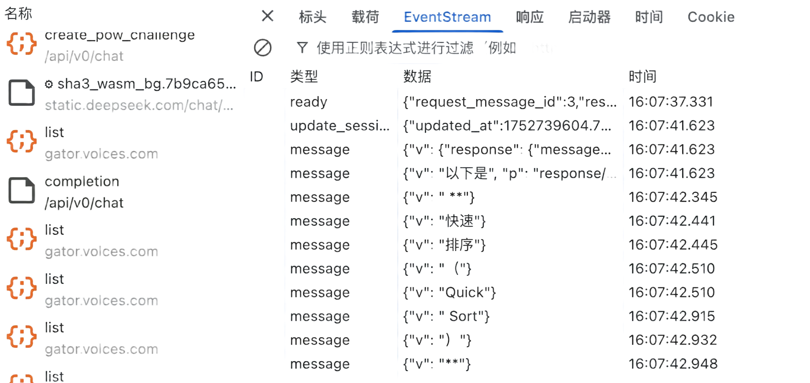
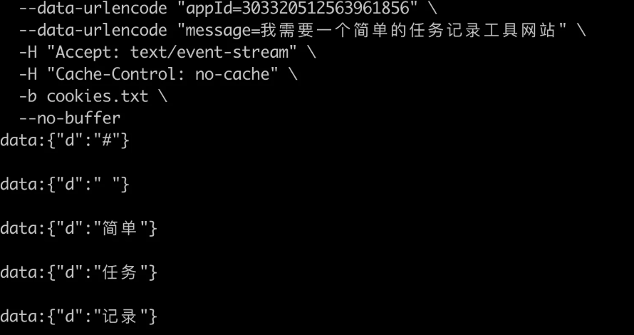
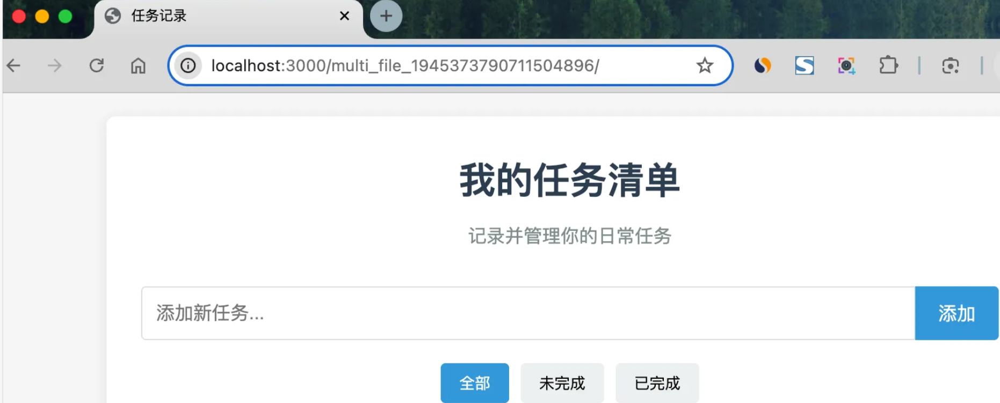
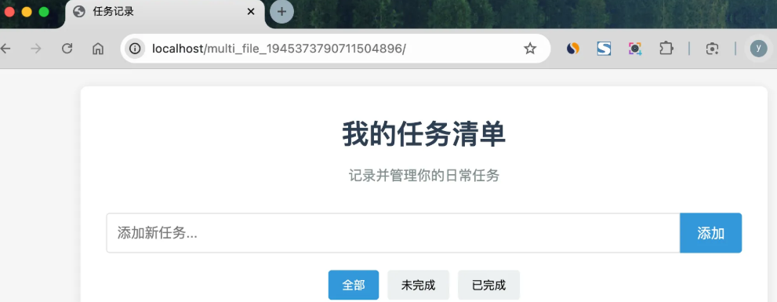

# 一、需求分析
之前我们实现‍的是单机版本，用户只能在本地生成代码文件。现在我们要将其升级为平台化系统؜，这意味着需要支持多用户、应用管理、在线部署等功能。

**需要的具体功能包括**：
- 用户基础功能

- 创建应用

- 编辑应用信息

- 删除自己的应用

- 查看应用详情

- 分页查询自己的应用列表

- 分页查看精选应用列表

- 用户高级功能

- - ⭐️ 实时查看应用效果

- - ⭐️ 应用部署

- 管理功能

- 管理所有应用（删除、查询、修改）

- 设置精选应用
# 二、方案设计
## 核心业务流程
平台化改造的核心在于 建立完整的应用生命周期管理体系。

用户在主页输入提‍示词后，系统会创建一个应用记录，然后跳转到对话页面与 AI 交互生成网站。生成完成后，用户؜可以预览效果，满意后进行部署，让网站真正对外提供服务。

## 库表设计
应用表是整‍个项目的核心，需要记录**应用的基本信息、生成配置、部署؜信息**等。

其中最关键的是 deployKey 字段。由于每个网站应用文件的部署都是隔离的（想象成沙箱），需要用唯一字段来区分，可以作为应用的存储和访问路径；而且为了便于访问，每个应用的访问路径不能太长。

app 表的建表 SQL 如下：
````
-- 应用表
create table app
(
    id           bigint auto_increment comment 'id' primary key,
    appName      varchar(256)                       null comment '应用名称',
    cover        varchar(512)                       null comment '应用封面',
    initPrompt   text                               null comment '应用初始化的 prompt',
    codeGenType  varchar(64)                        null comment '代码生成类型（枚举）',
    deployKey    varchar(64)                        null comment '部署标识',
    deployedTime datetime                           null comment '部署时间',
    priority     int      default 0                 not null comment '优先级',
    userId       bigint                             not null comment '创建用户id',
    editTime     datetime default CURRENT_TIMESTAMP not null comment '编辑时间',
    createTime   datetime default CURRENT_TIMESTAMP not null comment '创建时间',
    updateTime   datetime default CURRENT_TIMESTAMP not null on update CURRENT_TIMESTAMP comment '更新时间',
    isDelete     tinyint  default 0                 not null comment '是否删除',
    UNIQUE KEY uk_deployKey (deployKey), -- 确保部署标识唯一
    INDEX idx_appName (appName),         -- 提升基于应用名称的查询性能
    INDEX idx_userId (userId)            -- 提升基于用户 ID 的查询性能
) comment '应用' collate = utf8mb4_unicode_ci;
````
**设计细节**：

1）priority 优先级字段：我们约定 99 表示精选应用，这样可以在主页展示高质量的应用，避免用户看到大量测试内容。

为什么用数字‍而不用枚举类型呢？原因是这样更利于扩展，比如约定 999 表示置顶؜；还可以根据数字灵活调整各个应用的具体展示顺序。

2）添加索引‍：给 deployKey、appName、userId 三个经常用؜于作为查询条件的字段增加索引，提高查询性能。

注意，我们暂时‍不考虑将应用代码直接保存到数据库字段中，而是保存在文件系统里。这样可以避免数据库和文؜件存储不一致的问题，也便于后续扩展到对象存储等方案。

# 三、基础应用能力（后端）
后端开发最‍终的目标是提供接口，我们先来实现一些基础的接口，也就是؜ “增删改查”:

- 【用户】创建应用（须填写 initPrompt）
- 【用户】根据 id 修改自己的应用（目前只支持修改应用名称）
- 【用户】根据 id 删除自己的应用
- 【用户】根据 id 查看应用详情
- 【用户】分页查询自己的应用列表（支持根据名称查询，每页最多 20 个）
- 【用户】分页查询精选的应用列表（支持根据名称查询，每页最多 20 个）
- 【管理员】根据 id 删除任意应用
- 【管理员】根据 id 更新任意应用（支持更新应用名称、应用封面、优先级）
- 【管理员】分页查询应用列表（支持根据除时间外的任何字段查询，每页数量不限）
- 【管理员】根据 id 查看应用详情

## 核心功能实现：
### 创建应用
用户创建应‍用时，只需要填写初始化提示词。系统会自动生成应用名称（؜取提示词前 12 位）和默认的代码生成类型。
### 更新应用
用户更新应用时，需要进行权限校验，确保只能修改自己的应用。
### 用户删除应用
需要进行权限校验，确保只能修改自己的应用。
### 用户查看应用详情
应用查询涉‍及到关联查询用户信息，需要创建 App 的封装类，包含؜ UserVO 用户信息字段：
### 用户分页查询应用
查询请求类，主要定义了可作为查询条件的字段：
#### 注意
分页查询应用‍时，也需要额外获取创建应用的用户信息，这会涉及到关联查询多个用户信؜息，我们需要优化查询性能。优化查询逻辑如下：

- 先收集所有 userId 到集合中
- 根据 userId 集合批量查询所有用户信息
- 构建 Map 映射关系 userId => UserVO
- 一次性组装所有 AppVO，根据 userId 从 Map 中取到需要的用户信息
### 用户分页查询精选应用
用户只能在主页查询精选应用列表（还有自己的），这样主页会更干净؜；同时避免了爬虫，相当于起到了一个管理员审核的作用。
### 管理员删除应用
跟用户删除‍应用接口类似，但是管理员可以删除任意应用，可以通过权限؜注解校验权限
### 管理员更新应用
管理员可以更新‍任意应用的应用名称、应用封面和优先级，更新优先级的操作其实就是精选。
### 管理员分页查询应用
管理员比普‍通用户拥有更大的查询范围，支持根据除时间外的任何字段查؜询，并且每页数量不限。
### 管理员查看应用详情
这个接口除了权限之外，目前跟用户查看应用详情接口没有区别

# 四、应用生成（后端）
## 业务流程设计
现在我们需‍要将之前实现的 A⁡I 生成功能与应用‏管理系统进行集成。

参考大厂平台，我们的整个业务流程是：

- 用户在主页输入提示词创建应用（入库）
- 获得应用 ID 后跳转到对话页面
- 系统自动使用初始提示词与 AI 对话生成网站代码

由于应用的生成过程和 AI 对话是绑定的，我们可以提供一个名为 **chatToGenCode** 的应用生成接口，调用之前开发的 **AI 代码生成门面**完成任务，并且**流式**返回给前端。前端不需要区分用户是否是第一次和该应用对话，始终调用这个接口即可，需要怎么做都交给后端来判断。

一定要确保生成的文件能够与应用正确关联，因此这次生成的网站目录名称不再是之前的 codeType_雪花算法，而是 **codeGenType_appId**，这样就能通过 appId 查数据库获取应用信息、再根据应用信息找到对应的网站目录了。


### 服务开发
- 修改目录生成，代码保存方法，添加appId参数，ai流式生成代码后拼接的结果保存在**type_appId的目录**中
- 修改单文件和多文件生成代码并保存接口，门面类也添加appId参数

## SSE 流式接口优化
目前虽然能‍‍‍流式输出了，但其实⁡⁡⁡获取到的数据是有问‏‏‏题的！我们还要对 ؜؜؜SSE 接口进行优化，解决 2 个问题。
### 1、解决空格丢失问题
前端使用 ‍‍‍EventSo⁡u⁡r⁡ce 对接‏目前‏的接‏口时，؜会出现؜空格丢؜失问题。

解决方案是‍‍‍在后端封装数据，⁡⁡可⁡以参考 Dee‏‏pS‏eek 的做؜؜法，将؜原本的返回值封装到 JSON 中：

按照封装的思路，我们可以编写下列代码，将 Flux 额外封装成 ServerSentEvent，把原始数据放到 JSON 的 d 字段内：
````
@GetMapping(value = "/chat/gen/code", produces = MediaType.TEXT_EVENT_STREAM_VALUE)
public Flux<ServerSentEvent<String>> chatToGenCode(@RequestParam Long appId,
                                                   @RequestParam String message,
                                                   HttpServletRequest request) {
    // 参数校验
    ThrowUtils.throwIf(appId == null || appId <= 0, ErrorCode.PARAMS_ERROR, "应用ID无效");
    ThrowUtils.throwIf(StrUtil.isBlank(message), ErrorCode.PARAMS_ERROR, "用户消息不能为空");
    // 获取当前登录用户
    User loginUser = userService.getLoginUser(request);
    // 调用服务生成代码（流式）
    Flux<String> contentFlux = appService.chatToGenCode(appId, message, loginUser);
    // 转换为 ServerSentEvent 格式
    return contentFlux
            .map(chunk -> {
                // 将内容包装成JSON对象
                Map<String, String> wrapper = Map.of("d", chunk);
                String jsonData = JSONUtil.toJsonStr(wrapper);
                return ServerSentEvent.<String>builder()
                        .data(jsonData)
                        .build();
            });
}
````
再次测试，空格也会正常输出了：


### 2、主动告诉前端生成完成

在 SSE 中，当服务器关闭连接时，会触发客户端的 **onclose** 事件，这是前端判断流结束的标准方式。但是，onclose事件会在**连接正常结束（服务器主动关闭）和异常中断（如网络问题时)都触发**，前端就很难区分到底后端是正常响应了所有数据、还是异常中断了。

修改接口代码，额外追加结束事件：
````
@GetMapping(value = "/chat/gen/code", produces = MediaType.TEXT_EVENT_STREAM_VALUE)
public Flux<ServerSentEvent<String>> chatToGenCode(@RequestParam Long appId,
                                                   @RequestParam String message,
                                                   HttpServletRequest request) {
    // 参数校验
    ThrowUtils.throwIf(appId == null || appId <= 0, ErrorCode.PARAMS_ERROR, "应用ID无效");
    ThrowUtils.throwIf(StrUtil.isBlank(message), ErrorCode.PARAMS_ERROR, "用户消息不能为空");
    // 获取当前登录用户
    User loginUser = userService.getLoginUser(request);
    // 调用服务生成代码（流式）
    Flux<String> contentFlux = appService.chatToGenCode(appId, message, loginUser);
    // 转换为 ServerSentEvent 格式
    return contentFlux
            .map(chunk -> {
                // 将内容包装成JSON对象
                Map<String, String> wrapper = Map.of("d", chunk);
                String jsonData = JSONUtil.toJsonStr(wrapper);
                return ServerSentEvent.<String>builder()
                        .data(jsonData)
                        .build();
            })
            .concatWith(Mono.just(
                    // 发送结束事件
                    ServerSentEvent.<String>builder()
                            .event("done")
                            .data("")
                            .build()
            ));
}
````

# 五、应用部署（后端）
之前我们是‍‍在本‍地手动双击打开⁡⁡ HTML 文件来⁡‏‏查看网站生成效果的؜؜，但现在平‏台化了，肯定不能让用户也这么干。؜    
## 部署方案
### 1、使用 Serve 工具
这是最简单的方案，通过 Node.js 的 serve 包可以快速启动一个 web 服务器，为指定目录提供 Web 访问服务。

先安装 serve 工具：
````
npm i -g serve
````

假设 code_output 目录就是要部署的文件目录，只需要在这个目录内运行 serve 命令就能查看到目录内的网站了.


使用时，只需提‍‍‍前在服务器上启动 serve⁡⁡⁡ 服务器，就能为特定部署目录‏‏‏提供 web 服务（比如 d؜؜؜eployed），然后部署时将代码文件移动到这个目录下即可。

这种方案的优点是配置简单；缺点是依赖 Node.js 环境，需要独立启动 Web 服务进程，而且性能相对较低。

### 2、通过 Spring Boot 接口
我们可以直‍‍‍接在后端项目中⁡实⁡现⁡一个静态资‏源服‏务接‏口，输؜入部署؜路径，؜返回相应的文件：
````
@RestController
@RequestMapping("/static")
public class StaticResourceController {

    // 应用生成根目录（用于浏览）
    private static final String PREVIEW_ROOT_DIR = System.getProperty("user.dir") + "/tmp/code_output";

    /**
     * 提供静态资源访问，支持目录重定向
     * 访问格式：http://localhost:8123/api/static/{deployKey}[/{fileName}]
     */
    @GetMapping("/{deployKey}/**")
    public ResponseEntity<Resource> serveStaticResource(
            @PathVariable String deployKey,
            HttpServletRequest request) {
        try {
            // 获取资源路径
            String resourcePath = (String) request.getAttribute(HandlerMapping.PATH_WITHIN_HANDLER_MAPPING_ATTRIBUTE);
            resourcePath = resourcePath.substring(("/static/" + deployKey).length());
            // 如果是目录访问（不带斜杠），重定向到带斜杠的URL
            if (resourcePath.isEmpty()) {
                HttpHeaders headers = new HttpHeaders();
                headers.add("Location", request.getRequestURI() + "/");
                return new ResponseEntity<>(headers, HttpStatus.MOVED_PERMANENTLY);
            }
            // 默认返回 index.html
            if (resourcePath.equals("/")) {
                resourcePath = "/index.html";
            }
            // 构建文件路径
            String filePath = PREVIEW_ROOT_DIR + "/" + deployKey + resourcePath;
            File file = new File(filePath);
            // 检查文件是否存在
            if (!file.exists()) {
                return ResponseEntity.notFound().build();
            }
            // 返回文件资源
            Resource resource = new FileSystemResource(file);
            return ResponseEntity.ok()
                    .header("Content-Type", getContentTypeWithCharset(filePath))
                    .body(resource);
        } catch (Exception e) {
            return ResponseEntity.status(HttpStatus.INTERNAL_SERVER_ERROR).build();
        }
    }

    /**
     * 根据文件扩展名返回带字符编码的 Content-Type
     */
    private String getContentTypeWithCharset(String filePath) {
        if (filePath.endsWith(".html")) return "text/html; charset=UTF-8";
        if (filePath.endsWith(".css")) return "text/css; charset=UTF-8";
        if (filePath.endsWith(".js")) return "application/javascript; charset=UTF-8";
        if (filePath.endsWith(".png")) return "image/png";
        if (filePath.endsWith(".jpg")) return "image/jpeg";
        return "application/octet-stream";
    }
}
````
其实这种方式和第一种差不多，只是我们第一种是通过**运行Serve服务**去访问文件，而第二张更加简单粗暴，因为我们springboot本来就是内嵌服务器的，直接**将tomcat当做服务器**，直接将文件资源作为接口响应返回（代码由ai编写）

### 3、使用 Nginx 映射
Nginx 是专业的 Web 服务器，性能优异，功能丰富。**因此这是最推荐的生产环境方案**。
1）首先到 [Nginx 官网](https://nginx.org/en/download.html) 下载 Nginx，各个操作系统的安装包都有。

下载好 Nginx 后，找到 Nginx 配置文件 nginx.conf，Windows 系统直接到安装目录下找，Mac / Linux 系统可以通过命令查看 Nginx 配置文件位置：
````
nginx -t
````

2）修改 ‍Ng‍‍inx 配置，⁡http 块中添⁡⁡加‏ server 块؜，配置 ‏‏root 为项目部署根目录：
````
# 静态资源服务器 - 80 端口
server {
    listen       80;
    server_name  localhost;
    charset      utf-8;
    charset_types text/css application/javascript text/plain text/xml application/json;
    # 项目部署根目录
    root         /Users/yupi/Code/yu-ai-code-mother/tmp/code_deploy;
    
    # 处理所有请求
    location ~ ^/([^/]+)/(.*)$ {
        try_files /$1/$2 /$1/index.html =404;
    }
}
````
注意，Windows 系统的路径斜杠要相反，比如 C:/code/yu-ai-code-mother_live/tmp/code_deploy

上述配置中使用了 try_files 指令，能够按顺序尝试多个文件路径，从而更灵活地处理文件访问。举个例子，当访问 /app/style.css 时，会先尝试找到 /app/style.css 文件，如果不存在则返回 /app/index.html，最后才返回 404 错误，这样能够适配后续我们要生成的 Vue 单页面应用。

💡 try_files 指令的具体解释：
- /$1/$2：第一个尝试的路径
- /$1/index.html：第二个尝试的路径
- =404：如果都找不到，返回 404 错误

3）启动 Nginx，或者输入命令来重载配置：
````
nginx -s reload
````

然后直接访问 80 端口，就能看到网站了：



这种方案的‍‍‍性能最佳，最适⁡合⁡生⁡产环境；缺‏点是‏需要‏额外引؜入 N؜ginx؜ 组件。

### 最终方案
基于以上分析‍‍‍，我们最终选择了混合方案⁡⁡⁡：使用 Spring B‏‏‏oot 接口实现 AI ؜؜؜生成的网页预览，使用 Nginx 提供网站部署服务。

## 开发
部署接口接受 appId 作为请求参数，返回可访问的 URL 地址 ${部署域名}/{deployKey}。

部署流程如下:
- **参数校验**：比如是否存在 App、用户是否有权限部署该应用（仅本人可以部署）
- **生成 deployKey**：之前设计库表时已经提到了 deployKey 的生成逻辑（6 位大小写字母 + 数字），还要注意不能跟已有的 key 重复；此外，每个 app 只生成一次 deployKey，已有则不生成。
- **部署操作**：本质是将 code_output 目录下的临时文件复制到 code_deploy 目录下，为了简化访问地址，直接将 deployKey 作为文件名。

1）首先在 AppConstant 中定义常量：
````
/**
 * 应用生成目录
 */
String CODE_OUTPUT_ROOT_DIR = System.getProperty("user.dir") + "/tmp/code_output";

/**
 * 应用部署目录
 */
String CODE_DEPLOY_ROOT_DIR = System.getProperty("user.dir") + "/tmp/code_deploy";

/**
 * 应用部署域名
 */
String CODE_DEPLOY_HOST = "http://localhost";
````

2）编写部署请求类：
````
@Data
public class AppDeployRequest implements Serializable {

    /**
     * 应用 id
     */
    private Long appId;

    private static final long serialVersionUID = 1L;
}
````
3）基于上‍‍‍‍述流程，在 ⁡A⁡p⁡p⁡Ser‏vi‏ce‏ 中‏؜编写部؜署服务؜的代码؜：
````
@Override
public String deployApp(Long appId, User loginUser) {
    // 1. 参数校验
    ThrowUtils.throwIf(appId == null || appId <= 0, ErrorCode.PARAMS_ERROR, "应用 ID 不能为空");
    ThrowUtils.throwIf(loginUser == null, ErrorCode.NOT_LOGIN_ERROR, "用户未登录");
    // 2. 查询应用信息
    App app = this.getById(appId);
    ThrowUtils.throwIf(app == null, ErrorCode.NOT_FOUND_ERROR, "应用不存在");
    // 3. 验证用户是否有权限部署该应用，仅本人可以部署
    if (!app.getUserId().equals(loginUser.getId())) {
        throw new BusinessException(ErrorCode.NO_AUTH_ERROR, "无权限部署该应用");
    }
    // 4. 检查是否已有 deployKey
    String deployKey = app.getDeployKey();
    // 没有则生成 6 位 deployKey（大小写字母 + 数字）
    if (StrUtil.isBlank(deployKey)) {
        deployKey = RandomUtil.randomString(6);
    }
    // 5. 获取代码生成类型，构建源目录路径
    String codeGenType = app.getCodeGenType();
    String sourceDirName = codeGenType + "_" + appId;
    String sourceDirPath = AppConstant.CODE_OUTPUT_ROOT_DIR + File.separator + sourceDirName;
    // 6. 检查源目录是否存在
    File sourceDir = new File(sourceDirPath);
    if (!sourceDir.exists() || !sourceDir.isDirectory()) {
        throw new BusinessException(ErrorCode.SYSTEM_ERROR, "应用代码不存在，请先生成代码");
    }
    // 7. 复制文件到部署目录
    String deployDirPath = AppConstant.CODE_DEPLOY_ROOT_DIR + File.separator + deployKey;
    try {
        FileUtil.copyContent(sourceDir, new File(deployDirPath), true);
    } catch (Exception e) {
        throw new BusinessException(ErrorCode.SYSTEM_ERROR, "部署失败：" + e.getMessage());
    }
    // 8. 更新应用的 deployKey 和部署时间
    App updateApp = new App();
    updateApp.setId(appId);
    updateApp.setDeployKey(deployKey);
    updateApp.setDeployedTime(LocalDateTime.now());
    boolean updateResult = this.updateById(updateApp);
    ThrowUtils.throwIf(!updateResult, ErrorCode.OPERATION_ERROR, "更新应用部署信息失败");
    // 9. 返回可访问的 URL
    return String.format("%s/%s/", AppConstant.CODE_DEPLOY_HOST, deployKey);
}
````
这个实现的优点在于支‍‍‍‍持重复部署。如果应用已经有 deplo⁡⁡⁡⁡yKey，就直接使用现有的；如果没有，‏‏‏‏就生成一个新的。这样既保证了 URL ؜؜؜؜的稳定性，又支持了代码的更新。缺点是不支持区分同一个应用多次部署的版本。

4）编写部署接口：
````
/**
 * 应用部署
 *
 * @param appDeployRequest 部署请求
 * @param request          请求
 * @return 部署 URL
 */
@PostMapping("/deploy")
public BaseResponse<String> deployApp(@RequestBody AppDeployRequest appDeployRequest, HttpServletRequest request) {
    ThrowUtils.throwIf(appDeployRequest == null, ErrorCode.PARAMS_ERROR);
    Long appId = appDeployRequest.getAppId();
    ThrowUtils.throwIf(appId == null || appId <= 0, ErrorCode.PARAMS_ERROR, "应用 ID 不能为空");
    // 获取当前登录用户
    User loginUser = userService.getLoginUser(request);
    // 调用服务部署应用
    String deployUrl = appService.deployApp(appId, loginUser);
    return ResultUtils.success(deployUrl);
}
````


