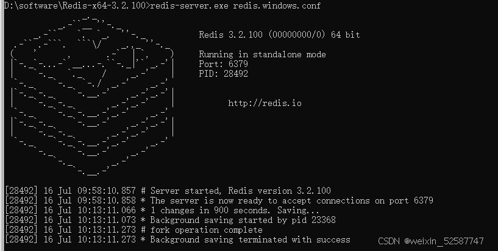

1.在redis安装目录里面点击redis-server开启redis服务，保证redis开启了，如果双击后闪退了，说明后台可能redis已经挂着了，这时候我们可以点击redis-cli,然后输入shutdown来结束redis进程，然后exit退出。如果有密码的话，可能会报错没有权限，这时候我们就使用auth password(自己的密码)获取权限后再用上面步骤就可以了

2.保证了redis已经开启了以后，还是连接不了，可能是spring的配置出了问题，要注意如果你没有密码的话，就不要在yml配置密码，注释掉，不然创建RedissonClient客户端的时候会解析RedisProperties配置成""空字符串导致启动报错，正常是需要解析成null，有密码就配置密码

3.注意：`spring.Session. store type: redis` 是配置session的存储为redis。`spring.Session.timeout`是配置session的过时时间。

```
redis:
  database: 1
  host: localhost
  port: 6379
  timeout: 5000
  password: xxxx
```

是配值我们要连接哪个redis库

4.如果以上都不行，就重新下载一个，然后按以上步骤吧，记得最好要设置密码。设置密码的语法是在redis的安装目录里面cmd，然后`config set requirepassword XXXX`,获取密码的语法是`config get requirepassword`,我的redis密码是`293928`。

Redis 5.0.14 下载：
链接：https://pan.baidu.com/s/1XcsAIrdeesQAyQU2lE3cOg
提取码：vkoi
redis 管理工具 quick redis：https://quick123.net/


注意：redis设置密码后每次关掉服务再开启是密码都会失效，我们要重新设置密码。

**解决方法**

**方式一**

进去redis-cli,运行命令：set config requirepass XXX，重新设置密码

缺点：每次重启都要重新设置密码

**方式二：修改配置文件（推荐）**

在redis目录下**redis.windows.conf**文件找到requirepass，追加一行，输入requirepass root，即为登录密码，重启redis服务再登录即可。

> \# requirepass foobared
> requirepass root //root为设置的密码

设置redis启动时加载配置文件的命令如下：

> redis-server.exe redis.windows.conf
> 
> 设置密码以后，每次开启redis要输出 `redis-server.exe redis.windows.conf` ,感觉挺麻烦的，我们可以使用bat批处理来完成配置开启。
新建一个以.bat 为结尾的文件并输入以下内容，其中`Redis_home=`后是你的Redis安装目录

将该文件放到你redis安装目录下

> set Redis_home=redis安装目录
> echo %Redis_home%
> %Redis_home%\redis-server.exe %Redis_home%\redis.windows.conf

后面直接双击该批处理文件即可

注意引入redis要引入redis对应的springbootstart依赖，不然没法存储redis,但yml却能够配置
