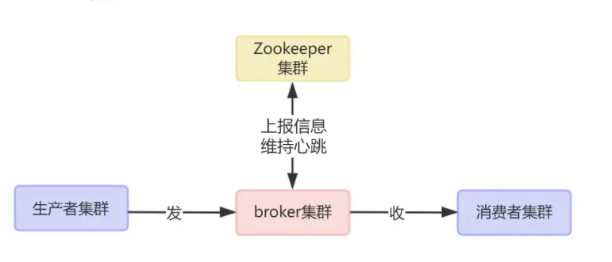
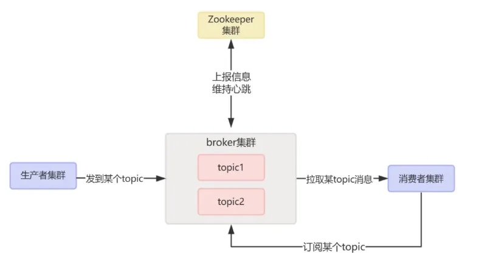
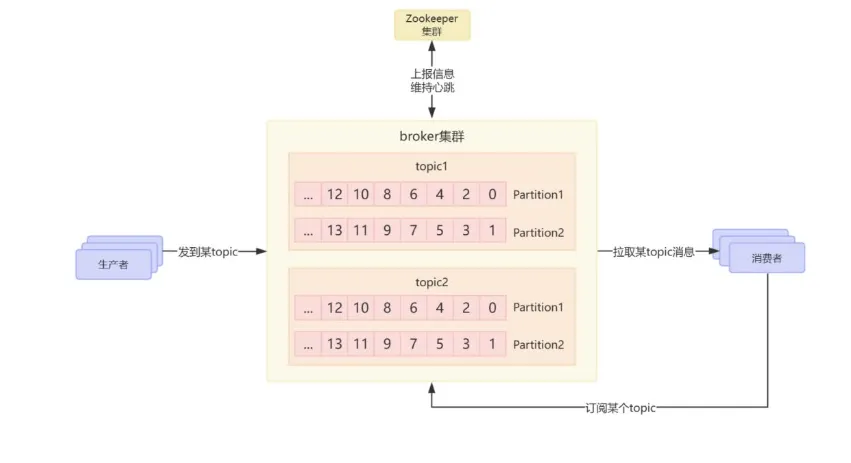
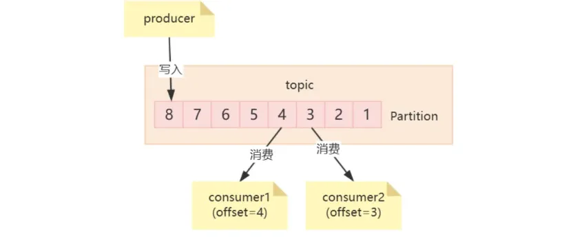
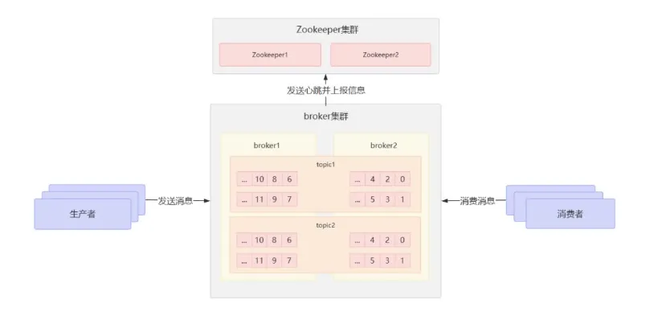
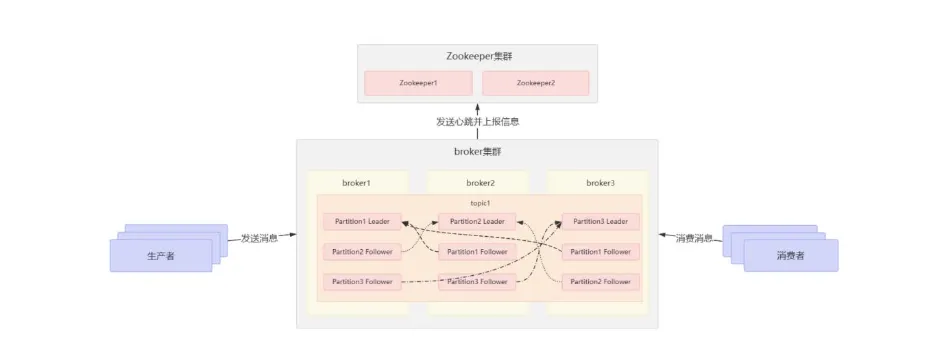
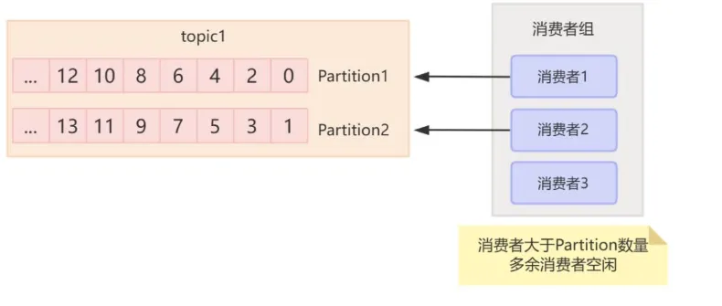
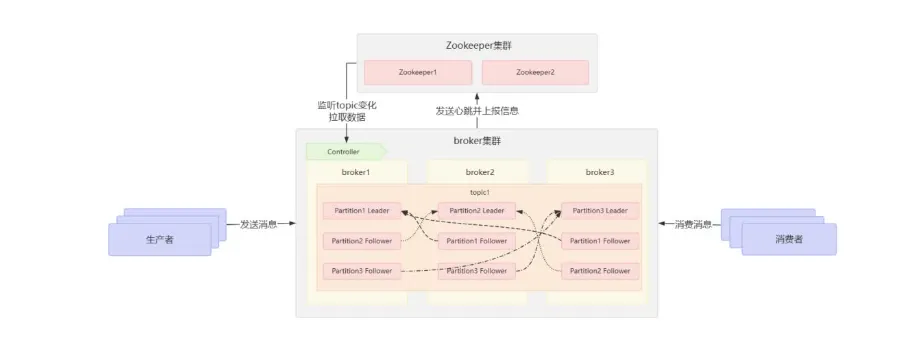

# Kafka
## 问题
问题写代码基本都用过各种mq,有没有考虑过：

● kafka的架构是什么样的?

● 多副本机制又是个啥?

● 为啥要有多副本机制?

● zk或kraft有什么用呢?

● kafka的工作流程是啥样的呢?
### 整体结构
整体结构一个Kafka整体结构包括生产者集群、消费者集群、broker集群、以及一个ZK集群.

● 生产者就是发消息的

● 消费者就是收消息的

● broker可以理解为是kafka本身,负责接收生产者的消息,并持久化到磁盘,处理消费者的拉取请求.

● zk就是一个注册中心,用来管理broker集群,保存topic和Partition路由信息等等.

● kafka新版本出了一个kraft,用来替代zk作为注册中心用,本质其实都是一样的.
## 基本概念
### topic
因为消息有很多不同的类型啊,所以broker中会通过topic去分类.生产者把不同类型的消息发到对应的topic,消费者订阅对应的topic,然后进行消费.

### Partitiontopic
实际上是一个逻辑上的分类的概念,从存储消息角度来看, topic内部其实是分区也就是Partition.

Partitiontopic实际上是一个逻辑上的分类的概念,从存储消息角度来看, topic内部其实是分区也就是Partition.

### offset
一条消息可以被多个消费者消费,那么问题来了,怎么知道每个消费者消费到哪儿了呢?

所以Partition中每条消息都有一个唯一标识,叫偏移量,也就是offset,就一个单调递增的整数,所以记录offset就能知道消费到哪儿了.

### 集群
如果一个topic对应的队列都在同一台机器上，那么这个机器I/O将会成为这个topic的性能瓶颈.那咋办呢?

● 其实一个topic下可以有多个partition,每个partition只存一部分数据.

● broker是做集群的,一个topic下的不同partition可以分布到不同的broker节点上.这就解决了单机性能瓶颈.

● 但是Kafka只能保证同一个partition内的消息是有序的,不同partition间消息的顺序性无法保证.

## 多副本机制
那么问题来了,刚说了,每个partition都只存一部分数据,那如果broker挂了,那存的这部分数据不就丢失了? Kafka是怎么保证高可用呢?

kafka提供了多副本机制,每个Partition的数据都会同步到其它broker节点上,那每一个Partition在其他broker上就有了多个副本.

然后副本会选一个leader出来,让leader去和生产者消费者交互,leader收到写请求,它就会把数据同步给所有的副本.收到读请求,直接读leader的数据.读写都是leader,其他副本都是备份.

这其实就是主从,严谨一点说应该是主备的概念.只不过kafka这里做的是Partition层面的主备,而不是broker层面的主备.

那为啥不读Follower副本呢?

● 如果读Follower Partition的话,上次读这个Follower Partition,下次读那个Follower Partition, offset就很难管理了.
### 消费者组
那一个topic下有多个分布到不同broker节点上的Partition,这么多个Partition,如果只有一个消费者慢慢消费,有点慢吧.那咋办呢?

● 多个消费者可以组成一个消费者组,然后一个消费者组内的消费者就可以并行地消费一个topic中的Partition了.

● 注意, topic中的一个Partition,只能被一个消费者组的一个消费者消费.

● 如果说消费者组内消费者数量超过Partition数量,多余的消费者就空闲了,就不能消费了.

### 工作流程

那么问题又来了,那么多个broker,生产者发消息的时候,怎么知道应该发给哪个broker呢,消费者获取消息的时候,怎么知道应该从哪个broker中获取消息呢? kafka的工作流程是什么样子的呢?

● broker集群定时向注册中心发送心跳包,上报自身信息.zk掌管了所有broker, topic和Partition信息.

● Broker中会选举出一个大哥,叫Controller,它会监听zk中的topic变化.一旦topic变化, controller就会从zk中拉取最新数据,然后广播给其他broker,所以每个broker中都会存储最新的集群路由表.

● 生产者通过访问broker就能获取到路由信息,根据配置的分区策略,把消息直接发送给目标topic的leader Partition对应的Broker. Broker接收到消息后,写入到Partition末尾,并分配一个offset.然后leader会同步数据给自己的副本.

● 消息的消费者通过访问broker,就能获取到订阅的这个topic的路由信息,就能知道应该去哪个broker去拉取消息了.通过自己记录的最新offset就可以读取消息了.

如果你把这几个mq设计思想的文章看完,就会发现不同mq的实际设计细节都不太一样,但是核心思想都差不多.