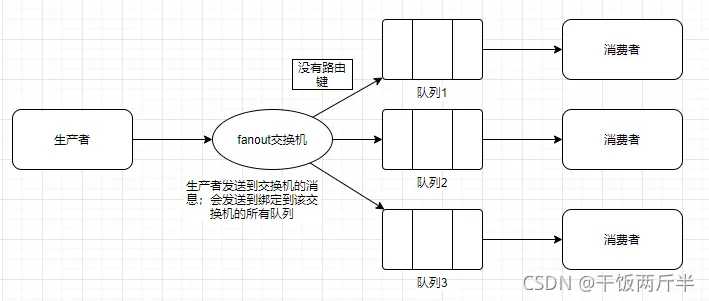
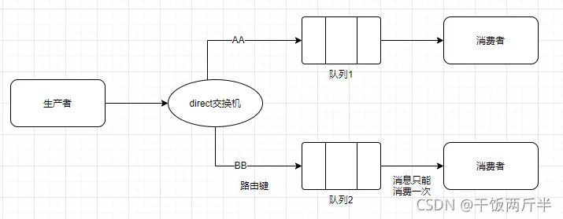
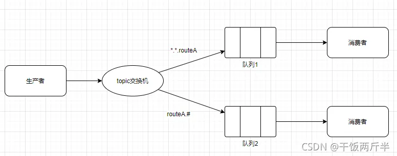
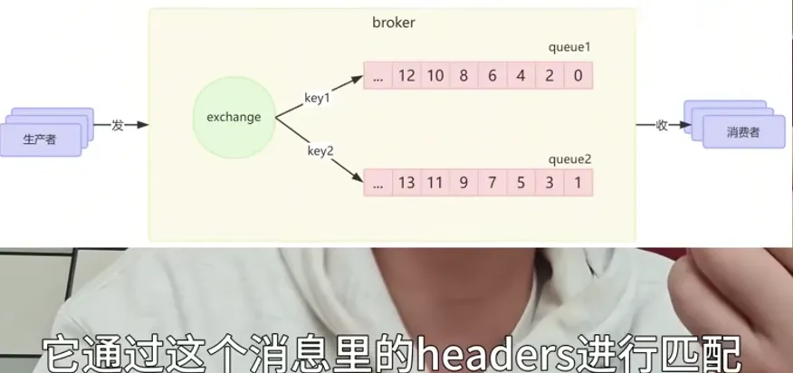
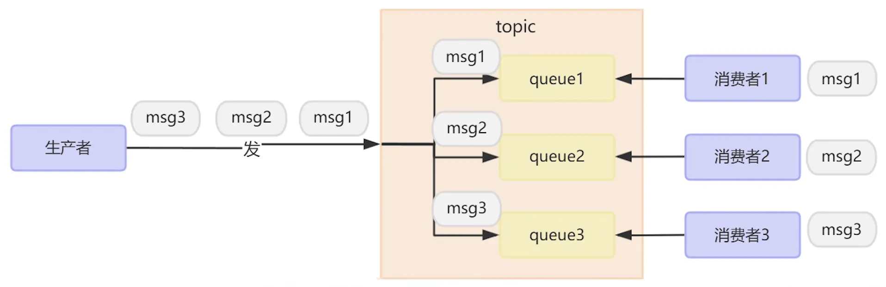
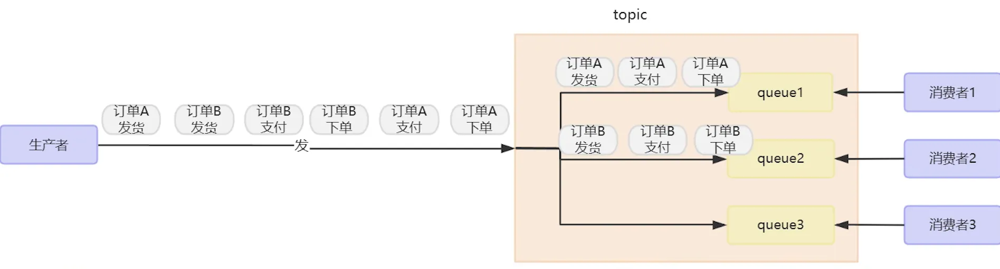
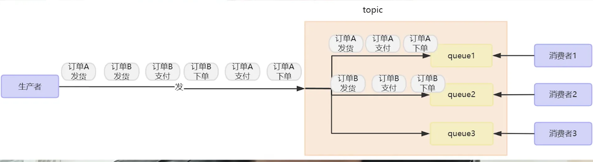

# RabbitMQ
## rabbitMQ整体结构：

**生产者**：发消息的

**消费者**：收消息的

**broker**: 可以理解为RabbitMQ本身，负责接收生产者的消息，将生产者的消息持久化到磁盘，将消息发送给消费者。
### 交换机和队列：
RabbitMQ为了消息的灵活路由，设计了交换机，交换机通过bindingkey和队列进行绑定，将消息路由到对应的队列中。然后消费者去监听队列。

#### 四种交换机：
**扇出（Fanout）**：忽略路由键，发送到所有绑定交换机的队列。

**直连（Direct）**：发送到绑定交换机且路由键一样的队列。

**主题（Topic）**：和Direct差不多一样，但不一样的是交换机绑定队列时路由可以使用通配符，比较灵活。

**例子:**
```
图中队列1绑定的路由键是 ..routeA
图中队列2绑定的路由键是 routeA.#
生产者向该交换机的routeA.xxx.routeA路由键发送消息；那么队列1和2都会收到消息
(send(exchange,routingkry,msg))
```

**头(Headers)**:不依赖绑定队列，通过消息的headers去匹配（很麻烦）。

#### 如果RabbitMQ只部署一个节点会有什么问题？
会出现单点故障的问题

**解决方法？**

集群!

**rabbitMQ两种集群模式：**

**普通集群**：只同步元数据，队列数据只在主节点有（比如发给节点2，节点2通过元数据将消息转发主节点，目的是为了负载君合，无法实现真正的可用性）

**镜像集群**：同步完整镜像，然后可以主节点读写，从节点作为备份（和kafka的副本节点差不多）

### 可靠性（消息丢失）：
**消息丢失的场景？**

● broker将消息从生产者发送到队列丢失

● 在队列自己丢失了（宕机）

● broker将消息发送到消费者丢失/消费者拿到消息还没来得及消费线程就挂了（没有消费）

**解决办法：**

● **开启生产者ACK机制**，MQ收到消息给生产者返回一个ACK，确保MQ收到消息

● **开启MQ持久化**，将消息持久化到磁盘，MQ宕机重启也能恢复消息，同时使用镜像集群兜底。

● **开启消费者手动ACK机制**，消费者成功消费返回ACK，失败进行重试。（重试分为本地重试和重试队列重试，本地重试指的是使用spring retry去消费者线程进行重试，而重试队列是发送到一个重试队列进行延迟重试（ttl+死信），最终重试失败就发到最终死信队列;本地重试有问题因为如果队列没了消息还是会没，所以这里要选择重试队列）

### 消息重复消费：
**核心思路**：实现消费者的幂等性。

● 通过消息唯一id+redis sex nx进行实现（生成消息唯一id去redis查有没有，这里使用setnx是保证has+set的原子性）。

● 通过唯一索引保证幂等。

### 消息堆积：
**产生消息堆积原因**：
当生产者发送消息的速度超过了消费者处理消息的速度, 或者如果消费者因为某些原因持续阻塞，就会导致队列中的消息堆积，直到队列存储消息达到上限。最早接收到的消息，可能就会成为死信，会被丢弃，这就是消息堆积问题

**解决消息堆积：**

● **增加更多消费者**，提高消费速度

● **提高单个消息者的处理能力**, 在消费者内开启线程池加快消息处理速度
缺点: 消息太多就会开启太多新线程, cpu压力大

#### 如果是bug导致几百万消息持续积压几小时。有如何处理呢？
1. 先修复consumer消费者的bug，以确保其恢复消费速度，然后将现有consumer都停掉
2. 新建一个topic, partition是原来的10倍，临时建立好原先10倍的queue数量
3. 然后写一个临时的分发数据的consumer程序，这个程序部署上去消费积压的数据，消费之后不做耗时的处理，直接均匀轮询写入临时建立好的10倍数量的queue
4. 接着临时征用10倍的机器来部署consumer,每一批consumer消费一个临时queue的数据
5. 这种做法相当于是临时将queue资源和consumer资源扩大10倍，以正常的10倍速度来消费数据
6. 等快速消费完积压数据之后，得恢复原先部署的架构，重新用原先的consumer机器来消费消息

### 消息顺序性：
**有序性产生原因**：如果将消息发送到一个topic下的不同队列，多个消费者一起消费就会产生顺序性问题。

#### 有序性分为：
**全局有序**：保证所有消息都是顺序消费

**局部有序**：比如保证同一个订单的下单，支付，发货消息有序

#### 解决办法：
**全局有序**：只能通过消息路由算法，将消息全部路由到一个队列，然后单消费者串行消费

**局部有序**：将需要保证局部顺序的消息路由到一个队列中，然后一个队列一个消费者去消费（顺序队列只能做本地重试）
