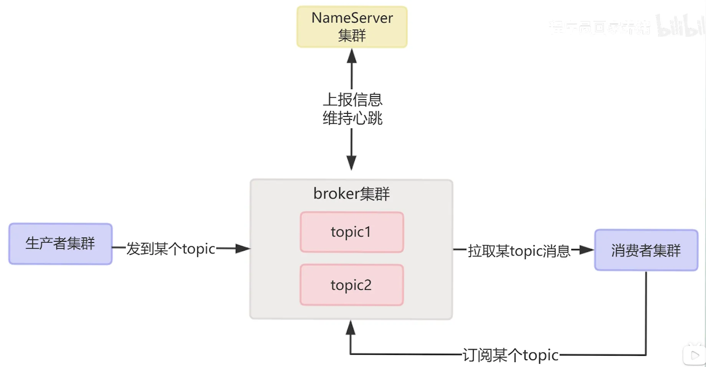
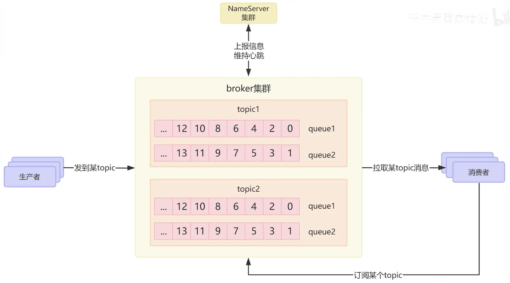
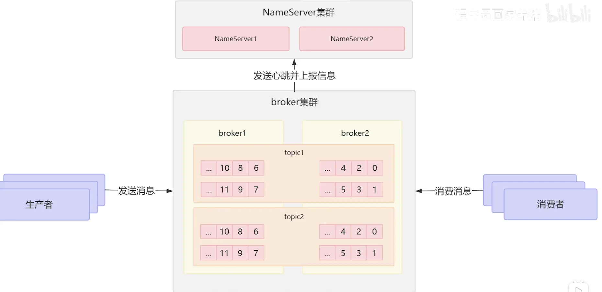
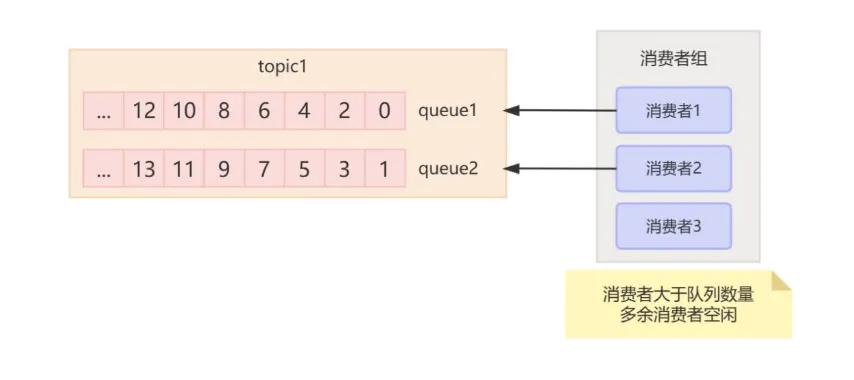
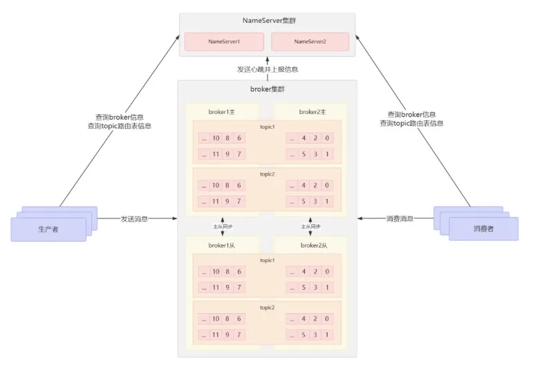

# RocketMQ
### 问题

写代码基本都用过各种mq,有没有考虑过rocketmq的架构是什么样的?

● NameServer是个啥?

● NameServer有啥用呢?

● rocketmq高可用怎么做的?

● 和kafka有啥区别?

● rocketMQ工作流程是啥样的呢?

### 整体结构：
一个RocketMQ整体架构包括生产者集群，消费者集群，broke集群和NameServer集群。

**生产者**：发消息的

**消费者**：收消息的

**broker**: 可以理解为RocketMQ本身，负责接收生产者的消息，将生产者的消息持久化到磁盘，将消息发送给消费者。

**NameServer**: 本质上是一个轻量级的注册中心，用来管理brokre集群，管理topic等。（和Kafka使用的Zookpper类似）

### topic
因为消息会有很多种类型，所以RocketMQ使用topic来区分不同的消息，生产者将不同的消息发到不同的topic,消费者订阅不同的topic进行消费，说白了topic就是逻辑上的一个分类的概念（可以了解为rabbitMQ的通配符）

### 队列
topic实际上是一个逻辑上的分类的概，从存储消息角度来看, topic内部是多个队列.这里的队列,在kafka中叫做Partition.本质都是一样的

### offset
RocketMQ中，为了解决消费进度的持久化与恢复问题，所以需要让消费者知道消费到哪里了，所以队列里的每个消息都会分配一个偏移量，也就是offset,一个单调递增的整数。纪录offset就能知道消费到哪里了。
### tag
tag就在在同一个topic下对消息进行更细致的一个分类，消费者可以通过tag对消息进行过滤。
## 高可用：
### 集群
如果一个topic对应的队列都在同一台机器上，那么这个机器I/O将会成为这个topic的性能瓶颈.那咋办呢?

● 其实一个topic下可以有多个队列,每个队列都只存一部分数据.

● broker是做集群的,一个topic下的不同队列可以分布到不同的broker节点上.这就解决了单机性能瓶颈.

● 但是RocketMQ只能保证同一个队列内的消息是有序的,不同队列间消息的顺序性无法保证.

### 主从
那么问题来了,刚说了,每个队列都只存一部分数据,那如果broker挂了,那存的这部分数据不就丢失了? RocketMQ是怎么保证高可用呢?

● RocketMQ的高可用和kafka的多副本机制类似,但不一样.kafka的多副本是对Partition做多个副本.

● 但是RocketMQ实际是对broker做主从,也就是对broker做副本.主节点负责处理读写请求,从节点会同步主节点的数据.主节点挂了,就需要在从节点中选择一个转从为主.

### nameserver
那么问题又来了,那么多个broker,生产者发消息的时候,怎么知道应该发给哪个broker呢,消费者获取消息的时候,怎么知道应该从哪个broker中获取消息呢?

所以这时候就需要一个注册中心,来专门管理broker集群,这就是NameServer.

这个NameServer说白了就这么几个作用.

● 第一个保存集群状态信息,通过broker定时上报心跳,来实时感知节点上下线.

● 第二个负责集群负载均衡,故障转移.

● 第三个,掌管消息路由,让生产者知道消息应该发给哪个broker,让消费者知道应该从哪个broker上取消息.

那为了保证NameServer的高可用,它自身也得做集群.
## 生产消费者组
### 消费者组
那一个topic下有多个分布到不同broker节点上的队列,这么多个队列,如果只有一个消费者慢慢消费,有点慢吧.那咋办呢?

● 多个消费者可以组成一个消费者组,然后一个消费者组内的消费者可以并行地消费一个topic中的队列.

● 注意, topic中的一个队列,只能被一个消费者组的一个消费者消费.

● 如果说消费者组内消费者数量超过队列数量,多余的消费者就空闲了,就不能消费了.

### 生产者组
都有消费者组了,有没有生产者组呢?

有的有的, RocketMQ中把相同业务逻辑的生产者可以分为一组,就是生产者组.

但是kafka中是没有生产者组的概念的,为啥呢?

因为kafka追求高吞吐量,所以kafka的生产者只发消息,不关心消息被谁消费了,也不关心消息状态.

RocketMQ主要设计用来发订单,交易信息这种重要消息,所以它提供事务机制,生产者需要与Broker进行多次交互,发送半消息、提交/回滚事务, Broker就需要知道来自同一个业务的所有生产者,方便进行协调.
#### 工作流程

● broker集群定时向nameServer发送心跳包,上报Topic和队列信息.

● NameServer在内存中维护着一张路由表，记录了每个Topic到Broker集群的映射关系，以及每个Broker上消息队列的详细配置.

● 生产者通过访问NameServer就能获取到消息的路由信息,然后发送给对应的Broker. Broker接收到消息后,会持久化到磁盘,然后同步数据给从节点.

● 消息的消费者通过访问NameServer,就能获取到订阅的这个topic的路由信息,就能知道应该去哪个broker去拉取消息了