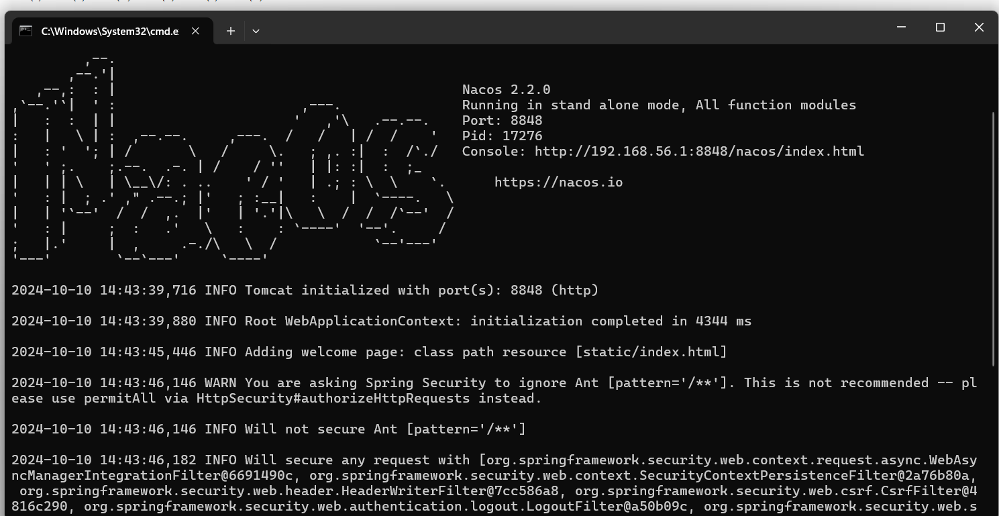

1.nacos介绍：nacos是阿里巴巴提供的一套微服务的配置中心，用来集中管理微服务的各个模块。

2.到官网下载：[Release 2.2.0 (Dec 14, 2022) · alibaba/nacos · GitHub](https://github.com/alibaba/nacos/releases/tag/2.2.0)

3.下载解压成功后进入bin目录，启动：

```
startup.cmd -m standalone
```


出现这样说明nacos成功启动，此时nacos启动在本机的8884端口，复制启动信息的console即nacos的可视化平台连接然后访问，默认账号密码都为nacos.