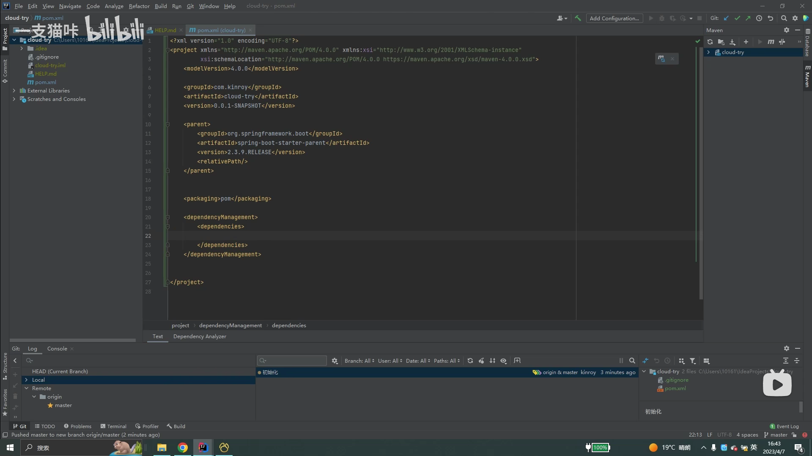
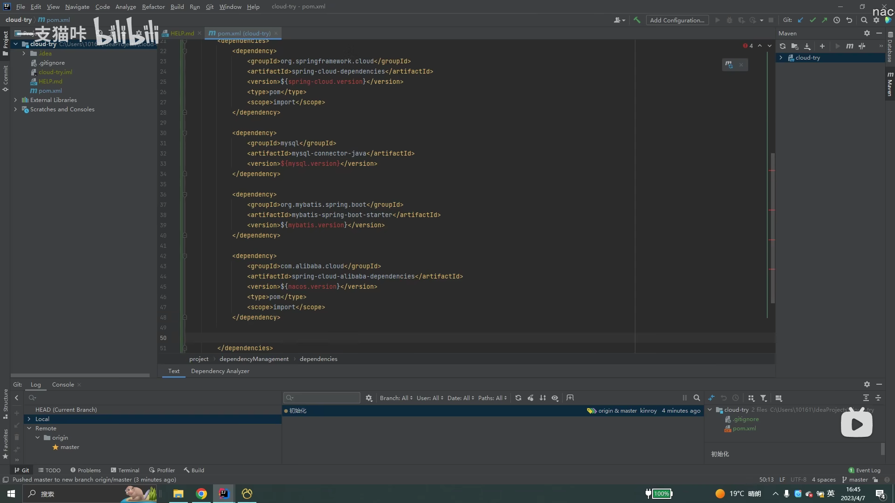
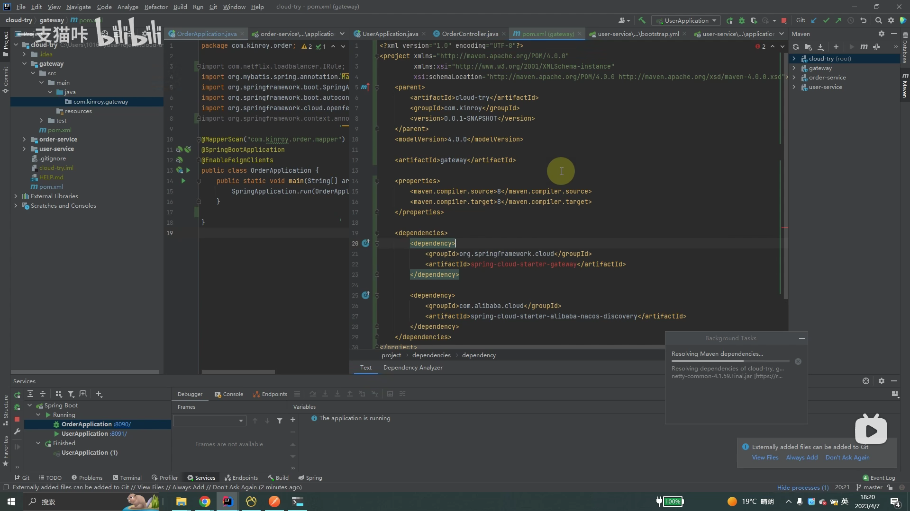
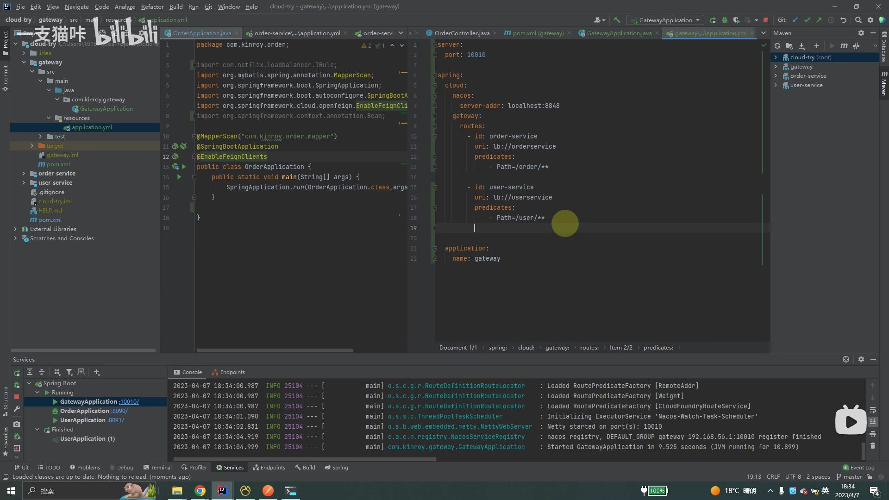
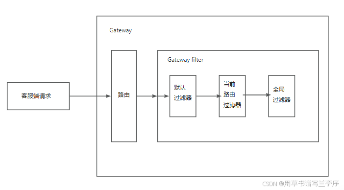
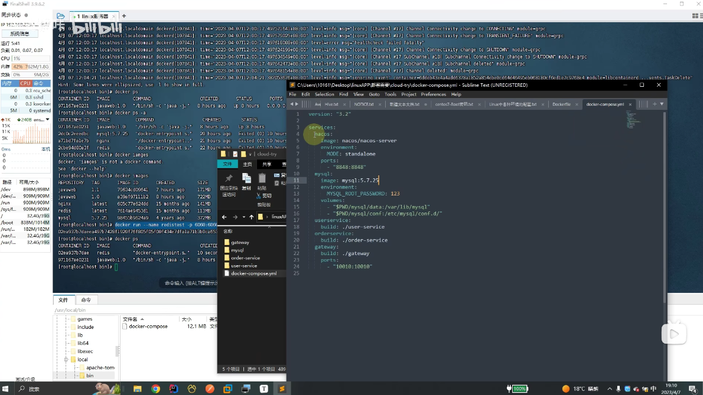
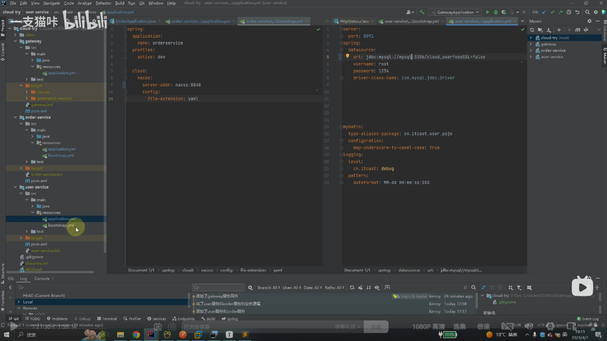

# 创建微服务过程


### 1.创建父工程

首先我们要先创建一个父工程，并导入springboot的起步依赖，然后指定打包方式为pom方式打包。

1.在<dependencyManager> <dependencies> 中导入一些重要然后要统一版本而又模块不一定都需要的依赖，比如：

spring-clould , mysql, mybatis,和nacos,swagger,knif4j版本我们可以通过<properties>中写<xx.version>来定义版本号


2.然后在<dependencyManager>下面继续写一个<dependencies>然后写一些子模块必须要的依赖，比如lombok.

3.biuld打包插件依赖

```
<build>
        <pluginManagement>
            <plugins>
                <plugin>
                    <groupId>org.apache.maven.plugins</groupId>
                    <artifactId>maven-compiler-plugin</artifactId>
                    <version>3.8.1</version>
                    <configuration>
                        <source>11</source> <!-- depending on your project -->
                        <target>11</target> <!-- depending on your project -->
                    </configuration>
                </plugin>
            </plugins>
        </pluginManagement>
    </build>
```

至此我们的父工程就算简单的搭建好了，我们就可以开始创建子模块了。


### 2.创建子工程

一般我们一个微服务最常见的模块有：user模块（创建springboot），common模块（创建module因为不用写业务代码只需要提供一些公共模块），api模块（用来提供后端内部调用的接口，通过feignClient），auth权限校验模块（用于校验登录态），gateway模块（用来转发，限流啥的模块）和其他业务模块。我们创建完子模块后，要导入父工程的<parent>，这样子模块就被父工程管理了，实现了依赖继承;同时我们应该在父工程的<module>导入子模块，这样子模块之间就实现了聚合。这样只要我们一执行父模块install时，所有子模块也会同时进行打包，轻松实现项目的一键构建（清理、编译、测试、打包、安装等）。

**在创建子模块的，基本必导的几个依赖：**

1.父模块管理的依赖：web,mysql,mybatis,nacos-discovery,nacos-config。openfeign.

```
1.discovery用于服务注册，将想要注册的服务注册到nacos中，被naocs发现。
2.config用于获取nacos配置管理->配置列表下配置文件中的内容
注意nacos的版本要和springboot的版本严格匹配，不然可能会报错。
```

2.打包插件，也就是上面父工程的build的依赖。


**子模块的yml文件：**

1.配置application.yml文件：该文件是配置一些写死的内容，比如database，port.

2.配置bootstrap.yml文件：

```
spring.application.name 项目名称

profile.active: 项目的环境，如果没有写就是默认local或者dev都加载

spring.cloud.nacos.config.server-addr 配置Nacos服务的地址。从这个地址的配置中心获取配置

spring.cloud.nacos.config.file-extension 配置中心数据的内容格式
```


```
用途：主要用于应用程序的引导阶段配置，特别是与Spring Cloud相关的配置，如配置中心（Config Server）的地址。它的内容在应用程序的上下文初始化之前被加载，适合配置那些需要在Spring应用上下文启动之前就需要读取的属性，比如用来配置从何处加载主配置文件的地址。
加载时机：bootstrap.yaml 文件比application.yaml更早加载，它在应用程序的引导阶段就被处理，用于应用程序上下文初始化之前的配置，比如配置中心的配置。
用途示例：当使用Spring Cloud Config Server来集中管理配置时，你需要在bootstrap.yaml中配置Config Server的地址，这样Spring Cloud会先从Config Server获取配置信息，再初始化Spring Boot应用。
```


### 3.**gateway摸块：**

#### 引入依赖：

我们前端在发请求的时候，肯定不可能根据请求什么模块去输入对应的**ip:端口**，这样前端不得打我们，所以我们需要一个网关，让前端请求这个官网，然后根据一些断言，让网关路由到对应的模块。

首先我们要先引对应的依赖：

我们需要引两个最基础的依赖就是网关依赖还有nacos-discovery(让网关发现我们)。

#### yml文件配置：

然后我们要在yml文件（bootstarp.yml也行）中定义服务的port端口，nacos的服务名，addr，以及网关的断言(路由到什么模块)，还可以配置一些其他的，比如拦截器，限流啥的。


补充：

```
注意lb://XX表示已负载均衡的方式路由到对应的服务名，网关会根据对应的服务名去nacos寻找真正的ip+端口

SpringCloudGateWay中，有三种过滤器：

默认过滤器default-filters

只对具体某个路由生效的局部过滤器filters

使用java代码编写的全局过滤器GlobalFilter（在gateway模块编写，继承GlobalFilter接口）
```


**三个拦截器执行顺序：**




#### 利用gateway解决跨域问题：

#### **方式一：配置application.yml文件：**

```
spring:
  cloud:
    gateway:
      globalcors: # 全局的跨域配置
        add-to-simple-url-handler-mapping: true # 解决options请求被拦截问题
               # options请求 就是一种询问服务器是否浏览器可以跨域的请求
               # 如果每次跨域都有询问服务器是否浏览器可以跨域对性能也是损耗
               # 可以配置本次跨域检测的有效期maxAge
               # 在maxAge设置的时间范围内，不去询问，统统允许跨域
        corsConfigurations:
          '[/**]':
            allowedOrigins:   # 允许哪些网站的跨域请求 
              - "http://localhost:8090"
            allowedMethods:   # 允许的跨域ajax的请求方式
              - "GET"
              - "POST"
              - "DELETE"
              - "PUT"
              - "OPTIONS"
            allowedHeaders: "*"  # 允许在请求中携带的头信息
            allowCredentials: true # 允许在请求中携带cookie
            maxAge: 360000    # 本次跨域检测的有效期(单位毫秒)
                  # 有效期内，跨域请求不会一直发option请求去增大服务器压力
```

#### **方式二：使用编码方式定义配置类：**

```
import org.springframework.context.annotation.Bean;
import org.springframework.context.annotation.Configuration;
import org.springframework.http.HttpHeaders;
import org.springframework.http.HttpMethod;
import org.springframework.http.HttpStatus;
import org.springframework.http.server.reactive.ServerHttpRequest;
import org.springframework.http.server.reactive.ServerHttpResponse;
import org.springframework.web.cors.reactive.CorsUtils;
import org.springframework.web.server.ServerWebExchange;
import org.springframework.web.server.WebFilter;
import org.springframework.web.server.WebFilterChain;
import reactor.core.publisher.Mono;
 
@Configuration
public class CorsConfig {
    private static final String MAX_AGE = "18000L";
 
    @Bean
    public WebFilter corsFilter() {
        return (ServerWebExchange ctx, WebFilterChain chain) -> {
            ServerHttpRequest request = ctx.getRequest();
            // 使用SpringMvc自带的跨域检测工具类判断当前请求是否跨域
            if (!CorsUtils.isCorsRequest(request)) {
                return chain.filter(ctx);
            }
            HttpHeaders requestHeaders = request.getHeaders();                                  // 获取请求头
            ServerHttpResponse response = ctx.getResponse();                                    // 获取响应对象
            HttpMethod requestMethod = requestHeaders.getAccessControlRequestMethod();          // 获取请求方式对象
            HttpHeaders headers = response.getHeaders();                                        // 获取响应头
            headers.add(HttpHeaders.ACCESS_CONTROL_ALLOW_ORIGIN, requestHeaders.getOrigin());   // 把请求头中的请求源（协议+ip+端口）添加到响应头中（相当于yml中的allowedOrigins）
            headers.addAll(HttpHeaders.ACCESS_CONTROL_ALLOW_HEADERS, requestHeaders.getAccessControlRequestHeaders());
            if (requestMethod != null) {
                headers.add(HttpHeaders.ACCESS_CONTROL_ALLOW_METHODS, requestMethod.name());    // 允许被响应的方法（GET/POST等，相当于yml中的allowedMethods）
            }
            headers.add(HttpHeaders.ACCESS_CONTROL_ALLOW_CREDENTIALS, "true");          // 允许在请求中携带cookie（相当于yml中的allowCredentials）
            headers.add(HttpHeaders.ACCESS_CONTROL_EXPOSE_HEADERS, "*");                // 允许在请求中携带的头信息（相当于yml中的allowedHeaders）
            headers.add(HttpHeaders.ACCESS_CONTROL_MAX_AGE, MAX_AGE);                           // 本次跨域检测的有效期(单位毫秒，相当于yml中的maxAge)
            if (request.getMethod() == HttpMethod.OPTIONS) {                                    // 直接给option请求反回结果
                response.setStatusCode(HttpStatus.OK);
                return Mono.empty();
            }
            return chain.filter(ctx);                                                           // 不是option请求则放行
        };
    }
 
}
```


### 4.替换一些yml文件配置，进行项目部署

我们部署前需要写一个docker compose.yml文件（首先要将docker和dockercompose容器下载下来）

修改微服务各模块依赖的数据库，nacos，redis等配置**ip**，修改为上面compose文件的名字,因为我们不一定是在本机上部署全部东西。

最后将项目打包成jar包，然后拖到服务器里面，运行dockercompose.yml文件就可实现一键部署，具体看docker的笔记。
