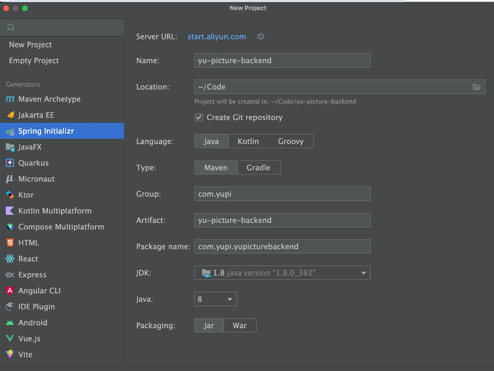
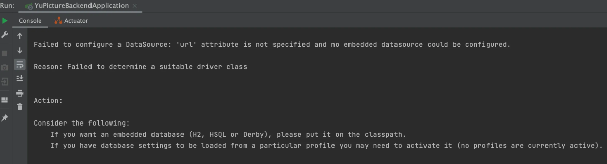
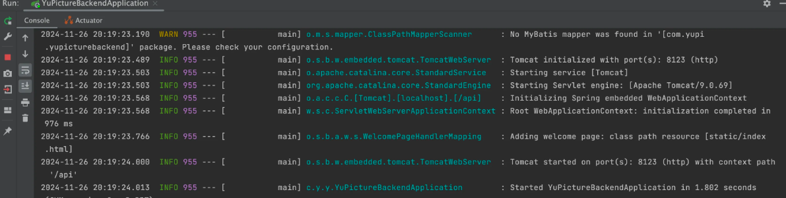
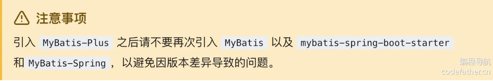
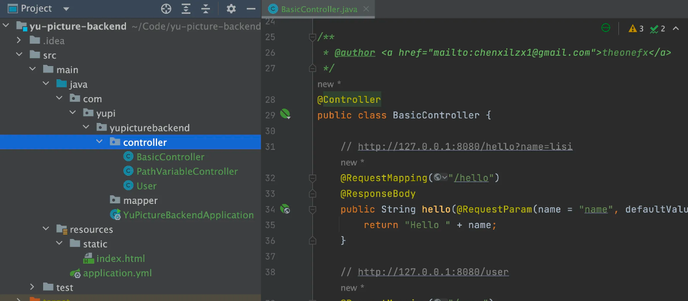
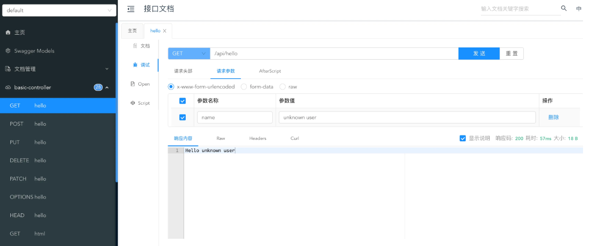
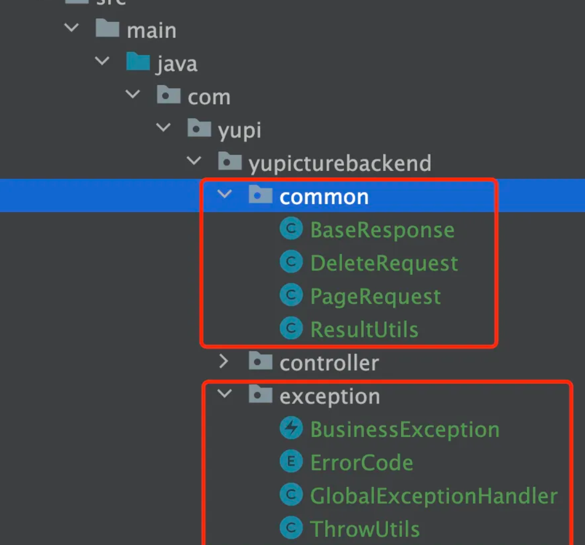
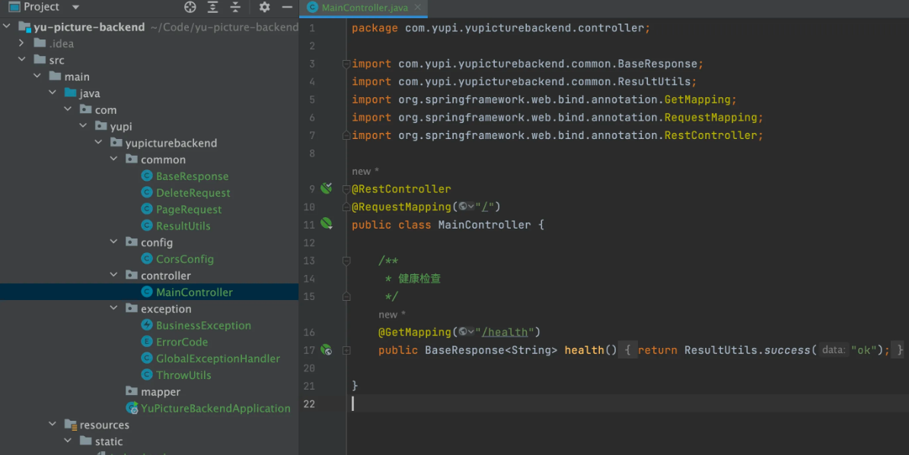
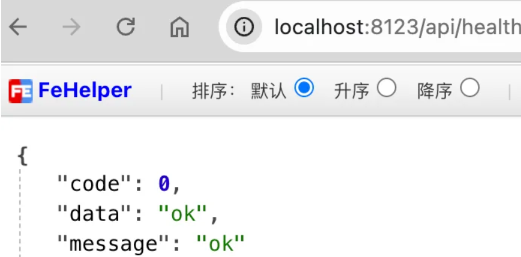

# 从0到1写一个后端初始化项目

### 环境准备

1）安装的 JDK 版本必须是 8、11 或 17，**不能超过 17！**

推荐使用 11 版本，因为后续可能要用到的缓存库 Caffeine 要求使用 11 版本。

可参考视频安装 JDK：https://www.bilibili.com/video/BV14SUNYREv8

2）MySQL 数据库最好安装 8.x 版本，或者 5.7 版本。

### 新建项目

在 IDEA 中新建项目，选择 Spring Initializr 模板，考虑到稳定性，此处选择创建 Java 8 版本的项目。

注意需要替换 Server URL 为 https://start.aliyun.com/，因为官方的 Server URL 不支持选择 Java 8。

配置如图：

选择 Spring Boot 2.7.6 版本，可以根据自己的需要添加一些依赖，比如 Spring Web、MyBatis、MySQL、Lombok：


> 当然，后续通过修改 Maven 配置添加依赖也是可以的。

点击创建，就得到了一个 Spring Boot 项目，需要等待 Maven 为我们安装依赖。

安装完依赖后，先尝试启动一下项目，结果会报错：

因为我们在 Maven 中引入了 MySQL 依赖，但是项目配置文件中并没有填写 MySQL 的配置。

修改资源目录下的配置文件为 `application.yml`，指定项目启动的端口号和访问地址前缀、项目名称、数据库配置等。代码如下：

```yaml
▼yaml复制代码server:
  port: 8123
  servlet:
    context-path: /api
spring:
  application:
    name: yu-picture-backend
  # 数据库配置
  datasource:
    driver-class-name: com.mysql.cj.jdbc.Driver
    url: jdbc:mysql://localhost:3306/yu_picture
    username: root
    password: 123456
```

这次项目就可以正常启动了：


### 整合依赖

接下来我们要整合一些开发项目常用的依赖。

#### 1、MyBatis Plus 数据库操作

MyBatis Plus 是 MyBatis 的增强工具，旨在简化开发流程。它提供了开箱即用的 CRUD 方法、动态查询构造器、分页插件和代码生成器等功能，大幅减少重复代码，同时保持与 MyBatis 原生功能的兼容性。例如，通过调用 `baseMapper.selectById(id)`，可以直接查询数据库中的记录，而无需手动编写 SQL。

参考官方文档引入：https://baomidou.com/getting-started/#spring-boot2

在 Maven 的 pom.xml 中添加依赖：

```xml
<dependency>
    <groupId>com.baomidou</groupId>
    <artifactId>mybatis-plus-boot-starter</artifactId>
    <version>3.5.9</version>
</dependency>
```

**注意，添加该依赖后，记得移除 MyBatis 相关的依赖！否则很容易导致版本冲突！！！**

在项目中新建 mapper 包，后续用于存放操作数据库的 Mapper 类，然后在项目启动类中添加扫描 Mapper 的 `@MapperScan` 注解：

```java
@SpringBootApplication
@MapperScan("com.yupi.yupicturebackend.mapper")
public class YuPictureBackendApplication {

    public static void main(String[] args) {
        SpringApplication.run(YuPictureBackendApplication.class, args);
    }

}
```

在 application.yml 中追加配置，开启日志和逻辑删除功能：

```yaml
▼yaml复制代码mybatis-plus:
  configuration:
    map-underscore-to-camel-case: false
    # 仅在开发环境开启日志
    log-impl: org.apache.ibatis.logging.stdout.StdOutImpl
  global-config:
    db-config:
      logic-delete-field: isDelete # 全局逻辑删除的实体字段名
      logic-delete-value: 1 # 逻辑已删除值（默认为 1）
      logic-not-delete-value: 0 # 逻辑未删除值（默认为 0）
```

#### 2、Hutool 工具库

Hutool 是主流的 Java 工具类库，集合了丰富的工具类，涵盖字符串处理、日期操作、文件处理、加解密、反射、正则匹配等常见功能。它的轻量化和无侵入性让开发者能够专注于业务逻辑而不必编写重复的工具代码。例如，`DateUtil.formatDate(new Date())` 可以快速将当前日期格式化为字符串。

参考官方文档引入：[https://doc.hutool.cn/pages/index/#%F0%9F%8D%8Amaven](https://doc.hutool.cn/pages/index/#🍊maven)

在 Maven 的 pom.xml 中添加依赖：

```xml
<dependency>
    <groupId>cn.hutool</groupId>
    <artifactId>hutool-all</artifactId>
    <version>5.8.26</version>
</dependency>
```

#### 3、Knife4j 接口文档

Knife4j 是基于 Swagger 接口文档的增强工具，提供了更加友好的 API 文档界面和功能扩展，例如动态参数调试、分组文档等。它适合用于 Spring Boot 项目中，能够通过简单的配置自动生成接口文档，让开发者和前端快速了解和调试接口，提高写作效率。

参考官方文档引入：https://doc.xiaominfo.com/docs/quick-start#spring-boot-2

由于使用的是 Spring Boot 2.x，注意要选择 OpenAPI 2 的版本。

在 Maven 的 pom.xml 中添加依赖：

```xml
<dependency>
    <groupId>com.github.xiaoymin</groupId>
    <artifactId>knife4j-openapi2-spring-boot-starter</artifactId>
    <version>4.4.0</version>
</dependency>
```

新建 controller 包用于存放 API 接口，将模板创建的 demos.web 包下的代码都移动到其中，仅用于测试：

在 application.yml 中追加接口文档配置，扫描 Controller 包：

```yaml
knife4j:
  enable: true
  openapi:
    title: "接口文档"
    version: 1.0
    group:
      default:
        api-rule: package
        api-rule-resources:
          - com.yupi.yupicturebackend.controller
```

重启项目，访问 http://localhost:8123/api/doc.html 能够看到接口文档，可以测试调用：

#### 4、其他依赖

可以按需引入其他依赖，比如 AOP 切面编程：

```xml
<dependency>
    <groupId>org.springframework.boot</groupId>
    <artifactId>spring-boot-starter-aop</artifactId>
</dependency>
```

这里我加上上面那个依赖但爆错了

`Caused by: java.lang.ClassNotFoundException: org.aspectj.lang.annotation.Point`

然后不引入上面那个，而是引入下面的就解决了

```
        <dependency>
            <groupId>org.springframework</groupId>
            <artifactId>spring-aspects</artifactId>
            <version>4.3.12.RELEASE</version>
        </dependency>

        <dependency>
            <groupId>org.springframework</groupId>
            <artifactId>spring-aop</artifactId>
            <version>4.3.12.RELEASE</version>
        </dependency>
```

给启动类添加注解（可选）：

```java
@EnableAspectJAutoProxy(exposeProxy = true)
```

解释一下 `exposeProxy = true` 的作用：通过 Spring AOP 提供对当前代理对象的访问，使得可以在业务逻辑中访问到当前的代理对象。你可以在方法执行时通过 `AopContext.currentProxy()` 获取当前的代理对象。

还有更多的依赖，后续我们随用随装。

### 通用基础代码

通用基础代码是指：无论在任何后端项目中，都可以复用的代码。这种代码一般 “一辈子只用写一次”，了解作用之后复制粘贴即可，无需记忆。

目录结构如下：

#### 1、自定义异常

自定义错误码，对错误进行收敛，便于前端统一处理。

💡 这里有 2 个小技巧：

1. 自定义错误码时，建议跟主流的错误码（比如 HTTP 错误码）的含义保持一致，比如 “未登录” 定义为 40100，和 HTTP 401 错误（用户需要进行身份认证）保持一致，会更容易理解。
2. 错误码不要完全连续，预留一些间隔，便于后续扩展。

在 `exception` 包下新建错误码枚举类：

```java
▼java复制代码@Getter
public enum ErrorCode {

    SUCCESS(0, "ok"),
    PARAMS_ERROR(40000, "请求参数错误"),
    NOT_LOGIN_ERROR(40100, "未登录"),
    NO_AUTH_ERROR(40101, "无权限"),
    NOT_FOUND_ERROR(40400, "请求数据不存在"),
    FORBIDDEN_ERROR(40300, "禁止访问"),
    SYSTEM_ERROR(50000, "系统内部异常"),
    OPERATION_ERROR(50001, "操作失败");

    /**
     * 状态码
     */
    private final int code;

    /**
     * 信息
     */
    private final String message;

    ErrorCode(int code, String message) {
        this.code = code;
        this.message = message;
    }

}
```

一般不建议直接抛出 Java 内置的 RuntimeException，而是自定义一个业务异常，和内置的异常类区分开，便于定制化输出错误信息：

```java
▼java复制代码@Getter
public class BusinessException extends RuntimeException {

    /**
     * 错误码
     */
    private final int code;

    public BusinessException(int code, String message) {
        super(message);
        this.code = code; 
    }

    public BusinessException(ErrorCode errorCode) {
        super(errorCode.getMessage());
        this.code = errorCode.getCode();
    }

    public BusinessException(ErrorCode errorCode, String message) {
        super(message);
        this.code = errorCode.getCode();
    }

}
```

为了更方便地根据情况抛出异常，可以封装一个 ThrowUtils，类似断言类，简化抛异常的代码：

```java
▼java复制代码public class ThrowUtils {

    /**
     * 条件成立则抛异常
     *
     * @param condition        条件
     * @param runtimeException 异常
     */
    public static void throwIf(boolean condition, RuntimeException runtimeException) {
        if (condition) {
            throw runtimeException;
        }
    }

    /**
     * 条件成立则抛异常
     *
     * @param condition 条件
     * @param errorCode 错误码
     */
    public static void throwIf(boolean condition, ErrorCode errorCode) {
        throwIf(condition, new BusinessException(errorCode));
    }

    /**
     * 条件成立则抛异常
     *
     * @param condition 条件
     * @param errorCode 错误码
     * @param message   错误信息
     */
    public static void throwIf(boolean condition, ErrorCode errorCode, String message) {
        throwIf(condition, new BusinessException(errorCode, message));
    }
}
```

#### 2、响应包装类

一般情况下，每个后端接口都要返回调用码、数据、调用信息等，前端可以根据这些信息进行相应的处理。

我们可以封装统一的响应结果类，便于前端统一获取这些信息。

通用响应类：

```java
▼java复制代码@Data
public class BaseResponse<T> implements Serializable {

    private int code;

    private T data;

    private String message;

    public BaseResponse(int code, T data, String message) {
        this.code = code;
        this.data = data;
        this.message = message;
    }

    public BaseResponse(int code, T data) {
        this(code, data, "");
    }

    public BaseResponse(ErrorCode errorCode) {
        this(errorCode.getCode(), null, errorCode.getMessage());
    }
}
```

但之后每次接口返回值时，都要手动 new 一个 BaseResponse 对象并传入参数，比较麻烦，我们可以新建一个工具类，提供成功调用和失败调用的方法，支持灵活地传参，简化调用。

```java
▼java复制代码public class ResultUtils {

    /**
     * 成功
     *
     * @param data 数据
     * @param <T>  数据类型
     * @return 响应
     */
    public static <T> BaseResponse<T> success(T data) {
        return new BaseResponse<>(0, data, "ok");
    }

    /**
     * 失败
     *
     * @param errorCode 错误码
     * @return 响应
     */
    public static BaseResponse<?> error(ErrorCode errorCode) {
        return new BaseResponse<>(errorCode);
    }

    /**
     * 失败
     *
     * @param code    错误码
     * @param message 错误信息
     * @return 响应
     */
    public static BaseResponse<?> error(int code, String message) {
        return new BaseResponse<>(code, null, message);
    }

    /**
     * 失败
     *
     * @param errorCode 错误码
     * @return 响应
     */
    public static BaseResponse<?> error(ErrorCode errorCode, String message) {
        return new BaseResponse<>(errorCode.getCode(), null, message);
    }
}
```

#### 3、全局异常处理器

为了防止意料之外的异常，利用 AOP 切面全局对业务异常和 RuntimeException 进行捕获：

```java
▼java复制代码@RestControllerAdvice
@Slf4j
public class GlobalExceptionHandler {

    @ExceptionHandler(BusinessException.class)
    public BaseResponse<?> businessExceptionHandler(BusinessException e) {
        log.error("BusinessException", e);
        return ResultUtils.error(e.getCode(), e.getMessage());
    }

    @ExceptionHandler(RuntimeException.class)
    public BaseResponse<?> runtimeExceptionHandler(RuntimeException e) {
        log.error("RuntimeException", e);
        return ResultUtils.error(ErrorCode.SYSTEM_ERROR, "系统错误");
    }
}
```

#### 4、请求包装类

对于 “分页”、“删除某条数据” 这类通用的请求，可以封装统一的请求包装类，用于接受前端传来的参数，之后相同参数的请求就不用专门再新建一个类了。

分页请求包装类，接受页号、页面大小、排序字段、排序顺序参数：

```java
▼java复制代码@Data
public class PageRequest {

    /**
     * 当前页号
     */
    private int current = 1;

    /**
     * 页面大小
     */
    private int pageSize = 10;

    /**
     * 排序字段
     */
    private String sortField;

    /**
     * 排序顺序（默认降序）
     */
    private String sortOrder = "descend";
}
```

删除请求包装类，接受要删除数据的 id 作为参数：

```java
▼java复制代码@Data
public class DeleteRequest implements Serializable {

    /**
     * id
     */
    private Long id;

    private static final long serialVersionUID = 1L;
}
```

#### 5、全局跨域配置

跨域是指浏览器访问的 URL（前端地址）和后端接口地址的域名（或端口号）不一致导致的，浏览器为了安全，默认禁止跨域请求访问。

为了开发调试方便，我们可以通过全局跨域配置，让整个项目所有的接口支持跨域，解决跨域报错。

新建 config 包，用于存放所有的配置相关代码。全局跨域配置代码如下：

```java
▼java复制代码@Configuration
public class CorsConfig implements WebMvcConfigurer {

    @Override
    public void addCorsMappings(CorsRegistry registry) {
        // 覆盖所有请求
        registry.addMapping("/**")
                // 允许发送 Cookie
                .allowCredentials(true)
                // 放行哪些域名（必须用 patterns，否则 * 会和 allowCredentials 冲突）
                .allowedOriginPatterns("*")
                .allowedMethods("GET", "POST", "PUT", "DELETE", "OPTIONS")
                .allowedHeaders("*")
                .exposedHeaders("*");
    }
}
```

### 编写示例接口

移除 controller 包下的其他代码，让项目干净一些，然后编写一个纯净的 `/health` 接口用于健康检查：

```java
@RestController
@RequestMapping("/")
public class MainController {

    /**
     * 健康检查
     */
    @GetMapping("/health")
    public BaseResponse<String> health() {
        return ResultUtils.success("ok");
    }
}
```

💡 健康检查是指可以通过访问该接口，来快速验证后端服务是否正常运行，所以该接口的返回值非常简单。

此时的项目结构如图：

访问 http://localhost:8123/api/health，看到输出结果，表示后端初始化完成：



