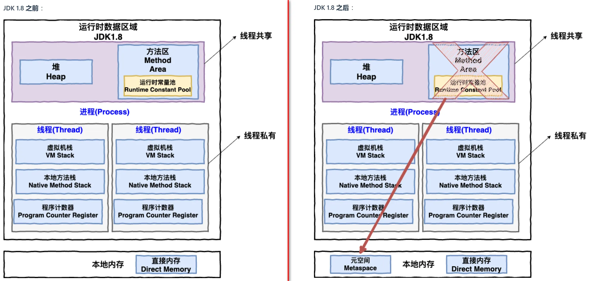
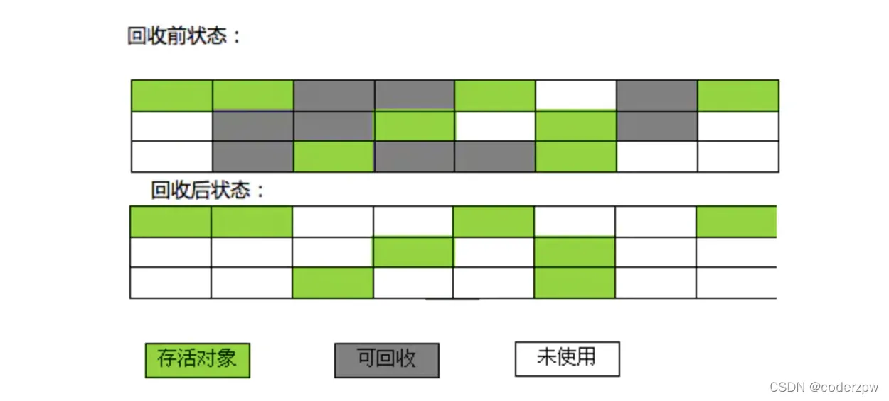
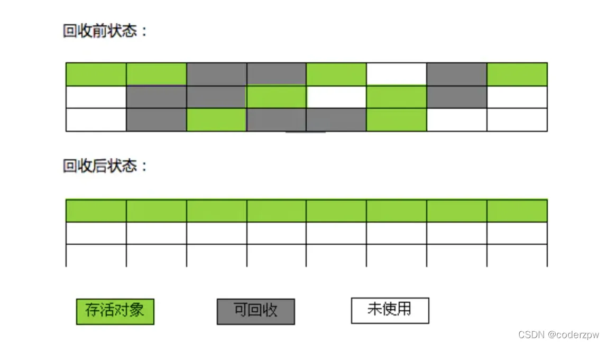

# JVM由哪些部分组成？
- 类加载子系统（加载类进来）
- 运行时数据区（存放数据）执行引擎（真正执行代码）
- 本地方法接口（调用native修饰的非java代码）

类加载器把 class 文件加载到运行时数据区，但是操作系统**无法识别 class 文件**，又要用到执行引擎中的**解释器**翻译成对应的机器码去执行，这个过程可能会调用不同语言为 Java 提供的接口，例如驱动，就会执行本地方法接口。

# JVM内存结构 （运行时数据区）

- 程序计数器（私有）
- 虚拟机栈（私有）
- 本地方法栈（私有）
- 方法区（共享）
- 堆（共享）
###  方法区
方法区是一个抽象，不同版本又两种实现：
- jdk1.6中, 方法区的实现是**永久代**, 而永久代是**在堆中**的. 方法区存储了类信息Class, 类加载器ClassLoader, 运行时常量池. 静态变量。运行时常量池中存储了字符串常量池String Table
- java8中, 方法区的实现是**元空间**, 元空间**在本地内存**(操作系统内存)中. 方法区同样存储了类信息Class, 类加载器ClassLoader, 运行时常量池，静态变量. 而字符串常量池String Table 被放在了堆区

# JVM内存结构中哪些是线程私有的? 哪些是内存共享的?
## 线程私有的：
### 程序计数器
- 程序计数器保存了下一条指令的执行地址, 所以解释器才能读取下一条指令然后执行。
- 为了线程切换后能恢复到正确的执行位置，每条线程都需要有一个独立的程序计数器, 所以程序计数器是线程私有的因为只保存下一条指令的地址, 程序计数器是唯一一个不会出现OutOfMemoryError  (内存溢出)的内存区域
### 虚拟机栈
**栈帧中**：
- 局部变量:比如int a;
- 操作数栈:比如int a =1的1；
- 动态链接:将字符信息转化为引用信息，比如match函数这个字符转化为对应的函数信息；
- 方法出口:跳出方法的出口；

1. 与程序计数器一样，虚拟机栈也是线程私有的，它的生命周期和线程相同，随着线程的创建而创建，随着线程的死亡而死亡。
2. 方法运行时使用的内存就是虚拟机栈。每个方法执行时都会创建一个桢栈来存储方法的局部变量、操作数栈、动态链接、方法出口等信息。栈的大小决定了方法调用的可达深度（递归多少层次，或嵌套调用多少层其他方法）
3. 虚拟机栈抛出的异常一般是 StackOverflow .
### 本地方法栈
● 与虚拟机栈作用相似。虚拟机需要用到c或者c++写的一些本地方法(native修饰的方法), 这些本地方法运行时使用的内存就是本地方法栈.
● 本地方法被执行的时候，在本地方法栈也会创建一个栈帧，用于存放该本地方法的局部变量表、操作数栈、动态链接、方法返回地址信息。
## 线程共享的：
### 堆
- 堆是线程共享的, 堆中的对象需要考虑线程安全问题.
- java中几乎所有的对象实例以及数组存储到堆中. 但是随着逃逸分析技术不断成熟, java7已经默认开启了逃逸分析, 如果方法中某些对象没有被返回, 也没有被外界使用(就是没有逃逸出去), 那么对象可以直接在栈上分配内存.
- 堆是垃圾收集器管理的主要区域, 由于现在收集器基本都采用分代垃圾收集算法，从垃圾回收的角度来看, Java 堆还可以细分为：新生代和老年代. 在java8以前, 还有堆中还有永久代,java8之后就永久代被元空间取代, 位置也放到了本地内存中.
### 方法区
- jdk1.6中, 方法区的实现是永久代, 而永久代是在堆中的. 方法区存储了类信息Class, 类加载器ClassLoader, 运行时常量池.运行时常量池中存储了字符串常量池String Table
- java8中, 方法区的实现是元空间, 元空间在本地内存(操作系统内存)中. 方法区同样存储了类信息Class, 类加载ClassLoader, 运行时常量池. 而字符串常量池String Table 被放在了堆区

# 垃圾回收是否涉及栈内存？
方法运行结束, 自动出栈, 不需要垃圾回收.
# 栈内存分配越大越好吗？
栈内存分配太大, 只能让方法递归的次数变多. 而且会让线程数变少.
# 方法内的局部变量是否线程安全？
栈是线程私有的, 而方法是放到栈里的, 里面的局部变量线程之间不共享, 自然是线程安全的.
# 如何判断方法中的一个变量是否为线程安全的? (逃逸分析)
### 方法逃逸： 
指在某一个方法中的对象，在该方法外部可以继续访问这个对象, 可以理解成对象跳出了方法。

比如, 该方法的中的一个对象是通过参数传递过来的或者该方法将某对象return出去, 那么该方法的外边就能访问到这个对象, 从而造成线程安全问题.
### 线程逃逸：
这个对象被其他线程访问到，比如赋值给了全局变量(类属性, 独立于方法之外)，并被其他线程访问到了。对象逃出了当前线程。

# 如果有个大对象一般是在哪个区域？
大对象通常会直接分配到老年代。
- 新生代主要用于存放生命周期较短的对象，并且其内存空间相对较小。如果将大对象分配到新生代，可能会很快导致新生代空间不足，从而频繁触发MinorGC。将大对象直接分配到老年代，可以减少新生代的内存压力，降低MinorGC的频率。
- 大对象通常需要连续的内存空间，如果在新生代中频繁分配和回收大对象，容易产生内存碎片，导致后续分配大对象时可能因为内存不连续而失败。老年代的空间相对较大，更适合存储大对象，有助于减少内存碎片的产生。

# 什么是方法区
方法区是线程共享的，用于存放**类信息**，**常量**、**静态变量**

HotSpot 虚拟机对虚拟机规范中方法区有两种实现方式:
- 一种是java8之前的永久代, 位置在堆中.
- 另一种是java8之后的元空间, 位置在本地内存中.

# 为什么要将永久代替换为元空间呢?  
- 整个永久代存储在堆中，有一个 JVM 本身设置的固定大小上限，无法进行调整.、
- 而元空间使用的是直接内存，可以用本机可用内存进行调整。

# 字符串常量池是什么
- 字符串常量池 是 JVM 对字符串（String 类）专门开辟的一块区域，主要目的是为了避免字符串的重复创建。
- JDK1.7 之前，字符串常量池存放在永久代。
- JDK1.7 字符串常量池和静态变量从永久代移动了 Java 堆中。

# 为什么要将字符串常量区从永久代放到堆中
- 因为永久代的回收效率很低，在full GC的时候才会触发回收。而Full GC是老年代空间不足、永久代空间不足时才会触发。这就导致字符串常量区回收效率不高。
- 而我们开发中会有大量的字符串被创建，回收效率低，会导致永久代内存不足。放到堆里，堆中minor GC就会触发回收, 回收效率高, 能及时回收StringTable内存。

# 内存泄漏和内存溢出有什么不同
## 内存泄露
### 定义：
内存泄漏是指程序在运行过程中不再使用的对象仍然被引用，从而无法被垃圾收集器回收，导致可用内存逐渐减少
### 内存泄露常见原因：
- **静态集合**：使用静态数据结构（如HashMap或ArrayList)存储对象，且未清理
- **线程**：未停止的线程可能持有对象引用，无法被回收
- **ThreadLocal**: ThreadLocal使用后不调用remove, 就可能发送内存泄漏

## 内存溢出：
### 定义：
内存溢出是指JVM在申请内存时，没有足够的内存，最终引发OutofMemoryError（OOM）。
### 内存溢出常见原因：
- **递归调用**：深度递归导致栈溢出, 栈溢出也是内存溢出的一种（栈）.
- **大量对象创建**：短时间程序中不断创建大量对象, 且无法回收, 超出JVM堆的限制就会OOM.（堆。元空间）
- **内存泄漏**: 内存泄漏之后, 可用内存减少, 一直泄漏下去, 就很容易出现OOM.

# 内存泄漏/OOM怎么排查？

内存泄漏其实是指在 Java 中，有些对象已经不再被使用，但因为存在未释放的残留引用，导致它们无法被 GC 回收，持续占用内存，最终可能引发 OOM。

## 排查和解决的步骤主要是：

**紧急情况下先加内存**
1. **监控发现**：用 **jstat** 监控 GC 和内存，若老年代在 GC 后仍持续增长，基本可判断存在内存泄漏。
2. **dump 分析**：用 **jmap** 生成 dump 文件，再用 **GCEasy 分析**，找到**占用内存大的对象**。
3. **代码修复**：根据泄漏对象的引用链，**找到问题代码**，释放不必要的对象引用，从根源解决泄漏。
# 强引用，软引用，弱引用，虚引用？
**强引用**:被强引用指向的对象永远不会被垃圾回收器回收，即使是OOM

**软引用**:被软引用指向的对象在内存充足时不会被回收，在内存紧张时会被回收

**弱引用**:只要发生GC就会被回收

**虚引用**:被虚引用指向的对象相当于没有引用一样，只要GC就会被回收，可以配合ReferenceQueue引用队列在对象回收时进行通知

# 垃圾回收算法是什么，为了解决了什么问题？
-  垃圾回收算法是为了解决内存管理的问题。
- 在传统的编程语言中，开发人员需要手动分配和释放内存，这可能导致内存泄漏。
- Java引入了垃圾回收机制来**自动管理内存**。自动检测和回收不再使用的对象，避免内存泄漏。

# 如何判断对象是否是垃圾
## 引用计数法
- 每个对象维护一个引用计数器，引用计数增加时，计数器加 1，减少时，计数器减 1。当引用计数器为 0 时，说明该对象不再被引用，可以被回收。
- **优点**：实现简单，实时性好。
- **缺点**：无法处理循环引用的问题，两个对象互相引用时，引用计数器永远不会为 0。

## 可达性分析
- Java 中垃圾回收主要采用可达性分析算法。从一组称为 “GC Roots” 的对象出发，遍历所有可达的对象，凡是无法通过 GC Roots 到达的对象，均被视为垃圾。
- **优点**：能够解决循环引用的问题。
- **缺点**：需要消耗一定的资源进行标记。

# 垃圾收集有哪些算法，各自的特点？
- 标记-清除算法
- 标记-整理算法
- 复制算法
- 分代收集算法
## 标记 -清除算法

### 算法分为两个阶段：
- **标记**：标记所有的存活对象
- 清除****：对堆内存从头到尾遍历，回收所有未标记对象
### 缺点:
- 是会产生内存碎片。
- 需要维护一个列表来可用内存区域和大小

## 标记整理算法

### 算法分为“标记”和“整理”两个阶段：
- 标记：标记所有的存活对象（存活就是gcroot的可达对象，只是简约说成存活）
- 整理：将所有的存活对象整理到内存的一端。之后清理外边界的空间（清理垃圾）
### 优点:
- 不会产生内存碎片
- 只需要维护一个起始内存起点（不需要维护一个列表）
### 缺点:
整理过程需要STW（stop work),即暂停用户程序
## 复制算法
将原有的内存空间一分为二，每次只用其中的一块。

在垃圾回收时，将存活的对象复制到另外一个内存空间中，然后将该内存空间清空，交换两个内存恐惧额的角色，完成垃圾回收。
### 优点：
- 没有标记和清除过程，实现简单，运行高效。
- 复制过去以后保证空间的连续性，不会出现“碎片”问题。
### 缺点：
需要两倍的内存空间。

## 分代收集算法
目前java采用分代收集算法, 将分为堆内存分为新生代和老年代.
### 新生代
新生代代分三个区（比例8:1:1默认）：
-  一个Eden区(伊甸园)
- 两个Survivor区(from和to, 有的也叫s1和s0)

### 工作流程：
1. 新对象首先分配在 Eden 区。
2. 当 Eden 区满时触发 Minor GC：
   - JVM 会把 Eden + 正在使用的 Survivor 区 中还存活的对象复制到另一个空闲的 Survivor 区，然后存活对象的寿命+1。
   - Eden 和旧 Survivor 区会被清空。
3. 当对象在 Survivor 区经历多次 GC 后仍然存活（默认15），或者survivor内存不足，会晋升到 老年代（Old Gen）。

**注意:** 

在minor gc中, 会引发stop the world, 垃圾回收线程会暂停其他线程, 当垃圾回收完后, 其他线程才能执行. 因为gc时, 对象地址有可能改变, 此时用户线程运行会出问题.

### GC时为什么会有全局停顿？
就像打扫房间，如果你边扫地边磕瓜子，房间永远也扫不干净；只有停止磕瓜子扫才能干净。当gc线程在处理垃圾的时候，其它java线程要停止才能彻底清除干净，否则会影响gc线程的处理效率增加gc线程负担，特别是在垃圾标记的时候。

## 老年代
- 当老年代空间不足, 会先尝试触发minor gc清理新生代, 如果空间依旧不足, 那么就会触发full gc, 清理老年代.
- full gc也会触发SWT(stop the world), 但是相比于minor gc, fullgc的暂停时间更长.
- 如果full gc后空间足够, 那就继续运行. 如果full gc后空间不足, 那么抛出out of memory error（OOM）

# 常见垃圾回收器？
常见的垃圾回收器分为三类:串行，并行，并发垃圾回收器
### 串行垃圾回收器有:
Serial（新）,Serial Old（老）
### 并行垃圾回收器有:
Parnew（新）,Parallel scavenge（新）,Parallel Old（老）
### 并发垃圾回收器有:
CMS（标记-清除算法）,G1（标记-整理算法）

新生代使用**复制算法**；老年代使用**标记-整理算法**

# 介绍一下 CMS （Concurrent Mark Sweep）
CMS是老年代并行垃圾收集器, 采取**标记清除**算法, 追求**最短GC回收**停顿时间,
## CMS 处理过程有四个步骤：
1. 初始标记：指的是标记所有被 GCRoots 直接可达的老年代对象，该阶段**需要STW**。
2. 并发标记：指的是对**初始标记**的对象继续**递归标记**出所有存活老年代对象，该阶段与用户线程同时运行, **不需要STW**
3. 重新标记：修正**并发标记期间**因为用户程序继续运行而导致**标记产生变动**的那一部分对象的标记记录，该阶段**需要STW**. 由于垃圾回收算法和用户线程并发执行，虽然能降低响应时间，但是会发生漏标和多标的问题。
4. 并发清除：指的是将**标记为垃圾的对象**进行清除，该阶段与用户线程同时运行, **不需要STW**.
   CMS 之所以能极大地降低 GC 停顿时间，本质上是将原本冗长的引用链扫描进行切分。通过 GC 线程与用户线程并发执行，加上重新标记校正的方式，减少了垃圾回收的时间。
### CMS缺点是:
   - 多线程并发处理, 吃CPU资源（并行垃圾回收缺点）
   - 采用标记清除算法会产生空间碎片（标记-清除缺点）
   - 无法处理浮动垃圾, 在 CMS 进行并发清理的时候，用户线程同时在运行，也会产生一些浮动垃圾。（过程缺点）
   CMS 垃圾回收器在 Java 9 中已经被标记为过时(deprecated)，并在 Java 14 中被移除。

# 介绍一下 G1
G1从jdk7开始，jdk9被设为默认垃圾收集器；目标就是彻底替换掉CMS

## 内存分配策略
将内存分成一个个的Region，且不要求各部分是连续的。G1在逻辑上还是划分Eden、Survivor、OLd，但是物理上他们不是连续的。
### region类型：
- 三种常见： Eden、Survivor、old generation(老年代)区
- 巨无霸区：保存比标准region区大50%及以上的对象,存储在一组连续的区中.转移会影响GC效率，标记阶段发现巨型对象不再存活时，会被直接回收
- 未使用区：未被使用的region
特别说明：某个region的类型不是固定的，比如一次ygc过后，原来的Eden的分区就会变成空闲的可用分区，随后也可能被用作分配巨型对象

## 特点
- 同时注重吞吐量(Throughput)和低延迟(Low latency), 默认的暂停目标是200ms
- 将堆内存化整为零，会将堆划分为多个大小相等的Region, 内存的回收是以region作为基本单位的
- 整体上看是标记整理算法，微观上看两个区域之间是复制算法

## G1（Garbage-First，垃圾优先）垃圾回收器的回收流程主要分为以下几个阶段：
1. 初始标记（Initial Mark）：
   - 标记 GC Roots 能直接关联到的对象，速度快。
   - 修改 TAMS（Next Top at Mark Start）的值。
   - 暂停所有应用线程（STW）。
2. 并发标记（Concurrent Marking）：
   - 从第一阶段标记递归标记所有可达对象，并且用SATB记录变更的引用记录
   - 与应用程序线程并发执行。
3. 最终标记（Final Mark）：
   - 处理并发标记阶段的 SATB（Snapshot At The Beginning）记录，保证标记完整性。
   - 暂停应用线程（STW）。
4. 筛选回收（Live Data Counting and Evacuation）：
   - 统计 Region 中存活和可回收对象信息。
   - 按回收收益排序 Region，优先回收收益高的，复制存活对象到其他 Region，释放被回收 Region 空间。
   - 暂停应用线程（STW）。
   - 
G1 垃圾回收器通过分阶段回收，减少对应用程序的影响，提升内存回收效率，尤其适合大堆内存管理。

## 以下是对上面出现的名词的解释：
### 1.GC Roots 是什么？
在 Java 垃圾回收机制中，GC Roots 是一组必须活跃的引用，是垃圾回收器在标记存活对象时的起始点集合。

也就是说，从这些 GC Roots 开始遍历，能直接或间接访问到的对象都被认为是存活的对象，不会被垃圾回收器回收；而那些无法从 GC Roots 访问到的对象，则被判定为可回收的垃圾对象。

### 2.TAMS（Next Top at Mark Start，标记开始时的下一个顶部位置）是什么？
- **TAMS 是一个地址标记**：在每个 Region（G1 垃圾回收器将堆内存划分为多个大小相等的 Region(块)）中，都有一个 TAMS 指针。当并发标记开始时，会记录下此时 Region 中的一个地址，这个地址就是 TAMS。
- **时间划分对象创建**：TAMS 将 Region 中的对象划分为两部分。在并发标记开始之前创建的对象位于 TAMS 指针之前；而在并发标记过程中创建的新对象会被分配到 TAMS 指针之后的空间。
- **而所谓的 “修改 TAMS 的值**”，其实是在初始标记阶段，会将 TAMS 指针设置到当前 Region 中对象分配的最新位置。

【**注**：“TAMS 指针前” 指的是在每个 Region 内，相对于 TAMS 指针位置而言，地址小于 TAMS 指针所指向地址的那部分内存空间。】

【**注**：对于 TAMS 之后的新对象，会隐式地认为是存活对象，不需要在并发标记阶段进行额外标记，简化了并发标记流程。】

【**注**：并发标记：在 G1 垃圾回收器的并发标记阶段，存在着垃圾回收线程与应用程序线程同时运行的状态，这种同时运行的状态即被称为并发过程。】

## 什么是SATB（Snapshot At The Beginning，初始快照）？
- **初始快照概念**：SATB 即 “初始快照”，它的核心思想是在垃圾回收的并发标记阶段开始时，对堆内存中的对象引用关系拍摄一个快照。在这个快照中记录下了当时对象之间的引用情况，后续的标记操作主要基于这个初始的快照来进行。
- **记录引用变化**：在并发标记过程中，应用程序线程持续运行，会不断创建新对象、修改对象间的引用关系或者删除引用。SATB 记录就是用来记录这些在并发阶段发生的对象引用变化的。通常借助写屏障（Write Barrier）技术来实现，当对象的引用关系被修改时，写屏障会记录下相关的信息，这些信息就构成了 SATB 记录。
- **处理 SATB 记录原因如下**：一是避免对象漏标记，防止因并发时引用关系变化，使存活对象未被标记而遭误回收致程序出错。二是维护标记一致性，将并发阶段引用变化纳入标记，准确反映对象真实存活状态。三是提升并发标记效率，使垃圾回收器在并发阶段持续工作，于最终标记阶段统一处理记录，避免频繁同步开销，保证标记正确。
- **与TAMS 的协作关系**：TAMS 主要负责对新创建对象的处理，从内存空间分配的角度辅助标记；而 SATB 侧重于记录对象引用关系的变化，从对象引用的角度保证标记的准确性。两者相互配合，使得 G1 垃圾回收器在并发环境下能够高效、准确地完成标记存活对象的任务。

【注：虽然并发标记阶段已经处理了部分并发操作对标记的影响，但最终标记阶段仍然需要处理 SATB 记录，因为并发标记阶段的处理难以实时跟踪全部变化，以及写屏障记录的延迟处理。】

【注：难以实时跟踪全部变化：虽然并发标记会尽力处理这些变化，但由于应用程序线程和垃圾回收线程同时运行，使得对象引用关系的变化十分频繁，很难实时且全面地跟踪所有对象引用关系的改变。例如，在极短的时间内，可能会有大量对象的引用关系被修改，并发标记过程中可能无法及时捕捉到所有这些变化。】

【注：写屏障记录的延迟处理：为了记录对象引用关系的变化，并发标记通常会使用写屏障技术。然而，写屏障只是记录下这些变化，并不会立即对标记结果进行更新。这些记录需要在后续阶段进行统一处理，以确保标记的准确性。】

## 在 G1 垃圾回收器中，按回收收益排序 Region 的 “收益” 主要有：
- **可回收空间大小**：即 Region 内垃圾对象占用空间。可回收空间大的 Region 能释放更多内存，减少碎片，回收收益高。
- **回收成本**：指回收 Region 时消耗的时间和资源。存活对象少的 Region 回收成本低，收益更高。
- **对应用程序性能的影响**：垃圾回收需暂停应用线程（STW），STW 时间短、对应用性能影响小的 Region 回收收益高。
G1 综合以上因素，优先回收可回收空间大、成本低且对应用性能影响小的 Region，提升垃圾回收效率与整体性能。

# 什么是三色标记算法
三色标记算法 是为了GC线程和用户线程能够并发执行，在标记对象的时候不用长时间的STW。

**三色标记法将对象的颜色分为了黑、灰、白，三种颜色**：

- **「黑色」**：该对象和对象下的属性也全部都被标记过了。（程序所需要的对象，也就是完成了初始化扫描和并发扫描）
- **「灰色」**：该对象已经被标记过了，但该对象下的属性没有全被遍历完。（GC需要从此对象中去寻找垃圾，也就是没有完成并发扫描，黑色和白色的中间态，最后只有黑和白）
- **「白色」**：该对象没有被标记过。（说明是垃圾，也就是并发初始化扫描没有）
## 过程：
### 初始阶段：
所有对象都是白色。
### 标记阶段：
- 从一组gcRoot开始，将直接引用标记为灰色；
- 然后递归扫描所有的灰色对象，将扫描到对象也标记为灰色；
- 当灰色引用的所有引用都处理完毕则标记为黑色；

**最终状态**：全部扫描后对象只剩黑色和白色，回收白色对象。

## 三色标记中可能出现漏标问题和多标问题
使用三色标记算法，会出现多标和漏标问题：
### 多标问题：
多标问题是原来被标记为黑色的对象引用链被断了，本来需要回收的对象没有回收。

**解决办法**：下次GC会继续回收，所以不用解决。

### 漏标问题：
黑色A对象引用了C,灰色的B对象引用C断开，此时C还是被引用，但是B已经遍历不到了，所以导致漏标，不用回收的对象被回收了。

**解决办法：**
1.  **增量更新（Incremental Update）** 当**黑色对象引用白色对象时**，通过**写屏障**将黑色对象**重变为为灰色**，重新扫描。如**CMS**（白色被引用就改个色）。
2.  **原始快照（SATB, Snapshot-At-The-Beginning）** 在标记开始时建立“快照”。当**引用被删除时**，写屏障**纪录变更引用**，在**标记结束前**重新扫描这些记录，确保对象**不被漏标**。如 **G1、ZGC**（比如B引用了C,C还没被遍历就断了，那他保存的这个快照就会被发现还没遍历的C改了，就需要记录起来等下重新遍历）。

# 什么情况下使用CMS,什么情况使用G1?
## CMS适用场景：
- **低延迟需求**：适用于对停顿时间要求敏感的应用程序。
- **老生代收集**：主要针对老年代的垃圾回收。
- **碎片化管理**：容易出现内存碎片，可能需要定期进行FullGC来压缩内存空间。
## G1适用场景：
- **大堆内存**：适用于需要管理大内存堆的场景，能够有效处理数 GB以上的堆内存。
- **对内存碎片敏感**：G1通过紧凑整理来减少内存碎片，降低了碎片化对性能的影响。
- **比较平衡的性能**：G1在提供较低停顿时间的同时，也保持了相对较高的吞吐量。

# YoungGc,OldGC,FullGc,MixedGC之间的区别？

触发条件和回收的范围不同：
- **MinorGC/YoungGC**是**新生代的eden不足**和新建对象放不下时会触发GC，回收的是新生代；
- **OldGC/MajorGC**在**老年代不足**的时候触发GC,回收的是老年代；
- **FullGC**在**老年代不足**、**新生代晋升老年代放不下**、和**元空间不足会触发GC**,回收的是新生代，老年代和元空间。
- **MixedGC**在**老年代的堆占有率**超过一定阈值，默认45%的时候会回收，回收的是新生代和部分占有率高的老年代区域

# 什么时候触发MinorGC/YoungGC?
1. Eden区满了
2. 新建对象放不下

# 什么时候触发FullGC?
1. 老年代不足
2. 新生代晋升到老年代放不下
3. 元空间不足
4. 使用System.gc方法

# 对象的生命周期
- **创建**：对象通过关键字new在堆内存中被实例化，构造函数被调用，对象的内存空间被分配。
- **使用**：对象被引用并执行相应的操作，可以通过引用访问对象的属性和方法，在程序运行过程中被不断使用
- **销毁**：当对象不再被引用时，通过垃圾回收机制自动回收对象所占用的内存空间。垃圾回收器会在适当的时候检测并回收不再被引用的对象，释放对象占用的内存空间

# JVM调优
## 合理的JVM配置
每个服务对性能指标的要求是不同的，没有固定数值。以下是比较合理的GC指标范围

-  每分钟的GC耗时在1s以内，500ms以内尤佳
- 每次YGC耗时在100ms以内，50ms以内尤佳
- FGC最多几小时1次，1天不到1次尤佳
- 每次FGC耗时在1s以内，500ms以内尤佳

## 合理的JVM参数
- -XX:NewRatio=2，年轻代:老年代=1:2
- -XX:SurvivorRatio=8，eden:s0:s1=8:1:1
- 堆内存设置为物理内存的3/4左右
- -Xmn：年轻代大小。JDK官方建议年轻代占整个堆大小空间的3/8左右
 
