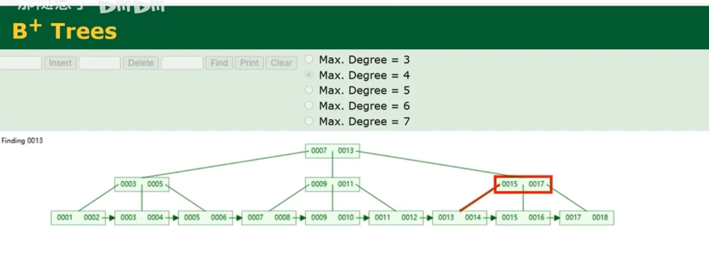
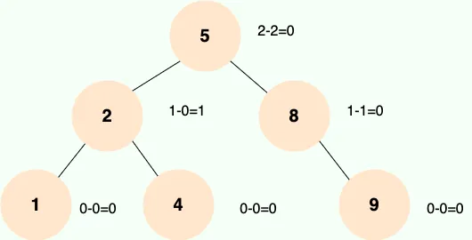
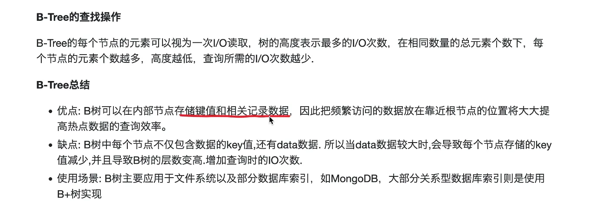
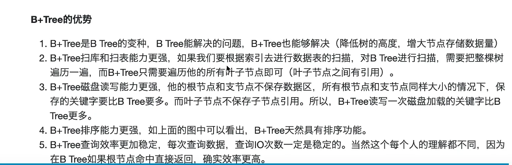
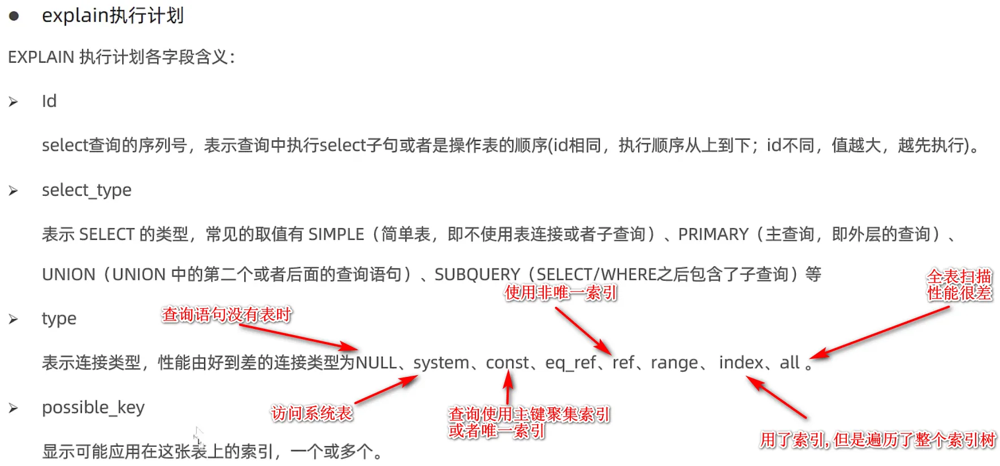
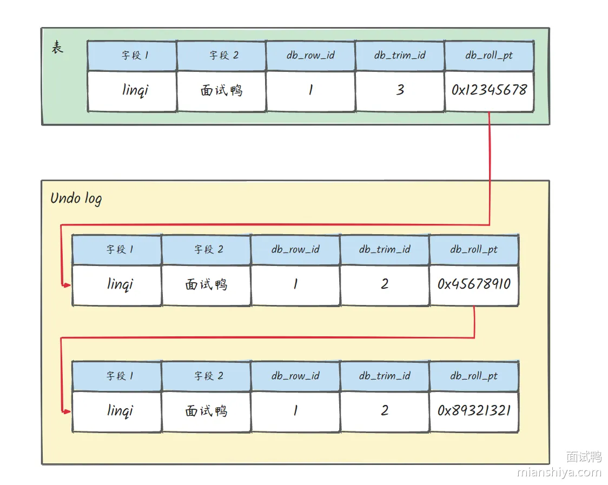
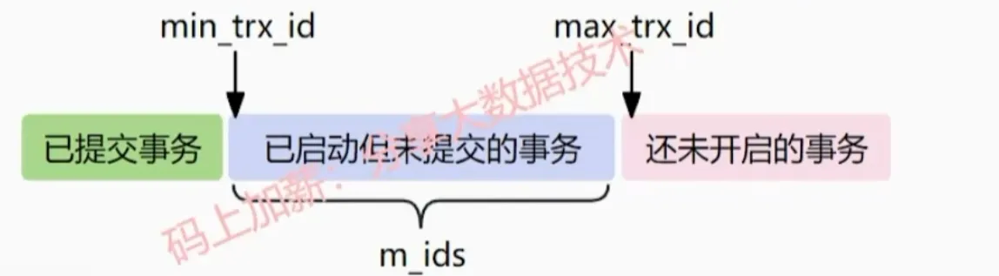
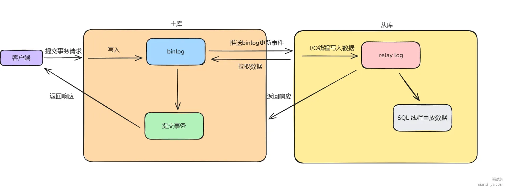

# 数据库三大范式
- **第一范式**: 要求数据库表的每一列都是不可分割的原子数据项。如详细地址可以分割为 省市区等.
- **第二范式**: 非主键属性必须完全依赖于主键, 不能部分依赖。第二范式要确保数据库表中的每一列都和主键相关，而不能只与主键的某一部分相关
- **第三范式**: 任何非主键属性不依赖于其它非主键属性。第三范式需要确保数据表中的每一列数据都和主键直接相关，而不能间接相关, 避免传递依赖。
### 例子:
一张表, 有学生id, 学号, 姓名, 年龄, 班主任姓名, 班主任年龄。此时班主任年龄依赖于班主任姓名或者班主任id, 不应该依赖于学生id, 所以这就是间接相关.
数据库三范式也并不是必须遵守的, 适当添加冗余信息, 可以减少多表查询, 提高效率. 

# CHAR和VARCHAR有什么区别？ 
- CHAR是固定长度，**定义时需要指定固定长度**，长度**不够时补空格**。CHAR适合存储长度固定的数据。
- VARCHAR是可变长度的字符串类型，定义时需要**指定最大长度**，**实际长度就是字符串长度**。VARCHAR适合存储长度可变的数据，如用户输入的文本、备注等，节约存储空间

# 内连接，左/右连接区别？
### 内连接:
返回两张表的关联数据
### 左/右连接:
左表的数据全部保留，右表有匹配到的就显示，没匹配的用null代替
右连接的也一样

# limit 100000 10和limit 10的区别？
- limit offset会扫描limit+offset条数据，如果没有索引覆盖，还会将这些数据全部进行回表，然后再丢弃前面limit条数据
- limit 10是直接从开头拿10条数据

# count(1),count(*)，count(字段名)区别？
- count(*),count(1)表示表数据有多少行
- count(字段名)表示字段不为null的有多少行

# 常用函数：
### 聚合函数：
- sum:求和
- count:求行数
- avg:求平均值
- max:求最大
- min:求最小

### 条件函数:
- if:判断
- ifnull:如果为空

### 数学函数:
- abs:取绝对值
- power:取指数
- mod:取模

### 字符串函数：
- lower:转小写
- upper:转大写
- length:计算长度
- replace:字符串替换

# SQL语句的执行顺序
当一个查询语句同时出现了where,group by,having,order by的时
候, 编写顺序:
- select
- from
- where
- group by
- having
- order
- limit
### 实际执行顺序:
1. 执行from查看表
2. 执行where xx对全表数据做筛选，返回第1个结果集。
3. 针对第1个结果集使用group by分组，返回第2个结果集。
4. 针对第2个结果集执行having xx进行筛选，返回第3个结果集。
5. 针对第3个结果集执行select xx，返回第4个结果集。
6. 针对第4个结果集order by排序, 返回第5个结果集
7. 针对第5个结果集使用limit进行条数限制, 返回第6个结果集

# SQL语句的执行过程
- **取得连接**:客户端和Mysql服务端先通过连接器建立连接，并校验客户端的账号密码和用户权限。
- **查询缓存**:根据sql语句为key查询缓存，有直接返回。在Mysql8.0已取消。
- **分析器**:进行词法分析和语法分析。词法分析就是sql语句拆成词 。语法分析就是将词进行语法校验并构建成语法树
- **优化器**:
  - 决定使用哪个索引；
  - 存在多表关联的时 候（join），决定各个表的连接顺序
  - 最后生成最优sql执行计划
- **执行阶段**(执行器): 调用存储引擎接口，执行sql语句

# MySQL排序实现
- 看有没有命中索引，命中了就直接做索引排序，因为索引本身就是有序的。
- 如果没有命中索引就走文件排序，文件排序又分为两种：
  - 如果排序的数据量大于内存（sortBuffer）,就使用外磁盘排序（外部排序），一般是归并排序。
  - 如果排序的数据量小于内存（sortBuffer），就使用单路排序或者双路排序。
    - 单路排序是指查询的字段没有超过最大查询字段长度，此时可以直接将查询的数据全部放在sortBuffer中排序，只需要回表一次
    - 双路排序是指超过最大查询字段长度，就只将id+排序字段进行排序，然后再根据id回表查到完整数据，需要回表两次，所以叫双路排序。

# MySQL的索引引擎有哪些？
mysql的存储引擎主要有InnoDB,MyISAM和Memory三种，我将从特点，应用场景，崩溃恢复三个方面来讲他们的区别。
### InnoDB
InnoDB他的特点是支持事务，外键和行锁；他通常应用于需要事务的场景，比如订单系统；通过redolog日志实现崩溃恢复。
### NyISAM
MyISAM的特点是不支持事务和外键，使用表级锁；通常应用于只需要查询的场景，比如日志分析系统。崩溃恢复是通过手动恢复。
### Memory
Memory的特点是数据是存放在内存中的；通常用于缓存系统；一旦mysql崩溃数据就会丢失。

# innodb和MyISAM的区别
- Innodb有事务 外键 行级锁
- innodb支持MVCC, MyISAM不支持
- InnoDB 支持数据库异常崩溃后的安全恢复, 依赖于redo log ,而MyISAM不支持

# 索引存储结构：

- IO的最小单位是page
- mysql数据也都存储在数据页page中，每个page最多16kb。
- mysql在读取数据的时候，先把每个page加载到内存，然后再进行访问，所以他是一层一层的，IO次数取决于树的层数。

# MySQL中的索引类型
### 数据结构
B+树索引、哈希索引、倒排索引（Full text）。
### 存储结构
聚簇索引、非聚簇索引
### 字段特性
主键索引、唯一索引、普通索引（二级索引、辅助索引）、前缀索引
### 字段个数
单列索引、联合索引

# 主键索引和唯一索引的区别？


### 补充回答
- **B+树索引**：通过树形结构存储数据，适用于范围查询和精确查询，支持有效数据的快速查找、排序和聚合操作，MySQL的默认索引类型，常用于InnoDB和MyISAM。
- **哈希索引**：基于哈希表的结构，适用与等值查询，但不支持范围查询，查询速度很快，同时不存储数据的顺序，常用于Memory引擎
- **倒排索引**：它将文档集合中的每个唯一单词（词条）映射到包含该单词的所有文档列表，倒排索引通过将单词作为索引的键，文档列表作为值，实现了从单词到文档的快速查找，而全文索引通常依赖倒排索引这种数据结构来实现
- **聚簇索引**：索引的叶子节点存储完整数据记录
- **非聚簇记录**：索引的叶子节点存储了主键值和对应的索引字段
- **普通索引**：一般指非主键索引且非唯一索引（二级索引、辅助索引）
- **主键索引**：唯一且不能为NULL，每个表只能有一个，InnoDB中主键索引是聚簇索引结构实现的
- **联合索引**：多个列组成的索引，适用于多列的查询条件，也可以通过联合索引实现覆盖索引和索引下推技术
- **唯一索引**：唯一，允许为null，但一个列中可以有多个null，可以有效防止重复数据的插入
- **全文索引**：准确来说是一种索引技术，通常依赖倒排索引这种数据结构实现，针对文本数据的一种索引机制，能让用户对文本内容进行全面检索

# 聚簇索引和非聚簇索引的区别？
### 聚簇索引：
索引叶子节点存储索引列和完整数据行，可直接访问全部数据。每个表只能有一个聚簇索引，通常是主键索引，适合范围查询和排序。
### 非聚簇索引：
索引叶子节点存储数据行的主键和对应索引列，需要通过主键才能访问完整数据行。一个表可以有多个非聚簇索引，也叫非主键索引、辅助索引、二级索引，适用于快速查找特定列的数据。

# 为什么InnoDB存储引擎选择使用B+树索引结构？
## 索引底层数据结构选型：
### hash表：
哈希表是键值对的集合，通过键(key)进行哈希算法即可快速取出对应的值(value)，因此哈希表可以快速检索数据（接近 O(1)，哈希冲突使用链表/红黑树进行存储。
#### 优点：
查找非常快，只需要O(1)的时间复杂度。
#### 缺点：
- 范围查询效率差，需要一个一个节点查,查一次就得进行多次数的IO操作。

### 二叉查找树（BST）
#### 特点：
1. 左子树所有节点的值均小于根节点的值。
2. 右子树所有节点的值均大于根节点的值。
3. 左右子树也分别为二叉查找树。
#### 缺点：
当平衡太差的时候，比如退化为链表，查找速率为O(N)，查找速率非常慢。

### 自平衡二叉查找树（AVL树）
#### 特点：
树的特点是保证任何节点的左右子树高度之差不超过1

#### 优点：
它的查找、插入和删除在平均和最坏情况下的时间复杂度都是 O(logn)。
#### 缺点：
- 由于 AVL 树需要频繁地进行旋转操作来保持平衡，因此会有较大的计算开销进而降低了数据库写操作的性能。
- 每个树节点仅存储一个数据，而每次进行磁盘 IO 时只能读取一个节点的数据，如果需要查询的数据分布在多个节点上，那么就需要进行多次磁盘 IO。

### 红黑树：
#### 特点：
- 每个节点非红即黑；
- 根节点总是黑色的；
- 每个叶子节点都是黑色的空节点（NIL 节点）；
- 如果节点是红色的，则它的子节点必须是黑色的（反之不一定）；
- 从任意节点到它的叶子节点或空子节点的每条路径，必须包含相同数目的黑色节点（即相同的黑色高度）。
#### 优点：
为红黑树在插入和删除节点时只需进行 O(1) 次数的旋转和变色操作，即可保持基本平衡状态，而不需要像 AVL 树一样进行 O(logn) 次数的旋转操作。
#### 缺点：
红黑树并不追求严格的平衡，而是大致的平衡。正因如此，红黑树的查询效率稍有下降，因为红黑树的平衡性相对较弱，可能会导致树的高度较高，这可能会导致一些数据需要进行多次磁盘 IO 操作才能查询到，这也是 MySQL 没有选择红黑树的主要原因。

### B树

B 树也称 B- 树，全称为 多路平衡查找树，B+ 树是 B 树的一种变体。B 树和 B+ 树中的 B 是 Balanced（平衡）的意思。
#### 特点：
- B 树的所有节点既存放键(key)也存放数据(data)；
- B 树的叶子节点都是独立的；
- B 树的检索的过程相当于对范围内的每个节点的关键字做二分查找，可能还没有到达叶子节点，检索就结束了。
- 在 B 树中进行范围查询时，首先找到要查找的下限，然后对 B 树进行中序遍历，直到找到查找的上限；

### B+树

B+树是在B树基础上的优化，使得更适合存储索引结构。InnoDB就是用B+树实现其索引结构。
#### 特点：
- 非叶子节点只存储键
- 数据都存储在叶子节点中
- 所有叶子节点之间都有链指针

## 综上所述InoDB选择B+树不选择红黑树原因：
- 从树的层级来讲， B + 树的节点可以存储多个键和指针，通过尽量减少树的高度，来减少磁盘 I/O 操作。红黑树每个节点只存储一个键值和少量指针，树的高度相对较高。在大规模数据存储时，可能需要更多的磁盘 I/O 操作来获取数据。
- 从范围查询的角度来讲，B + 树的数据都存在叶子结点而且叶子节点是一个有序链表的结构可以通过遍历叶子节点来实现高效的范围查，而红黑树主要使用的是中序遍历的方式，可能不方便。从修改的角度考虑， B + 树在插入和删除操作时，虽然也可能需要进行节点的分裂和合并等操作，但由于其节点可以存储多个键，相较于红黑树节点只能存储一个键值对，由于其需要进行调整的操作的频率比较少，所以效率比较高。

## 综上所述InoDB选择B+树不选择B树原因：
- B 树每个节点都存储数据，导致树的高度可能相对更高一些。而 B + 树只有叶子节点存储数据，非叶子节点只用来索引，这样可以使得相同数据量下 B + 树的高度更低，查询时磁盘 I/O 次数更少，提高了查询效率，更契合数据库存储数据量大且需要频繁查询的特点。（IO）
- B + 树数据都存在叶子结点上，而是叶子结点是一个有序的链表结构，范围查询相较于B树需要中序遍历访问非叶子节点的效率更高一点。

# 索引的原理
索引的本质，是数据库为了**加快数据查询速度**而建立的一种**排序的数据结构**，核心思想是用空间换时间，通过减少磁盘 IO 来提升查询效率。

MySQL InnoDB 中，数据默认以 **16KB 数据页**为单位存储在磁盘上，不管有没有索引，真实的业务数据都是存在这些数据页里的。
如果不建立索引，执行查询时只能进行**全表扫描**，MySQL 会从头到尾遍历所有数据页，逐行比对查找数据，每次加载一个数据页基本都对应一次磁盘 IO，数据量大时效率极低。

当我们创建索引后，MySQL 会**额外维护一套独立的索引页**，同样以 16KB 为单位，并使用 **B+ 树** 把这些索引页组织成有序的查找结构。B+ 树是多路平衡查找树，树的高度很低，只需要很少的 IO 次数就能从根节点快速定位到叶子节点。

具体查询可以分为两种索引场景：

## 一、聚簇索引（主键索引）
InnoDB 的聚簇索引比较特殊，**它的叶子节点本身就是真实存储数据的数据页**，整张表的数据就是按照聚簇索引的 B+ 树结构组织的。
通过聚簇索引查询时，B+ 树定位到叶子节点，就相当于直接找到了真实数据页，可以直接从中读取完整的行数据，不需要再去别的地方查找。

## 二、普通二级索引
二级索引会构建独立的 B+ 树，叶子节点存放在**额外的索引页**中，里面只保存索引字段的值以及对应的主键，不存完整数据。
这时候又分两种情况：
1. **索引覆盖**
   如果查询需要返回的字段，全部都包含在二级索引里，MySQL 就可以直接从**这些额外的索引页**中拿到所需数据，直接返回结果，不需要再访问真实数据页，也不需要回表。
2. **不满足覆盖索引，需要回表**
   如果查询的字段没有全部包含在二级索引中，MySQL 会先通过二级索引的索引页找到对应的主键，再拿着这个主键去**聚簇索引**中查找，最终定位到聚簇索引的叶子节点，也就是**真实数据页**，读取完整数据，这个过程就是回表。

---

# 一句话总结（收尾用）
索引就是通过 B+ 树结构管理额外的索引页，快速定位数据位置以减少磁盘 IO；聚簇索引直接对应真实数据页，二级索引存放在独立索引页，覆盖索引从索引页取数，不覆盖则通过主键回表到聚簇索引的数据页取数。

# 回表的定义
"回表" 是指在使用二级索引（非聚簇索引）进行查询的时候，索引字段没有覆盖查询字段，需要根据主键去聚簇索引查找实际的数据行，这个过程被称为回表。

# 最左匹配原则是什么？
### 定义：
最左匹配原则指的是在使用联合索引时，查询条件需要先匹配最左的索引列，最左列相同才会继续匹配下一列。使用联合索引的查询条件必须包含最左列，否则会导致索引失效。

### 底层原理：
因为联合索引在B+树中的排序是从左到右依次进行的，只有第一列值相同时，才会按照第二列排序，依此类推。

# 什么是索引覆盖？
索引覆盖是指二级索引已经包含了要查询的数据，不用进行回表

# 什么是索引下推
索引下推是指将部分查询条件由服务层过滤下推到存储引擎层，是一种针对联合索引的技术。
### 例子
比如我们有一个联合索引a,b，根据a=1，b＞30的条件查询。没有索引下推时，先根据联合索引查出满足a=1的索引，回表后再到服务层过滤b＞30。使用索引下推则在查询a=1的索引后，直接在存储引擎层过滤b＞30再回表，减少回表次数。

# 索引失效的场景
- 使用select*
- 违反最左匹配原则
- 使用计算式，函数或者隐式类型转化（int转string，mysql不知道要转化为什么样的字符串）
- 使用不等条件进行查询，比如!=,no in,no exist
- 使用使用like做左模糊查询和or前后有不带索引的

# 索引是否越多越好？
索引不是越多越好。
### 从空间上:
每创建一个索引，都要创建一棵B+树，占用空间。
### 在时间方面:
每次增删改都要维护索引的有序性，会降低增删改的效率

# 索引设计原则
### 字段要求:
- 数据量大的, 查询频繁的列建立索引
- 对于经常where, order by, group by的列建立索引
- 选择区分度高的列做索引. 身份证号适合索引, 性别和状态不适合索引
### 索引类型要求:
- 字符串类型且比较长的, 可以使用前缀索引
- 尽量使用联合索引, 而不是单列索引, 联合索引很多时候可以覆盖索引, 避免回表
### 索引数量要求:
- 控制索引数量, 索引不是多多益善, 太多了占空间, 维护索引需要的代价也越多, 增删改反而会比较慢.


# SQL调优
### 慢sql的发现:
定位慢mysql主要可以通过慢sql日志，使用explain执行计划分析，或者使用Arthas的trace接口分析。

### 对于索引方面的优化
可以使用explain去分析使用用到索引，如果没有用到要对**经常查询**或者**排序**，**区分度高**的字段加索引或者避免索引失效；

### IO方面:
只**查询必要的字段**，同时**创建联合索引**保证索引覆盖，避免回表。

### 数据量太大的话:
可以进行分库分表，冷热数据分离或者数据归档。

### 架构方面:
可以引入redis来缓存热点数据

# 怎么找到慢sql?
- 打开慢查询日志（slow query log）
- 使用explain执行计划来对慢 SQL 进行分析, 查询是否使用了索引(sql语句前加上 explain即可)

## 什么是慢查询日志(slow query log)
- 慢查询日志记录了执行时间超过 long_query_time（默认是 10s，通常设置为 1s）的所有查询语句，在解决 SQL 慢查询（SQL 执行时间过长）问题的时候经常会用到
- 找到慢 SQL 是优化 SQL 语句性能的第一步，然后再用EXPLAIN 命令可以对慢 SQL 进行分析，获取执行计划的相关信息

# explain执行计划
### 重要点关注: 
type, prossible_key, key, key_len, extra.
````
#先执行一条sql
select * from user;
#在该sql前加上explain关键字
explain select * from user;
````


# 什么是数据库事务
### 事务: 
一系列sql语句, 要么全成功, 要么全失败.
### 事务四大特征（ACID）:
- **原子性 (Atomicity)**: 事务是不可分割的最小单元, n个连续操作失败了一个, 前面的操作回滚 (要么都成功, 要么都失败)
。**原子性通过undolog回滚来实现**

- **一致性(Consistency)**: 执行事务前后，数据总量保持一致. 例如转账业务中，无论事务是否成功，转账者和收款人的总额应该是不变的
。**保证了其他三个特性, 一致性就自然实现了**.

- **隔离性 (Isolation)**: 多个用户并发访问数据库时，数据库为每一个用户开启的事务，不能被其他事务的操作数据所干扰，多个并发事务之间要相互隔离, 保证每个事务不受并发影响, 独立执行
。**mvcc+锁 配合undolog来实现**

- **持久性 (Durability)**: 持久性是指一个事务一旦被提交，它对数据库中数据的改变就是永久性的, 无法撤销
。**redolog来实现**

# 隔离性产生的问题 
## 脏读
### 定义：
一个事务读取到另一个事务未提交的数据
### 例子
1. 在事务A执行过程中，事务A对数据资源进行了修改，事务B读取了事务A修改后的数据。
2. 由于某些原因，事务A并没有完成提交，发生了RollBack操作，则事务B读取的数据就是脏数据。
3. 这种读取到另一个事务未提交的数据的现象就是脏读(Dirty Read)。
## 不可重复读:
### 定义：
这种在同一个事务中，前后两次读取的数据不一致的现象就是不可重复读(Nonrepeatable Read)。
### 例子：
事务B读取了两次数据资源，在这两次读取的过程中事务A修改了数据，导致事务B在这两次读取出来的数据不一致。
## 幻读:
### 定义:
幻读指的是同一个事务中，先后两次读取的数据集的记录数不一致
### 例子：
- 事务A按照条件查询数据时，没有对应的数据行，但是在插入数据时，又发现这行数据已经存在，好像出现了幻觉。(由于解决了不可重复读, 所以该事务读取不到别的事务已提交的数据)
- 幻读和不可重复读有些类似，但是幻读强调的是读取的数据的数量不一致，而不是单条数据的更新。(比如第一次读是有0条数据, 但是第二次读却有了1条数据).

# 事务的隔离级别
## 读未提交
- 读未提交(Read Uncommitted)，是最低的隔离级别，指的是一个事务可以看到其他事务未提交的数据。
- 不能解决脏读，可重复读，幻读，所以很少应用于实际项目。
## 读已提交
- 读已提交(Read Committed)， 在该隔离级别下，一个事务只能看到其他事务已提交的数据。
- 可以防止脏读，但是不能解决可重复读和幻读的问题。
## 可重复读 (mysql默认隔离级别)
- 可重复读(Repeatable Read)，MySQL默认的隔离级别。
- 可重复读是快照读, 在该隔离级别下，同一个事务多次读同一个数据,  两次读到的数据是一样的（实际上读的是数据快照）。
- 可以防止脏读、不可重复读、第一类更新丢失、第二类更新丢失的问题，不过还是会出现幻读。
## 串行化
- 串行化(Serializable)，这是最高的隔离级别。
- 它要求事务序列化执行，事务只能一个接着一个地执行，不能并发执行(会阻塞)。
- 在这个级别，可以解决上面提到的所有并发问题，但可能导致大量的超时现象和锁竞争，通常不会用这个隔离级别
### 注意:
事务的隔离级别越高, 数据安全性就越高, 但是执行效率越低.

# MySQL 的隔离级别怎么实现的
MySQL 的隔离级别基于**锁**和 **MVCC 机制**共同实现的。
串行化隔离级别，是通过锁来实现的。除了 串行化隔离级别，其他的隔离级别都是基于 MVCC实现。不过， 串行化之外的其他隔离级别可能也需要用到锁机制，就比如 **可重复读**在**当前读**情况下需要使用**加临键锁**读来保证不会出现幻读

# 什么是 MVCC
MVCC是多版本并发控制，指维护一个数据的多个版本，控制返回某个版本的数据，使得读写操作没有冲突.

# MVCC 的实现原理
MVCC的具体实现，依赖于**数据库记录中的隐式字段**(最近更新的事务id和回滚指针)、**undo log**和**readView**实现的。
### 隐藏字段:
行数据除了我们定义的字段之外，还有一些重要的隐藏字段:
- db_trx_id:最近修改的事务id
- db_roll_ptr:回滚指针，指着这行数据的上一个版本。

当数据被修改时，旧的数据会被保存到undolog日志中，并将回滚指针指向数据的上一个版本，形成undolog版本链。

### Readview

readview其实就是维护了一个集合，记录了当前数据库的事务状态，他有四个字段:
- creator_trx_id:readview创建者事务的id
- trx_ids:表示当前数据库活跃事务id列表
- up_limit_id:最小活跃事务id（最小事务id）。
- low_limit_id:下一个事务的id（最大事务id）
#### 读取过程
- undolog版本链决定返回的数据
- readview加上可见性算法决定了返回数据的那个版本+可见性算法。
### 事务可见性算法

1. 当事务id为创建readView的事务id是可见的
2. 当事务id<最小活跃事务id是可见的，说明已经提交
3. 当事务id>=下一个事务id是不可见的，说明的未来的事务
4. 当事务id不在当前活跃事务id列表中是可见的（最小活跃事务id<此时id<下一个事务id）

## 大白话理解ReadView:
### 为什么需要记录ReadView?
其实为什么需要readview,因为当时读取数据时事务的状态和目前事务数据库的状态是不一样的。
### 例子1
比如我在第一次读取数据的事务，比如有事务1.2.3.4，事务1是已经提交的事务，2是自己，3.4是活跃事务。那事务1和2是不是就是可以看的，而事务3.4就是不可以看的。
### 例子2
第二次读取后，此时数据为有1.2.3.4.5，此时1.2.3.4.5均已经提交了，理论上来说都是可以读的（每次读都新创建一个readview的情况下，也就是每次读最新数据），但是对于当时我们第一次读的时候，1是可以读的，2是我们的事务的操作也是可以读的，但是3.4虽然现在已经提交了，但对于我们第一次读的时候还是未提交的，不可以读取；5也是对于当时第一次读的时候也是未来的事务所以也是不能读的

# 当前读与快照读
## 当前读: 
### 定义：
读取的是记录的最新版本，读取时还要保证其他并发事务不能修改当前记录，会对读取的记录进行加锁。
### 例子：
对于我们日常的操作，如：select...lock in share mode(共享锁）,select...for update、update、insert、delete(排他锁）都是一种当前读
### 当前读解决幻读：
使用临键锁进行加锁来保证不出现幻读

## 快照读: 
不加锁的select就是快照读，快照读读取的是记录数据的可见版本有可能是历史数据，不加锁
- **读已提交**: 每次select都会生成一个快照读
- **可重复读**: 事务开始后的第一个select才是快照读的地方
- **串行化**: 快照度会退化为当前读
### 快照读解决幻读 ：
由 MVCC 机制来保证不出现幻读

# MVCC是怎么实现读已提交和可重复读
其实根据事务的不同隔离级别，其 Read View 的时机是不同的：
- 在 RC 隔离级别下，每次 select 都会获取一次 ReadView
- 在 RR 隔离级别下，只有一个事务中的第一次 select 才会获取第一次 Read View。、

# MVCC是怎么防止幻读的
InnoDB 存储引擎在 RR 级别下通过 MVCC 和 Next-key Lock (临键锁) 
### 当前读
1. 执行 select...for update/lock in share mode、insert、update、delete 等为当前读，这些语句执行前都会查询最新版本的数据, 所以是当前读
2. **通过临键锁next-key-lock锁住空隙**, 防止其他事务在查询的范围内插入数据, 从而防止幻读.
### 当前读：
1. 执行普通 select ，此时会以 MVCC 快照读的方式读取数据
2. 第一次读取的时候生成一个ReadView,后面都复用这个快照

但是MVCC并没有彻底防止幻读问题, 只是解决了大多数幻读问题, 在一些极端场景还是会有幻读问题.

# InnoDB的RR隔离级别是否能解决幻读问题？
### 快照读解决
通过MVCC解决快照读的幻读问题，只有第一次快照读会生成readview，其他快照读复用第一次的readview。
### 当前读解决
通过间隙锁解决当前读的幻读问题，在当前读的时候使用间隙锁锁住记录之前的间隙，防止幻读。
### 当时RR级别并没有完全拒绝幻读问题，比如以下场景:
- 事务1进行快照读，然后事务2插入一条数据，此时再update更新新插入的数据是可以成功的，发生了幻读。
- 或者事务1进行快照读，然后事务2插入一条数据，事务1再进行当前读也会幻读问题。

# 锁的类型
### 1. 按锁的粒度（锁定范围）
- 全局锁：锁定整个 MySQL 实例，用于全库备份等操作。
- 表锁：锁定整张表，并发度低，开销小。
- 行锁：锁定单行数据，并发度高，是 InnoDB 的核心。

### 2. 按锁的设计思想
- 悲观锁：假设并发冲突多，操作前直接加锁，确保数据一致性（如行锁、表锁）。
- 乐观锁：假设并发冲突少，通过版本号或时间戳在提交时检查冲突，不真正加锁。

### 3. 按锁的兼容性（读写互斥关系）
- 共享锁（S锁）：读锁，多个事务可同时持有，不阻塞读，但阻塞写。
- 排他锁（X锁）：写锁，独占锁，阻塞所有读写操作。

### 4. 按锁的意图（表级意向锁）
- 意向共享锁（IS锁）：事务准备对表中某些行加共享锁，先在表级别声明的意图。
- 意向排他锁（IX锁）：事务准备对表中某些行加排他锁，先在表级别声明的意图。

作用：快速判断表级锁是否可加，避免逐行检查。

### 5. 按锁的实现算法（InnoDB 行锁实现）
- 记录锁（Record Lock）：锁定索引中的一条具体记录。
- 间隙锁（Gap Lock）：锁定索引记录之间的间隙，防止幻读。
- 临键锁（Next-Key Lock）：记录锁 + 间隙锁的组合，是 InnoDB 默认的行锁算法

# 三大日志
## 1. Undo Log（回滚日志）
记录数据**修改前的快照**，用于事务异常时回滚；同时支撑 **MVCC 多版本并发控制**，实现非锁定读。

### undo log 什么时候会被清理？
回答：当没有任何事务需要用到这个版本的 undo log 时才能清理。具体来说，就是所有活跃事务的 Read View 都不需要看这个旧版本了。InnoDB 有个 purge 线程专门干这事，它会定期扫描，把没人用的 undo log 回收掉。如果有长事务一直不提交，undo log 就会堆积，回滚段撑爆，这就是为什么要避免大事务和长事务。

## 2. Redo Log（重做日志）
记录数据页的**物理修改**，用于数据库崩溃恢复，保证已提交事务的数据不丢失，把未刷盘的修改重新落盘。

### redo log 的设计动机
InnoDB 用 Buffer Pool 缓存数据页，修改操作先改内存里的脏页，然后异步刷盘。问题来了，如果脏页还没刷盘 MySQL 就崩了，数据不就丢了？

最简单的方案是每次修改都立刻刷盘，但数据页是 16KB，改一个字节就要写 16KB，而且数据页在磁盘上是随机分布的，随机 IO 性能很差，一台普通 SSD 每秒也就几千次随机写。

redo log 的思路是先写日志再写数据页。redo log 是顺序追加写的，几十个字节就能记录一次修改，顺序 IO 性能比随机 IO 高一个数量级。只要 redo log 落盘了，就算数据页没刷，重启后也能恢复。这就是经典的 WAL，Write-Ahead Logging。

**redo log 的写入流程分三步：**

1）事务执行过程中，先把修改写到 redo log buffer，这块内存默认 16MB

2）事务提交时，根据 innodb_flush_log_at_trx_commit 参数决定刷盘策略：

- 设为 0，每秒刷一次，可能丢 1 秒数据
- 设为 1，每次提交都刷盘，最安全但性能最差
- 设为 2，每次提交写到 OS 缓存，MySQL 挂了不丢数据，操作系统挂了可能丢

3）后台线程定期把脏页刷到磁盘，推进 checkpoint

### binlog 和 redo log 的两阶段提交
一个事务提交，binlog 和 redo log 都要写，那谁先谁后？如果只写了一个另一个没写成功，主从数据就不一致了。

**InnoDB 用两阶段提交来解决：**

1）**prepare 阶段**：redo log 写入并标记为 prepare 状态

2）**commit 阶段**：binlog 写入成功后，再把 redo log 标记为 commit

崩溃恢复时，如果 redo log 是 prepare 状态，就去看 binlog 有没有对应的记录。有就提交，没有就回滚。这样保证了两份日志的一致性。

### 提问：如果 binlog 写成功了但通知 InnoDB commit 失败了会怎样？
回答：这时候 redo log 还是 prepare 状态。重启恢复时，MySQL 会拿 redo log 里的 XID 去 binlog 查，能查到说明 binlog 完整，就把事务提交掉。所以不会丢数据，也不会不一致。

## 3. Binlog（二进制日志）
记录数据的**逻辑修改操作**，主要用于**主从复制**与**基于时间点的数据恢复**。


# mysql如果有很大的数据（1000w+），怎么优化？
## 索引优化
1. 首先在索引方面可以给经常查询，区分度高的字段加索引。同时避免索引失效；
2. 还有加合适的索引，比如内容长的可以加前缀索引；
3. 还有可以建立联合索引，在查询时保证索引覆盖，避免回表
## 分库分表
### 定义
分库分表就是把原本存在一个数据库或一张表里的数据，拆散到多个数据库或多张表里去。目的很直接：单机扛不住了就加机器，单表太大了就拆小表。
### 策略
1）**水平分表**：同一张表的数据按行拆分，比如按用户 ID 取模，user_0、user_1、user_2 这样分。每张表结构一模一样，只是数据不同。

2）**垂直分表**：把一张宽表的列拆开，常用字段放一张表，不常用的大字段单独拎出去。比如用户表拆成 user_base 存用户名、手机号，user_detail 存个人简介、头像这些占空间的字段。

3）**水平分库**：表结构复制到多个数据库实例，数据按规则分散存储。比如电商订单按用户 ID 哈希到 order_db_0、order_db_1、order_db_2 三个库。

4）**垂直分库**：按业务模块拆库，用户相关的放 user_db，订单相关的放 order_db，商品相关的放 product_db。微服务架构下基本都是这么干的。

### 中间件实现：
**ShardingSphere**：Apache旗下的一个分布式数据库中间件。
````
spring:
  shardingsphere:
    datasource:
      names: ds0,ds1
      ds0: # 数据源1配置
        type: com.zaxxer.hikari.HikariDataSource
        driver-class-name: com.mysql.jdbc.Driver
        jdbc-url: jdbc:mysql://localhost:3306/db0
        username: root
        password: password
      ds1: # 数据源2配置
        type: com.zaxxer.hikari.HikariDataSource
        driver-class-name: com.mysql.jdbc.Driver
        jdbc-url: jdbc:mysql://localhost:3306/db1
        username: root
        password: password
    sharding:
      tables:
        t_order: # 订单表(逻辑表名)
          actual-data-nodes: ds$->{0..1}.t_order_$->{0..15} # 分为2个库，每个库16张表
          database-strategy:
            inline:
              sharding-column: user_id
              algorithm-expression: ds$->{user_id % 2} # 按user_id分库
          table-strategy:
            inline:
              sharding-column: order_id
              algorithm-expression: t_order_$->{order_id % 16} # 按order_id分表（分表策略）
````
查询直接使用逻辑表名进行查询就行了。
### 常见分表策略：
- id取模分表
- 按时间，比如每一个月一个表，那就将数据的创建时间的YYYMMM格式进行分表
- 用户名分表（将用户名分64张表，就将用户名进行hashCode()然后取模64）

## 冷热数据源分离
- 比如把 3 个月前的数据迁移到归档表，主表只保留热数据
- 一张 5000 万的表，归档后主表可能就剩 500 万，查询性能直接提升一个量级。

## 架构层面
- 使用读写分离，读用从库，写用主库，分担压力。
- 库引入Redis缓存热点数据

## 事务里有读有写，怎么处理路由？
回答：事务必须走单连接，不能拆到主从两边。主流框架的做法是检测到开启事务后，所有操作都路由到主库，直到事务提交或回滚。ShardingSphere 默认就是这个行为，

# 主从同步架构：
## 定义和实现：
MySQL 主从同步的核心就是 binlog 复制：主库把写操作记到二进制日志里，从库拉过来重放一遍，数据就同步了。

### 整个流程涉及三个线程配合：

1）主库的 dump 线程：监听 binlog 变更，有新内容就推事件给从库

2）从库的 I/O 线程：拉取主库数据，把收到的 binlog 写进本地的 relay log

3）从库的 SQL 线程：读 relay log，逐条执行 SQL 语句




## 三种复制模式

MySQL 支持异步、同步、半同步三种复制模式，区别在于主库什么时候给客户端返回响应：

| 复制模式     | 主库返回时机                     | 性能 | 数据可靠性                     |
| ------------ | -------------------------------- | ---- | ------------------------------ |
| 异步复制     | 写完 binlog 立即返回             | 最高 | 最低，主库挂了可能丢失数据     |
| 同步复制     | 等待所有从库确认后返回           | 最差 | 最高                           |
| 半同步复制   | 等待至少一个从库确认后返回       | 折中 | 较高                           |

MySQL 默认是异步复制，主库写完 binlog 就直接返回，压根不管从库有没有收到。好处是快，坏处是主库突然挂了，那些还没同步过去的数据就丢了。

同步复制要等所有从库都确认收到才返回，一般没人用，太慢了。

## binlog 有几种格式，它们有什么区别？
binlog 有 statement、row、mixed 三种格式：

- **statement**：记录原始 SQL，日志体积小，但函数、时间等可能导致主从不一致。
- **row**：记录行数据变更前后内容，一致性最强，日志稍大，是生产推荐。
- **mixed**：自动切换，普通 SQL 用 statement，不安全语句自动改用 row。


