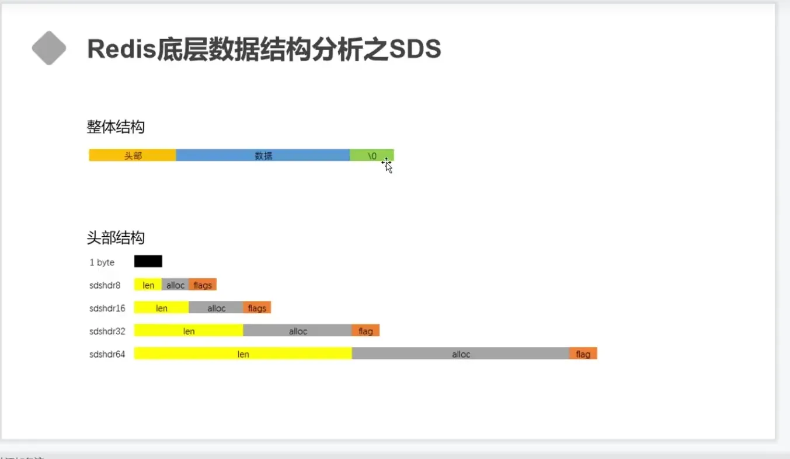
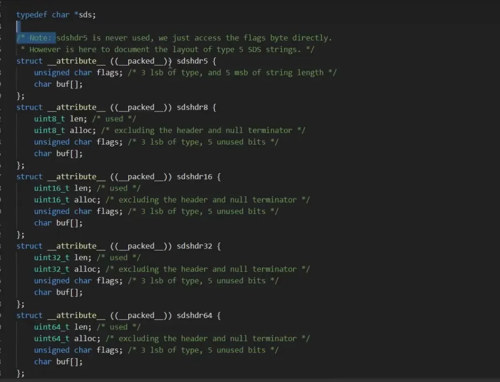
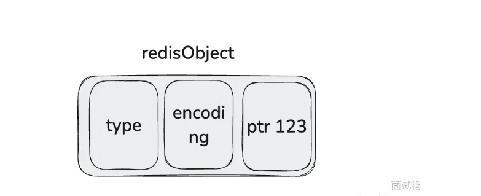
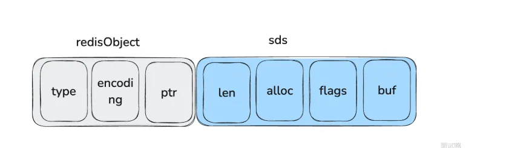
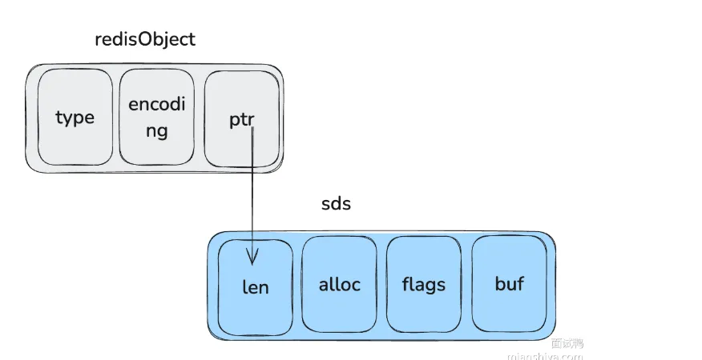
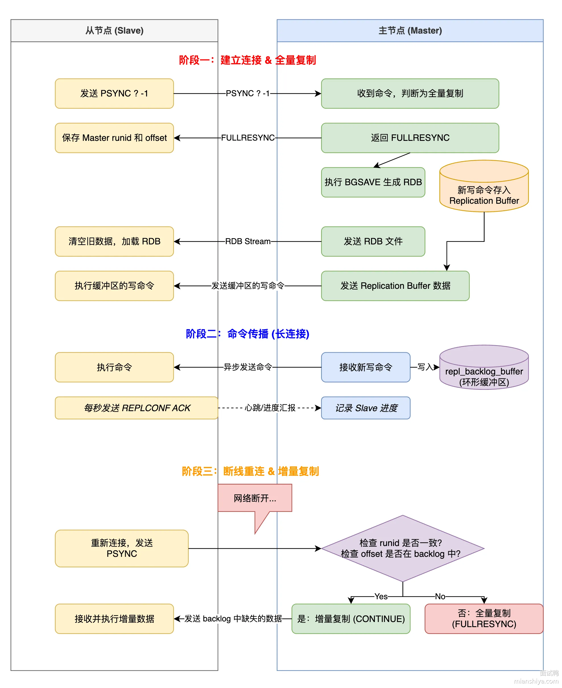

# 什么是redis
redis是基于c语言开发的一个非关系数据库，存储的是kv键值对的数据。相比与传统的磁盘数据库不同，他是基于内存存储的，读写速度更快，贝广泛应用于缓存方面。

# redis有多少种数据类型？
## 基本数据类型五种：


## 5 种数据类型对比
### String 
**结构存储的值**:

字符串，整数，浮点数

**结构的读写能力**:

一种二进制安全的数据类型，支持存储：字符串、整数、浮点数、图片 (图片的 base64 编码或者图片路径)、序列化后的对象；

### List

**结构存储的值**:

链表结构，链表上的每个节点都包含一个字符串

**结构的读写能力**:

链表两端可进行插入和删除操作，支持遍历读取和反向查找，更加方便操作

### Set

**结构存储的值**:

包含字符串的无序集合

**结构的读写能力**:

无序集合，集合中的元素保证唯一性，类似于 HashSet
### Zset

**结构存储的值**:

和散列一样，用于存储键值对

**结构的读写能力**:

和 Set 相比，Sorted Set 增加了一个权重参数 score
，使得集合中的元素能够按照 score
进行有序排序。

### Hash

**结构存储的值**:

包含键值对的无序散列表

**结构的读写能力**:

String 类型的 field-value (键值对) 映射表，特别适合用于存储对象，后续可以直接修改这个对象中的某些字段的值

## 四种特殊数据结构:
- **HperLogLogs**（基数统计）:可以用来统计页面UV
- **BitMap（位存储）**:用户签到
- **geo（地理位置）**:用来存储地理位置
- **stream**:用作消息队列


# String字符串
string是最常见的，可以传字符串，整数，浮点数，二进制数等。
## 常用操作：
- strlen(返回存储的字符串长度)
- strcat(拼接字符串)
- setnx(key不存在的时候设置key的值)
- incr key(存储数值加1) decr(存储数值减1)
## 底层实现：
Redis 的 String 底层用的是 SDS，全称 Simple Dynamic String，简单动态字符串。它不是直接用 C 语言原生的 char 数组，因为 C 字符串有几个致命问题：
1. 获取长度得遍历一遍，时间复杂度 O(n)
2. 遇到 \0 就认为结束了，没法存二进制数据
3. 扩容得自己手动搞，一不小心就缓冲区溢出

SDS 的核心设计是在字符数组前面加了个头部结构，记录了当前长度 len 和分配的空间 alloc。这样获取长度直接读 len 字段，O(1) 搞定；判断剩余空间用 alloc - len 就行，扩容前先检查够不够，不够再分配，杜绝溢出；而且不依赖 \0 判断结束，图片、音频这种二进制数据也能存。

并且配合int，emstr,raw编码来就行存储优化。


v
### SDS结构体有四个属性：
1. len表示字符串数组的长度。
2. alloc表示分配给字符串数组的空间大小。
3. flags表示SDS的类型。一共有五种类型：SDS5,SDS8,SDS16,SDS32,SDS64；根据字符串的大小来使用不同的SDS类型，节省内存空间。
4. buf柔性数组，真正存储字符串的数据空间。

### Redis 还根据存储内容做了编码优化：

1）能解析成整数的，直接用 int 编码，把数字存在指针位置，连 SDS 都不用分配

2）44 字节以内的短字符串用 embstr 编码，redisObject 和 SDS 分配在一块连续内存，一次 malloc 搞定

3）超过 44 字节的长字符串用 raw 编码，redisObject 和 SDS 分开存，方便独立扩容

### int编码：

当字符串能够转化为long表示的整数的时候，会使用int编码，然后将字符串存于RedisObject的ptr属性中。
### emstr编码：

当字符串长度小于等于44个字节的时候，会使用emstr编码，该编码使用SDS和RedisObject来表示字符串对象。并将redisObject和SDS存储在一块连续的内存块中，减少内存的分配和管理的开销。
### raw编码：

当字符串长度大于44个字节的时候，会使用raw编码。该编码也是使用SDS和RedisObject来表示字符串对象，将将Redis和SDS分开存储在两块内存块中，用redisObject的ptr编码指向SDS，以便处理更长的字符串。


### 先了解为什么要自己实现SDS,而不是使用c语言的string:
- 首先c语言的string需要通过o(n)的复杂度来获取字符串长度（strlen），而SDS有字段用来记录字符串的长度，可以O(1)来获取长度
- 其次c语言的string是通过/0来结尾的,比如'1111/01111'的长度是4，而SDS的长度计算是看len属性，所以SDS是二进制安全的。
- 防止缓冲区溢出。c语言在用strcat进行拼接的时候，如果没有分配足够长的内存，就会造成缓冲区溢出。SDS在拼接字符串的时候，会根据len来判断内存空间是否满足，如果不满足就会进行扩容（申请新的内存空间）。而且采用预分配策略，
- 如果新字符串<1M：
- - 新空间长度 = (原字符串长度 + 追加字符串长度) * 2 + 1
- 如果新字符串>1M：
- - 新空间长度=(原字符串长度 + 追加字符串长度) + 1MB + 1。

可以减少内存的分配次数

# List字符串列表
### list的常见操作：
- llen:获取列表长度
- lpush:插入列表头部  rpush:插入列表尾部（插入）
- lpop:移除头部元素   rpop:移除尾部元素（删除）
- lindex:根据索引获取元素   lrange:获取索引范围内元素（左闭右闭） lset:修改索引对应的值   ltrim:裁剪list列表(索引)
- lrem:删除匹配元素 （提到裁剪顺便想到的）

实际上是一个双端链表，left、 right 都可以插入，插入的值可以重复
- 如果key不存在，创建新的链表
- 如果key存在新增元素
- 如果移除所有值，空链表也代表不存在
- 在两边插入或者改动值，效率最高，中间元素相对效率较低
## 底层实现：
  
  3-2之前是由压缩列表(zipList)和LinkList(双向链表实现)，当元素数量<512并且元素大小<64字节时采用ZipList，超过则采用LinkedList。3.2之前只由quickList实现。 
  ### zipList:
  当元素较少且总大小较小时，使用压缩链表实现，节省内存。
  ### LinkList:
  当元素较多的时候，使用双向链表实现，便于从两端快速插入和删除
  ### quicklist:
  quickList在3.2之后使用，他结合了zipList和LinkList的特性

# Set及其实现原理：
zset是无序不重复集合
### set常用命令：
- sadd key member:添加元素
- srem key:移除元素
- smemebers key: 查看key的所有元素
- scard key:查看key的元素个数
- sismembers key member:判断key是否存在某个元素
- sdiff key key1....: 求差集，第一个为基准
- sinter key key1 :求交集..
- sunion key key1..求合集

### 底层结构
- 当存储的所有数据都是整数，并且元素数量不超过set-max-intset-entries（默认512）时，Set会采用IntSet，节省内存。
- 其他使用redis的ditc(字典还进行存储，键用来存值，value为null)

# ZSet及其实现原理
zset是一个不重复的集合，每一个元素都关联了一个score值，内部基于score从小到大进行排序。

## 底层原理：
他的底层是通过跳表和哈希表进行实现的。(少量数据使用ZipList，使用Dict和SkipList)
- 跳表用来存储元素的排序和快速查找；哈希表用于成员和分数的映射，通过快速查找。
- 当zset元素过少的时候，redis会用压缩列表来节省空间：即同时满足zset元素个数小于等于zset-max-ziplist-entries（128）和元素的成员名和分值小于等于zset-max-ziplist-value（64）。
- ZipList是连续内存，因此score和element是紧挨在一起的两个entry， element在前，score在后

score越小越接近队首，score越大越接近队尾，按照score值升序排列

# Hash及其实现原理
Hash结构与Redis中的Zset非常类似：
- 都是键值存储
- 都需求根据键获取值
- 键必须唯一
### 区别如下：
- zset的键是member，值是score；hash的键和值都是任意值
- zset要根据score排序；hash则无需排序
## 底层实现原理(少量数据ZipList，大量数据Dict)：
- 当Hash中数据项比较少的情况下，Hash底层才⽤压缩列表ziplist进⾏存储数据，随着数据的增加，底层的ziplist就可能会转成dict，具体配置如下：
- hash-max-ziplist-entries 512
- hash-max-ziplist-value 64

当满足上面两个条件其中之⼀的时候，Redis就使⽤dict字典来实现hash。

# 说一下redis的常用命令（你平时都用哪些redis命令）
- set key value 设置键值对
- get key  获取键的值
- type key 查看键的类型
- exists key 查看redis对应的key是否存在
- del key 删除对应的键
- expire key 设置过期时间（秒）
- ttl key 查看键的过期时间（秒）

# Redis都用到了哪些数据结构？
### 首先先说redis常用的数据结构有：
- String
- List
- Set
- ZSet
- Hash
- HypeLogLog
- BitMap
- Geo
- Stream
### 项目里面用到的数据结构：
- 我常用的有String和ZSet还有BitMap。
- 比如我在项目中用String做缓存还有做计数器统计用户访问题目的一个频率
- ZSet用来做排行榜
- BitMap用来纪录用户签到

# Redis你是怎么用的
通过引入redis依赖还有Redission依赖去引入Redis客户端(RedisTemplate和RedissionClient做缓存
- 做计数器
- ZSet做排行榜
- BitMap做用户签到
- 用Redission的RRateLimiter做限流

# Redis的锁你是怎么用的？
- Redis的锁我一般使用redission来实现。
- 引入依赖后可以用RedissionClient.getLock()获取锁对象，锁对象调用Lock(),unlock（）进行加锁解锁


# Redis的分布式锁怎么设计？
### 1.setnx
利用redis的setnx 1命令，天然互斥，key不存在，设置成功返回1（加锁成功），设置失败返回0（锁被占用）。然后执行完后释放锁 dek key;

### 2.setnx+过期时间（setnx key 1 px 10,000):

刚才第一版那种方法，如果拿到锁后，服务器宕机了，那锁就永远无法释放，所以说需要锁加过期时间，而且拿到锁和设置过期时间需要原子，setnx中的px命令可以做到；


### 3.setnx+过期时间+UUID（防止锁误删+lua 第二版)


又有一个问题，假如线程A拿到了锁，十秒后还没执行完，锁自动过期;此时线程B拿到了锁，还没执行完A此时执行完了，把线程B的锁删了，此时线程C拿到锁...,循环。 所以我们在setnx key value的时候，把value设置为一个唯一的uuid,这样就能在删除前通过value判断是不是自己的锁，而且判断并且执行这是两步操作，我们需要原子，所以还得使用lua脚本保证是原子操作


## 4.setnx+过期时间+UUID+看门狗（续锁） 
第三版我们虽然解决了锁误删问题，但其实锁过期后其他线程进来不仅会打乱原来线程执行的业务，所以还是需要线程执行完再释放锁，所以我们可以使用一个守护线程，每隔过期时间的三分之一就去看锁还在不在，在就说明业务还没执行完，给锁续期。

# Redis为什么这么快？
- 基于内存操作，比磁盘要快。
- 单线程操作，避免了频繁的线程上下文切换（redis6.0网络IO使用多线程，但命令执行还是使用使用线程，不会导致并发）
- 采用了IO路多复用模型
- Redis提供了很多优化后的数据结构，比如跳表。

# redis为什么是单线程，为什么后续要引入多线程？
单线程设计原因：
1. redis是基于内存操作的，性能瓶颈主要是内存和网络而不是cpu。
2. redis使用多线程会涉及到并发问题，使用单线程实现更简单，而且可以减少线程上下文切换带来的性能损耗，提高性能。
3. redis使用IO多路复用技术，可以减少网络IO，提高性能。
   6.0 版本引入多线程的原因：
1. 随着请求量的增大，redis有大量时间浪费在网络IO（接受请求，发送响应上），而不是核心命令的执行。
2. 虽然redis6.0引入多线程，但是只是在网络IO使用了多线程，执行命令依旧使用单线程，不会担心发生线程安全问题


# redis支持事务吗，怎么实现？
- redis支持事务，通过使用Mutil开启事务，exe提交事务，discard取消事务，watch监视键（如果在事务执行前键有变化则不会执行事务，保证一致性）。
- redis支持原子性，即使一个命令执行失败，后续命令也会继续执行下去，隔离级别由于单线程只能串行化，watch保证一致性，但不能回滚。

# Redis的删除策略
Redis 数据过期主要有两种删除策略，分别为定期删除、惰性删除两种：
### 定期删除：
Redis 每隔一定时间（默认是 100 毫秒）会随机检查一定数量的键，如果发现过期键，则将其删除。
### 惰性删除：
在每次访问键时，Redis 检查该键是否已过期，如果已过期，则将其删除。

# edis的内存淘汰策略:
### 前提：
- LRU（last recently.used）:最久未使用
- LFU（last frequently ）:最少未使用（根据使用次数加时间得到频率）used
## 内存淘汰策略一共有八种:
### 1）不淘汰数据:
当运行内存达到最大内存的时候，直接禁止写入数据
### 2）基于设计过期时间key进行淘汰:
- 随机淘汰
- 淘汰快过期的（ttl）
- 淘汰最久未使用的（LRU）
- 淘汰使用最少的（LFU）
3）基于所有数据进行淘汰:
- 随机淘汰
- 最久未使用
- 最少未使用

# 缓存读写策略:
三种效缓存读写策略分别是：
- Cache-Aside（旁路缓存）
- - Write-Through（写透缓存）
- Write-Behind（写回缓存）。
## 旁路缓存模式(Cache Aside Pattern)
旁路缓存是最常见的缓存读写模式，适用于读多写少的使用经常。服务端以数据库比如 MySQL 为主，Redis 为辅，进行存储。
### 读:
先读缓存，如果缓存没有读取数据库，然后更新缓存
### 写:
先写数据库，然后再删除缓存(先删后更大概率导致缓存不一致)

1. 先删后更数据不一致情况（两请求一读一写）
- 首先写请求删除缓存，此时读请求发现没有缓存，就去数据库读取，然后写请求更新     数据库，然后读请求更新缓存为老数据，出现数据不一致。
2.先更后删数据库不一致情况（一读一写加缓存刚好失效）
- 缓存中 X 不存在（数据库 X = 1）
- 线程 A 读取数据库，得到旧值（X = 1）
- 线程 B 更新数据库（X = 2)
- 线程 B 删除缓存
- 线程 A 将旧值写入缓存（X = 1）
### 从上面的表述可以知道，缓存失效场景需要满足：
1. 缓存失效
2. 读写请求同步对一个数据进行并发操作
3. 更新数据库+删除缓存的时间大于读取和写入缓存的时间，也就是说写操作时间大于读操作时间，理论发生概率是很小的。一般而言业务上都会使用这个方案。

## 读/写穿透(Read/Write Through Pattern)
读写穿透策略将 Redis/Memcached 视为数据存储的主要地方，也就是说将缓存充当原本的数据库，利用 Cache 服务负责将数据读取并写入数据库(MySQL、Oracle等)。
### 写操作流程
1）**读穿透**:直接更新数据库
2）**写穿透**:同步更新缓存和数据库。
### 读操作流程
1）从缓存读取数据，读取到返回
2）缓存读取不到，从数据库加载后写入缓存并返回。

## 异步缓存写入(Write Behind Pattern)
- 只更新缓存，然后将缓存数据标记为脏数据，然后马上返回，不立马更新数据库。
- 对于数据库的更新使用异步批量的更新数据库，一般不使用，但数据库的缓冲池机制是这种策略的一个实现，
适用场景：数据经常变化，一致性要求不高（可以延时同步），比如 PV、UV、点赞量。

# Redis怎么实现和mysql的一致性?
- **先更新数据库，再删缓存**：实时一致性要求高的场景首选，虽然极端情况下会短暂不一致，但概率很低
- **缓存双删**：先删缓存、更新数据库、延迟再删一次，能解决"先删缓存再更新数据库"的并发问题
- **Binlog 异步更新**：用 Canal 监听 MySQL Binlog，通过消息队列异步删除缓存，最终一致性最好
- 读操作就都是去读缓存，没有就去读数据库然后更新缓存。
## 如果在一个没有提交的事务内怎么保证数据一致?
- 前两种方法在事务没有提交前，其他线程读取数据其实更新的值是感知不到的，其他线程读到的还是旧值，也就变成了删除缓存然后再更新数据库这种情况。
- 但是Binlog异步更新的方案就不一样了，只有提交事务时binlog才会变化，才会触发删除缓存的操作。

# 说一下redis的lua脚本
## 定义：
Redis 的 Lua 脚本功能可以在 Redis 服务器那边直接运行 Lua 脚本。
- 一方面可以把好几个 Redis 命令捆在一起执行，这么做就能保证这些操作是一个整体，不会中途被打断，也就是保证了操作的原子性；
- 另一方面呢，还能减少在网络上来回传输命令的开销。
## 代码实现：
- 在使用这个功能的时候，有两个命令可以用，一个叫EVAL[执行]，另一个叫 EVALSHA [执行脚本哈希值(命令)] 。
- EVAL 命令用于直接执行用户提供的 Lua 脚本。
- EVALSHA命令 用于执行已经加载到 Redis 服务器中的 Lua 脚本。
- 需要先使用 SCRIPT LOAD （脚本加载）命令将脚本加载到 Redis 并获取其 SHA1 校验和，然后使用 EVALSHA 结合这个校验和来执行脚本。

# redis的缓存雪崩，缓存击穿和缓存穿透问题
## 缓存雪崩：
指大量的缓存同时过期，导致大量请求直接访问数据库
### 解决措施:
- 给缓存设置随机过期时间；
- 采用多级缓存，减少redis的压力。

## 缓存击穿：
某个热点key缓存过期，导致大量的请求直接访问数据库。
### 解决措施：
- 使用互斥锁（双重判定锁），保证同一时间只有一个请求可以去访问数据库并且更新缓存。
如果缓存未命中，贼获取互斥锁（sexnx）,获取失败则休眠重试。获取成功则再次查询有无缓存，没查到则查询数据库对缓存进行重建
- 使用缓存预热，避免第一次访问大量请求访问数据库。
- 设置热点数据永不过期。

## 缓存穿透:
大量请求访问一个不存在的数据，缓存中没有对应纪录，导致大量的请求直接访问数据库
### 解决措施：
- 设置空缓存
- 使用布隆过滤器，过滤掉数据不存在的请求，防止请求直接访问数据库；或者在访问不存在的数据的时候，也给它们加缓存，避免直接访问数据库。

# 聊一下布隆过滤器
## 定义：
布隆过滤器是一种高效的概率数据结构，常用于检测一个元素是否在一个集合中，可以有效减少数据库的查询次数，解决缓存穿透等问题。
## 实现：
可以通过使用 位图（Bitmap） 或使用 Redis 模块 RedisBloom。
### 1）使用位图实现布隆过滤器：
- 使用 Redis 的位图结构 SETBIT 和 GETBIT 操作来实现布隆过滤器。位图本质上是一个比特数组，用于标识元素是否存在。
- 对于给定的数据，通过多个 哈希函数 计算位置索引，将位图中的相应位置设置为 1，表示该元素可能存在。
2）使用 RedisBloom 模块：
- Redis 提供了一个官方模块 RedisBloom，封装了哈希函数、位图大小等操作，可以直接用于创建和管理布隆过滤器。
- 使用 BF.ADD 来向布隆过滤器添加元素，使用 BF.EXISTS 来检查某个元素是否可能存在。

# 布隆过滤器原理
布隆过滤器是由一个 位数组 和 k 个独立的哈希函数 组成。

- 添加元素时，通过 k 个哈希函数将元素映射到位数组的 k 个位置上，将这些位置设置为 1。
- 检查元素是否存在时，同样计算 k 个位置，如果所有位置都是 1，则说明元素可能存在；只要有一个位置为 0，就可以确定元素一定不存在。
- 如果布隆过滤器判断一个元素不存在集合中，那么这个元素一定不在集合中，如果判断元素存在集合中则不一定是真的，因为哈希可能会存在冲突。因此布隆过滤器有误判的概率。


# 说一下redis的持久化机制
redis的持久化机制分为两种,RDB（redis database ）和AOF(append only file)。
## RDB：
### 概念：
RDB是指redis将某一时刻的数据快照以二进制的数据写入到RDB文件中,通过读取RDB文件恢复数据。他的优点是回复速度快，只需要加载文件的数据，但是他可能会丢失最后一次同步后的数据。
### 触发条件：
- 达到持久化配置阈值（conf文件多少文件修改了多少个键）
- 正常关闭redis
- save（主线程）和bgsave命令（子线程）
### save
如果使用save命令的话，会在主线程生成RDB文件，如果RDB文件生成太久就会阻塞主线程。
### bgsave
使用bgsave命令的话，主线程会开一个子线程去生成RDB文件，在执行bgsave的过程中，主线程依旧可以执行命令，读取数据使用共享内存，写入数据使用写时复制。

## AOF:
### 概念：
AOF是将每一个写命令追加到一个AOF文件中，通过重放的方式恢复数据。AOF数据丢失的比较少，但是AOF的恢复速度比较慢。
### 在Redis的配置文件中可以配置三种不同的AOF持久化方式:
- 每次修改数据都会写入RDB文件。
- 每次修改数据后先写入AOF的内核缓存区，每隔一秒将缓存区的数据写回硬盘。
- 让操作系统决定何时写入AOF文件。
### AOF重写：
当写命令不断的写入AOF文件时，文件的体积会变的越来越大。当AOF文件过大的时候，redis主进程子会自动在后台fork一个子进程，专门对AOF文件进行重写，针对相同的key操作进行合并。
### AOF会丢失数据吗
会，Redis在执行写命令时不会写到AOF,而是写到AO缓冲区，然后刷盘到AOF中，有三种刷盘策略:
- 每次写命令都刷盘
- 每隔1s刷盘到AOF
- 由操作系统决定刷盘时机
一般我们都使用一秒输呀一次，所以说在下一次刷盘前redis宕机就会丢失最多一秒数据

## 混合持久化
混合持久化是redis4.0后提出的。
### 定义：
AOF进行重写的时候，fork出来的重写子进程会先将于主线程共享的内存数据以二进制的方式写入AOF文件中，此时主线程执行的修改命令会记录在重写缓冲区里面，共享内存写完后重写缓冲区的命令会追加到AOF文件中，最后将含有RDB格式和AOF格式的AOF文件代替旧的RDB文件。
## 好处：
- 混合持久化的好处是重启redis恢复数据时前半部分的RDB格式的全量数据，加载速度快，后半部分是增量的AOF文件，丢失数据少。
- 这也是为什么redis5.0之后开启AOF默认开启混合持久化的原因。


# redis的性能瓶颈
- 扩容增加redis的配置
- 使用多级缓存减少redis的压力
- 使用读写分离，把读请求分发到多个从节点，减少单节点压力。

# 热key问题
### 什么是热点key问题？
某些redis的key访问频繁导致redis压力大
### 热点key问题的危害
- 处理热key会消耗大量的cpu和带宽，影响redis实例对其他请求的处理
- 如果请求的热key超过了redis的处理能力，会导致redis直接宕机。
### 如何解决热点key问题
- 使用多级缓存减少redis的压力
- 使用限流和降级，减少对redis的访问，在必要的时候使用降级返回空值。
- 使用读写分离，将读请求分发到多个从节点，减少单节点压力

# 大key问题？
### 什么是大key问题
redis的大key问题指的是键值占用内存大的问题。
### 怎么发现:
- 使用redis-cli --bigkeys命令查看所有类型的key内存最大的key。
- 使用大key检测平台
### 大key的危害
- 获取大key可以会导致较长的网络传输时间，增加网络带宽压力（get）
- Redis单线程执行命令，操作大key耗时较长，会导致其他命令阻塞（set）
- 操作大key耗时较长，会导致请求的客户端超时（get,set）
- 在集群模式下，会导致内存分布不均，影响查询焦虑

### 怎么解决大key问题
- **在开发层面**，可以将一个大对象拆分为几个小对象存储，也可以将数据存储后再进行存储。
- **在业务方面**：调整存储策略，只存储必要的元素
- **在架构方面**：可以进行集群部署，减少单个节点的负担，或者给机器加资源。

# 什么是主从复制
- 主从复制就是将一台Redis主节点的数据复制到其他的Redis从节点中，尽最大可能保证Redis主节点和从节点的数据是一致的。
- 主从复制是Redis高可用的基石，Redis Sentinel以及RedisCluster 都依赖于主从复制。
- 主从复制这种方案不仅保障了Redis服务的高可用，还实现了读写分离，提高了系统的并发量，尤其是读并发量。

# 主从同步原理：
它的实现原理，可以分为三个阶段来讲：

### 1）第一阶段是：建立连接与全量同步

当**从节点**第一次连上主节点时，会发送 **PSYNC** 命令。因为是第一次，**主节点会执行一次全量复制**。

具体就是主节点会在后台生成一份 RDB 快照文件发给从节点，**从节点**拿到后先清空自己的旧数据，**然后加载这份快照**。

💡**这里有个细节**

在生成和发送快照的这段时间里，主节点是不会停止服务的，它会把这段时间新收到的写命令，先暂存在一个叫 Replication Buffer 的**内存缓冲区**里。等快照发完了，再把这个缓冲区里的命令发给从节点，这样就保证了数据不丢失。

### 2）第二阶段是：命令传播

全量同步完成后，**主从之间就会建立一个长连接**。以后**主节点**每收到一个写命令，就会异步地发送给从节点，**从节点**跟着执行就好了。这期间他们还会互相发心跳包（Ping/Ack）来确认对方还活着。

### 3）第三阶段是：断线重连与增量同步

网络总是不稳定的，如果从节点掉线了一小会儿又连上了，重新搞一次全量同步太浪费资源了。

所以 Redis 2.8 以后引入了增量同步。主节点内部有一个环形的缓冲区叫 repl_backlog_buffer（积压缓冲区）。

如果从节点连上来，告诉主节点：“我刚才读到偏移量 1000 了”，主节点一看积压缓冲区里 1000 之后的数据还在，就会只把断线期间这部分数据补发给从节点，这就叫增量复制。

但如果断线太久，缓冲区的数据被覆盖了，那就只能无奈地重新发起全量同步了。



# 哨兵模式
### Sentinel哨兵有什么作用
- 监控Redis节点的运行状态并自动实现故障转移。
- 当master节点出现故障的时候，Sentinel会自动根据一定的规则选出一个slave升级为master,确保整个Redis系统的可用性。整个过程完全自动，不需要人工介入

### 如何判断主节点是否挂了：
1. 主观下线: 每隔1s ping一下所有节点，如果一段时间没有收到某个节点的回复，就认为这个节点主观下线了。
2. 客观下线（只有主节点有）：除了自己ping一下，还问问其它的哨兵主节点有没有挂，然后进行投票，投票数大于n/2+1就认为挂了
### 新主节点怎么选
  哨兵 Leader 选出来后，要从剩下的从节点里挑一个当新主节点。选择标准按优先级排：

1）先看 slave-priority 配置值，值越小优先级越高，0 

2）priority 相同就看复制偏移量 offset，offset 越大说明数据越新

3）offset 也相同就比 run_id，选 ID 最小的那个

###  老主节点恢复了怎么办
假如老主节点只是网络闪断，过一会儿又好了，哨兵会给它发 SLAVEOF 命令，让它变成新主节点的从节点。不会出现双主的情况。

# redis缓存的数据量太大怎么办？
使用分片集群，数据分散到不同的redis节点，避免了单个redis数据量过大的问题。

# Sentinel和Cluster的区别？
**一句话说清楚**：Sentinel 只管故障转移，Cluster 既管故障转移又管数据分片。

**Sentinel** 是哨兵模式，专门盯着主从复制架构里的主节点。主节点挂了，哨兵会把某个从节点提升为新主节点，保证服务不中断。但数据还是全量存在每个节点上，没法水平扩展。

**Cluster** 是官方的集群方案，把数据自动打散到多个节点上存储，每个节点只存一部分数据。同时 Cluster 内置了类似哨兵的故障检测和自动故障转移机制，某个主节点挂了，它的从节点会自动顶上，不需要额外部署哨兵。

# redisCluster是如何分片的？
Cluster 用哈希槽来分片，一共 16384 个槽，每个主节点负责一部分槽。key 通过 CRC16 算法**算出哈希值**，再对 16384 **取模**，落到对应的槽上。
````
slot = CRC16(key) % 16384
````

