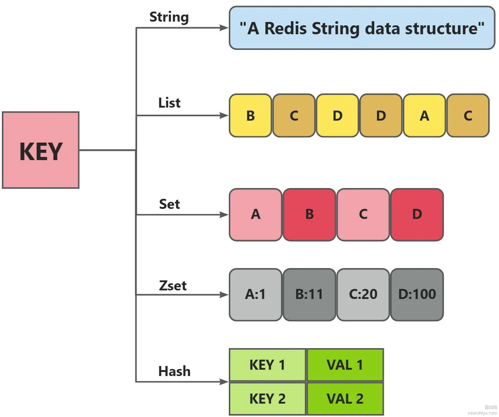

# 什么是redis
redis是基于c语言开发的一个非关系数据库，存储的是kv键值对的数据。相比与传统的磁盘数据库不同，他是基于内存存储的，读写速度更快，贝广泛应用于缓存方面。

# redis有多少种数据类型？
## 基本数据类型五种：

## 5 种数据类型对比
### String 
**结构存储的值**:

字符串，整数，浮点数

**结构的读写能力**:

一种二进制安全的数据类型，支持存储：字符串、整数、浮点数、图片 (图片的 base64 编码或者图片路径)、序列化后的对象；

### List

**结构存储的值**:

链表结构，链表上的每个节点都包含一个字符串

**结构的读写能力**:

链表两端可进行插入和删除操作，支持遍历读取和反向查找，更加方便操作

### Set

**结构存储的值**:

包含字符串的无序集合

**结构的读写能力**:

无序集合，集合中的元素保证唯一性，类似于 HashSet
### Zset

**结构存储的值**:

和散列一样，用于存储键值对

**结构的读写能力**:

和 Set 相比，Sorted Set 增加了一个权重参数 score
，使得集合中的元素能够按照 score
进行有序排序。

### Hash

**结构存储的值**:

包含键值对的无序散列表

**结构的读写能力**:

String 类型的 field-value (键值对) 映射表，特别适合用于存储对象，后续可以直接修改这个对象中的某些字段的值

## 四种特殊数据结构:
- **HperLogLogs**（基数统计）:可以用来统计页面UV
- **BitMap（位存储）**:用户签到
- **geo（地理位置）**:用来存储地理位置
- **stream**:用作消息队列

# 说一下redis的常用命令（你平时都用哪些redis命令）
- set key value 设置键值对
- get key  获取键的值
- type key 查看键的类型
- exists key 查看redis对应的key是否存在
- del key 删除对应的键
- expire key 设置过期时间（秒）
- ttl key 查看键的过期时间（秒）

# Redis都用到了哪些数据结构？
### 首先先说redis常用的数据结构有：
- String
- List
- Set
- Zset
- Hash
- HypeLogLog
- BitMap
- Geo
- Stream
### 项目里面用到的数据结构：
- 我常用的有String和ZSet还有BitMap。
- 比如我在项目中用String做缓存还有做计数器统计用户访问题目的一个频率
- ZSet用来做排行榜
- BitMap用来纪录用户签到

# Redis你是怎么用的
通过引入redis依赖还有Redission依赖去引入Redis客户端(RedisTemplate和RedissionClient做缓存
- 做计数器
- ZSet做排行榜
- BitMap做用户签到
- 用Redission的RRateLimiter做限流

# Redis的锁你是怎么用的？
- Redis的锁我一般使用redission来实现。
- 引入依赖后可以用RedissionClient.getLock()获取锁对象，锁对象调用Lock(),unlock（）进行加锁解锁

# Redis的分布式锁怎么设计？
### 1.setnx
利用redis的setnx 1命令，天然互斥，key不存在，设置成功返回1（加锁成功），设置失败返回0（锁被占用）。然后执行完后释放锁 dek key;

### 2.setnx+过期时间（setnx key 1 px 10,000):

刚才第一版那种方法，如果拿到锁后，服务器宕机了，那锁就永远无法释放，所以说需要锁加过期时间，而且拿到锁和设置过期时间需要原子，setnx中的px命令可以做到；

### 3.setnx+过期时间+UUID（防止锁误删+lua 第二版)

又有一个问题，假如线程A拿到了锁，十秒后还没执行完，锁自动过期;此时线程B拿到了锁，还没执行完A此时执行完了，把线程B的锁删了，此时线程C拿到锁...,循环。 所以我们在setnx key value的时候，把value设置为一个唯一的uuid,这样就能在删除前通过value判断是不是自己的锁，而且判断并且执行这是两步操作，我们需要原子，所以还得使用lua脚本保证是原子操作

## 4.setnx+过期时间+UUID+看门狗（续锁） 
第三版我们虽然解决了锁误删问题，但其实锁过期后其他线程进来不仅会打乱原来线程执行的业务，所以还是需要线程执行完再释放锁，所以我们可以使用一个守护线程，每隔过期时间的三分之一就去看锁还在不在，在就说明业务还没执行完，给锁续期。
# Redis怎么实现和mysql的一致性?
- **先更新数据库，再删缓存**：实时一致性要求高的场景首选，虽然极端情况下会短暂不一致，但概率很低
- **缓存双删**：先删缓存、更新数据库、延迟再删一次，能解决"先删缓存再更新数据库"的并发问题
- **Binlog 异步更新**：用 Canal 监听 MySQL Binlog，通过消息队列异步删除缓存，最终一致性最好
- 读操作就都是去读缓存，没有就去读数据库然后更新缓存。
## 如果在一个没有提交的事务内怎么保证数据一致?
- 前两种方法在事务没有提交前，其他线程读取数据其实更新的值是感知不到的，其他线程读到的还是旧值，也就变成了删除缓存然后再更新数据库这种情况。
- 但是Binlog异步更新的方案就不一样了，只有提交事务时binlog才会变化，才会触发删除缓存的操作。
