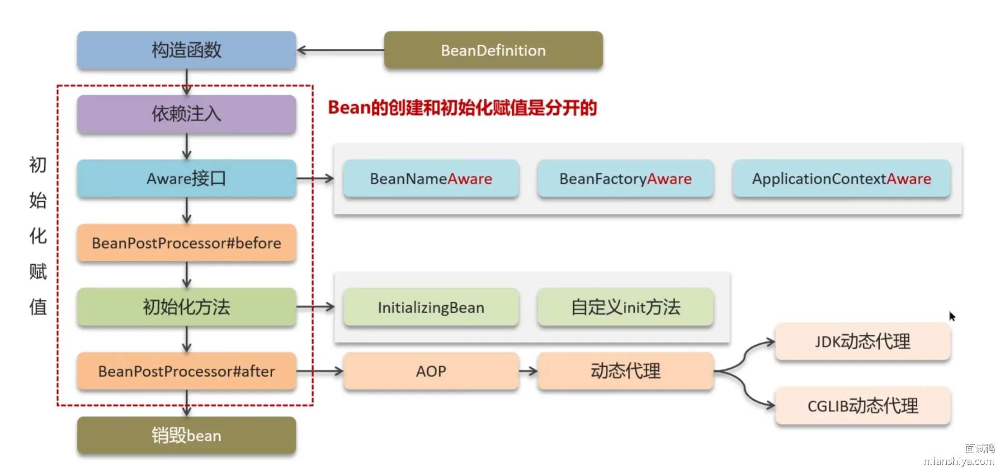
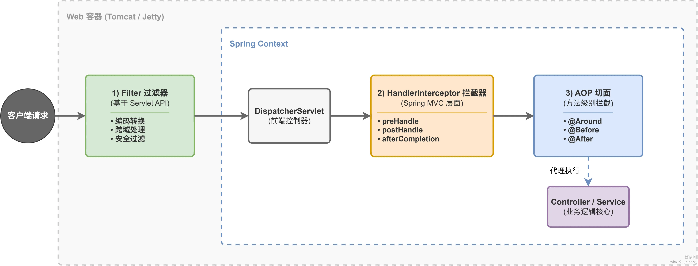

# SpringIOC
## 定义：
IoC指的是将对象的创建和管理交给spring容器，而不是自己new。

我们只需要在xml配置bean，spring容器在初始化时就会读取这些配置，然后通过反射生成对应的bean实例。当需要某些对象时，spring就会从容器中拿到对应的bean对象并通过依赖注入赋值给我们。
##  好处：
1. 实现对象之间的解耦
2. 可扩展性强，将对象的创建和管理交给IOC容器管理，可以在不修改业务的情况下增加额外功能，比如AOP，日志，事务。

## DI
依赖注入指的是由容器负责依赖对象的注入（比如a依赖b,将被依赖对象b注入到目标对象a），是实现IOC的一个核心的机制，他有五种依赖注入方式:
- 构造器注入
- setter方法注入
- 还有字段注入（比如AutoWired）
- **方法注入**：在普通方法上标记 @Autowired，方法参数会被自动注入。适合需要多个依赖一起初始化的场景。
- **接口回调注入**：实现 Spring 内置的 Aware 接口，比如 BeanFactoryAware、ApplicationContextAware，Spring 会自动回调注入对应的组件。

# AOP
### 定义：
AOP指的面向切面编程，是在不改变业务的情况下，动态的将一些功能增强到业务当中，比如日志打印。
### 实现aop有五大核心：
- 切面（功能模块，比如日志切面）
- 通知（执行时机，比如执行方法后）
- 连接点（可能被增强的节点）
- 切入点（真正被增强的节点）
- 织入（增强的过程）。
### 底层实现：
- AOP是动态织入，运行的时候通过动态代理实现（JDK代理或者CGLib代理）
- Spring默认使用JDK动态代理
- springBoot2版本使用CGLib代理。
#### 两者的区别:
- JDK动态代理是基于接口进行代理，代理类必须实现一个或多个接口
- CGLib动态代理是基于子类进行代理，代理类无需实现接口

# 通知类型
- **前置通知**:方法执行前通知
- **后置通知**:方法执行成功后通知
- **后置异常通知**:方法执行异常后通知
- **后置最终通知**:方法执行成功与否都进行通知
- **环绕通知**:方法执行前后进行通知

# 写一个AOP的一个具体操作：
## 定义一个注解：
````
@Target(ElementType.METHOD)       // 注解只能用在方法上
@Retention(RetentionPolicy.RUNTIME)// 运行时生效，AOP必须用这个
public @interface MyLog {
    // 可以加属性，非必须
    String value() default "";
}
````
### 编写切面类
````
// 切入点：匹配所有加了 @MyLog 注解的方法
@Pointcut("@annotation(com.xxx.annotation.MyLog)")
public void logPointcut() {
}
````
### 定义切入点
````
// 切入点：匹配所有加了 @MyLog 注解的方法
@Pointcut("@annotation(com.xxx.annotation.MyLog)")
public void logPointcut() {
}
````
### 编写通知
````
@Around("logPointcut()")
public Object around(ProceedingJoinPoint joinPoint) throws Throwable {
    // 1. 方法执行前：打印日志、权限校验、统计耗时
    System.out.println("方法执行前");

    // 2. 执行目标方法（必须调用，否则业务方法不跑）
    Object result = joinPoint.proceed();

    // 3. 方法执行后：打印结果、记录日志
    System.out.println("方法执行后");

    return result;
}
````
### 使用注解
````
@Service
public class OrderService {

    @MyLog("下单接口")
    public void createOrder() {
        System.out.println("创建订单");
    }
}
````
### 原理：
- Spring 扫描到 @Aspect，识别为切面
- 根据切入点表达式，找到所有被 @MyLog 标记的方法
- 动态代理（JDK 代理 / Cglib）生成代理类
- 调用目标方法时，先走切面通知，再执行原方法
- 这个过程叫 织入（Weaving）

# Spring框架中都用到了哪些设计模式？
- **工厂模式**：BeanFactory就是简单工厂模式的体现，用来创建对象的实例；
- **单例模式**：Bean默认为单例模式。
- **代理模式**：Spring的AOP功能用到了JDK的动态代理和CGLIB字节码生成技术；
- **模板方法**：用来解决代码重复的问题。比如.RestTemplate,RabbitTemplate, JpaTemplate。
- **适配器模式**: spring MVC 的 HandlerAdapter
- **观察者模式**: Spring Event事件驱动

# bean的定义：
任何被Spring容器管理的对象都叫作bean

# beanFatory
BeanFactory是bean工厂，由IOC底层容器实现，用来创建和管理bean

# Bean的注入方式有哪些
- **构造函数注入**：通过类的构造函数来注入依赖项。
- **Setter注入**：通过类的Setter方法来注入依赖项。
- **Field(字段）注入**：直接在类的字段上使用注解（如@Autowired或@Resource)来注入依赖

# bean的作用域有多少种？
bean的作用域有6种:
1. **singleton**:单例,ioc容器只有一个
2. **protype**:原型，ioc容器有多个
3. **application**:每个web应用创建一个
4. **session**:每次会话创建一个
5. **request**:每次请求创建一个，请求完销毁
6. **websocket**:每次长连接创建一个

# bean的生命周期 

1. 先实例化bean
2. 对bean进行属性注入
3. 检查bean有没有实现aware接口，有将对应的资源给bean,比如bean的名字，工厂。
4. 调用所有BeanPostProcess的PostProceessBeforeInitialization方法进行前置处理。
5. 初始化bean
6. 调用所有BeanPostProcess的PostProceessAfterInitialization方法进行后置处理。比如AOP.
7. 销毁bean

# bean注入方式？
## 1. XML 配置方式
````
-<bean id="..." class="..."> 
````
- 传统方式，现在很少写全量 XML，但仍需知道。

## 2. @Component 系列注解（扫描方式）

- 注解：@Component 、@Service 、@Controller 、@Repository
- 依赖：必须在 @ComponentScan 扫描包下
- 特点：被动被扫描，适合自己项目里的类

## 3. @Configuration + @Bean（手动注册）
````
@Configuration
public class Config {
@Bean
public UserService userService() {
return new UserService();
}
}
````
- 配置类要被扫描到
- 适合：第三方类、需要复杂构造的 Bean

## 4. @Import 方式（主动导入）

- 写在 @Configuration 配置类上
- 配置类必须被扫描，但被导入的类可以不在扫描包内

## 一句话整体区分（好记）

- XML：老方式
- @Component：靠扫描，被动注册
- @Bean：在配置类里手动 new
- @Import：主动把类“拉”进容器，不受包扫描限制

# 自动装配方式？
Spring装配指的是SpringIoc容器根据bean的类型或者名称自动注入依赖的bean
- 根据bean类型进行装配
- 根据bean名称进行装配

# 循环依赖
## 一、循环依赖定义
指两个或者多个bean相互引用，形成闭环。
## 二、Spring解决方案
Spring采用三级缓存解决循环依赖问题，核心思想：用半成品Bean的地址完成依赖赋值，无需等待对方完整初始化后再赋值。

1. 一级缓存：存放完全初始化完成的Bean。
2. 二级缓存：存放已实例化但未完成初始化的Bean（仅持有Bean地址）。
3. 三级缓存：存放Bean的工厂方法，用于延迟获取早期的bean对象

## 三、三级缓存执行流程

循环依赖完整流程（A ↔ B）

- 实例化Bean A：调用构造方法实例化A，实例化完成后将Bean A的工厂 ObjectFactory 加入三级缓存。 
- ObjectFactory 作用：延迟初始化，后续可获取Bean A的早期对象。 
- 依赖注入Bean A：对A进行依赖注入，发现A依赖B。检查一、二级缓存，未找到Bean B。 
- 实例化Bean B：创建B，先实例化，再将B的工厂加入三级缓存。 
- 依赖注入Bean B：检查一、二级缓存，未找到A，调用三级缓存中A的工厂，根据是否需要代理获取早期的bean代理对象(就是刚才实例化的那个，加了层代理而已)或者原始对象(就是刚才实例化的那个)，完成B的依赖注入。 
- Bean B初始化完成：B初始化后，将其加入一级缓存。 
- 继续初始化Bean A：从一级缓存获取已初始化完成的B，完成A的依赖注入，将A放入一级缓存。

## 四、使用二级缓存可以吗？
### 实际方案：使用三级缓存(Factory)

1. 实例化 Bean A
2. 放入三级缓存（工厂 ObjectFactory）
3. 判断是否有循环依赖：
- 否（大多数情况）：工厂不被调用 → 初始化后创建代理（标准生命周期）
- 是（A依赖B，B依赖A）：工厂被触发 → 提前创建代理（特殊处理）
### 总结

三级缓存就是为了在解决循环依赖和维持标准生命周期之间做一个平衡。它让我们可以只在真正发生循环依赖的时候，才去提前创建代理对象；否则，就按兵不动，维持原样。
## 五、三级缓存解决循环依赖的条件

1. 涉及的Bean均为单例对象。
2. 字母顺序在前的Bean（如先创建的A）必须通过set方法注入属性（而非构造方法注入）。

## 六、三级缓存失效场景

1. 构造器注入循环依赖：A的构造方法依赖B，B的构造方法依赖A，对象无法实例化，三级缓存失效。
2. bean是原型（prototype）作用域：原型Bean每次获取都会创建新实例，A依赖新B、B依赖新A，形成无限循环，三级缓存失效。

## 七、失效场景解决方法

可通过@Lazy注解实现懒加载，解决上述循环依赖失效问题。

# SpringMVC说一下？
Spring MVC 是 Spring的基础上 对 MVC 的实现，在传统 MVC 基础上做了扩展：

- 将 Model 层拆分为业务模型 Service 和数据模型 Repository；
- 将 Controller 层拆分为前端控制器 DispatcherServlet 和后端控制器 Controller；
- 相比之前 Servlet+JSP 每个url都要写一个servlet的模式，它和 Servlet 解耦，简化了 Web 开发，不用再写大量 Servlet。

# SpringMVC和Spring的关系

Spring 是基础，Spring MVC 是构建在 Spring 之上的 Web 层框架，依赖 Spring 的 IOC、DI、AOP 等能力来处理 Web 请求。

# Spring的好处？
1. 第一个好处就是将对象的创建，管理和依赖注入交给IOC容器，而不需要我们自己new。
2. 第二个好处就是有AOP,可以在不改变业务逻辑的情况下动态增强功能。

# spring事务管理方式
- 编程式事务：通过 TransactionTemplate 或者TransactionManager 手动管理事务
- 声明式事务：@Transactiona, 通过aop实现的

# Spring事务隔离级别？
Spring的隔离级别有:

读未提交，读已提交，可重复读（默认），串行化。

如果数据库和spring隔离级别不一样以spring为主

# Spring事务传播行为？
### 作用：
事务传播行为指的是:事务方法被另一个方法调用的时候，事务要怎么传播
## 种类
### 事务的解决方案（A套B）:
- 融入事务:B直接用A的事务。缺点是B错A会回滚
- 挂起事务:A执行事务B挂起，B执行事务A挂起，两者事务单独执行。
- 嵌套事务:B错A不回滚,A错B回滚（大影响小，小不会影响大）

## 事务传播机制（7种）
### 融入三种:
调用方法有则事务融入，没有则创建新事务，不开启事务和抛出异常

### 挂起两种
新建事务，或者不开启事务，如果调用方法有事务则挂起调用方法事务

### 嵌套一种:
如果调用方法有事务就嵌套事务（即子事务回滚时父事务不影响，父事务回滚时子事务跟着回滚），没有则新建事务。

### 永无事务:
不开启事务，如果调用方法有事务则抛出异常

# Spring事务什么时候失效？
### 修饰符相关（3种）
- 1.事务方法是static修饰的静态方法（属于类）
- 2.事务方法被final修饰（无法继承，也就无法代理）
- 3.事务方法不是public修饰（非public也无法代理）

### 类自身（2种）
- 4.事务方法的类不是spring容器管理（代理在bean初始化后）
- 5.事务方法是在类内调用（类内调用的方法，this不会走动态代理）

## 异常（2种）
- 6.事务方法抛出的异常不在范围内（比如@Transational注解默认error和runtimexception回滚）如果是**IOException**就会失效
- 7.事务方法抛出的异常被try catch捕获

## 设定错误
- 8.事务传播方式设定错误（比如父事务挂起，开启新事务）
- 9.数据库不支持事务

# @Qualifier注解作用
@Qualifier 就是用来指定要注入的 Bean 名称，从而解决同一类型多个 Bean 实例时的注入冲突问题。

搭配：
````
- @Autowired + @Qualifier("bean名字")
````
就可以精准指定注入哪一个 Bean。

# @Bean和@Component的区别？

- **@Bean：**配合@Configuration注解标注在方法上，将方法返回值注入Spring容器。
- **@Component：**标注在类上，被Spring扫描后将类实例注入容器。

# #@Component系列注解的区别？
- Component系列注解指的是：@Component,@Controller,@Service,@Repository
- 本质没有任何区别，都是为了更好的区分业务

# 单例Bean是否有并发安全问题？
单例bean有并发安全问题，只要bean里面有可修改的实例变量，在多线程同时修改的话就会出现并发安全问题。

### 解决:
- 可以用ThreadLocal来存变量，让变量变成线程私有。
- 可以通过加锁来保证同一时间只有一个线程能够访问变量。

# @Primary注解的作用？
@primary注解标注在bean实例上，意义是在多实例bean冲突时，优先用标注@primary注解的bean

# @value注解的作用？
@Value可以给标注字段赋值，可以直接写一个默认值或者从配置文件读取值给他

# @RequestBody和@responseBody的作用？


# @PathVariable的作用？
@PathVariable是用来读取路径的参数

# @valid和@validated的区别？
- valid不支持分组校验
- validated支持(将字段校验分不同的组，不同情况下可以使用不同组进行校验)
### @valid
````
import javax.validation.Valid;
import javax.validation.constraints.NotBlank;
import javax.validation.constraints.NotNull;

// 嵌套对象
class Address {
    @NotBlank(message = "地址不能为空")
    private String detail;
}

// 主实体
class User {
    @NotBlank(message = "用户名不能为空")
    private String username;

    // @Valid 支持嵌套校验（@Validated 本身做不到）
    @Valid
    @NotNull(message = "地址不能为空")
    private Address address;
}

// Controller
@RestController
@RequestMapping("/valid")
public class ValidController {

    @PostMapping("/add")
    public String add(@Valid @RequestBody User user, BindingResult result) {
        if (result.hasErrors()) {
            return result.getFieldError().getDefaultMessage();
        }
        return "校验成功";
    }
}
````
### @validated
````
import org.springframework.validation.annotation.Validated;
import javax.validation.constraints.NotBlank;

// 分组定义
class Group {
    public interface Add {}
    public interface Update {}
}

// 实体
class User {
    @NotBlank(message = "ID不能为空", groups = Group.Update.class)
    private String id;

    @NotBlank(message = "用户名不能为空", groups = Group.Add.class)
    private String username;
}

// Controller
@RestController
@RequestMapping("/validated")
public class ValidatedController {

    // 新增分组校验
    @PostMapping("/add")
    public String add(@Validated(Group.Add.class) @RequestBody User user) {
        return "新增校验成功";
    }

    // 更新分组校验
    @PostMapping("/update")
    {
        return "更新校验成功";
    }
}
````

# @Schedule注解的作用
schedule注解用来做定时任务，可以配合cron表达式(秒，分，时，日，月，周，年)，得在启动类上面加一个EnableSchedule

# @condition注解作用
@condition注解用来根据条件决定是否加载bean

# @Async的原理是什么？
- @Async 实现方法异步调用，底层基于 AOP 动态代理 + 线程池。
- Spring 会为标了 @Async 的类/方法生成代理对象，调用方法时拦截，把方法包装成任务提交到线程池，主线程直接返回，不阻塞等待。

### 默认线程池是什么

- Spring Boot 2.x 以后，@Async 默认用 SimpleAsyncTaskExecutor
- 它不是真正的池，来一个任务就开一个新线程，无上限复用。

### 默认线程池的弊端

- 无限创建线程：高并发下会创建大量线程，导致 OOM 或服务器资源耗尽
- 无线程复用：每次都 new Thread，频繁创建销毁开销大
- 无拒绝策略：任务堆积没有保护机制

### 所以生产上要怎么做

必须重写自定义线程池：

- 配置核心线程数、最大线程数、队列容量、空闲时间、拒绝策略
- 实现 AsyncConfigurer 或直接定义 ThreadPoolTaskExecutor 交给 Spring 管理

# @Async失效场景：
其实本质上是AOP失效，有以下几种场景:

### 修饰符相关（3种）
1. 方法不是public修饰（非public也无法代理）
2. 方法是static修饰的静态方法（属于类）
3. 方法被final修饰（无法继承，也就无法代理）

### 类自身（2种）
4. 方法的类不是spring容器管理（代理在bean初始化后）
5. 方法是在类内调用（类内调用的方法，this不会走动态代理）

### 其他（2种）
6. 异步方法返回类型错误
7. 启动类没有用@EnableAsync注解

# RestFul风格说一下？
RESTful 是一种 API 设计风格，核心是用 URL 表示资源，用 HTTP 方法表示对资源的操作，而不是用接口名描述行为。

1. URL 代表资源（如 /user 、/order/101）
2. HTTP 方法代表动作：
- GET：查询
- POST：新增
- PUT：全量修改
- DELETE：删除

响应用状态码表示结果，接口更统一、语义更清晰。

比如 GET /user/{id} 表示获取指定id的用户

# 什么是SpringBoot?
SpringBoot是简化spring应用开发的框架。采用约定大于配置的思想，将Spring的经常需要的配置自动给我们完成，如果需要更改只需要在配置文件中进行修改就行。（比如约定默认端口号server.port=8080，如果不想这个端口直接在配置文件中修改。）

### 它主要体现在：
- SpringBoot Starter起步依赖，帮我们导入spring开发常用jar包，通过parent帮我们管理版本，避免版本冲突。
- SpringBoot的自动装配，可以减少spring复杂的xml配置（mysql为例）
- SpringBoot内置的单独的Tomcat容器，不需要我们手动去将应用部署到Web容器中

# SpringBoot核心特点;
- **start起步依赖**:帮我们导入spring开发常用jar包
- **自动装配**:通过@enableAutoConfiguration注解扫描Meta/spring.fatories文件，读取所有的自动配置类，通过注解条件决定加载配置类
- **内嵌tomact服务器**:不用将应用打成war包部署到外部web容器
- **外部化配置**:可以通过yml文件来修改配置监控和管理

# SpringBoot如何实现自动装配的？
- 通过@EnableAutoConfiguration注解实现自动配置。
- 该注解会通过@import注解导入一个AutoConfigurationImportSelector类
- 该类会通过springFactoriesLoader去扫描的所有的META-INF/spring.factories&nbsp文件
- 找到所有的自动配置类，然后将满足条件注解的自动配置类加载到spring容器中。后续我们就可以直接注入自动装配的bean.

# Spring Boot 中 application.properties 和 application.yml 的区别是什么？
- 书写格式不同。 
- 优先级不同：properties比yaml优先加载

# 如何在 Spring Boot 中定义和读取自定义配置？
- 可以使用@Value注解
- @ConfigurationProperties注解

# Spring Boot 配置文件加载优先级你知道吗？
- 命令行最优先
- jar包外比jar包内优先
- p带profile比不带profile优先
- roperties比yml优先

# Spring Boot 打成的 jar 和普通的 jar 有什么区别 ?
springboot打的jar包的比普通多了个内嵌服务器，不需要部署在外部web容器就可以直接运行

# 怎么理解SpringBoot的start？
start可以看成一组依赖集合，引入一个start就等于引入了这一组依赖
### 如何自定义start?
- 首先先创建一个项目，写一个自动配置类（@Configuation）
- 然后再写一个属性类（用于别人导入start后可以动态修改配置,@ConfiguationProperties注解声明）
- 最后在Meta-Info文件下的spring.factories文件下写入自动配置类的路径.
- 最后install打包到本地仓库，别的项目就可以通过pom文件进行导入了

# Spring Boot 如何处理跨域请求（CORS）？
## 跨域定义:
跨域指的是浏览器在访问后端时，会检查协议，域名 端口一不一致，如果有有不一致的说明发生了跨域
## 解决办法:
### 局部跨域:
使用@CrossOrigin注解
### 全局跨域:
使用corsFilter过滤器

# SpringApplication有哪些注解？
- @Configuration注解
- @EnableAutoConfiguration注解
- ComponentScan注解

# 拦截器和过滤器的区别？
### 拦截的范围不同:
1. 过滤器是Servlet层面的，能拦截所有请求
2. 而拦截器是SpringMVC层面，只能拦截controller请求（dispachterServlet请求）
### 执行的顺序不同:
过滤器比拦截器先进行。

# ；拦截器的三个接口？
- **preHandle**在加入controller前执行，返回true放行，false直接拦截
- **postHandle**在controller执行完后执行
- afterCompletion在整个请求结束后执行，适合做清理工作，或者日志收尾

# 如果某个拦截器的 preHandle 返回 false，后面的拦截器还会执行吗？
### 回答：
不会。preHandle 返回 false 表示请求被拦截，整个链路直接中断，后续的 interceptor 和 Controller 都不会执行。但已经执行过 preHandle 的那些 interceptor，它们的 afterCompletion 方法还是会被调用，用来做资源清理。

# Filter、Interceptor、AOP 三者的执行顺序是怎样的？

### 回答：
**Filter** 最先执行，因为它在 Servlet 容器层面拦截，请求还没进 Spring。然后是 **HandlerInterceptor** 的 preHandle，接着是 **AOP 切面**，最后才到 Controller 方法。返回时顺序反过来：先出 **AOP**，再 **postHandle**，最后 **afterCompletion** 和 **Filter**。

# 多个切面之间的执行顺序怎么控制？
### 回答：
用 @Order 注解（标注在AOP切面上）或者实现 Ordered 接口(方法返回一个数值)。数值越小优先级越高，先执行。如果不指定顺序，Spring 按类名字母序处理，这就不可控了，生产环境建议都显式指定 @Order。

# 分布式和微服务的区别？
### 分布式
分布式指的是将单个应用部署到多个服务器上，提高性能。
### 微服务
微服务指的是将整个应用拆分成多个单一职责的服务，降低服务之间的耦合

# 微服务有哪些核心组件？
## 注册中心
### 常用组件：
Nacos, Eureka, Zookeeper, Consul
### 作用
负责服务的注册与发现
## 配置中心
### 常用组件：
Nacos, Apollo, Spring Cloud Config
### 作用：
集中管理各个微服务的配置文件，支持不同环境（Dev/Test/Prod）的配置隔离，以及运行时的配置动态刷新
## API 网关
### 常用组件：
Spring Cloud Gateway, Zuul
### 作用：
微服务架构的统一入口，负责路由转发、鉴权认证、全局限流等
## 远程调用与负载均衡（RPC & Load Balancing）
### 常用组件：
OpenFeign, Dubbo, Spring Cloud LoadBalancer, Ribbon。
### 作用：
服务间的通信，在多个服务实例中做负载均衡，避免单点压力。
## 容错降级
### 常用组件：
Sentinel, Hystrix, Resilience4j。
### 作用：
为了避免服务雪崩。当某个微服务流量太大或者出现故障时，做限流，熔断，或者降级，保护系统。
## 分布式链路追踪
### 常用组件：
SkyWalking, Zipkin, Jaeger
### 作用：
用于记录一个请求经过的所有服务，帮助快速定位性能瓶颈和报错节点
## 分布式事务（Distributed Transactions）
### 常用组件：
Seata, RocketMQ（基于可靠消息最终一致性）。
### 作用
解决跨多个微服务、跨多个数据库的数据一致性问题。

# SpringBoot和SpringCould的区别？                                                                                                                解决跨多个微服务、跨多个数据库的数据一致性问题。
- SpringBoot是用来简化单体Spring应用的开发
- SpringCould基于SpringBoot用来构建微服务框架

# 为什么需要服务注册与发现？
分布式系统里服务数量多、变化快，靠人工维护服务之间的调用关系根本搞不定。今天加两台机器，明天下掉三台，服务 IP 天天在变，如果每次都要改配置文件重新发布，运维早就疯了。

服务注册与发现就是用一个注册中心来自动管理这些关系。服务启动后主动把自己的信息（服务名、IP、端口）注册上去，消费者要调用谁，直接问注册中心拿地址列表就行，不用关心具体哪台机器。

### 整个流程是这样的：

1. 服务提供者启动时，向注册中心注册自己的信息
2. 注册中心存储所有服务实例的元数据
3. 服务消费者启动时，从注册中心订阅所需服务
4. 注册中心将服务列表推送给消费者
5. 消费者根据负载均衡策略选择一个实例发起调用
6. 服务上下线时，注册中心主动通知消费者更新本地缓存

# 提问：配置中心的配置和本地配置文件同时存在时，优先级是怎样的？
回答：一般是配置中心优先级更高，会覆盖本地配置。以 Nacos 为例，它的加载顺序是先加载本地的 application.yml，再加载配置中心的配置，后加载的覆盖先加载的。但这个优先级是可以配置的，有些场景下你可能希望本地配置优先，比如本地调试时想临时改个参数，不想影响配置中心的值。

## 提问：配置中心存储敏感信息比如数据库密码，怎么保证安全？
### 回答：几个层面一起做。
- 首先配置中心本身要有权限控制，不同团队只能看自己项目的配置
- 其次敏感配置要加密存储，配置中心一般都支持配合 Jasypt 这类工具，存的是密文，服务启动时解密。再者传输过程要走 HTTPS，防止中间人截获。
- 最后审计日志要开，谁在什么时间改了什么配置，全部记录下来，出问题能追溯。

# 提问：配置中心挂了，服务还能启动吗？
# 回答：
大部分配置中心客户端都有本地缓存机制。服务第一次启动时从配置中心拉到配置会缓存到本地磁盘，后续启动如果配置中心挂了，会用本地缓存的配置启动。Nacos 客户端就有这个机制，缓存文件默认在 ~/nacos/config 目录下。但如果是第一次启动且配置中心挂了，那就起不来了，因为没有本地缓存可用。

# 为什么需要负载均衡？
1. 负载均衡的核心目的是把请求流量分摊到多台服务器上，让系统能扛住更大的并发量
2. 同时避免单台机器挂掉导致整个服务不可用。

# 怎么实现负载均衡？
### 1.客户端负载均衡（Ribbon）

消费者通过本地缓存的服务实例选择一个实例进行请求。

### 2.服务端负载均衡（Nginx,GateWay）

请求先经过负载均衡器，又负载均衡器决定转发到哪个实例

# 负载均衡算法有哪些？
1. 轮询
2. 加权轮询
3. 随机
4. 加权随机
5. 最少连接数
6. 哈希算法

# Http和gRPC之间的区别？
- Http是一种通信协议，他规定了发请求必须是请求头，请求行，请求体，响应必须是状态行，响应头，响应体。优势是通用，通常用于前后端请求和三方API使用

- RPC是一种通信方式，可以跟调用本地方法一样调用远程服务，通常用于微服务之间的远程调用（比如服务A用@DubboService暴露接口，服务B用@DubboReference注入服务A,然后直接调用方法）

# 提问：什么时候该用 HTTP 接口，什么时候该用 RPC？
### 回答：
- 对外暴露给第三方的接口用 HTTP，因为通用性好，不挑语言不挑框架，Postman 就能调试。
- 内部微服务之间通信用 RPC，调用体验好，性能高。
- 有个简单的判断标准：如果调用方你控制不了，就用 HTTP；调用方也是你自己的服务，就用 RPC。

# 提问：Dubbo 和 Spring Cloud OpenFeign 都能做服务调用，怎么选？
### 回答：看团队技术栈和性能要求。
- OpenFeign 上手简单，就是声明个接口加注解，底层走 HTTP，跨语言方便。
- Dubbo 性能更好，功能更全，服务治理能力强，但学习曲线陡一些。高并发、低延迟的核心链路用 Dubbo，
- 边缘业务或者团队 Java 经验不足就用 OpenFeign。两者也可以混用，不是非此即彼。

# OpenFeign
### 核心原理
- 基于动态代理生成HTTP请求
- 依赖服务注册中心（如Eureka）实现服务发现
## 实现步骤与代码
### 添加依赖
````
<dependency>
  <groupId>org.springframework.cloud</groupId>
  <artifactId>spring-cloud-starter-openfeign</artifactId>
</dependency>
````
### 服务A编写controller
````
   @GetMapping("/getUser")
    Result getUser() {
        return Result.success("成功");
    }

````
### 服务B添加接口 @FeignClient,并接口撰写与服务端相同的controller方法
````
@Component
@FeignClient(value = "product-service-name")
public interface ProductServiceApi {
    @GetMapping("/getUser")
    Result getUser() {};
}

````
### 关键配置（application.yml）
````
feign:
client:
config:
default:
connectTimeout: 5000   # 连接超时(ms)
readTimeout: 10000      # 读取超时(ms)
````

# Dubbo实现跨服务调用
### 核心原理
- 基于接口代理的透明化RPC调用
- 使用Netty实现长连接通信
## 实现步骤与代码
### 添加依赖
````
<dependency>
  <groupId>org.apache.dubbo</groupId>
  <artifactId>dubbo-spring-boot-starter</artifactId>
  <version>3.0.8</version>
</dependency>
````
### 定义共享接口（API模块）
````
public interface UserService {
UserDTO getUserById(Long id); // 需序列化的DTO
}
````
### 服务提供者实现
````
@DubboService // 暴露Dubbo服务
public class UserServiceImpl implements UserService {
@Override
public UserDTO getUserById(Long id) {
return userRepository.findById(id);
}
}
````
### 服务消费者调用
````
@RestController
public class OrderController {
@DubboReference // 引用远程服务
private UserService userService;

@GetMapping("/order/{userId}")
public Order getOrder(@PathVariable Long userId) {
UserDTO user = userService.getUserById(userId); // RPC调用
return new Order(user);
}
}
````
### 关键配置（application.yml）
````
dubbo:
application:
name: order-service
registry:
address: nacos://localhost:8848 # 注册中心地址
protocol:
name: dubbo
port: 20880
````

# 什么是Feign?
Feign 是一个声明式的 HTTP 客户端，让你调用远程服务就像调用本地方法一样简单。

传统方式用 HttpClient 或 RestTemplate 调接口，得自己组装 URL、拼参数、处理响应，代码又臭又长。

Feign 的思路是：你只管定义一个接口，用注解标明请求方式和路径，剩下的活儿它全包了。

举个例子，调用订单服务的接口：
````
@FeignClient(name = "order-service")
public interface OrderClient {

    @GetMapping("/order/{id}")
    Order getOrderById(@PathVariable("id") Long id);

    @PostMapping("/order")
    Order createOrder(@RequestBody Order order);
}
````
用的时候直接注入这个接口，调方法就行：
````
@RestController
public class OrderController {

    @Autowired
    private OrderClient orderClient;

    @GetMapping("/my-order/{id}")
    public Order getOrder(@PathVariable Long id) {
        // 像调本地方法一样调远程服务
        return orderClient.getOrderById(id);
    }
}
````
Feign 在运行时会给这个接口生成动态代理，帮你把方法调用翻译成 HTTP 请求发出去。
### Feign 的调用流程：

- 应用代码调用接口方法
- 动态代理拦截方法调用
- 解析注解，构建 HTTP 请求
- 通过负载均衡选择服务实例
- 发送请求，接收响应
- 反序列化响应体，返回结果

# Feign和OpenFeign?
- Feign和OpenFeign都是声明式的Http客户端,用于简化Http调用，
- 但OpenFiegn在Feign的基础上兼容了SpringClould的生态，可以支持SpringMVC的注解（@GetMapping,PostMapping）
- 自带负载均衡（LoadBlance），还可以结合Sentinel做限流和熔断，降级

# Feign和Dubbo的区别？
eign 是一个声明式的 HTTP 客户端，通过接口注解的方式发起 HTTP/REST 请求，底层走的是 HTTP 协议。

Dubbo 是阿里开源的 RPC 框架，默认使用自定义的 Dubbo 协议进行二进制序列化通信，性能比 HTTP 高不少。
### 只看通信层面的话：

- Feign 基于 HTTP 协议，请求报文是文本格式，跨语言友好但报文体积大、解析慢
- Dubbo 默认用私有协议，报文是二进制格式，体积小、解析快，但跨语言需要额外适配。
### 从使用场景看：

- Feign 更适合对外开放 API 或者异构系统调用的场景，Spring Cloud 体系里服务间调用基本都用它。
- Dubbo 更适合内部高并发、低延迟的服务调用，像电商大促场景下订单调用库存，一秒几万次调用，用 Dubbo 能省不少网络开销。

# 什么是缓存雪崩？
服务雪崩指的是在**微服务调用链路**中某个服务故障，导致依赖的服务连锁故障。比如a调b,b调c。c故障了导致b故障，又导致a故障

# 服务熔断
服务熔断是一种防止系统过载的保护机制。，当一个服务因为故障（如网络问题、服务不可用等）导致大量请求失败时，熔断器会“断开”这个服务，阻止更多的请求发送到这个服务，从而保护系统不被进一步的故障影响。
### 熔断器的三种状态：

- Closed（关闭）： 正常状态，所有请求都转发给目标服务。✅
- Open（开启）： 熔断状态，所有请求都被拦截，直接返回错误。❌
- Half-Open（半开）： 尝试恢复状态，允许少量请求通过，如果请求成功，则关闭熔断器；如果请求失败，则保持开启状态。

# 什么是服务降级？
服务降级是指在系统压力过大或某些服务不可用时，主动关闭一些非核心功能，保证核心功能的正常运行。比如，电商网站在大促时，可能会关闭评论功能，确保下单和支付功能正常。

# 降级和熔断有什么区别？
### 回答：
- 熔断是被动触发的，检测到下游服务故障率超过阈值就自动断开调用。
- 降级是主动的策略，可以提前配置好，也可以手动触发。熔断触发后一般会执行降级逻辑，所以熔断和降级经常配合使用。
- 熔断解决的是"怎么发现故障并快速止损"，降级解决的是"止损后给用户返回什么"。

# 什么是限流？
限流是指通过控制qps,请求频率和并发接口数来防止流量过大导致系统崩溃

## 限流之后请求被拒绝了，用户体验很差，有什么优化方案？
- 可以用排队等待代替直接拒绝，让请求进入等待队列，处理完一个再放下一个，用户只是等得久了点但不会失败。
- 另一种方案是触发降级逻辑，返回兜底数据或缓存数据，比如商品详情接口被限流时返回缓存的商品信息。
- 还可以在前端做优化，限流时返回预估等待时间，让用户知道大概要等多久。

# 什么是灰度发布、金丝雀部署以及蓝绿部署？
- **蓝绿部署**是最简单直接的，线上同时跑两套环境，蓝色是当前生产版本，绿色是新版本。新版本测试没问题后，把流量一把切到绿色环境，蓝色环境留着当备份，出问题秒切回来。
- **金丝雀部署**是先放一小撮流量到新版本试水，比如 5% 的请求打到新版本，观察一段时间没问题再逐步放大流量比例，最后全量切换。名字来源于矿工用金丝雀探测有毒气体，金丝雀先进去，没事人再进。
- **灰度发布**和金丝雀很像，区别在于流量分配的维度。金丝雀一般按比例随机分流，灰度发布可以按用户属性分流，比如先让内部员工用新版本，再放给北京地区用户，最后全量。

# 分布式事务和解决办法
## 什么是分布式事务？
- 在进行跨服务或者跨数据库操作的时候需要用到分布式事务。

- 比如用户服务支付扣除金额，商品服务减少库存，此时用户服务执行成功，商品服务执行失败被回滚，这就是一个分布式事务问题。

# 分布式事务方案:
## 1.2PC:

将整个事务提交分为两个阶段，准备阶段和提交阶段。

### 准备阶段:
协调者会给参与者发送准备命令，询问所有参与者啥是否能提交事务，然后等待响应。

### 提交阶段:
如果所有参与者的响应都是准备好，就向所有的参与者发送提交，否则发送回滚命令。

这种做法为强一致性设计，但会造成第二阶段如果操作失败只能不断重试（第一阶段如果操作可以判断事务失败）


## 2.3PC

3PC将整个事务分为三个阶段，为询问，准备，提交。

### 询问阶段:
协调者询问参与者的状态，如果状态都好则加入准备阶段。

准备阶段和执行阶段就和2PC一样。


## 3.TCC（try confirm cannel）

TCC要求所有本地事务实现三个阶段:

Try,Confirm,Cannel

- 本地事务在Try阶段会先尝试执行事务

- 如果所有本地事务Try阶段没问题则全部走confirm阶段提交事务

- 如果有本地事务Try阶段执行失败，则全部走cannel阶段执行回滚操作（耦合代码进行补偿）

该方案采用了最终一致性，但对业务代码有侵入


## 4.SAGA（saga长事务）

将分布式事务拆分成一系列的本地事务然后穿在一起，一个本地事务执行完才能进入下一个本地事务。如果某个局部事务执行失败则执行对应补偿事务撤销之前的操作
这种需要每个局部事务都定义一个补偿事务


## 5.消息事务

生产者在执行本地事务前前会给RokectMQ发送一个半消息（对消费者不可见），然后执行事务。

- 如果事务执行成功则发送提交消息，否则发送回滚消息。

- 如果MQ接受到提交消息，则让半消息对消费者可见，消费者消费消息

- 如果接受到回滚消息，则丢弃半消息。

- 如果生成者事务执行一半宕机，没法及时发送commit,rollback状态，MQ会进行事务会查，主动请求生成者本地事务状态。