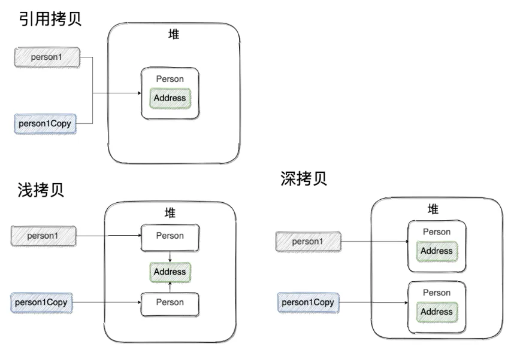
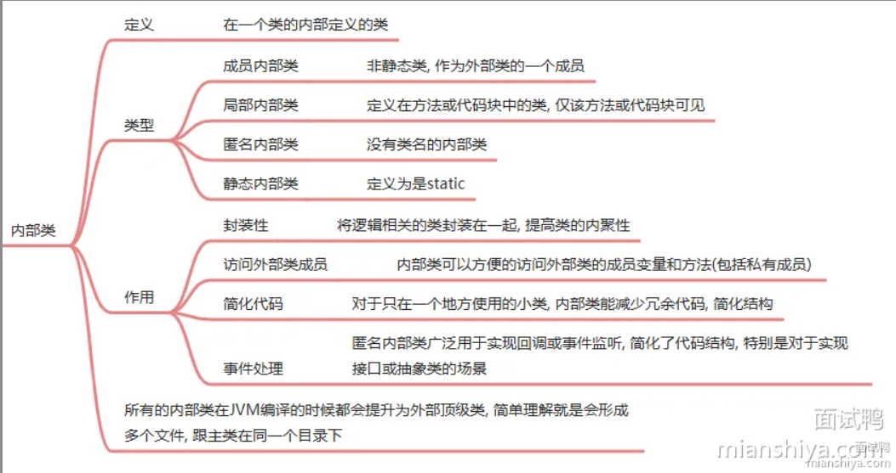

# java的优势？
1. **跨平台**：Java 通过 JVM 实现跨平台。Java 源码不直接编译成某个操作系统的机器码，而是编译成 .class 字节码文件，然后通过对应版本的 JVM 翻译成对应操作系统的机器码。
2. **面向对象**：Java 具有封装、继承、多态等特性。
3. **内存自动管理**：Java 能自动回收内存，提高内存管理效率，防止内存泄漏。
4. **生态**：Java 拥有强大的类库和第三方组件。

# 面向对象和面向过程的区别
### 面向过程:
面向过程思想是将解决问题的步骤分析出来，然后用函数一步一步将步骤实现，然后再依次调用就可以了.
### 面向对象:
将构成问题的事物，分解成若干个对象（建立对象的目的不是为了完成一个步骤，而是为了描述某个事物在解决问题过程中的行为），在解决问题的时候，需要完成什么事情, 直接让某个对象来干即可.
# Java为什么能跨平台
java之所以能跨平台是因为java在源码编译时不会直接生成对应操作系统的机器码，而是生成.class字节码文件

然后由jvm翻译成对应操作系统的机器码去执行。

所以上想要在哪个操作系统运行就下载对应操作系统的jvm即可。

# JDK, JRE, JVM有什么区别
## jvm
JVM是**Java虚拟机**。它负责将Java字节码（由Java编译器生成）编译成机器码，并执行程序。
## JRE
- JRE是**Java运行时环境**，是Java程序运行所需的最小环境。它包含了JVM和一组Java核心类库，用于支持Java程序的执行.
- 简单来说: **JRE=JVM+一组核心类库**
## JDK
- JDK是**Java开发工具包**。它包含了JRE、编译器（javac)、调试器(jdb)等开发工具。
- JDK提供了开发、编译、调试和运行Java程序所需的全部工具和环境
简单来说: **JDK=JRE+开发工具**。

# Java的基本数据类型
### Java 中有 8 种基本数据类型，分别为：
- **4 种整数型：** byte 、 short 、 int 、 long
- **2 种浮点型：** float 、 double
- **1 种字符类型：** char
- **1 种布尔型：** boolean 。
### 这八种基本类型都有对应的包装类分别为：
- Byte 、 Short 、Integer 、 Long 
- Float 、 Double 
- Character 
- Boolean

### 占用内存大小
byte占1个字节,short占2个字节, int占4个字节；

float占4个字节, doule占8个字节；

char占2个；

java定义了boolean数据类型，在编译之后都使用Java 虚拟机中的int数据类型来代替. 所以boolean类型占4个字节；

# java访问权限？
- **public**:能被任何类访问
- **protected**:能被当前包及其子包的的类访问
- **default**:能被当前包的类访问
- **private**：只能被当前类访问

# 为什么用BigDecimal不用double/double计算出现什么问题?
### double会出现的问题：
- 计算机无法精确地表示小数, 所以做浮点数计算时会出现精度丢失问题
### BigDecimal的好处
- BigDecimal 是 Java 提供的高精度数值计算类，专门解决 float 和 double 的精度丢失问题。涉及到钱的计算，必须用 BigDecimal。

### BigDecimal 内部是怎么存储数据的？
回答：BigDecimal 内部有两个关键字段：
- 一个 BigInteger 类型的 intVal 存储去掉小数点后的数字
- 一个 int 类型的 scale 表示小数点位数。比如 123.45，intVal 存 12345，scale 存 2。
- 运算时先对齐 scale，再用 BigInteger 做整数运算，最后调整 scale。

### bigdecimal的比较使用compareTo 比较而不是 equals
BigDecimal 的 equals 方法会同时比较值和精度（scale），所以：
````
BigDecimal a = new BigDecimal("1.0");
BigDecimal b = new BigDecimal("1.00");
System.out.println(a.equals(b));     // false，精度不同
System.out.println(a.compareTo(b));  // 0，值相等
````
比较 BigDecimal 的大小，永远用 compareTo，返回 -1、0、1 分别表示小于、等于、大于。

### BigDecimal.valueOf 和 new BigDecimal(String) 有什么区别？
- BigDecimal.valueOf(double) 内部会先调用 Double.toString 把 double 转成字符串，再用字符串构造 BigDecimal，所以结果是精确的。

- new BigDecimal(String) 直接用字符串构造。两者结果一样，但 valueOf 有个小优化：对于 0 到 10 的整数有缓存，会直接返回缓存对象。

### BigDecimal 的性能问题
- BigDecimal 是**不可变类**，每次运算都会创建新对象。在大量循环计算场景下，会产生很多临时对象，增加 GC 压力。
- 对性能要求极高、数据量极大的场景。BigDecimal 的运算比基本类型慢几十倍。
- 如果能确定精度范围，比如金额精确到分，用 long 存分值性能更好。电商订单系统、支付系统里很多都是这么干的，展示时再除以 100 转成元。

### MySQL 中存储金额
数据库层面，MySQL 存储金额应该用 DECIMAL 类型，不要用 FLOAT 或 DOUBLE，原因一样是精度问题。

# 基本类型和包装类型的区别？
- 包装类型默认值是 null ，而基本类型默认值不是null.
- 包装类型可用于泛型，而基本类型不可以。
- 基本数据类型存放在栈中（局部变量）或者堆中（成员变量）。包装类型存在堆中。
- 占用的内存不同。相比于对象类型， 基本数据类型占用的空间非常小。

# 自动装箱与拆箱
- 装箱：将基本类型转化为包装类型；调用了 包装类的 valueOf() 方法
- 拆箱：将包装类型转换为基本数据类型；调用了 xxxValue() 方法

# Integer的缓存问题?
````
Integer i1 = 100;  
Integer i2 = 100;  
System.out.println(i1 == i2);  // true
Integer i3 = 1000;  
Integer i4 = 1000;  
System.out.println(i3 == i4);  // false
````
### 为什么出现上面这种奇怪的现象?
- Java的Integer类内部实现了一个静态缓存池，用于存储特定范围内的整数值对应的Integer对象。
- 默认情况下，这个范围是-128至127。当创建一个在这个范围内的整数对象时，并不会每次都生成新的对象实例，而是复用缓存中的现有对象，会直接从内存中取出，不需要新建一个对象。所以, 在对比是一定要用equals().

# 序列化和反序列化
- 序列化指的是将java对象转化为字节序列的过程，比如转化为字节流，json。便于存储和网络传输。
- 反序列化指的是将字节序列转化为java对象的过程。
- 实现序列化和反序列化需要实现Serializable接口或者转化为Json格式对象，其中Serializble接口里面的SerializbleUID是用于在反序列时校验版本的一致性。
- 如果不需要对象中的某个字段被序列化，可以使用transient关键字进行修饰

# java中参数传递是按值还是引用？
- Java 中的方法参数传递是值传递。
- **基本数据类型**传递的是**值的副本**，修改传参**不会影响**原来的变量；**引用类型**传递的是**地址值副本**，修改对象内部属性**会影响**原来的变量。

# 深拷贝和浅拷贝区别？什么是引用拷贝？


- **浅拷贝**:浅拷贝复制的是对象本身还有基本类型的成员变量，引用类型的成员变量指向的还是原对象的地址，原对象改，拷贝对象也会改。
- **深拷贝**:深拷贝会完全不仅会复制对象本身和基本类型的成员变量，还会递归的复制引用类型的成员变量。
- **引用拷贝**: 引用拷贝就是两个不同的引用指向同一个对象。

# 如何实现深拷贝
### 使用序列化和反序列化
- 可以把对象序列化为字节流, 然后反序列化为对象实现深拷贝.
- 可以把对象序列化为json, 然后反序列化为对象实现深拷贝.
- 序列化的深拷贝最常用.
### 实现 Cloneable 接口并重写 clone() 方法
- 递归clone

# == 和 equals() 的区别
### == 对于基本类型和引用类型的作用效果是不同的：
- 对于基本数据类型来说， == 比较的是值
- 对于引用数据类型来说， == 比较的是对象的内存地址
### equals() 方法存在两种使用情况：
- **类没有重写 equals() 方法** ：通过 equals() 比较该类的两个对象时，等价于通过“==”比较这两个对象，使用的默认是 Object类 equals() 方法。
- **类重写了 equals() 方法** ：一般我们都重写 equals() 方法来比较两个对象中的属性是否相等；若它们的属性相等，则返回true(即，认为这两个对象相等)。

String 中的 equals 方法是被重写过的，因为 Object 的 equals方法是比较的对象的内存地址，而 String 的 equals 方法比较的是对象的值。

# hashCode() 有什么用？ (高)
hashCode() 的作用是获取哈希值。这个哈希值的作用是确定该对象在哈希表中的索引位置 （可以快速找到所需要的对象）

# 为什么重写equals()方法时需要重写hasCode()方法？
**在java中规定：** 如果一个对象equals函数比较相等，hashcode计算出的哈希值也相等；如果hashcode计算出的哈希值相等，equals的结果不一定相等，即发生哈希冲突。

这种规定是为了确保在使用哈希结构（hashMap等）的时候不会出现索引混乱的情况。 这也是为什么在重写hashcode的时候为什么也要重写equals的原因，因为要满足这种规范（包装equals相同时hashCode一样）。

# 接口和抽象类的区别？
### 设计思想：
- 接口的设计是自上而下的。我们知晓某一行为，于是基于这些行为约束定义了接口，一些类需要有这些行为，因此实现对应的接口。
- 抽象类的设计是自下而上的。我们写了很多类，发现它们之间有共性，有很多代码可以复用，因此将公共逻辑封装成一个抽象类，减少代码冗余。
语法：
### 多继承
抽象类只能单继承，接口可以有多个实现
### 成员变量和构造函数
- 接口中的成员变量默认为 public static final，即常量，接口不能包含构造函数
- 抽象成员变量是普通变量，抽象类可以包含构造函数
### 方法实现
- 接口中的方法是抽象方法（但在 Java8 之后可以设置 default 默认方法或者静态方法）。
- 抽象类可以包含 abstract 方法（没有实现）和具体方法（有实现）。它允许子类继承并重用抽象类中的方法实现。

# 面向对象的三大特征：
## 封装
将对象的属性和行为封装起来，隐藏类内部的细节，只对外暴露必要的接口，提高代码的安全性和可维护性。
## 继承
- 允许一个子类继承父类的非私有成员变量和⽅法的机制
- 子类可以重用父类的代码，并且可以通过添加新的方法或修改（重写）已有的方法来扩展或改进功能
## 多态
多态指的是在不同的情况下可以有不同的形式。

### 多态分为编译时多态和运行时多态：
- 编译时多态是通过方法重载实现：同一个类中允许出现多个同名方法，只要参数列表不同即可，在调用方法的时候编译器会根据传入的参数调用对应的方法；
- 运行时多态是通过方法重写实现的：同一个父类引用可以指向不同的子类的实例，在调用方法时会根据指向的实例类型来调用对应的方法。

多态的目的是为了增加代码的维护性和可扩展性。

# 方法的重载和重写有什么区别
1. 重载指的是在同⼀个类中可以出现同名方法名，只要参数列表不同
2. 重写是在子类可以重写⽗类中方法，只要方法名和参数列表必须

# 方法的重载和重写有什么区别
1. 重载指的是在同⼀个类中可以出现同名方法名，只要参数列表不同
2. 重写是在子类可以重写⽗类中方法，要求方法名和参数列表必须相同，而且访问权限要和父类一样或者大，返回值和异常类也必须一样或者是子类。

# 为什么java不支持多重继承？
- 因为多继承会产生**菱形继承**。比如a类有一个run方法，然后b类和c类都继承兵且重写了a的run方法，此时如果d类继承了b和c，就会导致d不知道要继承b类的run方法逻辑还是c类的run方法逻辑。
- **为什么可以多接口实现**：因为如果一个类在实现了具有两个同名方法的接口时，编译器会强制重写该同名方法，否则在编译阶段就会报错。

# java内部类？
- **成员内部类**能访问外部类所有属性和方法；
- **静态内部类：** 只能访问外部类静态的属性和方法;
- **局部内部类：** 定义在方法或者代码块中的类，仅方法或者代码块可见。
- **匿名内部类：** 没有显式类名的内部类，一般用来临时创建对象


# Object类都有哪些方法？

1. **equals()**  
   判断两个对象**内容是否相等**，默认比较地址，一般需要重写。

2. **hashCode()**  
   返回对象的**哈希码值**，和 equals 配套：相等对象必须 hashCode 相同。

3. **toString()**  
   返回对象的**字符串表示**，默认是 类名@哈希值，一般重写用来打印属性。

4. **getClass()**  
   返回对象的**运行时 Class 对象**，用于反射。

5. **wait()**  
   让当前线程**进入等待状态**，并释放锁，直到被 notify/notifyAll 唤醒。

6. **notify()**  
   **随机唤醒**一个在该对象上等待的线程。

7. **notifyAll()**  
   **唤醒所有**在该对象上等待的线程。

8. **clone()**  
   **克隆对象**，创建并返回当前对象的副本（浅拷贝）。

# wait和sleep的区别？
- sleep是Thread类的方法，执行时让出cpu，但不释放锁
- wait是Object类的方法，执行时释放cpu，而且释放锁，需要其他线程进行唤醒后重新抢锁</p>

# 什么是泛型
泛型是指**数据类型可以被指定为一个参数**（type parameter）这种参数类型可以用在**类**、**接口**和**方法**的创建中，分别称为**泛型类**、**泛型接口**、**泛型方法**。

# 泛型的作用
- 将类型安全问题从运行时异常转为编译时异常。
- 还有就是可以让一套代码支持多种类型

# 泛型擦除
- 泛型擦除指的是在编译时将泛型的类型擦除，变为Object或者下界类（extends是父类）
- 作用：为了兼容1.5之前的版本

### 泛型擦除带来的常见坑
1）不能用泛型类型创建实例或数组
````
public <T> void test() {
T obj = new T();      // 编译报错
T[] arr = new T[10];  // 编译报错
}
````
擦除后 T 变成 Object，JVM 根本不知道该 new 什么类型。想要创建实例得传个 Class<T> 进来。

2）不能对泛型使用 instanceof
````
if (obj instanceof List<String>) {}  // 编译报错
````
运行时只有 List，没有 List<String>，所以这个检查没法做。

3）泛型类型的静态成员共享
````
public class Box<T> {
public static int count = 0;
}
// Box<String>.count 和 Box<Integer>.count 是同一个
````
不管泛型参数是啥，编译后都是同一个 Box 类，静态成员当然是共享的。

### 提问：既然泛型被擦除了，为什么 List<String> 和 List<Integer> 不能互相赋值？
**回答**：这是编译期检查，不是运行时检查。编译器在擦除之前就已经做了类型检查，发现类型不匹配直接报错，压根走不到擦除那一步。

你要是用反射往 List<String> 里塞 Integer 是完全可以的，运行时根本不管。

# 静态变量和非静态变量的区别？
- **归属**:静态成员归类，内存唯一，全实例共享;非静态成员归对象,每个非静态成员都有自己的一块内存；
- **规则**：静态方法只能调用静态成员，非静态成员可调用静态 + 非静态成员。

# final的作用
1. 被final修饰的类无法继承 
2. 被final修饰的方法无法重写 
3. 被final修饰的变量为常量, 无法重新赋值
- final修饰基本类型变量, 无法修改
- final修饰引用类型, 这个引用无法指向其他对象, 也就是地址无法修改, 但是对象属性可修改

# try和fianlly中同时出现return会出现什么情况
````
try{
return "a";
} fianlly {
return "b";
}
````
finally块中的return语句会覆盖try块中的return返回，因此，该语句将返回"b"

**原理：** return后的值会存在栈帧中的**局部变量表**中，执行完finally返回，但如果在finally中执行return会**覆盖局部变量表**中的值。

# native修饰的方法是什么?
native修饰的方法是本地方法，底层又C/C++语言实现

# Exception和Error的区别？
两者都是 Throwable 的子类（继承了该类才能被 try catch），用于表示程序中的异常情况。

### Exception
Exception 是程序可以处理的异常，它又分为**编译时异常**（checked）比如 IOException 这种编译时就显式处理;

**运行时异常**（unchecked）比如 NullPointerException 空指针异常。
### Error
Error 是程序无法处理的情况，比如 OOM。

# String
## String的不可变性
String类底层是通过一个被private final修饰的字符数组（jdk8为char,9为byte）来存储字符串
- String类本身被final修饰，保证没法被继承，重写方法。
- final：数组地址不能改变, 不能指向其他数组
- private：无法被外界访问，且自身没有提供直接修改字符数组的方法

## 为什么JDK9将 String数组又char类型改为byte?
**为了减少内存占用**。

- 在 JDK8 及之前，String 使用 char[] 存储，每个 char 固定占 2 字节，部分字符只需 1 字节，会造成内存浪费。
- JDK9 以后改用 byte[]，JVM 会根据字符内容判断：若所有字符都可用 1 字节存储则采用单字节编码，否则使用 2 字节。

## String s1 = new String("abc");这句话创建了几个字符串对象？
### 如果字符串常量池中不存在字符串对象“abc”的引用，那么会在堆中创建2个对象：
- 一个是new的String对象
- 一个是在字符常量池中创建"abc"

### 如果字符串常量池中不存在字符串对象“abc”的引用：
那么会在堆中创建1个对象, 就是new的String对象.

## String和StringBuffer和StringBuilder区别
### String
String是不可变字符串，每次修改都会生成一个新的String对象，线程安全。
### StringBuffer
StringBuffer是线程安全的可变字符串，底层用synchronized修饰方法来保证线程安全。
### StringBuilder
StringBuilder是线程不安全的可变字符串。
### 对于三者使用的总结：
1. 操作少量的数据: 适用 String
2. 单线程做大量字符串拼接操作: 适用 StringBuilder
3. 多线程做大量字符串拼接操作: 适用 StringBuffer

## 字符串拼接“+” 
- 如果是两个字符串字面量相加，比如'a'+'b',编译器直接优化成一个字符串。
- 如果是变量相加，则会new一个StringBuild通过append方法进行拼接（一条语句一个，所以最好不要在循环+拼接）

## 字符串常量池的作用了解吗？
字符串常量池 是 JVM 为了提升**性能**和减少**内存消耗**针对字符串String 类）专门开辟的一块区域，主要目的是为了**避免字符串的重复创建**

# 反射说一下？
反射就是能在程序运行时动态获取类信息，创建类对象，访问对象成员变量和调用方法。

**优点**：能在运行时进行获取，比较灵活

###反射代码
````
import java.lang.reflect.Constructor;
import java.lang.reflect.Field;
import java.lang.reflect.Method;

public class ReflectDemo {
    public static void main(String[] args) throws Exception {
        // 1. 获取 Class 对象（三种常用方式）
        Class<?> clazz = Class.forName("com.example.User");

        // 2. 创建对象（调用无参构造）
        Object obj = clazz.newInstance();

        // 3. 获取构造方法并创建对象
        Constructor<?> constructor = clazz.getConstructor(String.class, int.class);
        Object user = constructor.newInstance("张三", 20);

        // 4. 获取并操作属性（包括私有）
        Field nameField = clazz.getDeclaredField("name");
        nameField.setAccessible(true); // 打破封装
        nameField.set(user, "李四");
        System.out.println(nameField.get(user));

        // 5. 获取并调用方法（包括私有）
        Method method = clazz.getDeclaredMethod("show", String.class);
        method.setAccessible(true);
        method.invoke(user, "反射调用成功");

        // 6. 获取所有方法/属性
        Method[] methods = clazz.getDeclaredMethods();
        Field[] fields = clazz.getDeclaredFields();
    }
}
````
# 你平时什么时候会用到反射
- **Spring 的IoC机制**会通过反射实例化 Bean、注入依赖
- **Spring的AOP**用到了动态代理, 也是大量使用反射
- 当要从配置文件中**读配置创建类对象**时需要使用反射.配置文件配置某个类的全类名, 然后就需要读配置, 然后反射创建对象.
- MyBatis 的 **Mapper 接口动态代理**：反射生成接口的代理对象，执行 SQL 映射方法

# 什么是动态代理？
Java 动态代理指的是程序在运行时动态创建代理对象，通过代理对象访问目标对象，通常用于给目标对象的功能做增强。
### Java 动态代理的实现分为两种：
基于 JDK 的动态代理、基于 CGLib 的动态代理。

- 其中 JDK 动态代理是通过**接口**进行代理，需要目标类实现接口，可以理解为代理类和目标类实现同一个接口，代理类重写接口方法调用目标方法并做增强。

- CGLib 代理是通过**子类**进行代理，不需要目标类实现接口，可以理解为用子类访问父类并做功能增强。

# 注解
### 注解核心概念
注解本质上是**代码中的标记**，它可以打在**类、方法、字段、参数**等位置，标记本身还能携带自定义的属性值。

注解本身**不会直接改变程序的运行逻辑**，但编译器、框架或工具可以读取这些标记，在编译期或运行期做特定处理：
- 编译期：做语法检查（如 `@Override` 校验方法重写）、生成代码（如 Lombok）
- 运行期：实现依赖注入（如 Spring `@Autowired`）、AOP 增强等功能

---

### 元注解与自定义注解
元注解是**用来定义注解的注解**，核心有 4 个：
1.  `@Target`：限定注解能作用的范围（类、方法、字段等）
2.  `@Retention`：指定注解的生命周期（源码/字节码/运行时生效）
3.  `@Documented`：让注解信息被包含在 Javadoc 中
4.  `@Inherited`：允许子类继承父类上的注解

#### 定义一个注解的标准模板：
```java
// 元注解：限定作用范围 + 生命周期
@Target(ElementType.TYPE)
@Retention(RetentionPolicy.RUNTIME)
public @interface MyAnnotation {
    // 注解属性：类型 + 名称() + 默认值(可选)
    String value() default "";
    int count() default 1;
}
```

#### 使用与解析：
```java
// 打在类上
@MyAnnotation(value = "demo", count = 5)
public class Demo {}

// 运行时通过反射读取注解
Class<Demo> clazz = Demo.class;
MyAnnotation anno = clazz.getAnnotation(MyAnnotation.class);
String val = anno.value(); // 获取属性值
```

---


# java8都有哪些新特性？
1. **语法层面**
    - 新增 Lambda 表达式，简化匿名内部类
    - 新增 Stream API，方便集合流式操作
    - 新增 Optional 类，用于优雅判空，避免空指针
    - 接口支持默认方法与静态方法

2. **日期与并发**
    - 全新日期时间 API（LocalDate、LocalDateTime、Instant 等），线程安全
    - 新增 CompletableFuture，支持异步编排与复杂并发任务

3. **集合**
    - HashMap 改用**数组+链表+红黑树**结构
    - ConcurrentHashMap 优化并发实现，粒度更细

4. **JVM**
    - 方法区实现从**永久代**改为**元空间**，使用直接内存，可动态扩展

# 什么是字节码文件？
java源码在经过编译之后的文件就是字节码文件

然后字节码文件会通过对应系统的jvm解释成对应的系统的机器码
# 类加载过程
Java 的类加载过程分为三个阶段：**加载**、**连接**和**初始化**。

- 在**加载阶段**：类加载器通过类的全限定名获取对应的字节码文件，将类的字节码以二进制形式加载到 JVM 中，并生成对应的 Class 对象（对应方法区的类信息，对静态变量加锁其实就是锁的这个）。

- 在**连接阶段**：JVM 会检查加载进来的字节码文件是否合法，然后为类里的静态变量在方法区开辟内存空间，并赋默认值，将类的符号引用（方法名）转化为直接引用（可访问的地址）。

- 在**初始化阶段**：JVM 会为类的静态变量赋初始值，并执行类中的静态代码块。

# 双亲委派机制？
类加载器在加载一个类之前，会先委派给父类加载器查看是否已经加载过，如果有就直接返回已加载的 Class 对象；

没有则继续层层委派，直到启动类加载器。再从启动类加载器开始，从上到下依次尝试加载。

**好处**：避免类重复加载，避免破坏核心类库。
# IO流
I/O流是java用于**处理输入输出**的一个类库，他主要分为两大类：**字节流**和**字符流**。
- 字节流主要是用于**处理二进制文件**，比较适合处理图片，音频等，主要类是**InPutStream**,**OutPutstream**及其子类。
- 字符流主要是用于**处理文本文件**，主要是**Reader**和**Writer**类及其子类。

# IO 模型完整总结

先重申一个核心前提：
IO 模型主要描述的是服务端如何管理连接、如何读取数据，客户端本身只是发起请求，逻辑非常简单。

## 1. BIO（同步阻塞 IO）
BIO 是同步阻塞模型。

服务端采用 一个连接对应一个独立线程 的方式处理。
当用户线程调用 read() 时，本质就是向操作系统发起一次 IO 读取请求。

发起请求后，用户线程会一直阻塞等待，直到操作系统完成两件事：
1. 把数据从网络/磁盘拷贝到内核缓冲区；
2. 再把数据从内核缓冲区拷贝到用户缓冲区。

整个过程线程全程阻塞，不能做其他事。
当并发连接增多时，线程数量暴涨，CPU 线程切换开销巨大，很容易把服务器压垮。

## 2. NIO（同步非阻塞 IO）
NIO 是同步非阻塞模型，核心是 IO 多路复用。

1. 服务端不再为每个连接开线程，而是把所有连接（FD）注册到多路复用器上（select/poll/epoll）。
2. 建立连接后，客户端只要发数据，操作系统就会自动通过 DMA 将数据从磁盘拷贝到内核缓冲区。
3. 用户线程调用 select() 轮询，查看是否有连接的数据已准备好；
4. 如果有连接数据准备好，用户线程才真正调用 read() 发起 IO 请求；
5. 此时再将数据从内核缓冲区拷贝到用户缓冲区。

整个过程依然是同步的——仍然需要用户线程自己去完成拷贝，但因为只在就绪时才读，所以不会长时间阻塞在单个连接上，实现一个线程管理大量连接。

## 3. AIO（异步非阻塞 IO）
AIO 是异步非阻塞模型。

用户线程调用 read() 发起 IO 请求后，直接立即返回，不需要阻塞等待。

后续所有操作都由操作系统内核自动完成：
1. 操作系统等待数据到达；
2. 操作系统把数据从内核缓冲区拷贝到用户缓冲区；
3. 全部完成后，操作系统通过回调函数通知用户线程。

用户线程完全不参与数据拷贝，真正做到异步。
但 Linux 对 AIO 支持不够完善，实际生产中远不如 NIO+epoll 常用。

## 4. LT 水平触发 / ET 边缘触发
- LT 水平触发
  只要 FD 上还有未读数据，每次调用 select/poll/epoll_wait 都会持续返回该 FD。
  没读完会一直提醒，使用简单、不容易丢数据，但可能产生空轮询。

- ET 边缘触发
  只在 FD 状态变化时（例如从无数据变为有数据）通知一次。
  即使缓冲区还有数据，只要没有新数据到来，就不会再次通知。
  效率更高，但必须一次性把数据读完，否则会丢失剩余数据。

select、poll 只支持 LT；
epoll 同时支持 LT 和 ET。

# select,poll,epoll区别？
### 首先先知道什么是IO多路复用:
IO多路复用是指使用select/poll/epoll去监听一批文件描述符（连接），当有文件描述符数据准备完毕就通知用户线程调用read()方法将数据从内核缓冲区拷贝到用户缓冲区。

### 应用
其实IO多路复用在nio里面就有应用，用一个事件监听器去监听所有的连接，然后用户线程轮询调用select()查看数据准备好的连接，然后调用read()将内核缓冲区数据拷贝到用户缓冲区。

## select,poll,epoll的不同(本质是管理连接，返回准备好数据的连接的方式不一样)

### select
使用一个位图去监听所有的连接，默认最大1024个连接，用户线程每次调用select，就将整个位图从用户缓冲区拷贝到内核缓冲区，然后对位图遍历找到数据准备好的连接进行标记，然后再将就绪的连接从内核缓冲区拷贝到用户缓冲区，重新遍历找到就绪连接，效率比较低。

### poll
poll相比于select，采用了一个动态数组来监听连接，连接大小不受限制，解决了select连接受限的问题。但还是需要进行两次拷贝和遍历查找。

### epoll
它在内核中维护了一棵红黑树来存储所有要监视的连接，还有一个双向链表来存放就绪的连接。

- **添加或删除要监视的连接**，是通过 epoll_ctl 操作这棵红黑树，只需要操作一次，后续无需重复拷贝(不需要和select一样，每次轮询都把位图都拷贝到内核缓冲区)。
- **当某个连接就绪时**，内核会通过回调机制，自动把它加入到就绪链表中，epoll_wait 可以O(1)返回数据准备完毕的连接，无需扫描，而且就绪链表通过mmap进行用户缓冲区和内核缓冲区的映射，用户缓冲区可以直接访问，减少了一次拷贝。


 

