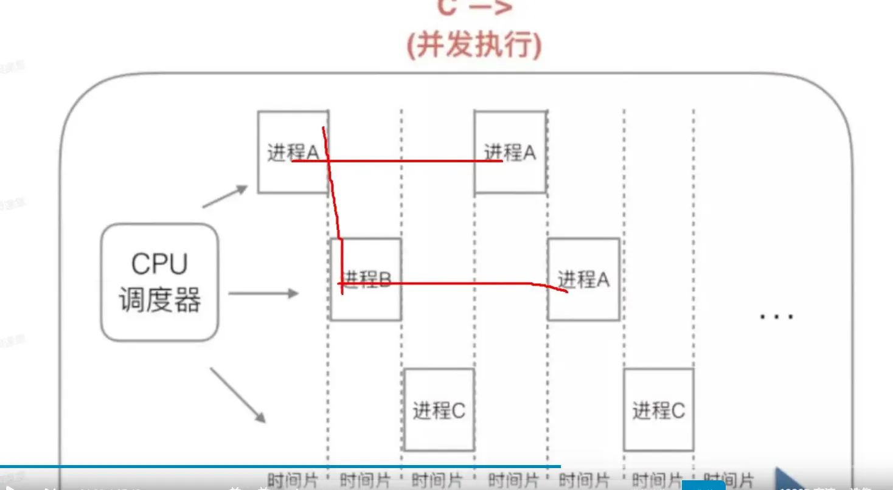
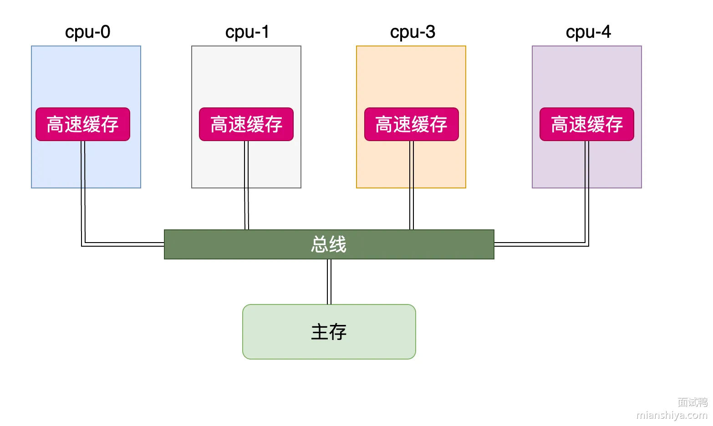
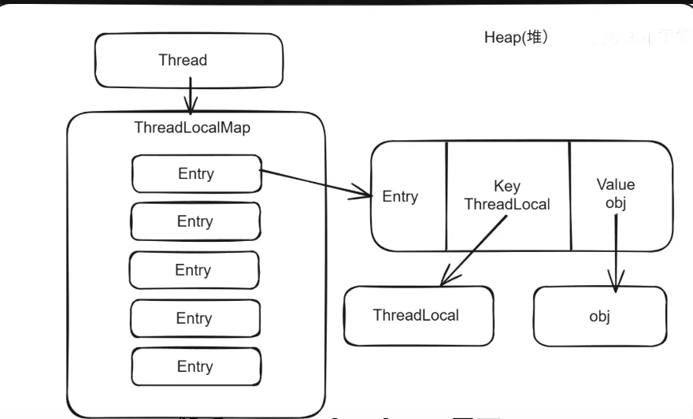
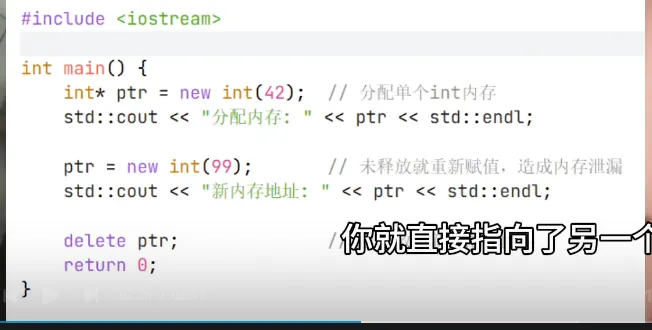

# 进程，线程，协程的概念
## 进程：
进程是操作系统资源分配的一个基本单位，内存、文件等资源是分配给进程的。（启动main就是启动一个jvm进程）
## 线程：
线程是CPU调度的一个基本单位。一个进程包含多个线程，多个线程共享进程的资源。
- 线程共享进程的堆和方法区资源
- 每个线程都有自己的程序计数器，虚拟机栈和本地方法栈。
## 协程
协程是更加轻量级的执行单位，由应用程序调度，**不涉及用户态和内核态的切换**，开销小。
Java 在 JDK 19 引入虚拟线程，JDK 21 正式稳定，可看作协程的实现。

# 进程和线程的区别？
### 定义
- **进程**：操作系统资源分配的基本单位。
- **线程**：CPU调度的基本单位，共享进程资源。
### 切换
- **进程切换**：开销大，需换页表、刷新 TLB（缓存）、保存完整上下文。
- **线程切换**：开销小，只保存 CPU 上下文，共享地址空间。
### 安全性
- 进程：独立，一个崩溃不影响其他进程。
- 线程：共享进程资源，一个线程崩溃可能导致整个进程退出。
# 协程和线程的区别？
- 线程由操作系统调度，涉及用户态和内核态切换；协程由应用程序调度，不涉及内核态切换。
- 线程执行 IO 操作时会阻塞；协程只是挂起，不会阻塞线程。

# java的线程安全是什么意思？
### 概念：
线程安全指的是在多线程下同时访问共享资源不会出现数据不一致。

**保证线程安全需要保证**：可见性，有序性，原子性。
### 实现：
线程安全可以通过同步机制和无锁机制来实现：


- 同步机制比如 **Synchronized** 和 **ReentrantLock**、**CountDownLatch**、**CyclicBarrier**、**Semaphore**；

- 无锁机制比如**原子类**（volatile 修饰保证可见性和有序性；CAS 让读值和计算、写入这三步成为一个 CPU 指令，不会因为执行一半 CPU 就跑去执行另一个线程导致数据错乱，从而保证原子性）。

# java中进程怎么实现消息通信？
### 进程间通信主要有以下几种：

1. **信号、信号量**
   主要用于**同步、互斥**，**不传递大量数据**。

2. **共享内存**
   多个进程直接共享同一块内存，**速度最快**，但需要配合同步机制。

3. **管道 / 命名管道 / 消息队列**
   用于**本机进程间传递数据**，有数据拷贝开销：
    - 管道：用于父子进程通信
    - 命名管道：任意进程间通信
    - 消息队列：按消息传输，区别于管道的字节流

4. **Socket**
   支持**跨网络、跨主机**的进程通信。
# java中线程怎么实现通信？
1. **synchronized + Object 的 wait/notify/notifyAll**
    - wait()：线程等待，释放锁
    - notify()：唤醒单个等待线程
    - notifyAll()：唤醒所有等待线程

2. **ReentrantLock + Condition 的 await/signal/signalAll**
    - await()：线程等待
    - signal()：唤醒单个线程
    - signalAll()：唤醒所有线程

3. **volatile**
    - 保证变量**可见性**，写立即刷新到主内存，读从主内存取最新值

4. **CountDownLatch**
    - 让线程等待其他一批线程完成

5. **CyclicBarrier**
    - 一组线程互相等待，都到达后再一起执行

6. **Semaphore**
    - 控制同时访问资源的线程数量

# 同步和异步的区别？
- 同步是**调用方**发起请求后需要等待结果的返回。
- 异步是调**用方发起请求**后不需要等待结果的返回，可以去干其他事，后面通过**回调**等来拿到结果。

### 和阻塞非阻塞区别：
- 一个是强调调用方等待非等待，一个是强调线程状态。
- 比如同步阻塞：调用方等待且线程挂起。同步非阻塞：调用方也是等待，但不挂起，通过轮询。

# 阻塞和非阻塞之间的区别？
阻塞和非阻塞强调的是结果返回之前线程是否挂起。
- 阻塞：结果返回前，线程挂起。
- 非阻塞：结果返回前，线程不挂起。

比如在BIO用户线程发起IO请求后就会挂起等待数据;
而NIO不挂起，而且轮询的去调用select()查看连接有没有准备好；

# 并发，并行，串行
- 并发：并发指的是单核cpu交替的去执行多个线程
- 并行:并行指的是多核cpu同时执行多个线程
- 串行：单核cpu按顺序执行多个线程

# CPU的核心数和线程数之间的关系
- cpu的核心数和同时运行的线程数之间是1比1的关系
- 也就是说一个8核的cpu最多同时运行8个线程

# 时间片与上下文切换的概念
时间片指的是cpu分配给各个线程的时间，这段时间称为时间片。
## 思考：为什么单核cpu能够支持多线程？

- cpu通过时间片分配算法来交替的执行线程，达到单核可以支持多线程的目的
- 单核cpu的上下文切换频繁，可以通过增加多核来减少上下文的切换。

## 上下文切换
### 定义:
- 线程在执行过程中会有自己的运行条件和状态（也称上下文），比如程序计数器，栈信息等.
- 在上下文切换过程中，CPU会停止处理当前运行的程序，并保存当前程序运行的具体位置以便之后继续运行。
- 从这个角度来看，上下文切换有点像我们同时阅读几本书，在来回切换书本的同时我们 需要记住每本书当前读到的页码
### 什么时候发生线程上下文切换:
- 线程主动让出CPU, 比如sleep(), wait()
- 线程时间片用完
- 线程被阻塞
- 线程被终止运行

# 死锁
## 死锁的四个必要条件
1. **互斥**: 进程互斥的访问资源
2. **请求保持**: 保持两个进程占有一部分资源的同时都请求对方让出另一部分资源
3. **不可剥夺**: 进程在所获得的资源未释放前，不能被其他进程强行夺走，只能自己释放。
4. **循环等待条件**: 双方都等待对面让出资源, 产生僵持

# 死锁解决
## 检测死锁
- **日志**: 可以通过日志进行定位
- **jps** 可以查看定位进程号, **jstack** 进程号 可以查看栈信息, 来排查死锁
- **jconsole** 可以用来检测死锁
- arthas的**thread -b**这种工具也可以用来检测排查死锁
## 解决
- kill掉阻塞的进程
- 定位到问题代码进行修复

# Java 线程的生命周期（六种状态）
Java 线程的生命周期包含六种状态：**新建**、**就绪**、**运行**、**阻塞**、**等待**、**终止**。
- 用 new 创建 Thread 对象后，线程处于新建状态；
- 调用 start() 方法后，线程进入就绪状态，等待 CPU 调度；
- 当线程获得 CPU 时间片，进入运行状态，执行 run() 方法中的逻辑；
- 若线程竞争共享资源（如 synchronized 锁）失败，会进入阻塞状态；待成功获取资源后，重新回到就绪态；
- 当线程调用 Object.wait()、Thread.join()（无参）等方法时，会进入等待状态，需被其他线程通过 notify()/notifyAll() 唤醒，唤醒后转为就绪态；
-  线程正常执行完 run() 方法，或因未捕获异常意外结束，都会进入终止状态。

# java怎么创建线程（多线程）
- 继承Thread类，重写run方法
- 实现Runnable接口，重写run方法，然后使用该实现类去构造Thread
- 实现Callable接口，重写call方法，后传入FutureTask类，再将FutureTask类传给Thread的构造函数
- 使用线程池
- 使用CompletableFuture类

# 说一下线程池的原理
线程池是一种池化技术，他负责管理一组线程，避免线程频繁的创建和销毁。
线程池有七个参数，分别是：

核心线程数，最大线程数，空闲存活时间，空闲存活时间单位，任务队列，线程工厂，拒绝策略。
### 原理：
- 默认情况下线程池不会预先创建线程，只有提交任务的时候，才会创建线程。
- 当线程达到核心线程数的时候，此时再提交任务，任务会先存放在任务队列中
- 如果任务队列也满了，如果再提交任务，线程池会创建临时线程，直到达到最大线程数。
- 如果达到最大线程数了，再提交任务就会执行拒绝策略。
- 当线程空闲时间达到空闲存活时间后，线程池会销毁临时线程，直到线程数为核心线程为止。

# 创建线程池的方法
- new一个ThreadPoolExcutor对象（提交的任务是runnable和callable任务，全部线程共享一个阻塞队列）
- new一个ForkJoinPool对象（提交的是ForkJoinTask任务，是一个基于任务窃取算法的线程池，每个线程都有一个双端队列，当一个线程的双端队列为空的时候，就会去窃取别的线程的任务去执行）
- 用Excutors工厂类创建

## java并发库提供了多少中线程池的实现（Excutors）
**大概**：三数量不同加两任务状态不同

java并发库主要提供了五种线程池的实现，主要通过Excutors工具类来创建：
- SingleThreadExcutor:创建一个只有单个线程的线程池。
- FixedThreadPool:创建一个固定线程数量的线程池。
- CacheThreadPool:创建一个动态线程数量的线程池。线程数量没有上限，只要提交任务且没有可用线程，就会创建新线程，空闲线程会在六十秒被回收
- ScheduleThreadPool:创建支持定时任务的线程池。
- WorkStealingPool:基于任务窃取算法的线程池。每个线程维护一个双端队列，当一个线程的队列为空时会窃取其他线程的任务去执行。

# Executors创建线程池会存在什么问题
**大概**：2任务队列没限制，2线程数没限制

Executors用起来比较方便, 但是在大型分布式系统中直接使用会产生一些问题.
- newFixedThreadPool() 和 newSingleThreadExecutor() 固定线程数量的线程池和单个线程的线程池, 线程数量不会溢出, **但是任务队列有可能溢出**. 允许的任务队列长度为Integer.MAX_VALUE, 可能堆积大量任务, 导致OOM.
- newCachedThreadPool() 和 newScheduledThreadPool() **线程数量随着任务增加而增加**, 线程数量有可能溢出. 线程数最大为Integer.MAX_VALUE, 可能会创建大量线程, 从而导致oom.
阿里巴巴开发手册中强制规定, 线程池不允许使用Executors创建, 而是通过ThreadPoolExecutor方式创建, 这样可以使编程者更加明确线程池运行规则, 避免资源耗尽.

# 线程池中submit() 和execute()方法有什么区别
- execute()只能提交runnable任务, submit()既可以提交runnable任务, 又能提交callable任务
- submit()可以返回持有计算结果的Future对象.、


# 怎么合理设置线程数量（cpu利用）
- 如果是**cpu密集型任务**，可以设置为**cpu核心数加1**。因为cpu密集型任务不会阻塞，能充分的利用cpu，所以没必要开太多线程，开太多反而会增加上下文切换的开销
- 如果是**IO密集型任务**，可以设置为**cpu核心数*2**.因为IO密集型任务会阻塞，cpu利用率不高，多开一些线程可以提高cpu的利用率。

# 线程池关闭，chudwon和chutdownnow说一下
- chutdown是**停止新的任务提交**，当时会**等待已经提交的任务都执行**完毕再关闭
- chutdownnow会**停止新的任务提交**，**尝试停止正在执行的任务**，然后**返回工作队列中的任务列表**。

# 线程池运行时核心线程数能改吗？
在平时我们使用的 ThreadPoolExecutor 线程池中，可以对线程池对象在运行中调用 **setCorePoolSize(int)** 动态**设置核心线程数**，使用 **getCorePoolSize() 动态获取核心线程数**。

补充：**最大线程数**和**任务队列长度**可看不可改。

# 线程池执行出现异常，怎么知道是哪个线程发生异常？
线程池默认情况下是不会告诉我们是哪个线程发生异常的，但是我们可以通过：
1. **自定义线程工厂**,在创建线程时给线程设置未捕获异常处理器（UnCaughtExceptionHandle），然后用日志记录异常线程名。
2. **使用try catch捕获run方法异常**，然后日志记录异常线程名。
3. 使用submit提交时，**调用Future.get**时使用**try catch捕获异常**，日志记录异常线程名。

# 如果控制多个线程的执行顺序？
1. **Thrread.join()**方法等待其他线程完成；
2. **synchronized**代码块中配合wait.notify/notifyAll方法和ReentrantLock配合Condition的await和signal/signalAll；
3. 使用**countdownlatch**让一组线程等待其他线程完成；
4. 使用**cyclicbarrier**让一组线程相互等待
5. 使用**semaphore**控制线程**并发访问共享资源的数量**。
# 了解过哪些阻塞队列？
**大概**：数据结构三加功能二
1. **ArraryBlockingQuqueue**:基于数组的阻塞队列，是一个有界的队列（数组，有界）
2. **LinkBlockingQueue**:基于链表的阻塞队列，可以有序也可以无序（链表，可有可无）
3. **ProrityBlockingQueue**:一个无界的优先级队列，他的元素顺序是有序的，不是先进先出的（优先级堆，有序）
4. **DelayQueue**:延迟队列，队列元素必须继承Delay接口，当队列里的元素过期了才会被取出（过期元素）
5. **synchronousQueue**:一个没有容量的队列，每次提交操作都要等待相应的移除操作，用于线程之间传递任务，而不是存储任务。（用做线程之间传递任务）


# 常用锁概念（按 AQS 加锁→执行→释放顺序整理）
## 一、按并发控制策略划分
### 1. 悲观锁
   **思想**：认为并发冲突一定会发生，所以在操作前先加锁，阻塞其他线程。

   **特点**： 
   - 加锁后其他线程必须阻塞等待。
   - 线程阻塞 / 唤醒需要内核态切换，开销大。
   - 适合写多读少、冲突高的场景。

**代表**：synchronized、ReentrantLock 加锁失败阻塞模式。
### 2. 乐观锁
   **思想**：认为冲突大概率不会发生，不加锁，直接操作，失败再重试。

   **实现**：基于 CAS（Compare And Swap） 无锁算法。

   **特点**：
   - 无锁、无阻塞、无内核态切换，性能极高。
   - 适合读多写少、冲突低场景。
   - 失败会循环重试，高冲突下会占用 CPU。
   - 代表：AtomicInteger、ConcurrentHashMap 中的 CAS。
## 二、按锁获取顺序 / 公平性划分
### 3. 非公平锁
   **思想**：线程加锁时直接先尝试抢占，不排队。

   **AQS 行为**：
   - 先尝试获取锁；
   - 获取失败才进入队列等待。
   - 优点：吞吐量更高，减少线程切换开销。
   - 缺点：可能出现线程饥饿（某些线程一直抢不到）。

   **代表**：synchronized、ReentrantLock(false)。
### 4. 公平锁
   **思想**：严格按FIFO 队列顺序获取锁，先来先服务。

   **AQS 行为**：
   - 先判断队列是否有线程在等待；
   - 有则直接进入队列，不抢占。
   - **优点**：无饥饿，所有线程都能公平获取锁。
   - **缺点**：吞吐量更低，线程切换频繁。
   **代表**：ReentrantLock(true)。
## 三、按锁是否可重复获取划分（AQS 核心特性）
### 5. 可重入锁
   **定义**：同一个线程外层获取锁后，内层再次获取同一把锁不会阻塞。

   **AQS 原理**：
   - 使用state变量记录重入次数。
   - **加锁**：state+1；释放锁：state-1；state=0 才真正释放。
   - **作用**：避免同一线程递归调用导致死锁。

   **代表**：synchronized、ReentrantLock。
### 6. 非可重入锁
   加锁后即使同一线程再次获取也会阻塞，容易死锁，Java 中极少使用。

## 四、按获取锁失败后的行为划分（AQS 核心流程）
### 7. 阻塞锁
   - **行为**：获取锁失败 → 释放 CPU → 进入阻塞状态，等待被唤醒。
   - **AQS**：进入同步队列，park()阻塞。
   - **优点**：不占用 CPU。

   **代表**：synchronized、ReentrantLock 常规模式。
### 8. 非阻塞锁
   **行为**：获取锁失败 → 立即返回，不阻塞、不等待。

   **代表**：tryLock() 无参 / 带超时。
   ## 五、按阻塞实现方式划分
### 9. 自旋锁
   - **行为**：获取锁失败 → 不阻塞、不释放 CPU，循环 while 重试。
   - **优点**：避免线程阻塞 / 唤醒的内核开销。
   - **缺点**：长时间自旋会大量消耗 CPU。
   - **适用**：锁持有时间很短的场景。
   - **AQS 应用**：ReentrantLock 加锁前会先自旋尝试。
### 10. 互斥锁
   - **行为**：获取锁失败 → 阻塞挂起，释放 CPU，等待唤醒。
   - **优点**：不占用 CPU。

   **代表**：synchronized、常规ReentrantLock。

## 六、按读写场景细分（AQS 共享 / 独占模式）
### 11. 读写锁（ReadWriteLock）
将锁分为读锁与写锁：
#### 写锁（独占锁 / 排他锁）：
- 同一时间只允许一个线程持有。
- 写与写互斥、写与读互斥。
### 读锁（共享锁）：
- 多个线程可同时加读锁。
- 读与读不互斥，读与写互斥。
- **适用**：读多写少，大幅提升并发读性能。

**代表**：ReentrantReadWriteLock。

# 说一说自己对于 synchronized 关键字的了解
- synchronized关键字解决的是多个线程之间**访问资源的同步性**
- synchronized关键字可以保证被它修饰的方法或者代码块在**任意时刻只能有一个线程执行**

# 怎么使用 synchronized 关键字
- **修饰非静态方法**, 锁的是**this(当前对象)**, 也就是一个对象用一把锁
- **修饰静态方法**, 锁的是 **类.class对象** , 也就是类的所有对象公用一把锁
- **修饰代码块**, 括号里写什么就锁什么. 

# synchronized原理 
1. 它的实现主要依靠于**监视器锁**（Monitor）和**对象头**（包含Mark Word）
2. 当**修饰方法**时，会在方法的访问标志中加 **ACC_SYNCHRONIZED**，线程进入方法前JVM会检查这个标志，有的话就要拿到**对象的锁监视器**才能执行
3. 修饰代码块时，编译器会在**代码块入口插入 monitorenter**这个字节码指令，在**正常出口和异常出口都添加 monitorexit**字节码指令，保证发生异常也能结束。线程执行 monitorenter 时会尝试获取监视器锁，获取成功则执行代码块，失败则阻塞等待；执行 monitorexit时释放锁并唤醒等待队列中的线程
4. 对象头中的Mark Word会根据锁的状态存储不同的信息：无锁时存对象的hashCode和GC信息；偏向锁存线程ID；轻量级锁存指向栈中Lock Record的指针；重量级锁存指向Monitor对象的指针
5. JDK1.6给synchronized加了一套锁升级机制，偏向锁->轻量级锁->重量级锁，只升不降（这里的只升不降指的是竞争过程中不会降级，如果所有线程都释放锁了，就会恢复成无锁状态）

# 说一下synchronized的锁升级机制
- **无锁**： 锁的状态一开始是无锁状态；
- **偏向锁**：为“始终只有一个线程访问”的场景而设计。第一个线程来的时候，JVM通过CAS把线程ID写到Mark Word里，下一次这个线程再来的时候直接放行。但如果有第二个线程来了，就要撤销偏向锁，升级为轻量级锁（偏向锁的撤销要在安全点进行，JDK15默认禁用偏向锁，JDK18彻底移除了偏向锁）
- **轻量级锁**：适合多个线程交替访问，没有真正竞争的场景。线程在自己的栈帧中创建一个Lock Record，把对象的Mark Word信息拷贝过去，然后CAS把对象头指向这个Lock Record。成功就拿到锁，失败就升级为重量级锁（重入的时候，再入栈一个栈桢，Lock Record里的displaced header设为null，解锁的时候看到null就知道是重入的，直接返回）
- **重量级锁**：重量级锁的核心是锁监视器（ObjectMonitor），在升级的成重量级锁的时候会创建MonitorObject(锁监视器)，然后将对象的MarkWord改为指向该锁监视器的指针。
  - 抢锁的过程是CAS设置ObjectMonitor里的_owner为当前线程，成功则代表拿到锁有了执行权
  - 失败了不会立刻阻塞，而是会尝试自旋，挣扎一下（如果此时锁释放了）
  - 还是不行就将线程包装成ObjectWaiter对象加入阻塞队列队列然后进行阻塞状态，锁释放时阻塞队列的线程被唤醒后重新抢锁
  - 这里的多次自旋也是优化的一个手段，避免在用户态和内核态之间的切换造成的巨大开销。

# 为什么JDK15要废弃偏向锁
   偏向锁是为“始终只有一个线程访问”的场景设计的，现在的应用基本都是多线程的，偏向锁能派上用场的机会很少，偏向锁的撤销需要等到安全点，还要遍历线程栈，开销很大，官方在做了大量测试之后，发现禁用偏向锁后，大多数应用性能反而更好，所以JDK15默认禁用偏向锁，JDK18彻底移除了相关代码

# synchronized可重入如何实现 
通过对象头的MarkWord和Monitor锁监视器中的重入次数字段, 重入一次加一次, 释放一次减一次, 减到0则释放完毕. 

# JDK1.6 之后的 synchronized 底层做了哪些优化？
java的线程模型是1对1的, 加锁需要调用操作系统的底层原语
mutex, 所以每次切换线程都需要操作系统切换到内核态, 开销很大.这也是之前synchronized的问题所在, 

jdk1.6对其进行了优化, 从无锁到偏向锁到轻量级锁到重量级锁

# 锁的四种状态
JDK 1.6 引入了偏向锁和轻量级锁，从而让锁拥有了四个状态：
- 无锁状态（unlocked）、
- 偏向锁状态（biasble）、
- 轻量级锁状态（lightweight locked）
- 重量级锁状态（inflated）。 

虚拟机对象头里锁标志位, 就记录了这4中状态.
## 偏向锁
### 为什么引入偏向锁？
大多数时候没有锁竞争，而是一个线程多次获得同一个锁，因此如果每次都要竞争锁会增大很多没有必要付出的代价，为了降低获取锁的代价，才引入的偏向锁。
### 偏向锁的过程
- 当锁对象第一次被线程获得的时候，使用 CAS 操作将线程 ID 记录到对象头的MarkWord中
- 当线程再次获取锁的时候，会比较线程ID和对象头的Mark_Word的线程ID是否一致，一致则不需要进行同步操作。不一致则偏向状态就宣告结束，此时撤销偏向后升级为轻量级锁。当偏向线程不再使用该锁，则设置为无锁，重新偏向新的线程。
## 轻量级锁
### 为什么引入轻量级锁？
轻量级锁考虑的是竞争锁对象的线程不多，而且线程持有锁的时间也不长的情景。因为阻塞线程需要CPU从用户态转到内核态，代价较大，如果刚刚阻塞不久这个锁就被释放了，那这个代价就有点得不偿失了，因此这个时候就干脆不阻塞这个线程，让它自旋这等待锁释放。

### 什么是轻量级锁
- 轻量级锁是相对于传统的重量级锁而言，它使用自旋 + CAS操作来避免重量级锁使用互斥量的开销。
- 长时间的自旋会使CPU一直空转, 浪费CPU, 所以这里自旋是适应性自旋, 自旋时间由上一个线程自旋的时间决定的.

## 重量级锁
### 每个对象的Mark Word会关联一个 Monitor锁监视器,
锁监视器的结构如下：
````
class ObjectMonitor {
void*     _owner;           // 持有锁的线程
intptr_t  _recursions;      // 重入次数
ObjectWaiter* _WaitSet;     // 等待队列（调
用 wait() 的线程）
ObjectWaiter* _EntryList;   // 阻塞队列（竞
争锁失败的线程）
};
````
### 轻量级锁什么时候升级为重量级锁
- 线程自旋的次数到了阈值, 另外一个线程还没释放锁, 那么就膨胀为重量级锁。
- 如果有两条以上的线程争用同一个锁，那轻量级锁就不再有效，要膨胀为重量级锁。
### 什么是重量级锁？
所谓的重量级锁, 就是要阻塞其他线程, 这里就是操作系统层面的阻塞了. 需要从用户态切换到内核态, 开销较大. 所以只会在锁竞争大的时候进行.

# 锁消除
锁消除是指对于被检测出不可能存在竞争的共享数据的锁进行消除。锁消除主要是通过逃逸分析来支持，如果堆上的共享数据不可能逃逸出去被其它线程访问到，那么就可以把它们当成私有数据对待，也就可以将它们的锁进行消除。

# 锁粗化
- 如果一系列操作都对同一个对象反复加锁和解锁，频繁的加锁操作就会导致性能损耗。比如连续使用StringBuffer的append() 方法就属于这类情况。
- 如果JVM探测到由这样的一串零碎的操作都对同一个对象加锁，将会把加锁的范围扩展（粗化）到整个操作序列的外部。对于上一节的示例代码就是扩展到第一个 append() 操作之前直至最后一个append() 操作之后，这样只需要加锁一次就可以了。

# CAS
## 概念：
CAS是比较并交换，核心思想是在修改一个值的时候，先去看内存中的值是不是预期的值，是的话就将内存中的值替换为新值，否则进行重试或者失败。

## CAS原理
在java中，cas实现底层是通过调用了unsafe类的compareAndSwap来做CAS操作，这个方法调用了native修饰的方法，原子性是通过cpu的原子指令集（因为不同架构有不同的指令保证，所以交指令集）保证。比如在x86架构中，是通过compare and exchange指令来保证原子性。该指令执行时会锁住总线或者缓存行，来确保同一时刻只有一个cpu内核能够操作内存地址。

## CAS存在哪些问题？
1. 自旋CAS的方式如果长时间不成功，会给CPU带来很大的开销
2. 一次性只能保证一个共享变量的原子性 (多个可以通过AtomicReference来处理或者使用synchronized实现)
3. ABA问题, 但是ABA的问题大部分场景下都不影响并发的最终效果
## 什么是ABA问题？ABA问题怎么解决？
在做cas操作时：
- 线程1获取值为A
- 线程2修改值为B
- 线程3修改值为A
线程1获取值还是A, 以为该值从未被修改过, 这就是ABA问题

## 解决aba问题：
- 解决ABA问题的常见方法是使用带有版本号的CAS(比如用 AtomicStampedReference 类).
- 该类的原理是新增一个版本号, 每次操作给版本号一个新值. 进行cas操作时不仅要数值和之前一样, 版本号也要一样.
- 当数值一样, 但是版本号不同时, 说明产生了aba问题. 此时值不会被修改.

# CAS原理
- 在java中，cas实现底层是通过调用了unsafe类的compareAndSwap来做CAS操作
- 这个方法调用了native修饰的方法，原子性是依赖cpu的原子指令集保证。
- 比如在x86架构中，是通过compare and exchange指令来保证原子性。该指令执行时会锁住总线或者缓存行，来确保同一时刻只有一个cpu内核能够操作内存地址。

# 使用过java哪些原子类
**AtomicInteger**,**AtomicLong**.他们通过volatile和cas保证线程安全


# 说说AQS
AQS 是 JUC 底层的抽象同步框架，核心是两点：
- 一个是 volatile int state 表示同步状态，
- 另一个是双向链表实现的 FIFO 等待队列。
## 共享模式和独占模式
- 独占模式下，state=0 表示锁空闲，1 表示被占用；
- 共享模式下，state 表示可用资源数或许可数。

### 共享模式场景.
比如说Semaphore或者CountDownLatch.
#### Semaphore
对于Semaphore来说state就代表为许可证数量. 
- 比如当某个资源能同时被3个线程访问, 那state初始化就为3
- 获取时state 递减, 减到0后新线程就无法访问共享资源了, 就得进aqs等待
- 队列去等待了. 当线程释放资源时state递增.
#### CountDownLatch
CountDownLatch也是同理, state表示剩余任务数, 调用
countDown()时递减, state归零时唤醒所有await()线程.
### 独占模式场景
独占模式就是只允许单线程独占资源, 适用于互斥场景, 比如锁,也就是ReentrantLock.
#### ReentrantLock
- 独占模式通过acquire() 与 tryAcquire()获取资源, 对应ReentrantLock的lock和tryLock().
- 当state为0表示资源空闲, 加锁时, cas修改state, 修改为1, 表
示加锁成功, 加锁失败的就进入aqs等待队列.

### AQS过程：
- 线程获取资源时，先用 CAS 修改 state，成功就直接持有锁；失败就封装成 Node 加入队列，调用 LockSupport.park() 挂起。释放时会修改 state，如果state为0表示锁表内释放，调用 LockSupport.unpark() 唤醒队列里的队首线程。

- 公平锁会先判断队列是否有等待线程，有则直接入队；非公平锁不管队列，直接先 CAS 抢锁，抢不到再入队。

自定义同步器只要继承 AQS，实现尝试获取、尝试释放的逻辑即可，入队、挂起、唤醒这些底层逻辑 AQS 都已经实现好了。

# ReentrantLock的原理
ReentrantLock 是基于 AQS 实现的独占可重入锁，内部维护三个关键部分：

1. volatile 修饰的 int 类型变量 state，表示锁的状态,state = 0 表示锁空闲，state > 0 表示锁被持有，数值代表重入次数。；
2. 双向链表实现的同步队列，存放抢锁失败的线程；
3. 单向链表实现的条件队列，存放调用 await 等待的线程。
      ## 加锁流程：
      线程尝试通过 CAS 操作将 state 从 0 改为 1，如果修改成功，说明获取锁成功，并把当前持有锁的线程标记为自己；如果是可重入操作，发现持有锁的就是当前线程，直接将 state + 1；如果 CAS 修改失败，说明获取锁失败，会把当前线程封装成 Node 节点，加入到 AQS 同步队列的尾部，并调用 LockSupport.park () 把线程挂起。
      ## 释放锁流程：
      释放锁时，将 state - 1，如果 state 减到 0，说明锁完全释放，同时把持有锁的线程标记清空，然后调用 LockSupport.unpark ()，唤醒同步队列里的第一个等待线程，让它重新竞争锁。
      ## Condition 作用：
      调用 await () 时，线程会进入条件队列等待；调用 signal () 时，会把线程从条件队列移到同步队列，重新参与锁竞争。

# countdownLatch
countdownLatch是java并发包下的工具，可以让一个线程等待其他线程完成。他的原理是通过AQS实现的
````
import java.util.concurrent.CountDownLatch;

public class CountDownLatchDemo {
    public static void main(String[] args) throws InterruptedException {
        // 3个线程
        CountDownLatch latch = new CountDownLatch(3);

        for (int i = 1; i <= 3; i++) {
            int finalI = i;
            new Thread(() -> {
                System.out.println("线程" + finalI + " 开始执行");
                try {
                    Thread.sleep(1000);
                } catch (InterruptedException e) {
                    e.printStackTrace();
                }
                System.out.println("线程" + finalI + " 执行完毕");
                latch.countDown(); // 计数-1
            }).start();
        }

        System.out.println("主线程等待所有线程执行完...");
        latch.await(); // 阻塞，直到计数为0
        System.out.println("所有线程执行完毕，主线程继续");
    }
}
````
# cyclicBarrier
CyclicBarrier是juc并发包下的工具，作用是让一组线程相互等待对方完成。他的底层原理是基于AQS进行实现的
````
import java.util.concurrent.BrokenBarrierException;
import java.util.concurrent.CyclicBarrier;

public class CyclicBarrierDemo {
    public static void main(String[] args) {
        // 3个线程互相等待
        CyclicBarrier barrier = new CyclicBarrier(3, () -> {
            System.out.println("所有线程到齐，开始一起执行！");
        });

        for (int i = 1; i <= 3; i++) {
            int finalI = i;
            new Thread(() -> {
                System.out.println("线程" + finalI + " 到达屏障，等待其他线程");
                try {
                    barrier.await(); // 等待
                    System.out.println("线程" + finalI + " 继续执行");
                } catch (Exception e) {
                    e.printStackTrace();
                }
            }).start();
        }
    }
}
````

# Semaphore
Semaphore是Java并发中的同步工具类，底层基于AQS实现：
1. 核心是管理一组许可（permits），许可对应AQS的state状态值；
2. 线程通过 acquire() 获取许可，无可用许可时会阻塞等待；
3. 线程通过 release() 释放许可，释放后等待的线程可获取许可；
4. 作用是限制同时访问共享资源的线程数量；
5. 支持公平/非公平两种获取许可的策略。

## 公平与非公平模式的区别:

**公平模式:** 严格按线程等待队列的顺序获取许可

**实现方式**:获取许可前先看等待队列有没有等到线程，有则排队

**非公平模式**: 不遵循队列顺序，新线程可能“插队”抢占许可

**实现方式**:直接尝试CAS抢占state，抢占失败再入队。
````
import java.util.concurrent.Semaphore;

public class SemaphoreDemo {
    public static void main(String[] args) {
        // 最多允许 3 个线程同时获取许可（模拟3个业务窗口）
        Semaphore semaphore = new Semaphore(3);

        // 创建 5 个线程（模拟5个办理业务的人）
        for (int i = 1; i <= 5; i++) {
            new Thread(new Business(semaphore), "客户-" + i).start();
        }
    }
}

class Business implements Runnable {
    private final Semaphore semaphore;

    public Business(Semaphore semaphore) {
        this.semaphore = semaphore;
    }

    @Override
    public void run() {
        try {
            // 1. 获取许可
            System.out.println(Thread.currentThread().getName() + " 尝试获取窗口...");
            semaphore.acquire();

            // 2. 获取成功，开始执行业务
            System.out.println(Thread.currentThread().getName() + " ✅ 成功获取窗口，开始办理业务");
            Thread.sleep(2000); // 模拟业务耗时

            // 3. 业务完成
            System.out.println(Thread.currentThread().getName() + " 业务办理完成");

        } catch (InterruptedException e) {
            e.printStackTrace();
        } finally {
            // 4. 释放许可（必须放在finally里，保证一定释放）
            semaphore.release();
            System.out.println(Thread.currentThread().getName() + " ❌ 释放窗口");
        }
    }
}
````
# Synchronized和ReentrantLock之间的区别？
### 1. 实现的方式不同
Synchronized是通过锁监视器和对象头的MarkWord进行实现的，ReentrantLock是通过AQS实现的。
### 2. 加锁和释放锁不同
Synchronized的话线程执行到被Synchronized修饰的方法和代码块时会自己加锁释放锁，ReentrantLock需要手动调用tryLock(),unLock（）方法进行加锁解锁
### 3. 锁的公平性：
Synchronized只支持非公平锁，ReentrantLock支持公平锁和非公平锁。
### 4，锁的功能不同：
ReentrantLock支持更多的功能，比如锁中断和锁超时机制。

# Volatile
## 概念
Volatile是Java虚拟机(JVM)轻量级的同步机制
## 三大特性
- 禁止进行指令重排 (有序性)
- 保证可见性, 指线程之间的可见性，一个线程修改的状态对另一个线程是可见的. 线程每次获取volatile修饰的变量时, 都能获取到最新值. (volatile本质是在告诉jvm当前变量在工作内存(cache缓存/寄存器)中的值是不确定的，需要从主存中读取) 本质是禁用CPU缓存, 每次去主存取值
- 不保证原子性

## 可见性的根源
Java 内存模型里，每个线程有自己的工作内存，变量操作都在工作内存里进行，不是直接读写主内存。

线程 A 改了变量，什么时候同步回主内存？什么时候其他线程能看到？JVM 规范没强制要求立即同步，所以就出现了可见性问题。volatile 就是强制规定：写完立刻刷回主内存，读的时候必须从主内存拿最新值。

# Volatile和synchronized 的区别
- volatile本质是在告诉jvm当前变量在工作内存(CPU缓存/寄存器)中的值是不确定的，需要从主存中读取. synchronized则是锁定当前变量，只有当前线程可以访问该变量，其他线程被阻塞住
- volatile仅能实现变量的修改可见性，并不能保证原子性；synchronized则可以保证变量的修改可见性和原子性
- volatile不会造成线程的阻塞；synchronized可能会造成线程的阻塞。
- volatile仅能使用在变量级别；synchronized则可以使用在变量、方法、和类级别的。

# 为什么volatile不能保证线程安全？
很简单呀，可见性不能保证操作的原子性.
# 如果不使用lock和synchronized, 怎么保证num++的原子性?  
可以使用AtomicInteger原子类.

# ThreadLocal


## 什么是 ThreadLocal / ThreadLocal 有什么用?  
### 使用场景：
对于多线程共享的资源, 为了避免线程安全问题, 可以加锁处理. 也可以用ThreadLocal.
### 概念：
ThreadLocal可以理解为线程本地变量(不共享), 他会在每个线程都创建一个副本，那么在线程之间访问内部副本变量就行了, 每个线程各用各的, 这做到了线程之间互相隔离, 解决了线程安全问题.

ThreadLocal两大特点:
- 线程间资源隔离
- 单个线程内资源共享

## ThreadLocal原理
1. 每个线程都有自己的一个ThreadLocalMap,里面有一个entity数组，Entity数组存储着Key为ThreadLocal，value为值的节点。所以每一个线程即使ThreadLocal相同，value也不同，从而实现线程资源的隔离
2. 调用set方法，就是以ThreadLocal自己作为key,资源对象作为value,放入当前线程的ThreadLocalMap集合中
3. 调用get方法，就是以ThreadLocal自己作为key,到当前线程中查找关联的资源值
4. 调用remove方法，就是以ThreadLocal自己作为key,移除当前线程关联的资源值
5. 不同的线程之间threadlocal这个key值是一样，但是不同的线程所拥有的ThreadLocalMap是独一无二的

## ThreadLocal内存泄漏问题?
**内存泄漏例子：**

假如我们在c++中，如果我们声明了一个指针指向存储A(42)，然后我们又直接指向B(99),那最后就算delete了指针，A对象就变成了无法访问而且也无法清理的内存，造成内存泄露。

## 为什么会内存泄漏
如果说一个线程用完就释放, 那么没有问题.
### 正常被释放情况：
释放thread->threadlocalmap无引用，gc释放->entry无引用，gc释放->threadlocal,value无引用gc释放
### 泄露情况：
- 但是实际开发中为了避免资源浪费, 往往会使用线程池, 线程池的核心线程是不会释放的, 会重复利用. 那么就会有一条线 GCRoots -> ... -> Thread ->ThreadLocalMap ->Entry.
- 当线程池某个Thread调用ThreadLocal,set方法往ThreadLocalMap放数据, 放完不删除. 该线程之后并不会被销毁, 而是会重新放回线程池中. 那么此时ThreadLocalMap中的数据无法被gc回收, 就有可能有内存泄漏问题.

## 为什么key是弱引用
1. ThreadLocal的key使用弱引用，其实是为了加一层保障。
2. 当ThreadLocal调用get、set、remove时，会先在ThreadLocalMap中查找key为null的值，然后将value也设置为null，而ThreadLocal的key设置为弱引用，正是利用了这个机制。
3. 当我们使用ThreadLocal后忘记remove时，ThreadLocal会在下次GC时被回收，而value不回收。如果当前线程的ThreadLocal下次再调用get、set、remove时，就会将该值设置为null，从而避免内存泄露。

## 为什么value不是弱引用
因为我们在使用value时候都是ThreadLocal.get()获取，而不会和key一样使用强引用去指向（ThreadLocal<String> tl = new ThreadLocal<>()），所以如果value为弱引用的话可能会出现业务代码还没执行完结果value被GC回收，然后导致get出来的值为null的情况。 
## 如何避免value内存泄漏
````
// 任务里定义的局部变量
ThreadLocal<String> tl = new ThreadLocal<>(); //给了一个强引用
tl.set("xxx");
//方法执行结束后tl回收，此时key只剩弱引用，会被回收，
而value不会被回收（entry->value）,下次操作发现key为null,就会顺带将
value进行回收
````
1. ThreadLocalMap 中使用的 key 为 ThreadLocal 的弱引用，而value 是强引用。所以，如果 ThreadLocal 没有被外部强引用的情况下，在垃圾回收的时候，key 会被清理掉，而 value 不会被清理掉。
2. 这样一来， ThreadLocalMap 中就会出现 key 为 null 的 Entry。假如我们不做任何措施的话，value 永远无法被 GC 回收，这个时候就可能会产生内存泄露。 
3. ThreadLocalMap 实现中已经考虑了这种情况，在调用 set() 、 get() 、 remove() 方法的时候，会清理掉key 为 null 的记录。使用了ThreadLocal又不再调用get(),set(),remove()方法，那么就会导致内存泄漏, 所以使用完ThreadLocal 方法后 最好手动调用 remove() 方法