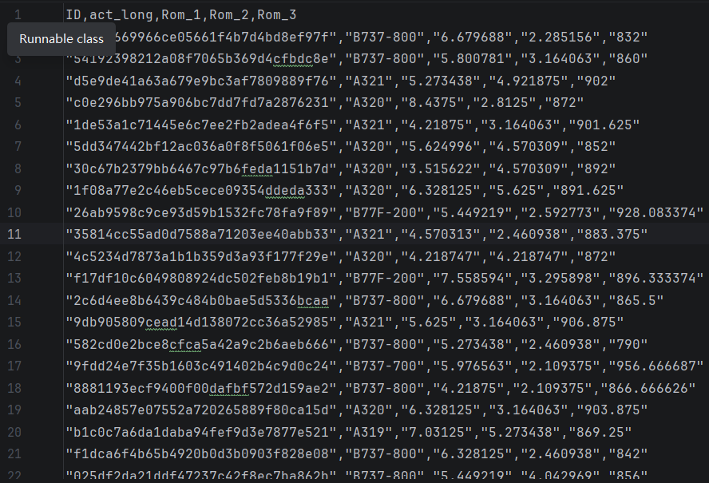

# 给你一个数据文件，将数据文件进行读取并且操作

## 解题方法：
### 首先先写一个流去读取文件：
**常用的流：**

- FileInputStream,FileOutputStream(字节流读取，适用于图片，视频)
- FileReader.FileWriter(字符流读取，适用于文本读取)
- BufferInputStream,BufferOutputStream,BufferReader,BufferWriter(File读一个数据一次IO,Buffer多个数据一次IO,支持readLine整行读取)
````
 String filepath=System.getProperty("user.dir")+File.separator+"笔试数据(1).csv";
       BufferedReader bufferedReader=new BufferedReader(new FileReader(filepath));
````
### 定义行的解析对象，并且提供String->OBJ解析
````
package model;

public class PlaneData {

    private String id;
    private String model;
    private double value1;
    private double value2;
    private double value3;

    // 无参构造
    public PlaneData() {}

    // 全参构造
    public PlaneData(String id, String model, double value1, double value2, double value3) {
        this.id = id;
        this.model = model;
        this.value1 = value1;
        this.value2 = value2;
        this.value3 = value3;
    }

    /**
     * 把一行字符串转成 PlaneData 对象
     */
    public static PlaneData to(String line) {
        // 去掉所有双引号
        String cleanLine = line.replace("\"", "");
        // 按逗号分割
        String[] arr = cleanLine.split(",");

        return new PlaneData(
                arr[0],
                arr[1],
                Double.parseDouble(arr[2]),
                Double.parseDouble(arr[3]),
                Double.parseDouble(arr[4])
        );
    }

    // getter & setter
    public String getId() {
        return id;
    }

    public void setId(String id) {
        this.id = id;
    }

    public String getModel() {
        return model;
    }

    public void setModel(String model) {
        this.model = model;
    }

    public double getValue1() {
        return value1;
    }

    public void setValue1(double value1) {
        this.value1 = value1;
    }

    public double getValue2() {
        return value2;
    }

    public void setValue2(double value2) {
        this.value2 = value2;
    }

    public double getValue3() {
        return value3;
    }

    public void setValue3(double value3) {
        this.value3 = value3;
    }
}
````
### 循环读取并加入队列
````
       List<PlaneData> list=new ArrayList<>();
      try {
          while((line= bufferedReader.readLine())!=null)
          {
              PlaneData data = PlaneData.to(line);
              list.add(data);
          }
      }
      catch (Exception e){
          System.out.println(e);
      }
````
### 对队列进行处理
````
      //比如求最小
        PlaneData minObj = list.stream()
                .min(Comparator.comparingDouble(PlaneData::getValue3))
                .orElse(null); // 如果list为空，返回null
        System.out.println("最小值是：" + minObj.getValue3());
````

# QueryWrapper的使用
````
// 1. 实体类（对应库表 user，自带 id、create_time 等）
import com.baomidou.mybatisplus.annotation.*;
import lombok.Data;
import java.time.LocalDateTime;

@Data
@TableName("user")
public class User {
    @TableId(type = IdType.AUTO)
    private Long id;
    private String name;
    private Integer age;
    private String email;

    // 逻辑删除字段（0未删 1已删）
    @TableLogic
    private Integer deleted;

    // 自动填充
    @TableField(fill = FieldFill.INSERT)
    private LocalDateTime createTime;

    @TableField(fill = FieldFill.INSERT_UPDATE)
    private LocalDateTime updateTime;
}

// 2. Mapper（继承 BaseMapper 就拥有所有CRUD）
import com.baomidou.mybatisplus.core.mapper.BaseMapper;
import org.apache.ibatis.annotations.Mapper;

@Mapper
public interface UserMapper extends BaseMapper<User> {
}

// 3. Service 接口
import com.baomidou.mybatisplus.extension.service.IService;

public interface UserService extends IService<User> {
}

// 4. Service 实现
import com.baomidou.mybatisplus.extension.service.impl.ServiceImpl;
import org.springframework.stereotype.Service;

@Service
public class UserServiceImpl extends ServiceImpl<UserMapper, User> implements UserService {
}

// 5. 统一测试/使用类（串完所有基础用法）
import com.baomidou.mybatisplus.core.conditions.query.LambdaQueryWrapper;
import com.baomidou.mybatisplus.core.conditions.query.QueryWrapper;
import com.baomidou.mybatisplus.core.metadata.IPage;
import com.baomidou.mybatisplus.extension.plugins.pagination.Page;
import org.springframework.web.bind.annotation.*;
import javax.annotation.Resource;
import java.util.List;

@RestController
@RequestMapping("/user")
public class UserController {

    @Resource
    private UserService userService;

    // ==================== 新增 ====================
    @PostMapping("/add")
    public String add(@RequestBody User user) {
        userService.save(user);
        return "新增成功";
    }

    // 批量新增
    @PostMapping("/saveBatch")
    public String saveBatch(@RequestBody List<User> list) {
        userService.saveBatch(list);
        return "批量新增成功";
    }

    // ==================== 删除 ====================
    @DeleteMapping("/delete/{id}")
    public String delete(@PathVariable Long id) {
        userService.removeById(id);
        return "删除成功（逻辑删除）";
    }

    // 条件删除
    @DeleteMapping("/deleteByAge")
    public String deleteByAge(Integer age) {
        LambdaQueryWrapper<User> wrapper = new LambdaQueryWrapper<>();
        wrapper.eq(User::getAge, age);
        userService.remove(wrapper);
        return "条件删除成功";
    }

    // ==================== 修改 ====================
    @PutMapping("/update")
    public String update(@RequestBody User user) {
        userService.updateById(user);
        return "根据ID修改成功";
    }

    // 条件修改
    @PutMapping("/updateByName")
    public String updateByName(String name, Integer age) {
        User user = new User();
        user.setAge(age);

        LambdaQueryWrapper<User> wrapper = new LambdaQueryWrapper<>();
        wrapper.eq(User::getName, name);
        userService.update(user, wrapper);
        return "条件修改成功";
    }

    // ==================== 查询单条 ====================
    @GetMapping("/get/{id}")
    public User getById(@PathVariable Long id) {
        return userService.getById(id);
    }

    // 条件单条
    @GetMapping("/getByName")
    public User getByName(String name) {
        LambdaQueryWrapper<User> wrapper = new LambdaQueryWrapper<>();
        wrapper.eq(User::getName, name);
        return userService.getOne(wrapper);
    }

    // ==================== 查询列表 ====================
    @GetMapping("/list")
    public List<User> list() {
        return userService.list();
    }

    // 条件列表：like、gt、ge、le、between、orderBy
    @GetMapping("/listByCondition")
    public List<User> listByCondition(String name, Integer minAge, Integer maxAge) {
        LambdaQueryWrapper<User> wrapper = new LambdaQueryWrapper<>();
        wrapper.like(name != null, User::getName, name)
               .ge(minAge != null, User::getAge, minAge)
               .le(maxAge != null, User::getAge, maxAge)
               .orderByDesc(User::getCreateTime);

        return userService.list(wrapper);
    }

    // ==================== 分页查询 ====================
    @GetMapping("/page")
    public IPage<User> page(Integer current, Integer size) {
        Page<User> page = new Page<>(current, size);

        LambdaQueryWrapper<User> wrapper = new LambdaQueryWrapper<>();
        wrapper.gt(User::getAge, 18);

        return userService.page(page, wrapper);
    }

    // ==================== 计数 ====================
    @GetMapping("/count")
    public Long count(String name) {
        LambdaQueryWrapper<User> wrapper = new LambdaQueryWrapper<>();
        wrapper.like(name != null, User::getName, name);
        return userService.count(wrapper);
    }
}

// 6. 必须配置分页插件（不然分页无效）
import com.baomidou.mybatisplus.annotation.DbType;
import com.baomidou.mybatisplus.extension.plugins.MybatisPlusInterceptor;
import com.baomidou.mybatisplus.extension.plugins.inner.PaginationInnerInterceptor;
import org.springframework.context.annotation.Bean;
import org.springframework.context.annotation.Configuration;

@Configuration
public class MyBatisPlusConfig {
    @Bean
    public MybatisPlusInterceptor mybatisPlusInterceptor() {
        MybatisPlusInterceptor interceptor = new MybatisPlusInterceptor();
        interceptor.addInnerInterceptor(new PaginationInnerInterceptor(DbType.MYSQL));
        return interceptor;
    }
}
````

# StreamAPI使用
````
import java.util.*;
import java.util.stream.*;

public class StreamAllDemo {
    public static void main(String[] args) {
        // 数据源
        List<Integer> list = Arrays.asList(1, 2, 3, 4, 5, 6, 7, 8, 9, 10, null, 5, 3);
        List<String> strList = Arrays.asList("apple", "banana", "cat", "dog", "elephant", "");

        // 1. 创建Stream
        Stream<Integer> stream = list.stream();
        Stream<String> parallelStream = strList.parallelStream();

        // 2. 过滤 filter
        List<Integer> filterList = list.stream()
                .filter(Objects::nonNull)       // 去null
                .filter(i -> i % 2 == 0)        // 偶数
                .collect(Collectors.toList());

        // 3. 去重 distinct
        List<Integer> distinctList = list.stream()
                .filter(Objects::nonNull)
                .distinct()
                .collect(Collectors.toList());

        // 4. 限制 limit / 跳过 skip
        List<Integer> limitList = list.stream()
                .filter(Objects::nonNull)
                .limit(3)
                .collect(Collectors.toList());

        List<Integer> skipList = list.stream()
                .filter(Objects::nonNull)
                .skip(2)
                .collect(Collectors.toList());

        // 5. 映射 map / flatMap
        List<Integer> mapList = strList.stream()
                .map(String::length)
                .collect(Collectors.toList());

        List<String> flatList = Arrays.asList("a,b,c", "d,e")
                .stream()
                .flatMap(s -> Arrays.stream(s.split(",")))
                .collect(Collectors.toList());

        // 6. 排序 sorted
        List<Integer> sortedList = list.stream()
                .filter(Objects::nonNull)
                .sorted()
                .collect(Collectors.toList());

        List<Integer> reversedList = list.stream()
                .filter(Objects::nonNull)
                .sorted(Comparator.reverseOrder())
                .collect(Collectors.toList());

        // 7. 匹配 match
        boolean anyMatch = list.stream().anyMatch(i -> i != null && i > 8);
        boolean allMatch = list.stream().allMatch(i -> i == null || i > 0);
        boolean noneMatch = list.stream().noneMatch(i -> i == null || i < 0);

        // 8. 查找 find
        Optional<Integer> findFirst = list.stream().filter(Objects::nonNull).findFirst();
        Optional<Integer> findAny = list.stream().filter(Objects::nonNull).findAny();

        // 9. 统计 count / max / min / average / sum
        long count = list.stream().filter(Objects::nonNull).count();
        Optional<Integer> max = list.stream().filter(Objects::nonNull).max(Integer::compareTo);
        Optional<Integer> min = list.stream().filter(Objects::nonNull).min(Integer::compareTo);
        IntSummaryStatistics stats = list.stream()
                .filter(Objects::nonNull)
                .mapToInt(Integer::intValue)
                .summaryStatistics();

        // 10. 归约 reduce
        Optional<Integer> sumReduce = list.stream().filter(Objects::nonNull).reduce(Integer::sum);
        Integer identitySum = list.stream().filter(Objects::nonNull).reduce(0, Integer::sum);

        // 11. 收集 collect
        List<Integer> collectList = list.stream().filter(Objects::nonNull).collect(Collectors.toList());
        Set<Integer> collectSet = list.stream().filter(Objects::nonNull).collect(Collectors.toSet());
        Map<Integer, String> map = strList.stream().collect(Collectors.toMap(String::hashCode, s -> s));
        String joinStr = strList.stream().filter(s -> !s.isEmpty()).collect(Collectors.joining(","));
        Map<Boolean, List<String>> group = strList.stream().collect(Collectors.groupingBy(String::isEmpty));
        Map<Boolean, Long> groupCount = strList.stream().collect(Collectors.groupingBy(String::isEmpty, Collectors.counting()));

        // 12. 遍历 forEach / peek
        list.stream().filter(Objects::nonNull).forEach(System.out::println);
        List<Integer> peekList = list.stream()
                .filter(Objects::nonNull)
                .peek(i -> System.out.println("peek: " + i))
                .collect(Collectors.toList());

        // 13. 转数组
        Integer[] array = list.stream().filter(Objects::nonNull).toArray(Integer[]::new);

        // 14. 并行流
        List<Integer> parallelResult = list.parallelStream()
                .filter(Objects::nonNull)
                .map(i -> i * 2)
                .collect(Collectors.toList());
    }
}
````
# 手写一个线程安全的计数器(两种方法)
## 1）使用synchronized（最基础、必掌握）
````
public class Counter {
    private int count = 0;

    // 加一
    public synchronized void increment() {
        count++;
    }

    // 获取值
    public synchronized int getCount() {
        return count;
    }
}
````
### 面试回答要点：
- 使用 synchronized 保证原子性、可见性、有序性
- count++ 是三步操作（读→改→写），非原子，必须加锁
- 简单可靠，但高并发下性能一般

## 2）使用 AtomicInteger（推荐，性能更好）
````
import java.util.concurrent.atomic.AtomicInteger;

public class Counter {
    private final AtomicInteger count = new AtomicInteger(0);

    public void increment() {
        count.incrementAndGet();
    }

    public int getCount() {
        return count.get();
    }
}
````
### 面试回答要点：
- 基于 CAS 无锁机制，性能比 synchronized 高
- 利用 CPU 原语保证原子操作，避免线程阻塞
- 适合高并发计数场景

# 2.手写线程安全的单例模式
## 1）双重校验锁（DCL）+ volatile（最常考）
````
public class Singleton {

    // 禁止指令重排，保证多线程可见性
    private static volatile Singleton instance;

    // 私有构造，禁止外部 new
    private Singleton() {}

    public static Singleton getInstance() {
        // 第一次判断，避免每次加锁
        if (instance == null) {
            synchronized (Singleton.class) {
                // 第二次判断，防止多线程同时进入外层 if
                if (instance == null) {
                    instance = new Singleton();
                }
            }
        }
        return instance;
    }
}
````
### 面试必说要点：

- 构造器私有，防止外部实例化
- volatile 禁止指令重排，避免 DCL 失效
- 两次判空 + 锁类对象，保证线程安全
- 懒加载，节约内存

## 2）静态内部类
````
public class Singleton {

    private Singleton() {}

    // 静态内部类，只有被调用时才加载
    private static class Holder {
        private static final Singleton INSTANCE = new Singleton();
    }

    public static Singleton getInstance() {
        return Holder.INSTANCE;
    }
}
````
### 优点：
- 由 JVM 类加载机制 保证线程安全
- 懒加载、性能高、代码简洁
- 无锁，面试加分项

## 3）饿汉式（最简单，但不是懒加载）
````
public class Singleton {
    private static final Singleton instance = new Singleton();
    private Singleton() {}
    public static Singleton getInstance() {
        return instance;
    }
}
````
### 特点：
天生线程安全，但类加载就初始化，可能浪费内存。

# 两个线程，线程 1 只打印 a，线程 2 只打印 b，交替打印，一共各打印 50 次，总共 100 个字符
````
import java.util.concurrent.Semaphore;

public class AlternatePrintAB {

    // 信号量控制：a 先执行
    private static final Semaphore semA = new Semaphore(1);
    private static final Semaphore semB = new Semaphore(0);

    public static void main(String[] args) {

        // 线程1：打印 a，50 次
        new Thread(() -> {
            for (int i = 0; i < 50; i++) {
                try {
                    semA.acquire();
                    System.out.print("a");
                    semB.release();
                } catch (InterruptedException e) {
                    Thread.currentThread().interrupt();
                }
            }
        }, "线程-a").start();

        // 线程2：打印 b，50 次
        new Thread(() -> {
            for (int i = 0; i < 50; i++) {
                try {
                    semB.acquire();
                    System.out.print("b");
                    semA.release();
                } catch (InterruptedException e) {
                    Thread.currentThread().interrupt();
                }
            }
        }, "线程-b").start();
    }
}
````

# 两个线程轮流打印数字，从 1 打到 100，交替输出。
````
import java.util.concurrent.Semaphore;

public class Print1To100 {

    private static final Semaphore sem1 = new Semaphore(1);
    private static final Semaphore sem2 = new Semaphore(0);
    private static int num = 1;
    private static final int MAX = 100;

    public static void main(String[] args) {

        // 线程1
        new Thread(() -> {
            while (num <= MAX) {
                try {
                    sem1.acquire();
                    if (num > MAX) {
                        sem2.release();
                        break;
                    }
                    System.out.println(Thread.currentThread().getName() + ": " + num++);
                    sem2.release();
                } catch (InterruptedException e) {
                    Thread.currentThread().interrupt();
                }
            }
        }, "线程-1").start();

        // 线程2
        new Thread(() -> {
            while (num <= MAX) {
                try {
                    sem2.acquire();
                    if (num > MAX) {
                        sem1.release();
                        break;
                    }
                    System.out.println(Thread.currentThread().getName() + ": " + num++);
                    sem1.release();
                } catch (InterruptedException e) {
                    Thread.currentThread().interrupt();
                }
            }
        }, "线程-2").start();
    }
}
````


# sql题 寻找用户推荐人
## 表结构：
我给你**纯标准Markdown、复制直接生效、无任何格式问题**的极简版（只有题目+题解+表格，完全可复制）：

# 584. 寻找用户推荐人
## 题目描述
表：`Customer`

| Column Name | Type    |
| :---------- | :------ |
| id          | int     |
| name        | varchar |
| referee_id  | int     |

`id` 是该表的主键列。
该表的每一行表示一个客户的 id、姓名以及推荐他们的客户的 id。

找出那些 **没有被 id = 2 的客户推荐** 的客户的姓名。
以任意顺序返回结果表。

## 题解
```sql
SELECT name
FROM Customer
WHERE referee_id != 2 OR referee_id IS NULL;
```


# 1148. 文章浏览 I

## 题目描述
表：`Views`

| Column Name | Type |
|-------------|------|
| article_id  | int  |
| author_id   | int  |
| viewer_id   | int  |
| view_date   | date |

此表无主键，因此可能会存在重复行。
此表的每一行都表示某人在某天浏览了某位作者的某篇文章。
请注意，同一人的 `author_id` 和 `viewer_id` 是相同的。

请查询出所有**浏览过自己文章**的作者。
结果按照 `id` **升序排列**。

---

## 题解
```sql
SELECT DISTINCT author_id AS id
FROM Views
WHERE author_id = viewer_id
ORDER BY id;
```

# 1683. 无效的推文

## 题目描述
表：`Tweets`

| Column Name | Type    |
|-------------|---------|
| tweet_id    | int     |
| content     | varchar |

`tweet_id` 是这张表的主键。
这张表包含了某社交媒体 App 中所有的推文。

查询所有**无效推文**的编号（ID）。
当推文内容中的字符数**严格大于 15** 时，该推文是无效的。
以任意顺序返回结果表。

---

## 题解
### 核心思路
使用字符串长度函数 `CHAR_LENGTH()` 判断内容长度是否超过 15。

### 标准解法
```sql
SELECT tweet_id
FROM Tweets
WHERE CHAR_LENGTH(content) > 15;
```

# 1378. 使用唯一标识码替换员工ID

## 题目描述
### 表1：`Employees`
| Column Name | Type    |
|-------------|---------|
| id          | int     |
| name        | varchar |

`id` 是该表的主键。
该表的每一行都代表了某公司其中一位员工的名字和 ID。

### 表2：`EmployeeUNI`
| Column Name | Type |
|-------------|------|
| id          | int  |
| unique_id   | int  |

`(id, unique_id)` 是该表的主键。
该表的每一行包含了该公司某位员工的 ID 和他的唯一标识码（unique ID）。

### 需求
编写一个 SQL 查询来展示每位用户的 **唯一标识码（unique_id）**；如果一位用户没有唯一标识码，那么就展示 `NULL`。
以 **任意顺序** 返回结果表。

---

## 题解
### 核心思路
使用**左连接（LEFT JOIN）**，以 `Employees` 表为基准，关联 `EmployeeUNI` 表，保留所有员工信息，无对应唯一标识码的员工自动填充 `NULL`。

### 标准解法
```sql
SELECT EmployeeUNI.unique_id, Employees.name
FROM Employees
LEFT JOIN EmployeeUNI
ON Employees.id = EmployeeUNI.id;
```

# 1581. 进店却未进行过交易的顾客

## 题目描述
### 表1：`Visits`
| Column Name | Type |
|-------------|------|
| visit_id    | int  |
| customer_id | int  |

`visit_id` 是该表中具有唯一值的列。
该表包含有关光临过购物中心的顾客的信息。

### 表2：`Transactions`
| Column Name   | Type |
|---------------|------|
| transaction_id| int  |
| visit_id      | int  |
| amount        | int  |

`transaction_id` 是该表中具有唯一值的列。
该表包含 `visit_id` 期间进行的交易的信息。

### 需求
编写 SQL 语句以查找**进店但未进行任何交易的顾客**的 ID，以及他们**未进行交易的进店次数**。
以任意顺序返回结果表。

---

## 题解
### 核心思路
1.  筛选出 `Visits` 表中，`visit_id` **不在** `Transactions` 表中的记录（即未产生交易的进店记录）
2.  按 `customer_id` 分组，统计每个顾客未交易的进店次数

### 标准解法
```sql
SELECT customer_id, COUNT(*) AS count_no_trans
FROM Visits
WHERE visit_id NOT IN (
    SELECT visit_id
    FROM Transactions
)
GROUP BY customer_id;
```

# 197. 上升的温度

## 题目描述
表：`Weather`

| Column Name | Type |
|-------------|------|
| id          | int  |
| recordDate  | date |
| temperature | int  |

`id` 是该表具有唯一值的列，没有具有相同 `recordDate` 的不同行。
该表包含特定日期的温度信息。

编写解决方案，找出与**之前（昨天的）**日期相比温度更高的所有日期的 `id`。
返回结果无顺序要求。

---

## 题解
### 核心思路
使用**自连接**将表与自身关联，通过 `DATEDIFF` 函数筛选出相邻两天的记录，再比较温度。

### 标准解法
```sql
SELECT w1.id
FROM Weather w1
JOIN Weather w2
ON DATEDIFF(w1.recordDate, w2.recordDate) = 1
AND w1.temperature > w2.temperature;
```

# 1661. 每台机器的进程平均运行时间

## 题目描述
表：`Activity`

| Column Name   | Type   |
|---------------|--------|
| machine_id    | int    |
| process_id    | int    |
| activity_type | enum   |
| timestamp     | float  |

`(machine_id, process_id, activity_type)` 是该表的主键（具有唯一值的列的组合）。
- `machine_id` 是一台机器的ID号
- `process_id` 是运行在各机器上的进程ID号
- `activity_type` 是枚举类型，取值为 `'start'` 或 `'end'`
- `timestamp` 是浮点类型，代表当前时间（以秒为单位）
- `'start'` 代表该进程在这台机器上的开始运行时间戳，`'end'` 代表该进程在这台机器上的终止运行时间戳
- 同一台机器、同一个进程都有一对开始时间戳和结束时间戳，且开始时间戳永远在结束时间戳前面

编写解决方案，计算**每台机器各自完成一个进程任务的平均耗时**。
完成一个进程任务的时间指进程的 `'end' 时间戳 减去 'start' 时间戳`，平均耗时通过计算每台机器上所有进程的耗时的平均值得到，结果**四舍五入保留3位小数**。
以任意顺序返回结果表。

---

## 题解
### 核心思路
1.  **自连接**：将 `Activity` 表与自身连接，匹配同一台机器、同一进程的 `start` 和 `end` 记录
2.  **计算耗时**：用 `end` 时间戳减去 `start` 时间戳，得到单个进程的耗时
3.  **分组求平均**：按 `machine_id` 分组，用 `AVG()` 计算平均耗时，并用 `ROUND()` 保留3位小数

### 标准解法
```sql
SELECT a1.machine_id, ROUND(AVG(a2.timestamp - a1.timestamp), 3) AS processing_time
FROM Activity a1
JOIN Activity a2
ON a1.machine_id = a2.machine_id
AND a1.process_id = a2.process_id
AND a1.activity_type = 'start'
AND a2.activity_type = 'end'
GROUP BY a1.machine_id;
```
